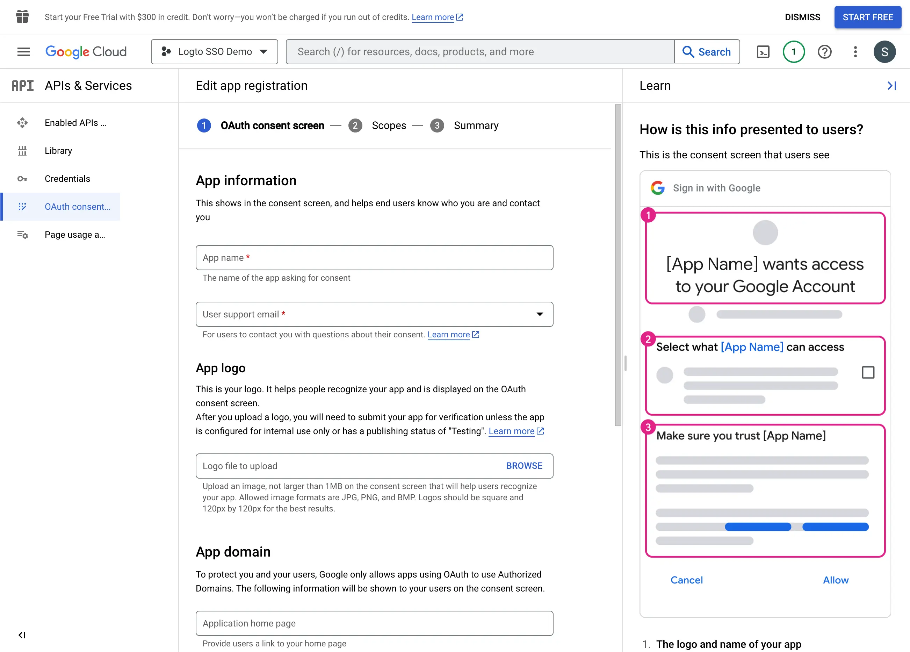
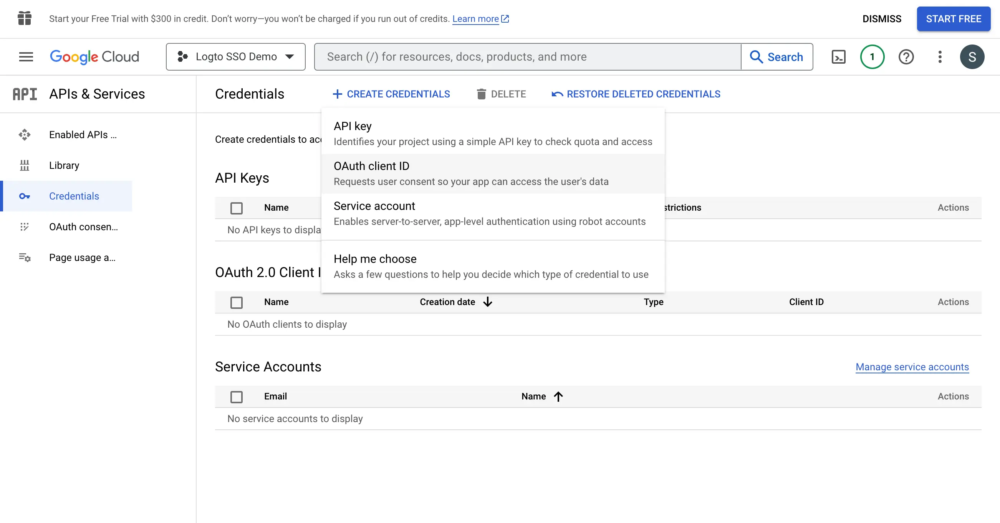

import GuideTip from '../../fragments/_sso_guide_tip.mdx';

# Configurer l'authentification unique avec Google Workspace

Avec un minimum d'efforts de configuration, ce connecteur permet l'intégration avec Microsoft Entra ID pour le SSO d'entreprise.

<GuideTip />

## Étape 1 : Créer un nouveau projet sur Google Cloud Platform \{#step-1-create-a-new-project-on-google-cloud-platform}

Avant de pouvoir utiliser Google Workspace comme fournisseur d'Authentification (Authentication), vous devez configurer un projet dans la [Google API Console](https://console.developers.google.com/) pour obtenir des informations d'identification OAuth 2.0. Si vous avez déjà un projet, vous pouvez passer cette étape. Sinon, créez un nouveau projet sous votre Organisation (Organisation) Google.

## Étape 2 : Configurer l'écran de consentement pour votre application \{#step-2-config-the-consent-screen-for-your-application}

Afin de créer une nouvelle information d'identification OIDC, vous devez configurer l'écran de consentement pour votre application.

1. Accédez à la page [Écran de consentement OAuth](https://console.cloud.google.com/apis/credentials/consent) et sélectionnez le type d'utilisateur `Interne`. Cela rendra l'application OAuth uniquement disponible pour les utilisateurs au sein de votre Organisation (Organisation).

2. Remplissez les paramètres de l'`Écran de consentement` en suivant les instructions sur la page. Vous devez fournir les informations minimales suivantes :

- **Nom de l'application** : Le nom de votre application. Il sera affiché sur l'écran de consentement.
- **Email de support** : L'email de support de votre application. Il sera affiché sur l'écran de consentement.

3. Définissez les `Portées` pour votre application. Afin de récupérer correctement les informations d'identité de l'utilisateur et l'adresse email de l'IdP, les connecteurs Logto SSO doivent accorder les portées suivantes de l'IdP :

- **openid** : Cette portée est requise pour l'authentification OIDC. Elle est utilisée pour récupérer le Jeton d’identifiant (ID token) et accéder au point de terminaison userInfo de l'IdP.
- **profile** : Cette portée est requise pour accéder aux informations de profil de base de l'utilisateur.
- **email** : Cette portée est requise pour accéder à l'adresse email de l'utilisateur.

Cliquez sur le bouton `Enregistrer` pour enregistrer les paramètres de l'écran de consentement.

## Étape 3 : Créer une nouvelle information d'identification OAuth \{#step-3-create-a-new-oauth-credential}

Accédez à la page [Informations d'identification](https://console.cloud.google.com/apis/credentials) et cliquez sur le bouton `Créer des informations d'identification`. Sélectionnez l'option `ID client OAuth` dans le menu déroulant pour créer une nouvelle information d'identification OAuth pour votre application.

Continuez à configurer l'information d'identification OAuth en remplissant les informations suivantes :

1. Sélectionnez `Application Web` comme type d'application.
2. Remplissez le `Nom` de votre application cliente, `Logto SSO Connector` par exemple. Cela vous aidera à identifier les informations d'identification à l'avenir.
3. Remplissez les `URIs de redirection autorisés` avec l'URI de rappel Logto. C'est l'URI vers lequel Google redirigera le navigateur de l'utilisateur après une Authentification (Authentication) réussie. Après qu'un utilisateur s'est authentifié avec succès auprès de l'IdP, l'IdP redirige le navigateur de l'utilisateur vers cet URI désigné avec un code d'Autorisation (Authorization). Logto complétera le processus d'Authentification (Authentication) basé sur le code d'Autorisation (Authorization) reçu de cet URI.
4. Remplissez les `Origines JavaScript autorisées` avec l'origine de l'URI de rappel Logto. Cela garantit que seule votre application Logto peut envoyer des requêtes au serveur OAuth de Google.
5. Cliquez sur le bouton `Créer` pour créer l'information d'identification OAuth.

## Étape 4 : Configurer le connecteur Logto avec les informations d'identification du client \{#step-4-set-up-logto-connector-with-the-client-credentials}

Après avoir créé avec succès l'information d'identification OAuth, vous recevrez une fenêtre modale avec l'ID client et le secret client.

Copiez l'`ID client` et le `secret client` et remplissez les champs correspondants dans l'onglet `Connexion` du connecteur SSO de Logto.

Vous avez maintenant configuré avec succès un connecteur SSO Google Workspace sur Logto.

## Étape 5 : Portées supplémentaires (Optionnel) \{#step-5-additional-scopes-optional}

Utilisez le champ `Portée` pour ajouter des portées supplémentaires à votre requête OAuth. Cela vous permettra de demander plus d'informations au serveur OAuth de Google. Veuillez vous référer à la documentation des [Portées OAuth de Google](https://developers.google.com/identity/protocols/oauth2/scopes) pour plus d'informations.

Indépendamment des paramètres de portée personnalisés, Logto enverra toujours les portées `openid`, `profile` et `email` à l'IdP. Cela garantit que Logto peut récupérer correctement les informations d'identité de l'utilisateur et l'adresse email.

## Étape 6 : Définir les domaines email et activer le connecteur SSO \{#step-6-set-email-domains-and-enable-the-sso-connector}

Fournissez les `domaines email` de votre Organisation (Organisation) dans l'onglet `Expérience SSO` du connecteur de Logto. Cela activera le connecteur SSO comme méthode d'Authentification (Authentication) pour ces utilisateurs.

Les utilisateurs avec des adresses email dans les domaines spécifiés seront redirigés pour utiliser votre connecteur SSO comme leur seule méthode d'Authentification (Authentication).

Pour plus d'informations sur le connecteur SSO Google Workspace, veuillez consulter [Google OpenID Connector](https://developers.google.com/identity/openid-connect/openid-connect).
