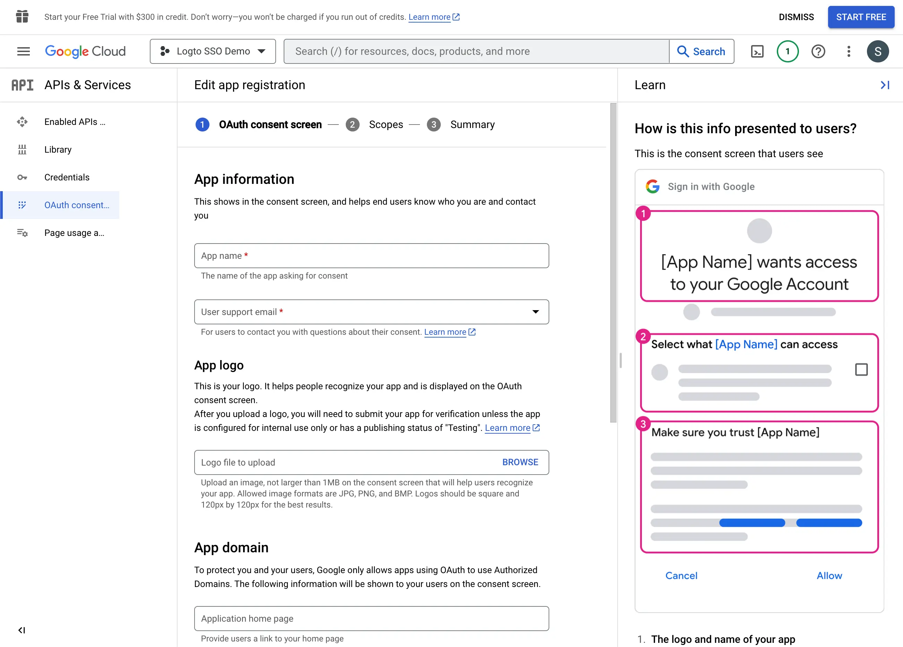

Pour créer de nouvelles informations d'identification OIDC, vous devez configurer l'écran de consentement pour votre application.

1. Accédez à la page [Écran de consentement OAuth](https://console.cloud.google.com/apis/credentials/consent) et sélectionnez le type d'utilisateur `Interne`. Cela rendra l'application OAuth uniquement disponible pour les utilisateurs au sein de votre organisation.

2. Remplissez les paramètres de l'`Écran de consentement` en suivant les instructions de la page. Vous devez fournir les informations minimales suivantes :

- **Nom de l'application** : Le nom de votre application. Il sera affiché sur l'écran de consentement.
- **Email de support** : L'email de support de votre application. Il sera affiché sur l'écran de consentement.

3. Définissez les `Portées` pour votre application. Afin de récupérer correctement les informations d'identité et l'adresse e-mail de l'utilisateur depuis le fournisseur d'identité (IdP), les connecteurs SSO de Logto doivent accorder les portées suivantes depuis l'IdP :

- **openid** : Cette portée est requise pour l'authentification OIDC. Elle est utilisée pour récupérer le jeton d'identifiant et accéder au point de terminaison userInfo de l'IdP.
- **profile** : Cette portée est requise pour accéder aux informations de profil de base de l'utilisateur.
- **email** : Cette portée est requise pour accéder à l'adresse e-mail de l'utilisateur.

Cliquez sur le bouton `Enregistrer` pour sauvegarder les paramètres de l'écran de consentement.
