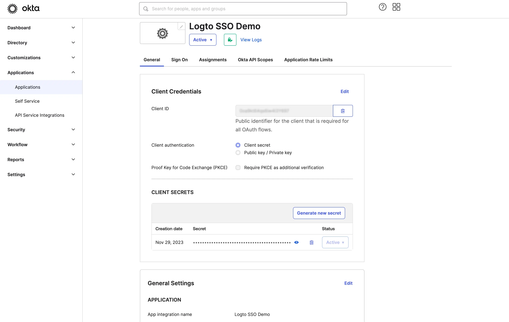

import GuideTip from '../../fragments/_sso_guide_tip.mdx';

# Configurer l’authentification unique avec Okta

Avec un minimum d'efforts de configuration, ce connecteur permet l'intégration avec Okta pour le SSO d'entreprise.

<GuideTip />

## Étape 1 : Créer une application OIDC sur le portail d'administration Okta \{#step-1-create-an-oidc-application-on-okta-admin-portal}

- Visitez le portail d'administration Okta et connectez-vous en tant qu'administrateur.
- Accédez à la page `Applications`/`Applications` à l'aide du menu latéral.
- Cliquez sur le bouton `Create App Integration` pour créer une nouvelle application OIDC.
- Sélectionnez l'option `OIDC - OpenID Connect` comme `Sign-in method`.
- Sélectionnez l'option `Web Application` comme `Application type`.

Cliquez sur le bouton `Next` pour continuer.

## Étape 2 : Configurer les paramètres de l'application \{#step-2-configure-the-application-settings}

1. Fournissez un `App integration name`. Il sera utilisé comme identifiant de votre application OIDC.
2. Ajoutez un nouveau `Sign-in redirect URIs` en utilisant l'URL de rappel du connecteur SSO de Logto.

C'est l'URI vers lequel Okta redirigera le navigateur de l'utilisateur après une authentification réussie. Après qu'un utilisateur s'est authentifié avec succès auprès du fournisseur d’identité (IdP), l'IdP redirige le navigateur de l'utilisateur vers cet URI désigné avec un code d'autorisation. Logto complétera le processus d'authentification basé sur le code d'autorisation reçu de cet URI.

3. Assignez des utilisateurs à l'application.

En fonction des paramètres `Assignments`, vous pouvez choisir d'assigner l'application à tous les utilisateurs ou à des utilisateurs/groupes spécifiques.

Cliquez sur le bouton `Save` pour enregistrer les paramètres de l'application.

## Étape 3 : Configurer le connecteur Logto avec les informations d'identification du client \{#step-3-set-up-logto-connector-with-the-client-credentials}

Après avoir créé avec succès l'application OIDC, vous serez redirigé vers la page de détails de l'application.

Copiez le `client ID` et le `client secret` et remplissez les champs correspondants dans l'onglet `Connection` du connecteur SSO de Logto.

Utilisez votre domaine Okta comme `issuer`. Exemple : `https://dev-12345678.okta.com`. Une fois que vous avez rempli tous les champs, cliquez sur le bouton `Save` pour enregistrer les paramètres du connecteur.

Si le lien `issuer` que vous avez fourni est valide, vous verrez une liste complète analysée des configurations IdP Okta affichée sous le champ `issuer`.

## Étape 4 : Portées supplémentaires (Optionnel) \{#step-4-additional-scopes-optional}

Utilisez le champ `Scope` pour ajouter des portées supplémentaires à votre requête OAuth. Cela vous permettra de demander plus d'informations au serveur OAuth d'Okta. Veuillez vous référer à la [documentation Okta](https://developer.okta.com/docs/reference/api/oidc/#scopes) pour plus de détails sur les portées disponibles.

Indépendamment des paramètres de portée personnalisés, Logto enverra toujours les portées `openid`, `profile` et `email` à l'IdP. Cela garantit que Logto peut récupérer correctement les informations d'identité de l'utilisateur et l'adresse e-mail.

## Étape 5 : Définir les domaines de messagerie et activer le connecteur SSO \{#step-5-set-email-domains-and-enable-the-sso-connector}

Fournissez les `email domains` de votre organisation dans l'onglet `SSO experience` du connecteur de Logto. Cela activera le connecteur SSO comme méthode d'authentification pour ces utilisateurs.

Les utilisateurs avec des adresses e-mail dans les domaines spécifiés seront redirigés pour utiliser votre connecteur SSO comme leur seule méthode d'authentification.

Pour plus de détails sur la création d'une intégration OIDC avec Okta, veuillez consulter [Create OIDC App Integrations](https://help.okta.com/oie/en-us/content/topics/apps/apps_app_integration_wizard_oidc.htm).
