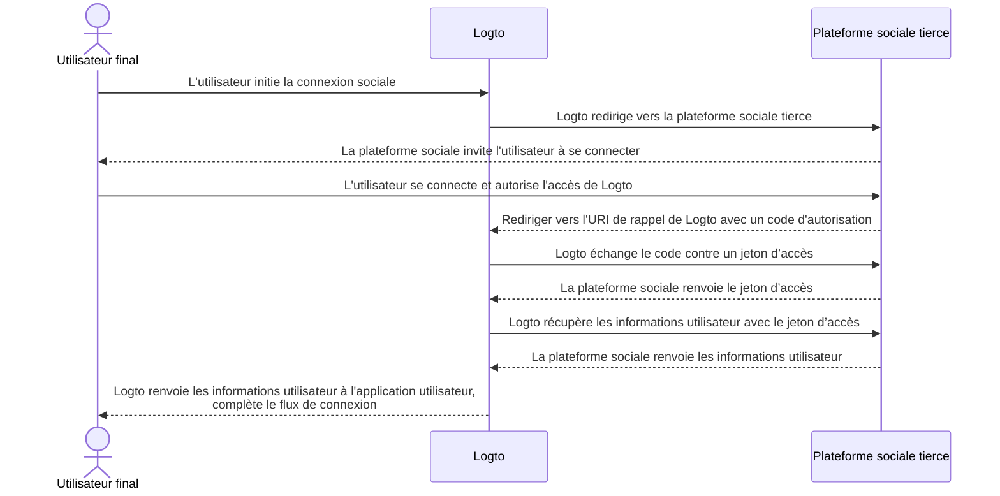

# Implémenter des connecteurs

Après avoir examiné la structure de fichiers du connecteur, discutons de l'implémentation et de l'idée principale du développement d'un connecteur.

Nous allons passer par un exemple simple pour les connecteurs sociaux et sans mot de passe afin que vous puissiez construire votre connecteur avec presque la même idée.

Dans cette partie, nous n'entrons pas dans les détails des paramètres spécifiques (comme `config`) car ce n'est pas le but de ce guide. Les développeurs qui implémentent de nouveaux connecteurs devraient lire les documents fournis par les fournisseurs de services tiers, et ces documents devraient détailler les paramètres.

## Construire un connecteur social

Prenons le connecteur GitHub comme exemple.

La plupart des flux d'Autorisation des connecteurs sociaux obéissent au [Flux de Code d'Autorisation OAuth](https://openid.net/specs/openid-connect-basic-1_0.html).

:::note
La majorité des _connecteurs sociaux_, obtenir un profil utilisateur avec l'Authentification des utilisateurs finaux suit un schéma en deux étapes (en supposant que toutes les étapes réussissent) :

1. Démarrer une requête d'authentification et obtenir l'authentification de l'utilisateur.
2. Récupérer le `jeton d’accès` en utilisant un `authCode` accordé par le fournisseur de connecteur.
3. Demander un profil utilisateur accessible publiquement en utilisant le `jeton d’accès`.

:::



Pour accomplir le flux, nous devons avoir les trois méthodes suivantes :

### getAuthorizationUri

`getAuthorizationUri` génère une URL de redirection qui peut diriger les utilisateurs finaux vers la page nécessitant l'Authentification des utilisateurs.

L'interface est définie comme `GetAuthorizationUri` dans [`@logto/connector-kit`](https://github.com/logto-io/logto/blob/master/packages/toolkit/connector-kit/src/types.ts).

Vous êtes autorisé à stocker des informations essentielles liées à la connexion en utilisant `setSession` (le deuxième paramètre d'entrée de `GetAuthorizationUri`) pour le bien de la méthode `getUserInfo`.

Les paramètres listés sont requis :

- `authorizationEndpoint` peut être trouvé dans le site de documentation OAuth de GitHub, qui est la page où l'utilisateur final doit aller pour l'authentification
- `config`, qui inclut `clientId` et `clientSecret` dans le scénario GitHub
- `state`, une chaîne aléatoire pour prouver le CSRF
- `redirectUri` de la page de destination après l'authentification réussie de l'utilisateur final

```typescript
const getAuthorizationUri = async ({ state, redirectUri }) => {
  const queryParameters = new URLSearchParams({
    client_id: config.clientId, // `config` contient vos informations d'identification de l'application GitHub
    redirect_uri: redirectUri,
    state,
  });

  return `${authorizationEndpoint}?${queryParameters.toString()}`;
};
```

### getAccessToken

`getAccessToken` obtient le jeton d’accès avec le code d'autorisation émis après l'authentification réussie des utilisateurs finaux.

Outre `config` que nous avons mentionné dans la méthode précédente `getAuthorizationUri`, nous voulons également obtenir :

- le `code` d'autorisation des paramètres apportés à la page de destination de redirection
- `accessTokenEndpoint`, qui est le point de terminaison pour obtenir le jeton d’accès avec le code d'autorisation

```typescript
const getAccessToken = async (config: GithubConfig, code: string) => {
  const { clientId: client_id, clientSecret: client_secret } = config;

  const httpResponse = await got.post({
    url: accessTokenEndpoint,
    json: {
      client_id,
      client_secret,
      code,
    },
    timeout: defaultTimeout,
  });

  const result = accessTokenResponseGuard.safeParse(qs.parse(httpResponse.body));

  if (!result.success) {
    throw new ConnectorError(ConnectorErrorCodes.InvalidResponse, result.error);
  }

  const { access_token: accessToken } = result.data;

  assert(accessToken, new ConnectorError(ConnectorErrorCodes.SocialAuthCodeInvalid));

  return { accessToken };
};
```

### getUserInfo

`getUserInfo` récupère les informations utilisateur avec le jeton d’accès obtenu à l'étape précédente.

L'interface est définie comme `GetUserInfo` dans [`@logto/connector-kit`](https://github.com/logto-io/logto/blob/master/packages/toolkit/connector-kit/src/types.ts).

À des fins de connexion, vous pouvez récupérer les informations nécessaires en utilisant la fonction `getSession`.

`userInfoEndpoint` est le point de terminaison utilisé pour obtenir les informations utilisateur.

Vous pouvez consulter les documents officiels pour trouver des informations utilisateur spécifiques accessibles au point de terminaison des informations utilisateur et la portée correspondante.

`id` attribué par le fournisseur d’identité (IdP) du connecteur (dans ce cas, GitHub) est requis ; d'autres informations sont facultatives. Si vous pouvez obtenir `email` ou `phone` à partir du profil utilisateur, ASSUREZ-VOUS qu'ils sont "vérifiés". Vous devez également aligner les clés de retour avec les noms de champs dans le [profil utilisateur Logto](/user-management/user-data/#basic-data).

```typescript
const getUserInfo = async (
  data: { code: string; config: GithubConfig },
  getSession: GetSession,
  { set: SetStorageValue, get: GetStorageValue }
) => {
  const { code, config } = data;
  const { accessToken } = await getAccessToken(config, code);

  try {
    const httpResponse = await got.get(userInfoEndpoint, {
      headers: {
        authorization: `token ${accessToken}`,
      },
      timeout: defaultTimeout,
    });

    const result = userInfoResponseGuard.safeParse(parseJson(httpResponse.body));

    if (!result.success) {
      throw new ConnectorError(ConnectorErrorCodes.InvalidResponse, result.error);
    }

    const { id, avatar_url: avatar, email, name } = result.data;

    return {
      id: String(id),
      avatar: conditional(avatar),
      email: conditional(email),
      name: conditional(name),
    };
  } catch (error: unknown) {
    if (error instanceof HTTPError) {
      const { statusCode, body: rawBody } = error.response;

      if (statusCode === 401) {
        throw new ConnectorError(ConnectorErrorCodes.SocialAccessTokenInvalid);
      }

      throw new ConnectorError(ConnectorErrorCodes.General, JSON.stringify(rawBody));
    }

    throw error;
  }
};
```

Vous pouvez trouver l'implémentation complète [ici](https://github.com/logto-io/connectors/blob/master/packages/connector-github/src/index.ts).

Pour plus de détails sur les paramètres configurables, consultez le README du connecteur GitHub ou les documents officiels de GitHub.

:::note
L'exemple que nous avons discuté est basé sur le type de subvention du Code d'Autorisation du protocole OAuth, qui est utilisé dans le connecteur GitHub de Logto. Cependant, il convient de souligner qu'un autre type de subvention, le type de subvention Implicite, peut également être utilisé pour récupérer le profil d'un utilisateur, et en fait, fournit un jeton d’accès directement dans la réponse d'authentification. Malgré cette commodité, le type de subvention du Code d'Autorisation est généralement recommandé par rapport au type Implicite en raison de sa sécurité renforcée.

Vous pouvez également construire un connecteur basé sur OIDC ou d'autres protocoles ouverts, cela dépend de votre cas d'utilisation ainsi que de la compatibilité du fournisseur social auquel vous souhaitez vous connecter.
:::

## Construire un connecteur sans mot de passe

Passons en revue l'implémentation du connecteur de messagerie directe Aliyun pour comprendre le processus de construction d'un connecteur sans mot de passe.

Les connecteurs sans mot de passe sont utilisés pour envoyer un code aléatoire à l'email ou au téléphone des utilisateurs finaux. En conséquence, une méthode `sendMessage` est requise.

### sendMessage

Pour envoyer un message, nous devons configurer correctement `config` et `endpoint`.

- `endpoint` est le point de terminaison auquel vos appels API se connectent
- `config` contient `templates` (modèles de contenu pour envoyer le code de passe dans différents flux utilisateur), `clientId` et `clientSecret` (pour accéder aux requêtes API)

```typescript
const sendMessage = async (data, inputConfig) => {
  const { to, type, payload } = data;
  const config = inputConfig ?? (await getConfig(defaultMetadata.id));
  validateConfig<AliyunDmConfig>(config, aliyunDmConfigGuard);
  const { accessKeyId, accessKeySecret, accountName, fromAlias, templates } = config;
  const template = templates.find((template) => template.usageType === type);

  assert(
    template,
    new ConnectorError(
      ConnectorErrorCodes.TemplateNotFound,
      `Cannot find template for type: ${type}`
    )
  );

  const parameters = {
    AccessKeyId: accessKeyId,
    AccountName: accountName,
    ReplyToAddress: 'false',
    AddressType: '1',
    ToAddress: to,
    FromAlias: fromAlias,
    Subject: template.subject,
    HtmlBody:
      typeof payload.code === 'string'
        ? template.content.replace(/{{code}}/g, payload.code)
        : template.content,
  };

  try {
    const httpResponse = await request(
      endpoint,
      { Action: 'SingleSendMail', ...staticConfigs, ...parameters },
      accessKeySecret
    );

    const result = sendEmailResponseGuard.safeParse(parseJson(httpResponse.body));

    if (!result.success) {
      throw new ConnectorError(ConnectorErrorCodes.InvalidResponse, result.error);
    }

    return result.data;
  } catch (error: unknown) {
    if (error instanceof HTTPError) {
      const {
        response: { body: rawBody },
      } = error;

      assert(typeof rawBody === 'string', new ConnectorError(ConnectorErrorCodes.InvalidResponse));

      errorHandler(rawBody);
    }

    throw error;
  }
};

const request = async (
  url: string,
  parameters: PublicParameters & Record<string, string>,
  accessKeySecret: string
) => {
  const finalParameters: Record<string, string> = {
    ...parameters,
    SignatureNonce: String(Math.random()),
    Timestamp: new Date().toISOString(),
  };
  const signature = getSignature(finalParameters, accessKeySecret, 'POST');

  const payload = new URLSearchParams();

  for (const [key, value] of Object.entries(finalParameters)) {
    payload.append(key, value);
  }
  payload.append('Signature', signature);

  return got.post({
    url,
    headers: {
      'Content-Type': 'application/x-www-form-urlencoded',
    },
    form: payload,
  });
};
```

Vous pouvez trouver l'implémentation complète [ici](https://github.com/logto-io/connectors/blob/master/packages/connector-aliyun-dm/src/index.ts).

Pour plus de détails sur les paramètres configurables, consultez le README du connecteur de messagerie directe Aliyun ou les documents officiels de messagerie directe Aliyun.

## Quoi d'autre ?

Pour voir la définition des méthodes de connecteur et se faire une idée de la conception de l'interface du connecteur, consultez [`@logto/connector-kit`](https://github.com/logto-io/logto/tree/master/packages/toolkit/connector-kit). Vous pouvez également trouver la référence _ConnectorMetadata_ à "[Connectors - ConnectorMetadata](/connectors/connector-data-structure/#connectors-local-storage-connectormetadata)" et "[Connector file structure](/logto-oss/develop-your-connector/connector-file-structure/)" peut vous aider à comprendre comment organiser votre implémentation.

- Un schéma _Zod_ de configuration de connecteur est obligatoire pour tous les connecteurs. C'est assez important car nous effectuons une vérification de type avant de sauvegarder `config` dans la base de données et d'appeler des API qui nécessitent des informations `config`.
- Tous les _connecteurs SMS_ et _connecteurs email_ nécessitent une méthode `sendMessage` pour appeler les API d'envoi de messages des fournisseurs de services en utilisant les configurations de la base de données. Les développeurs peuvent également réutiliser cette méthode pour envoyer un message de test avec une configuration non enregistrée lors de la configuration des connecteurs dans la Console d'administration.
- Le générateur d'URL d'autorisation `getAuthorizationUri` et le récupérateur de profil utilisateur `getUserInfo` sont requis pour tous les _connecteurs sociaux_ (`getAccessToken` est considéré comme une étape optionnelle dans `getUserInfo`).
- Toutes les méthodes des connecteurs fonctionnent via des appels API, par conséquent, les développeurs de connecteurs doivent vérifier les documents et gérer les réponses d'appels API infructueuses possibles.

## Installer vos propres connecteurs

Nous supposons que vous avez déjà terminé la construction de votre propre connecteur. Suivez les étapes suivantes pour l'installer manuellement :

1. Copiez le dossier du connecteur que vous avez implémenté dans le répertoire `/packages/connectors` de [`logto-io/logto`](https://github.com/logto-io/logto).
2. Installez les dépendances du dépôt du connecteur en tapant `pnpm pnpm:devPreinstall && pnpm i` à la racine du dossier logto.
3. Construisez le connecteur avec `pnpm connectors build`.
4. Liez les connecteurs locaux en utilisant `pnpm cli connector link`.
5. Redémarrez l'instance Logto avec `pnpm dev` à la racine du répertoire `logto-io/logto`, et vous pouvez trouver les connecteurs installés avec succès.

Vous pouvez maintenant tester et essayer votre connecteur pour voir s'il fonctionne comme prévu.

Si vous souhaitez ajouter des connecteurs qui ont déjà été publiés sur NPM ou les connecteurs officiels de Logto, vous pouvez consulter [Using Logto CLI - Manage connectors](/logto-oss/using-cli/manage-connectors/#add-connectors).
