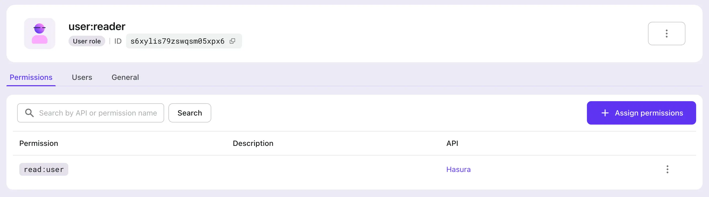

# Ajoutez l’authentification à votre application Hasura

[Hasura](https://hasura.io/) est un outil qui peut rapidement fournir des API GraphQL et REST correspondant à vos données. En considérant la sécurité des données, Hasura offre également la possibilité de peaufiner le contrôle d'accès pour chaque API différente.

Habituellement, les utilisateurs de Hasura utilisent d'autres services de gestion d'identité et d'authentification, Logto étant l'un des plus populaires parmi eux.

Dans cet article de blog, nous supposerons que vous utilisez déjà les services Hasura. Nous allons introduire comment intégrer Hasura et Logto pour maximiser la sécurité de vos données. Si vous n'avez pas de compte Logto, inscrivez-vous et commencez à l'utiliser dès maintenant !

## Contexte \{#background}

Hasura utilise la [gestion des accès basée sur les rôles](https://hasura.io/docs/latest/auth/overview/), tandis que Logto utilise le standard [Contrôle d’accès basé sur les rôles (RBAC)](/authorization/role-based-access-control).

Dans le modèle et les meilleures pratiques de Logto pour le RBAC, nous conseillons aux utilisateurs d'utiliser `scope` pour correspondre à la granularité la plus fine des Permissions, d'utiliser `role` comme un ensemble de `scope`s pour des opérations par lots pratiques, et finalement de vérifier `scope` (généralement du côté des fournisseurs de ressources) pour vérifier si un utilisateur peut effectuer une opération spécifique.

Dans Hasura, un `role` correspond à la granularité la plus fine des Permissions, et les vérifications de Permission sont effectuées par rapport aux `role`s. Par conséquent, lors de la configuration de Logto, nous recommandons de mapper un `role` à exactement un `scope`. Cette approche peut lier les Permissions de Logto et de Hasura ensemble pour éviter toute confusion et mauvaise utilisation.

Hasura peut prendre en charge le contrôle d'accès en utilisant des Webhooks ou des JWT. Notre précédent [article de blog](https://blog.logto.io/logto-x-hasura) a introduit comment utiliser les Webhooks, et dans les sections suivantes, nous expliquerons comment utiliser le contrôle d'accès en mode JWT de Hasura.

## Commencer \{#get-started}

Commençons par un exemple simple. Supposons qu'un utilisateur ait déjà deux API dans Hasura, `GET /user` et `PATCH /user`, correspondant à deux rôles : `user:reader` et `user:maintainer`, respectivement.

### 1. Créer une ressource API Hasura dans Logto \{#1-create-hasura-api-resource-in-logto}

Créez une ressource API Hasura dans Logto.


### 2. Créer des rôles selon la configuration Hasura dans Logto \{#2-create-roles-according-to-hasura-setup-in-logto}

Nous devons créer deux `scope`s pour la ressource API Hasura mentionnée à l'étape 1, à savoir `read:user` et `maintain:user`, puis créer deux rôles : `user:reader` (contenant le `scope` `read:user`) et `user:maintainer` (incluant le `scope` `maintain:user`) pour correspondre un à un avec les rôles de Hasura. Et attribuez ces rôles aux utilisateurs Logto selon les besoins.





### 3. Configurer la variable d'environnement Hasura `HASURA_GRAPHQL_JWT_SECRET` pour activer le mode JWT \{#3-configure-hasura-environment-variable-hasura_graphql_jwt_secret-to-enable-jwt-mode}

En examinant les [options de configuration JWT de Hasura](https://hasura.io/docs/latest/auth/authentication/jwt/#hasura-jwt-configuration-options), nous devons ajouter et configurer la variable d'environnement `HASURA_GRAPHQL_JWT_SECRET` avant de pouvoir utiliser JWT pour le contrôle d'accès.

Il existe de nombreuses options différentes qui peuvent être configurées, mais ici nous introduisons le cas le plus simple : seul le `jwk_url` doit être configuré. Cette valeur peut être obtenue à partir de votre point de terminaison de configuration OpenID de Logto (https://your.logto.domain/oidc/.well-known/openid-configuration).


### 4. Personnaliser les revendications supplémentaires du jeton d’accès utilisateur \{#4-customize-user-access-token-extra-claims}

En utilisant la fonctionnalité de revendications de jeton personnalisées de Logto, personnalisez la logique pour ajouter des revendications supplémentaires au jeton d’accès utilisateur.


Personnalisez la méthode `getCustomJwtClaims` pour ajouter des données dans le JWT sur lesquelles Hasura s'appuie pour mettre en œuvre le contrôle d'accès. Cela peut inclure des données liées à l'utilisateur étant autorisé pendant cette instance, y compris les `role`s qu'ils possèdent, qui peuvent être accessibles via `context`.

Nous avons également défini une variable d'environnement `USER_DEFAULT_ROLE_NAMES` pour éviter le codage en dur.

### 5. Intégrer Logto SDK \{#5-integrate-logto-sdk}

Après avoir configuré Logto et Hasura, intégrez votre application avec le Logto SDK. Ici, nous utilisons un exemple React pour prévisualiser le jeton d’accès utilisateur émis par Logto après la connexion de l'utilisateur.


Tout d'abord, nous attribuons les rôles `user:reader` et `user:maintainer` précédemment créés à l'utilisateur, puis nous nous connectons en tant que cet utilisateur.

```tsx
const config: LogtoConfig = {
  endpoint: 'http://localhost:3001',
  appId: '<your-application-id>',
  appSecret: '<your-application-secret>',
  scopes: [
    ...// existing scopes
    'read:user',
    'maintain:user',
  ],
  resources: [
    ...// existing resources
    'https://*.hasura.app/api',
  ],
};
```

Obtenez le jeton d’accès utilisateur et demandez les API Hasura :

```tsx
const accessToken = await logto.getAccessToken('https://*.hasura.app/api');

// Avant d'envoyer la requête à Hasura
request.headers.set('Authorization', `Bearer ${accessToken}`);
request.headers.set('x-Hasura-Role', '<required-role-for-the-endpoint>');
```

## Conclusion \{#conclusion}

Dans cet article, nous fournissons une autre méthode de contrôle d'accès basée sur JWT prise en charge par Hasura, autre que le Webhook.

En comparant les processus de contrôle d'accès [Webhook](https://hasura.io/docs/latest/auth/authentication/webhook/) et [JWT](https://hasura.io/docs/latest/auth/authentication/jwt/) de Hasura, nous pouvons voir que l'approche Webhook envoie un Webhook à Logto et attend une réponse avec chaque requête Hasura ; tandis que l'approche basée sur JWT peut être utilisée en continu jusqu'à l'expiration du JWT.

L'approche JWT peut réduire la charge réseau et éliminer la latence réseau apportée par les Webhooks ; pendant ce temps, l'approche Webhook peut synchroniser les changements dans les Permissions utilisateur en temps réel.

Les utilisateurs peuvent choisir l'approche appropriée en fonction de ces conclusions, combinées à leurs besoins commerciaux réels.
