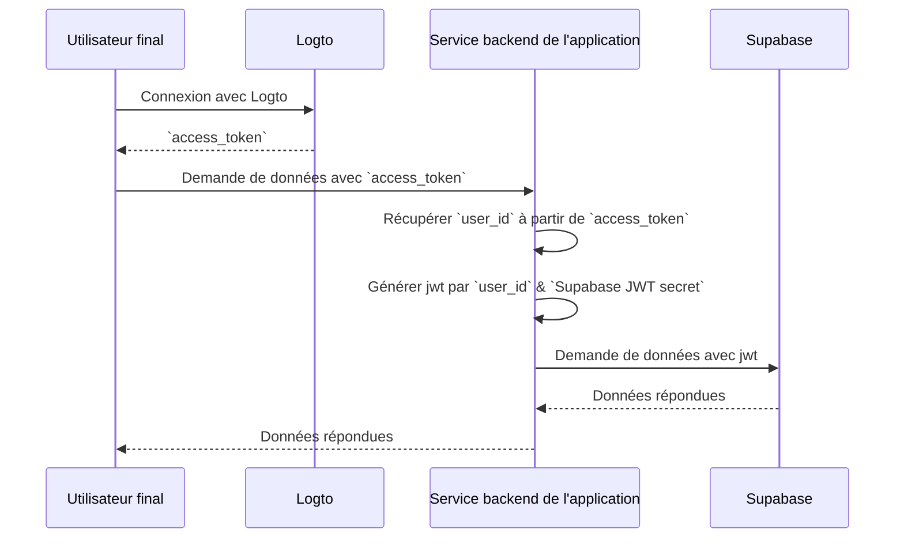

import createGetUserIdFunctionImage from '@site/docs/quick-starts/database/supabase/create-get-user-id-function.webp';
import createRlsPolicyImage from '@site/docs/quick-starts/database/supabase/create-rls-policy.webp';
import postsTableImage from '@site/docs/quick-starts/database/supabase/posts-table.webp';
import serviceRoleSecretImage from '@site/docs/quick-starts/database/supabase/service-role-secret.webp';
import supabaseApiSettingsImage from '@site/docs/quick-starts/database/supabase/supabase-api-settings.webp';

# Ajoutez l’authentification à votre application Supabase

## Notions de base de Supabase \{#supabase-basics}

Supabase utilise la [sécurité au niveau des lignes de Postgres](https://www.postgresql.org/docs/current/ddl-rowsecurity.html) pour contrôler les permissions d'accès aux données. En termes simples, en créant des politiques de sécurité au niveau des lignes pour les tables de la base de données, nous pouvons restreindre et gérer qui peut lire, écrire et mettre à jour les données dans une table.

Supposons que vous ayez une table nommée "posts" dans votre base de données, avec le contenu suivant :


Le champ `user_id` dans la table représente l'utilisateur auquel chaque donnée de post appartient. Vous pouvez restreindre chaque utilisateur à n'accéder qu'à ses propres données de post en fonction du champ `user_id`.

Cependant, avant que cela puisse être mis en œuvre, Supabase doit être capable d'identifier l'utilisateur actuel accédant à la base de données.

### Ajouter des données utilisateur aux requêtes Supabase \{#add-user-data-to-the-supabase-requests}

Grâce au support de Supabase pour les JWT, lorsque notre application interagit avec Supabase, nous pouvons générer un JWT contenant des données utilisateur en utilisant le secret JWT fourni par Supabase. Nous utilisons ensuite ce JWT comme en-tête d'authentification lors des requêtes. Lors de la réception de la requête, Supabase vérifie automatiquement la validité du JWT et permet l'accès aux données qu'il contient tout au long des processus suivants.

Tout d'abord, nous pouvons obtenir le secret JWT fourni par Supabase à partir des "Paramètres du projet" dans le tableau de bord Supabase :


Ensuite, lorsque nous utilisons le SDK Supabase pour faire des requêtes à Supabase, nous utilisons ce secret pour générer notre JWT et l'attacher comme en-tête d'authentification à la requête. (Veuillez noter que ce processus se déroule au sein du service backend de votre application, et le secret JWT ne doit jamais être exposé à des tiers).

```jsx
import { createClient } from '@supabase/supabase-js';
import { sign } from 'jsonwebtoken';

/*
 * Note :
 * Vous pouvez trouver le SUPABASE_URL, SUPABASE_ANON_KEY au même endroit où vous trouvez le secret JWT.
 */
const SUPABASE_URL = process.env.SUPABASE_URL;
const SUPABASE_ANON_KEY = process.env.SUPABASE_ANON_KEY;

const SUPABASE_JWT_SECRET = process.env.SUPABASE_JWT_SECRET;

export const getSupabaseClient = (userId) => {
  const jwtPayload = {
    userId,
  };

  const jwt = sign(jwtPayload, SUPABASE_JWT_SECRET, {
    expiresIn: '1h', // Juste pour la démonstration
  });

  const client = createClient(SUPABASE_URL, SUPABASE_ANON_KEY, {
    global: {
      headers: {
        Authorization: `Bearer ${jwt}`,
      },
    },
  });

  return client;
};
```

Ensuite, accédez à l'éditeur SQL dans le tableau de bord Supabase et créez une fonction pour récupérer le userId transporté dans la requête :


Le code utilisé dans l'image est le suivant :

```sql
create or replace function auth.user_id() returns text as $$
  select nullif(current_setting('request.jwt.claims', true)::json->>'userId', '')::text;
$$ language sql stable;
```

Comme le montre le code, dans Supabase, vous pouvez récupérer la charge utile du JWT que nous générons en appelant `request.jwt.claims`. Le champ `userId` à l'intérieur de la charge utile est la valeur que nous avons définie.

Avec cette fonction, Supabase peut déterminer l'utilisateur qui accède actuellement à la base de données.

### Créer une politique de sécurité au niveau des lignes \{#create-row-level-security-policy}

Ensuite, nous pouvons créer une politique de sécurité au niveau des lignes pour restreindre chaque utilisateur à n'accéder qu'à ses propres données de post en fonction du champ `user_id` dans la table des posts.

1. Accédez à la page de l'éditeur de table dans le tableau de bord Supabase et sélectionnez la table des posts.
2. Cliquez sur "Ajouter une politique RLS" en haut de la table.
3. Dans la fenêtre qui s'affiche, cliquez sur "Créer une politique".
4. Entrez un nom de politique et choisissez la commande de politique SELECT.
5. Dans le bloc `using` du code ci-dessous, entrez :

```sql
auth.user_id() = user_id
```


En utilisant de telles politiques, le contrôle d'accès aux données au sein de Supabase est réalisé.

Dans les applications du monde réel, vous créeriez diverses politiques pour restreindre les actions des utilisateurs telles que l'insertion et la modification de données. Cependant, cela dépasse le cadre de cet article. Pour plus d'informations sur la sécurité au niveau des lignes (RLS), veuillez vous référer à [Sécurisez vos données en utilisant la sécurité au niveau des lignes de Postgres](https://supabase.com/docs/guides/database/postgres/row-level-security).

### Processus d'intégration de base avec Logto \{#basic-integration-process-with-logto}

Comme mentionné précédemment, parce que Supabase utilise RLS pour son contrôle d'accès, la clé pour s'intégrer avec Logto (ou tout autre service d'authentification) réside dans l'obtention de l'identifiant de l'utilisateur autorisé et son envoi à Supabase. L'ensemble du processus est illustré dans le diagramme ci-dessous :



Ensuite, nous expliquerons comment intégrer Logto avec Supabase en nous basant sur ce diagramme de processus.

## Intégration de Logto \{#logto-integration}

Logto offre des guides d'intégration pour divers frameworks et langages de programmation.

En général, les applications construites avec ces frameworks et langages se répartissent en catégories telles que les applications natives, les SPA (applications monopage), les applications web traditionnelles et les applications M2M (machine à machine). Vous pouvez visiter la page [Démarrages rapides de Logto](/quick-starts) pour intégrer Logto dans votre application en fonction de la pile technologique que vous utilisez. Ensuite, suivez les instructions ci-dessous pour intégrer Logto dans votre projet en fonction du type de votre application.

### Application native ou SPA \{#native-app-or-spa}

Les applications natives et les SPA s'exécutent sur votre appareil, et les informations d'identification (jeton d'accès) obtenues après la connexion sont stockées localement sur votre appareil.

Par conséquent, lors de l'intégration de votre application avec Supabase, vous devez interagir avec Supabase via votre service backend car vous ne pouvez pas exposer des informations sensibles (comme le secret JWT de Supabase) sur l'appareil de chaque utilisateur.

Supposons que vous construisiez votre SPA en utilisant React et Express. Vous avez intégré avec succès Logto dans votre application en suivant le [Guide du SDK React de Logto](/quick-starts/react) (vous pouvez vous référer au code dans notre [exemple react](https://github.com/logto-io/js/tree/master/packages/react-sample)). De plus, vous avez ajouté la validation du jeton d'accès Logto à votre serveur backend selon la documentation [Protégez votre API sur Node (Express)](/authorization/api-resources/node-express).

Ensuite, vous utiliserez le jeton d'accès obtenu de Logto pour demander des données utilisateur à votre serveur backend :

```jsx
import { useLogto } from '@logto/react';
import { useState, useEffect } from 'react';
import PostList from './PostList';

const endpoint = '<https://www.mysite.com/api/posts>';
const resource = '<https://www.mysite.com/api>';

function PostPage() {
  const { isAuthenticated, getAccessToken } = useLogto();
  const [posts, setPosts] = useState();

  useEffect(() => {
    const fetchPosts = async () => {
      const response = await fetch(endpoint, {
        headers: {
          Authorization: `Bearer ${await getAccessToken(resource)}`,
        },
      });
      setPosts(response.json());
    };

    if (isAuthenticated) {
      void fetchPosts();
    }
  }, [isAuthenticated, getAccessToken]);

  return <PostList posts={posts} />;
}

export default PostPage;
```

Dans votre serveur backend, vous avez déjà extrait l'identifiant de l'utilisateur connecté à partir du jeton d'accès en utilisant un middleware :

```jsx
// auth-middleware.ts
import { createRemoteJWKSet, jwtVerify } from 'jose';

//...

export const verifyAuthFromRequest = async (ctx, next) => {
  // Extraire le jeton
  const token = extractBearerTokenFromHeaders(ctx.request.headers);

  const { payload } = await jwtVerify(
    token, // Le jeton Bearer brut extrait de l'en-tête de la requête
    createRemoteJWKSet(new URL('https://<your-logto-domain>/oidc/jwks')), // générer un jwks en utilisant jwks_uri demandé au serveur Logto
    {
      // émetteur attendu du jeton, doit être émis par le serveur Logto
      issuer: 'https://<your-logto-domain>/oidc',
      // audience attendue du jeton, doit être l'indicateur de ressource de l'API actuelle
      audience: '<your request listener resource indicator>',
    }
  );

  // si vous utilisez RBAC
  assert(payload.scope.includes('some_scope'));

  // logique de charge utile personnalisée
  ctx.auth = {
    userId: payload.sub,
  };

  return next();
};
```

Maintenant, vous pouvez utiliser le `getSupabaseClient` décrit ci-dessus pour attacher le `userId` au JWT utilisé dans les requêtes suivantes à Supabase. Alternativement, vous pouvez créer un middleware pour créer un client Supabase pour les requêtes qui doivent interagir avec Supabase :

```jsx
export const withSupabaseClient = async (ctx, next) => {
  ctx.supabase = getSupabaseClient(ctx.auth.userId);

  return next();
};
```

Dans le flux de traitement suivant, vous pouvez directement appeler `ctx.supabase` pour interagir avec Supabase :

```jsx
const fetchPosts = async (ctx) => {
  const { data } = await ctx.supabase.from('posts').select('*');

  return data;
};
```

Dans ce code, Supabase ne retournera que les données de post appartenant à l'utilisateur actuel en fonction des politiques définies précédemment.

### Application web traditionnelle \{#traditional-web-app}

La principale différence entre une application web traditionnelle et une application native ou SPA est qu'une application web traditionnelle rend et met à jour les pages uniquement sur le serveur web. Par conséquent, les informations d'identification des utilisateurs sont gérées directement par le serveur web, tandis que dans les applications natives et les SPA, elles résident sur l'appareil de l'utilisateur.

Lors de l'intégration de Logto avec une application web traditionnelle dans Supabase, vous pouvez directement récupérer l'identifiant de l'utilisateur connecté depuis le backend.

Prenons un projet Next.js comme exemple, après avoir intégré Logto avec votre projet en suivant le [Guide du SDK Next.js](/quick-starts/next-app-router), vous pouvez utiliser le SDK Logto pour récupérer les informations utilisateur et construire le JWT correspondant pour interagir avec Supabase.

```jsx
import { getLogtoContext } from '@logto/next-server-actions';
import { logtoConfig } from '@/logto';
import { getSupabaseClient } from '@/utils';
import PostList from './PostList';

export default async function PostPage() {
  const { claims } = await getLogtoContext(logtoConfig);

  // La valeur `sub` dans `claims` est l'identifiant de l'utilisateur.
  const supabase = getSupabaseClient(claims.sub);

  const { data: posts } = await supabase.from('posts').select('*');

  return <PostList posts={posts} />;
}
```

### Application machine à machine \{#machine-to-machine-app}

Machine à machine (M2M) est souvent utilisé lorsque votre application doit communiquer directement avec des serveurs de ressources, comme un service statique qui récupère des posts quotidiens, etc.

Vous pouvez utiliser le guide [Machine à machine : Auth avec Logto](/quick-starts/m2m) pour l'authentification des applications machine à machine. L'intégration entre Supabase et les applications machine à machine est similaire à celle des applications natives et des SPA (comme décrit dans la section "[Application native ou SPA](#native-app-or-spa)"). Elle implique l'obtention d'un jeton d'accès de Logto puis sa validation via une API backend protégée.

Cependant, il est important de noter que les applications natives et les SPA sont généralement conçues pour les utilisateurs finaux, donc l'identifiant utilisateur obtenu représente l'utilisateur lui-même. Cependant, le jeton d'accès pour les applications machine à machine représente l'application elle-même, et le champ `sub` dans la charge utile du jeton d'accès est l'identifiant client de l'application M2M, pas un utilisateur spécifique. Par conséquent, lors du développement, il est crucial de distinguer quelles données sont destinées aux applications M2M.

De plus, si vous souhaitez qu'une application M2M spécifique accède à Supabase au nom de l'ensemble du service pour contourner les restrictions RLS, vous pouvez utiliser le secret `service_role` de Supabase pour créer un client Supabase. Cela est utile lorsque vous souhaitez effectuer certaines tâches administratives ou automatisées nécessitant un accès à toutes les données sans être restreint par les politiques de sécurité au niveau des lignes mises en place pour les utilisateurs individuels.

Le secret `service_role` peut être trouvé sur la même page que le secret JWT :


Lors de la création d'un client Supabase, utilisez le secret `service_role`, puis ce client peut accéder à toutes les données de la base de données :

```jsx
import { createClient } from '@supabase/supabase-js';

// ...
const SUPABASE_SERVICE_ROLE_SECRET = process.env.SUPABASE_SERVICE_ROLE_SECRET;

const client = createClient(SUPABASE_URL, SUPABASE_SERVICE_ROLE_SECRET, {
  // ...options
});
```
