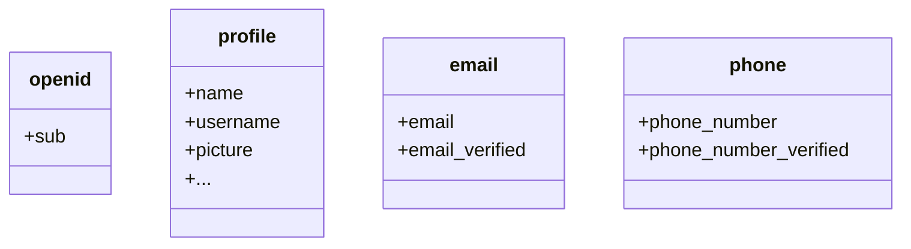

Par défaut, des revendications limitées sont retournées. Si vous avez besoin de plus d'informations, vous pouvez demander des portées supplémentaires pour accéder à plus de revendications.

:::info
Une "revendication" est une assertion faite à propos d'un sujet ; une "portée" est un groupe de revendications. Dans le cas actuel, une revendication est une information sur l'utilisateur.
:::

Voici un exemple non normatif de la relation portée - revendication :

:::tip
La revendication "sub" signifie "sujet", qui est l'identifiant unique de l'utilisateur (c'est-à-dire l'ID utilisateur).
:::

Le SDK Logto demandera toujours trois portées : `openid`, `profile` et `offline_access`.
