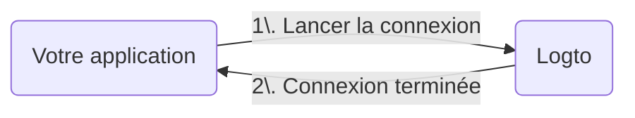

import RegardingRedirectBasedSignIn from './_regarding-redirect-based-sign-in.mdx';

Avant d’entrer dans les détails, voici un aperçu rapide de l’expérience utilisateur finale. Le processus de connexion peut être simplifié comme suit :

1. Votre application lance la méthode de connexion.
2. L’utilisateur est redirigé vers la page de connexion Logto. Pour les applications natives, le navigateur système est ouvert.
3. L’utilisateur se connecte et est redirigé vers votre application (configurée comme l’URI de redirection).

<RegardingRedirectBasedSignIn />

---
