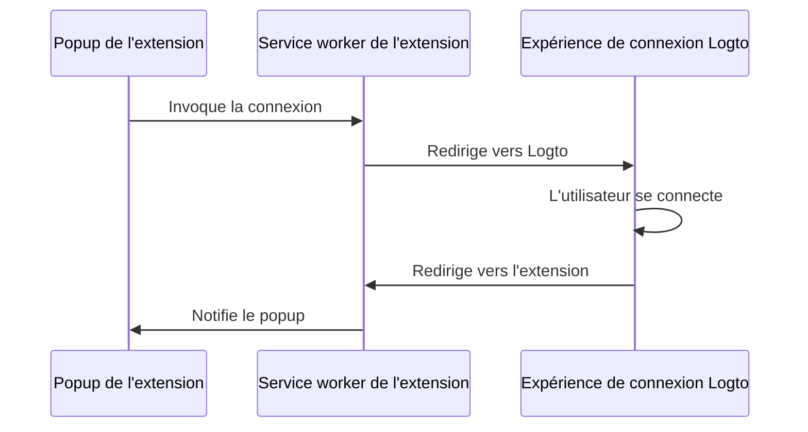

import extensionPopupImage from '@site/docs/quick-starts/framework/chrome-extension/extension-popup.webp';

import RegardingRedirectBasedSignIn from '../../fragments/_regarding-redirect-based-sign-in.mdx';

### Le flux d'authentification \{#the-authentication-flow}

En supposant que vous ayez placé un bouton "Se connecter" dans le popup de votre extension Chrome, le flux d'authentification ressemblera à ceci :



Pour d'autres pages interactives dans votre extension, vous devez simplement remplacer le participant `Popup de l'extension` par le nom de la page. Dans ce tutoriel, nous nous concentrerons sur la page popup.

<RegardingRedirectBasedSignIn />

### Mettre à jour le `manifest.json` \{#update-the-manifestjson}

Le SDK Logto nécessite les permissions suivantes dans le `manifest.json` :

```json title="manifest.json"
{
  "permissions": ["identity", "storage"],
  "host_permissions": ["https://*.logto.app/*"]
}
```

- `permissions.identity` : Nécessaire pour l'API Chrome Identity, utilisée pour se connecter et se déconnecter.
- `permissions.storage` : Nécessaire pour stocker la session de l'utilisateur.
- `host_permissions` : Nécessaire pour que le SDK Logto communique avec les APIs Logto.

:::note
Si vous utilisez un domaine personnalisé sur Logto Cloud, vous devez mettre à jour le `host_permissions` pour correspondre à votre domaine.
:::

### Configurer un script d'arrière-plan (service worker) \{#set-up-a-background-script-service-worker}

Dans le script d'arrière-plan de votre extension Chrome, initialisez le SDK Logto :

```js title="service-worker.js"
import LogtoClient from '@logto/chrome-extension';

export const logtoClient = new LogtoClient({
  endpoint: '<your-logto-endpoint>'
  appId: '<your-logto-app-id>',
});
```

Remplacez `<your-logto-endpoint>` et `<your-logto-app-id>` par les valeurs réelles. Vous pouvez trouver ces valeurs sur la page de l'application que vous venez de créer dans la Logto Console.

Si vous n'avez pas de script d'arrière-plan, vous pouvez suivre le [guide officiel](https://developer.chrome.com/docs/extensions/develop/concepts/service-workers/basics) pour en créer un.

:::info
**Pourquoi avons-nous besoin d'un script d'arrière-plan ?**

Les pages d'extension normales comme le popup ou la page d'options ne peuvent pas s'exécuter en arrière-plan et peuvent être fermées pendant le processus d'authentification. Un script d'arrière-plan garantit que le processus d'authentification peut être correctement géré.
:::

Ensuite, nous devons écouter le message provenant d'autres pages d'extension et gérer le processus d'authentification :

```js title="service-worker.js"
chrome.runtime.onMessage.addListener((message, sender, sendResponse) => {
  // Dans le code ci-dessous, puisque nous retournons `true` pour chaque action, nous devons appeler `sendResponse`
  // pour notifier l'expéditeur. Vous pouvez également gérer les erreurs ici, ou utiliser d'autres moyens pour notifier l'expéditeur.

  if (message.action === 'signIn') {
    const redirectUri = chrome.identity.getRedirectURL('/callback');
    logtoClient.signIn(redirectUri).finally(sendResponse);
    return true;
  }

  if (message.action === 'signOut') {
    const redirectUri = chrome.identity.getRedirectURL();
    logtoClient.signOut(redirectUri).finally(sendResponse);
    return true;
  }

  return false;
});
```

Vous remarquerez peut-être qu'il y a deux URIs de redirection utilisées dans le code ci-dessus. Elles sont toutes deux créées par `chrome.identity.getRedirectURL`, qui est une [API Chrome intégrée](https://developer.chrome.com/docs/extensions/reference/api/identity#method-getRedirectURL) pour générer une URL de redirection pour les flux d'authentification. Les deux URIs seront :

- `https://<extension-id>.chromiumapp.org/callback` pour la connexion.
- `https://<extension-id>.chromiumapp.org/` pour la déconnexion.

Notez que ces URIs ne sont pas accessibles et sont uniquement utilisées pour que Chrome déclenche des actions spécifiques pour le processus d'authentification.

### Mettre à jour les paramètres de l'application Logto \{#update-logto-application-settings}

Nous devons maintenant mettre à jour les paramètres de l'application Logto pour autoriser les URIs de redirection que nous venons de créer.

1. Allez sur la page de l'application dans la Logto Console.
2. Dans la section "URIs de redirection", ajoutez l'URI : `https://<extension-id>.chromiumapp.org/callback`.
3. Dans la section "URIs de redirection après déconnexion", ajoutez l'URI : `https://<extension-id>.chromiumapp.org/`.
4. Dans la section "Origines autorisées pour CORS", ajoutez l'URI : `chrome-extension://<extension-id>`. Le SDK dans l'extension Chrome utilisera cette origine pour communiquer avec les APIs Logto.
5. Cliquez sur **Enregistrer les modifications**.

N'oubliez pas de remplacer `<extension-id>` par votre ID d'extension réel. Vous pouvez trouver l'ID de l'extension sur la page `chrome://extensions`.

### Ajouter des boutons de connexion et de déconnexion au popup \{#add-sign-in-and-sign-out-buttons-to-the-popup}

Nous y sommes presque ! Ajoutons les boutons de connexion et de déconnexion et la logique nécessaire à la page popup.

Dans le fichier `popup.html` :

```html title="popup.html"
<button id="sign-in">Se connecter</button> <button id="sign-out">Se déconnecter</button>
```

Dans le fichier `popup.js` (en supposant que `popup.js` est inclus dans le `popup.html`) :

```js title="popup.js"
document.getElementById('sign-in').addEventListener('click', async () => {
  await chrome.runtime.sendMessage({ action: 'signIn' });
  // Connexion terminée (ou échouée), vous pouvez mettre à jour l'interface utilisateur ici.
});

document.getElementById('sign-out').addEventListener('click', async () => {
  await chrome.runtime.sendMessage({ action: 'signOut' });
  // Déconnexion terminée (ou échouée), vous pouvez mettre à jour l'interface utilisateur ici.
});
```

### Point de contrôle : Tester le flux d'authentification \{#checkpoint-test-the-authentication-flow}

Vous pouvez maintenant tester le flux d'authentification dans votre extension Chrome :

1. Ouvrez le popup de l'extension.
2. Cliquez sur le bouton "Se connecter".
3. Vous serez redirigé vers la page de connexion Logto.
4. Connectez-vous avec votre compte Logto.
5. Vous serez redirigé vers Chrome.

### Vérifier l'état d'authentification \{#check-authentication-state}

Puisque Chrome fournit des APIs de stockage unifiées, en dehors du flux de connexion et de déconnexion, toutes les autres méthodes du SDK Logto peuvent être utilisées directement dans la page popup.

Dans votre `popup.js`, vous pouvez réutiliser l'instance `LogtoClient` créée dans le script d'arrière-plan, ou en créer une nouvelle avec la même configuration :

```js title="popup.js"
import LogtoClient from '@logto/chrome-extension';

const logtoClient = new LogtoClient({
  endpoint: '<your-logto-endpoint>'
  appId: '<your-logto-app-id>',
});

// Ou réutilisez l'instance logtoClient créée dans le script d'arrière-plan
import { logtoClient } from './service-worker.js';
```

Ensuite, vous pouvez créer une fonction pour charger l'état d'authentification et le profil de l'utilisateur :

```js title="popup.js"
const loadAuthenticationState = async () => {
  const isAuthenticated = await logtoClient.isAuthenticated();
  // Mettez à jour l'interface utilisateur en fonction de l'état d'authentification

  if (isAuthenticated) {
    const user = await logtoClient.getIdTokenClaims(); // { sub: '...', email: '...', ... }
    // Mettez à jour l'interface utilisateur avec le profil de l'utilisateur
  }
};
```

Vous pouvez également combiner la fonction `loadAuthenticationState` avec la logique de connexion et de déconnexion :

```js title="popup.js"
document.getElementById('sign-in').addEventListener('click', async () => {
  await chrome.runtime.sendMessage({ action: 'signIn' });
  await loadAuthenticationState();
});

document.getElementById('sign-out').addEventListener('click', async () => {
  await chrome.runtime.sendMessage({ action: 'signOut' });
  await loadAuthenticationState();
});
```

Voici un exemple de la page popup avec l'état d'authentification :


### Autres considérations \{#other-considerations}

- **Bundling du service worker** : Si vous utilisez un bundler comme Webpack ou Rollup, vous devez explicitement définir la cible sur `browser` ou similaire pour éviter le bundling inutile de modules Node.js.
- **Résolution de module** : Le SDK Logto pour extension Chrome est un module uniquement ESM.

Consultez notre [projet d'exemple](https://github.com/logto-io/js/tree/HEAD/packages/chrome-extension-sample) pour un exemple complet avec TypeScript, Rollup, et d'autres configurations.
