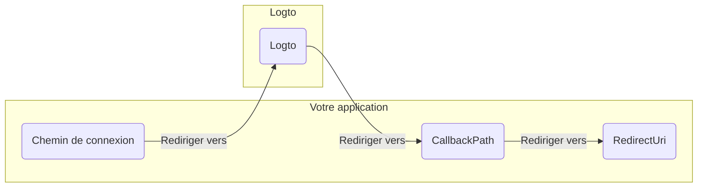

import RegardingRedirectBasedSignIn from '../../fragments/_regarding-redirect-based-sign-in.mdx';

Avant de continuer, il y a deux termes confus dans le middleware d'authentification .NET Core que nous devons clarifier :

1. **CallbackPath** : L'URI vers laquelle Logto redirigera l'utilisateur après qu'il se soit connecté (l'"URI de redirection" dans Logto)
2. **RedirectUri** : L'URI vers laquelle sera redirigé après que les actions nécessaires ont été effectuées dans le middleware d'authentification Logto.

Le processus de connexion peut être illustré comme suit :

 

De même, .NET Core a également **SignedOutCallbackPath** et **RedirectUri** pour le flux de déconnexion.

Pour plus de clarté, nous les appellerons comme suit :

| Terme que nous utilisons                  | Terme .NET Core       |
| ----------------------------------------- | --------------------- |
| URI de redirection Logto                  | CallbackPath          |
| URI de redirection post-déconnexion Logto | SignedOutCallbackPath |
| URI de redirection de l'application       | RedirectUri           |

<RegardingRedirectBasedSignIn />
