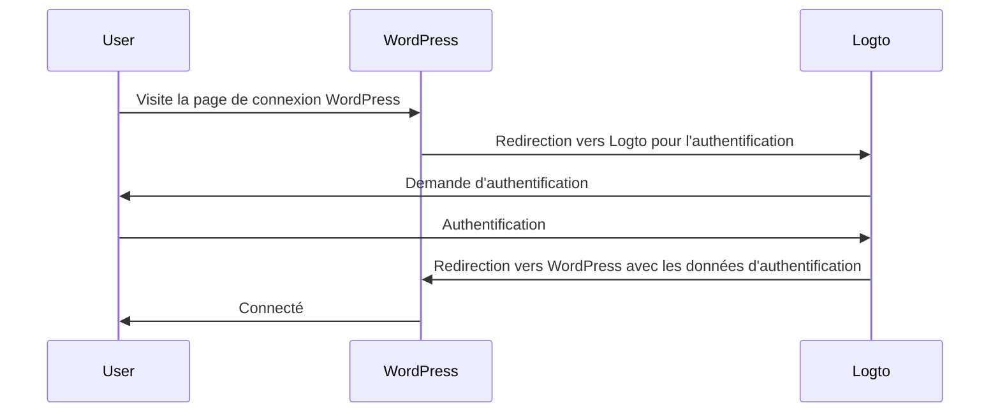
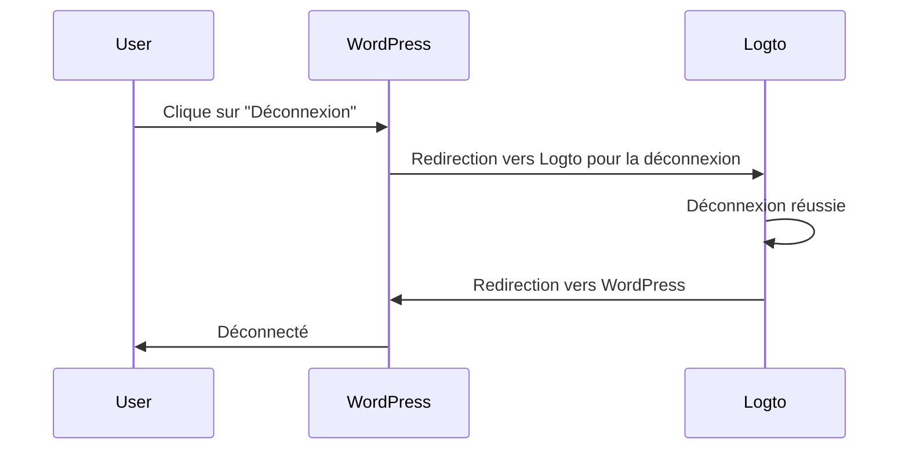

import TabItem from '@theme/TabItem';
import Tabs from '@theme/Tabs';

import FurtherReadings from '../../fragments/_further-readings.md';

# Ajoutez l’authentification à votre site WordPress avec le plugin Logto

Ce tutoriel vous montrera comment intégrer Logto à votre site [WordPress](https://wordpress.org) avec notre plugin WordPress officiel.

## Prérequis \{#prerequisites}

- Un compte [Logto Cloud](https://cloud.logto.io) ou un [Logto auto-hébergé](/introduction/set-up-logto-oss).
- Une application traditionnelle Logto créée.
- Un projet WordPress : suivez le guide d'installation officiel de [WordPress](https://wordpress.org/support/article/how-to-install-wordpress/) pour configurer votre site WordPress avant de continuer.

## Intégration \{#integration}

### Installer le plugin \{#authentication-settings}

:::info
Pour le moment, notre plugin est toujours en cours de révision et n'est pas disponible dans le répertoire des plugins WordPress. Nous mettrons à jour cette page une fois qu'il sera disponible.
:::

<Tabs>

{/* Uncomment the following block when plugin is available in the WordPress plugin directory */}
{/* <TabItem value="admin-panel" label="Depuis le panneau d'administration WordPress"> */}

{/* 1. Allez dans **Plugins** > **Ajouter nouveau**. */}
{/* 2. Recherchez "Logto". */}
{/* 3. Cliquez sur **Installer maintenant**. */}
{/* 4. Cliquez sur **Activer**. */}

{/* </TabItem> */}

<TabItem value="upload" label="Depuis un téléchargement">

1. Téléchargez le plugin WordPress Logto à partir de l'un des liens suivants :
   - [Dernière version](https://github.com/logto-io/wordpress/releases) : Téléchargez le fichier dont le nom est au format `logto-plugin-<version>.zip`.
     {/* Uncomment the following line when plugin is available in the WordPress plugin directory */}
     {/* - [Répertoire des plugins WordPress](https://wordpress.org/plugins) et recherchez "Logto". */}
2. Téléchargez le fichier ZIP du plugin.
3. Allez dans **Plugins** > **Ajouter nouveau** dans votre panneau d'administration WordPress.
4. Cliquez sur **Téléverser un plugin**.
5. Sélectionnez le fichier ZIP téléchargé et cliquez sur **Installer maintenant**.
6. Cliquez sur **Activer**.

</TabItem>

</Tabs>

### Configurer le plugin \{#scopes}

Vous devriez maintenant voir le menu Logto dans la barre latérale de votre panneau d'administration WordPress. Cliquez sur **Logto** > **Paramètres** pour configurer le plugin.

:::note
Vous devez avoir une application **web traditionnelle** créée dans la Console Logto avant de configurer le plugin. Si vous n'en avez pas créé une, veuillez vous référer à [Intégrer Logto dans votre application](/integrate-logto/integrate-logto-into-your-application) pour plus d'informations.
:::

La configuration minimale pour commencer avec le plugin est :

- Endpoint Logto : L'endpoint de votre tenant Logto.
- ID de l'application : L'ID de votre application Logto.
- Secret de l'application : Un des secrets valides de votre application Logto.

Toutes les valeurs peuvent être trouvées sur la page des détails de l'application dans la Console Logto.

Après avoir rempli les valeurs, cliquez sur **Enregistrer les modifications** (faites défiler vers le bas de la page si vous ne trouvez pas le bouton).

### Configurer l'URI de redirection \{#extra-params}

L'URI de redirection est l'URL vers laquelle Logto redirigera les utilisateurs après qu'ils se soient authentifiés ; et l'URI de redirection après déconnexion est l'URL vers laquelle Logto redirigera les utilisateurs après qu'ils se soient déconnectés.

Voici un diagramme de séquence non normatif pour illustrer le flux de connexion :

Voici à quoi ressemble le flux de déconnexion dans un diagramme de séquence non normatif :

Pour en savoir plus sur la nécessité de la redirection, consultez [Expérience de connexion expliquée](/concepts/sign-in-experience).

Dans notre cas, nous devons configurer les deux URIs de redirection dans votre Console Logto. Pour trouver l'URI de redirection, allez à la page **Logto** > **Paramètres** dans votre panneau d'administration WordPress. Vous verrez les champs **URI de redirection** et **URI de redirection après déconnexion**.

1. Copiez les valeurs **URI de redirection** et **URI de redirection après déconnexion** et collez-les dans les champs **URIs de redirection** et **URIs de redirection après déconnexion** dans votre Console Logto.
2. Cliquez sur **Enregistrer les modifications** dans la Console Logto.

### Point de contrôle : Testez votre site WordPress \{#require-verified-email}

Vous pouvez maintenant tester votre intégration Logto sur votre site WordPress :

1. Ouvrez une fenêtre de navigation privée si nécessaire.
2. Visitez votre site WordPress et cliquez sur le lien **Connexion** si applicable ; ou visitez directement la page de connexion (par exemple, `https://example.com/wp-login.php`).
3. La page devrait vous rediriger vers la page de connexion Logto.
4. Complétez le processus de connexion ou d'inscription.
5. Après une authentification réussie, vous devriez être redirigé vers votre site WordPress et connecté automatiquement.
6. Cliquez sur le lien **Déconnexion** pour vous déconnecter de votre site WordPress.
7. Vous devriez être redirigé vers la page de déconnexion Logto, puis de retour sur votre site WordPress.
8. Vous devriez être déconnecté de votre site WordPress.

## Paramètres d'authentification \{#require-organization-id}

Bien que le plugin fonctionne dès l'installation, vous pouvez personnaliser les paramètres d'authentification sur la page des paramètres du plugin Logto pour mieux répondre à vos besoins.

### Portées \{#authorization-settings}

Logto utilise des portées pour contrôler quelles informations sont partagées avec votre application. Le plugin WordPress Logto utilise le [Logto PHP SDK](https://github.com/logto-io/php) pour gérer le processus d'authentification, qui inclut les portées suivantes par défaut :

- `openid` : La portée de base requise pour OpenID Connect.
- `profile` : Pour obtenir les informations de profil de base de l'utilisateur.
- `offline_access` : Pour obtenir un jeton de rafraîchissement pour un accès hors ligne.

Pour plus d'informations sur les portées, consultez [Portées et revendications](/quick-starts/php#scopes-and-claims).

Le plugin ajoute également deux portées supplémentaires par défaut :

- `email` : Pour obtenir l'adresse e-mail de l'utilisateur.
- `roles` : Pour obtenir les rôles de l'utilisateur dans Logto.

Ces deux portées sont utilisées pour mapper l'e-mail et les rôles Logto aux e-mails et rôles WordPress. Vous pouvez personnaliser les portées en modifiant le champ **Portées** dans les paramètres du plugin.

:::warning
Si vous supprimez la portée `email` ou `roles`, certaines fonctionnalités du plugin ne fonctionneront pas correctement.
:::

### Paramètres supplémentaires \{#role-mapping}

Vous pouvez ajouter des paramètres supplémentaires à la requête d'authentification pour personnaliser le processus d'authentification. Par exemple, vous pouvez ajouter le paramètre `first_screen` pour décider quel écran afficher en premier dans le processus d'authentification.

Pour plus d'informations sur les paramètres supplémentaires, consultez [Paramètres d'authentification](/end-user-flows/authentication-parameters).

### Exiger un e-mail vérifié \{#advanced-settings}

Par défaut, le plugin exige que les utilisateurs aient une adresse e-mail vérifiée dans Logto pour se connecter à votre site WordPress. Si un utilisateur essaie de se connecter sans une adresse e-mail vérifiée, le plugin générera une erreur.

Vous pouvez désactiver cette fonctionnalité en décochant l'option **Exiger un e-mail vérifié** dans les paramètres du plugin.

### Exiger un ID d'organisation \{#remember-session}

Vous pouvez exiger que les utilisateurs aient une appartenance à une organisation spécifique dans Logto pour se connecter à votre site WordPress. Lorsqu'un ID d'organisation est spécifié, le plugin vérifiera si l'utilisateur a l'ID d'organisation spécifié dans son jeton d'identifiant. Sinon, une erreur sera générée.

Pour en savoir plus sur les organisations, consultez [Organisations](/organizations).

## Paramètres d'autorisation \{#sync-profile}

En plus de l'authentification, Logto fournit également des fonctionnalités d'autorisation comme le [contrôle d’accès basé sur les rôles (RBAC)](/authorization/role-based-access-control). Bien qu'il nécessite un peu de code personnalisé pour implémenter le RBAC si vous développez votre propre application, le plugin WordPress Logto offre un moyen intégré de mapper les rôles Logto aux [rôles WordPress](https://wordpress.org/documentation/article/roles-and-capabilities/).

### Mappage des rôles \{#wordpress-form-login}

Le plugin WordPress Logto vous permet de mapper les rôles Logto aux rôles WordPress. Cela signifie que vous pouvez attribuer différents rôles aux utilisateurs dans Logto, et le plugin attribuera automatiquement les rôles WordPress correspondants à ces utilisateurs lorsqu'ils se connecteront.

Pour mapper les rôles, cliquez sur **Ajouter** dans la section **Mappage des rôles** pour ajouter un nouveau mappage de rôle. Par exemple, si vous souhaitez mapper le rôle `group:editors` dans Logto au rôle `Editor` dans WordPress, vous pouvez le faire en ajoutant un nouveau mappage de rôle avec les valeurs suivantes :

- Rôle Logto : `group:editors`
- Rôle WordPress : `editor` (le slug du rôle `Editor` dans WordPress)

Vous pouvez trouver les slugs des rôles de tous les rôles WordPress dans la documentation [Rôles et Capacités](https://wordpress.org/documentation/article/roles-and-capabilities/).

:::note
Les slugs de rôle sont sensibles à la casse. Si vous entrez le nom du rôle comme `Editor` au lieu de `editor`, le mappage de rôle ne fonctionnera pas.
:::

Maintenant, rendez-vous dans la Console Logto et cliquez sur **Rôles** dans la barre latérale gauche. Créez un nouveau rôle nommé `group:editors` et attribuez-le à un utilisateur. Ensuite, connectez-vous à votre site WordPress avec cet utilisateur. Vous devriez voir que l'utilisateur a été attribué au rôle `Editor` dans WordPress.

:::note
Si l'utilisateur s'est déjà connecté à votre site WordPress, le mappage de rôle ne prendra effet que lorsque l'utilisateur se déconnectera et se reconnectera.
:::

Vous pouvez également ajouter plusieurs mappages de rôles pour mapper plusieurs rôles Logto aux rôles WordPress. Pour le moment, le plugin essaiera de mapper les rôles selon l'ordre de priorité. Par exemple, si vous avez les mappages de rôles suivants :

- Rôle Logto : `group:editors`, Rôle WordPress : `editor`
- Rôle Logto : `group:authors`, Rôle WordPress : `author`
- Rôle Logto : `group:subscribers`, Rôle WordPress : `subscriber`

Et qu'un utilisateur a à la fois les rôles `group:editors` et `group:authors` dans Logto, l'utilisateur se verra attribuer le rôle `Editor` dans WordPress.

## Paramètres avancés \{#username-strategy}

### Se souvenir de la session \{#troubleshooting}

Par défaut, le plugin se souviendra de la session de l'utilisateur pendant 2 semaines. Cela signifie que si un utilisateur se connecte à votre site WordPress, il ne sera pas invité à se reconnecter pendant 2 semaines. Vous pouvez réduire ce temps à 2 jours en décochant l'option **Se souvenir de la session** dans les paramètres du plugin.

### Synchroniser le profil \{#callback-url-shows-404}

Par défaut, le plugin synchronisera le profil de l'utilisateur à chaque connexion. Cela signifie que si un utilisateur se connecte à votre site WordPress, son profil sera mis à jour avec les dernières informations de Logto. Vous pouvez désactiver cette fonctionnalité en décochant l'option **Synchroniser le profil** dans les paramètres du plugin.

:::warning
Si vous désactivez cette fonctionnalité, le mappage de rôle ne prendra effet que lorsque l'utilisateur se connectera pour la première fois.
:::

### Connexion par formulaire WordPress \{#frequently-asked-questions}

Par défaut, vous pouvez ajouter `?form=1` à l'URL de connexion WordPress pour utiliser la connexion par formulaire WordPress. Cela est utile à des fins de test, mais vous pouvez désactiver cette fonctionnalité si vous ne souhaitez pas autoriser les utilisateurs à se connecter avec le formulaire WordPress.

### Stratégie de nom d'utilisateur \{#how-can-i-trigger-the-forgot-password-flow}

Il existe plusieurs façons de générer un nom d'utilisateur pour un utilisateur dans WordPress. Il est sûr d'utiliser la stratégie par défaut lorsque vous vous fiez à l'e-mail comme identifiant unique d'un utilisateur.

## Dépannage \{#how-can-i-use-the-wordpress-form-login}

### L'URL de rappel affiche une erreur 404 \{#further-readings}

Si l'URL de rappel affiche une erreur 404, il est probable que vos règles de réécriture WordPress soient obsolètes et doivent être actualisées manuellement. Pour ce faire, allez dans **Paramètres** > **Permaliens** dans votre panneau d'administration WordPress (ou visitez `/wp-admin/options-permalink.php` directement) et cliquez sur **Enregistrer les modifications**.

## Questions fréquemment posées \{#frequently-asked-questions}

### Comment puis-je déclencher le flux de mot de passe oublié ? \{#how-can-i-trigger-the-forgot-password-flow}

Il existe deux façons de déclencher le flux de mot de passe oublié :

1. Cliquez sur le lien de mot de passe oublié sur la page de connexion Logto.
2. Ajoutez `?action=lostpassword` à l'URL de connexion WordPress. Par exemple, `https://example.com/wp-login.php?action=lostpassword`.
   Cela vous redirigera vers la page de mot de passe oublié Logto.

### Comment puis-je utiliser la connexion par formulaire WordPress ? \{#how-can-i-use-the-wordpress-form-login}

Par défaut, vous pouvez ajouter `?form=1` à l'URL de connexion WordPress pour utiliser la connexion par formulaire WordPress. Par exemple, `https://example.com/wp-login.php?form=1`.

Si vous souhaitez désactiver cette fonctionnalité, vous pouvez décocher l'option **Connexion par formulaire WordPress** dans les paramètres du plugin.

## Lectures complémentaires \{#further-readings}

<FurtherReadings />
