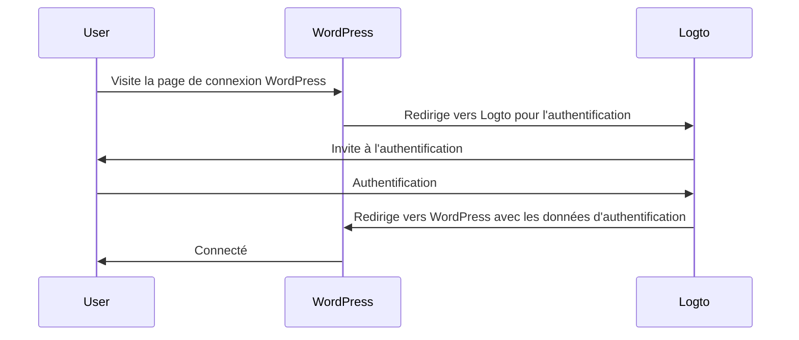
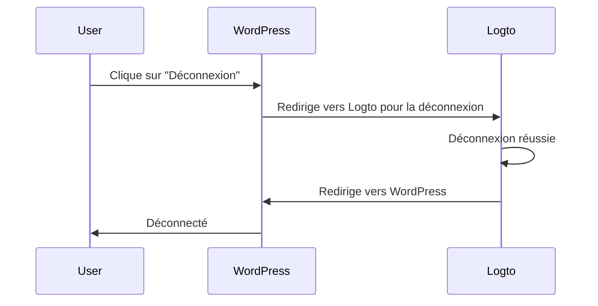

import TabItem from '@theme/TabItem';
import Tabs from '@theme/Tabs';

### Installer le plugin \{#install-the-plugin}

:::info
Pour le moment, notre plugin est encore en cours de révision et n'est pas disponible dans le répertoire des plugins WordPress. Nous mettrons à jour cette page une fois qu'il sera disponible.
:::

<Tabs>

{/* Décommentez le bloc suivant lorsque le plugin est disponible dans le répertoire des plugins WordPress */}
{/* <TabItem value="admin-panel" label="Depuis le panneau d'administration WordPress"> */}

{/* 1. Allez dans **Extensions** > **Ajouter**. */}
{/* 2. Recherchez "Logto". */}
{/* 3. Cliquez sur **Installer maintenant**. */}
{/* 4. Cliquez sur **Activer**. */}

{/* </TabItem> */}

<TabItem value="upload" label="Depuis un téléchargement">

1. Téléchargez le plugin Logto pour WordPress à partir de l'un des liens suivants :
   - [Dernière version](https://github.com/logto-io/wordpress/releases) : Téléchargez le fichier dont le nom est au format `logto-plugin-<version>.zip`.
     {/* Décommentez la ligne suivante lorsque le plugin est disponible dans le répertoire des plugins WordPress */}
     {/* - [Répertoire des plugins WordPress](https://wordpress.org/plugins) et recherchez "Logto". */}
2. Téléchargez le fichier ZIP du plugin.
3. Allez dans **Extensions** > **Ajouter** dans votre panneau d'administration WordPress.
4. Cliquez sur **Téléverser une extension**.
5. Sélectionnez le fichier ZIP téléchargé et cliquez sur **Installer maintenant**.
6. Cliquez sur **Activer**.

</TabItem>

</Tabs>

### Configurer le plugin \{#configure-the-plugin}

Vous devriez maintenant voir le menu Logto dans la barre latérale de votre panneau d'administration WordPress. Cliquez sur **Logto** > **Paramètres** pour configurer le plugin.

:::note
Vous devez avoir une application **web traditionnelle** créée dans Logto Console avant de configurer le plugin. Si vous n'en avez pas créé une, veuillez vous référer à [Intégrer Logto dans votre application](/integrate-logto/integrate-logto-into-your-application) pour plus d'informations.
:::

La configuration minimale pour commencer avec le plugin est :

- Point de terminaison Logto : Le point de terminaison de votre locataire Logto.
- ID de l'application : L'ID de votre application Logto.
- Secret de l'application : Un des secrets valides de votre application Logto.

Toutes les valeurs peuvent être trouvées sur la page des détails de l'application dans Logto Console.

Après avoir rempli les valeurs, cliquez sur **Enregistrer les modifications** (faites défiler vers le bas de la page si vous ne trouvez pas le bouton).

### Configurer l'URI de redirection \{#configure-redirect-uri}

L'URI de redirection est l'URL vers laquelle Logto redirigera les utilisateurs après qu'ils se soient authentifiés ; et l'URI de redirection après déconnexion est l'URL vers laquelle Logto redirigera les utilisateurs après qu'ils se soient déconnectés.

Voici un diagramme de séquence non normatif pour illustrer le flux de connexion :

Voici à quoi ressemble le flux de déconnexion dans un diagramme de séquence non normatif :

Pour en savoir plus sur la nécessité de la redirection, voir [Expérience de connexion expliquée](/concepts/sign-in-experience).

Dans notre cas, nous devons configurer les deux URIs de redirection dans votre Logto Console. Pour trouver l'URI de redirection, allez à la page **Logto** > **Paramètres** dans votre panneau d'administration WordPress. Vous verrez les champs **URI de redirection** et **URI de redirection après déconnexion**.

1. Copiez les valeurs **URI de redirection** et **URI de redirection après déconnexion** et collez-les dans les champs **URIs de redirection** et **URIs de redirection après déconnexion** dans votre Logto Console.
2. Cliquez sur **Enregistrer les modifications** dans Logto Console.

### Point de contrôle : Testez votre site WordPress \{#checkpoint-test-your-website}

Vous pouvez maintenant tester votre intégration Logto sur votre site WordPress :

1. Ouvrez une fenêtre de navigation privée si nécessaire.
2. Visitez votre site WordPress et cliquez sur le lien **Connexion** si applicable ; ou visitez directement la page de connexion (par exemple, `https://example.com/wp-login.php`).
3. La page devrait vous rediriger vers la page de connexion Logto.
4. Complétez le processus de connexion ou d'inscription.
5. Après une authentification réussie, vous devriez être redirigé vers votre site WordPress et connecté automatiquement.
6. Cliquez sur le lien **Déconnexion** pour vous déconnecter de votre site WordPress.
7. Vous devriez être redirigé vers la page de déconnexion Logto, puis de retour sur votre site WordPress.
8. Vous devriez être déconnecté de votre site WordPress.
