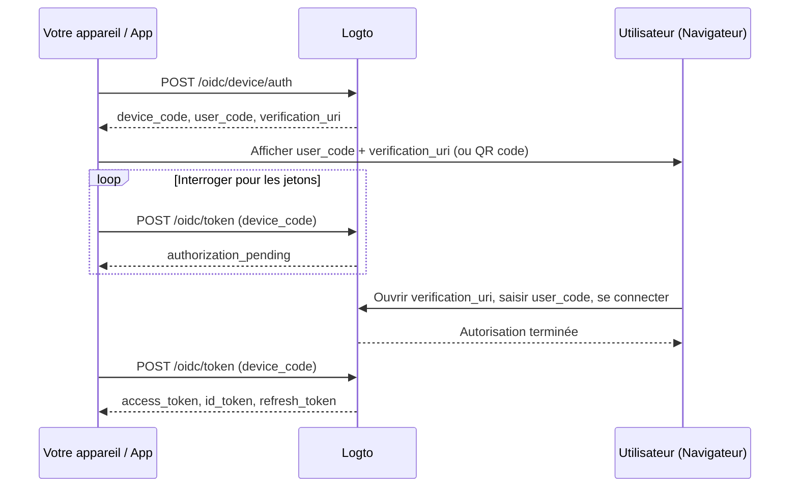

import ApiResourcesDescription from '../../fragments/_api-resources-description.md';
import FurtherReadings from '../../fragments/_further-readings.md';
import ScopeClaimList from '../../fragments/_scope-claim-list.md';
import ScopesAndClaimsIntroduction from '../../fragments/_scopes-claims-introduction.md';

# Device flow : Auth avec Logto

:::note
Ce guide suppose que vous avez créé une Application de type "Native" avec le device flow comme flux d'autorisation dans la Console Logto.
:::

## Introduction \{#introduction}

Le [device authorization grant OAuth 2.0](https://auth.wiki/device-flow) (device flow) est conçu pour les appareils avec des capacités de saisie limitées, tels que les smart TV, consoles de jeux, outils CLI et appareils IoT. Il permet aux utilisateurs de démarrer le processus de connexion sur l'appareil mais de terminer l'authentification sur un autre appareil disposant d'un navigateur, comme un téléphone ou un ordinateur portable.

Puisque l'appareil lui-même ne peut pas gérer un flux de connexion basé sur un navigateur, l'appareil affiche un code court et une URL. L'utilisateur visite cette URL sur un autre appareil, saisit le code et se connecte. Pendant ce temps, l'appareil d'origine interroge Logto jusqu'à ce que l'autorisation soit terminée.



## Obtenir les identifiants de l'application \{#get-application-credentials}

Dans votre Console Logto, accédez à la page de détails de votre application pour obtenir les identifiants suivants :

- **App ID** : L'identifiant unique de votre application (également appelé `client_id`).
- **Logto endpoint** : L'endpoint de votre serveur d'autorisation Logto. Vous pouvez le trouver dans la Console Logto sous "Détails de l'application".

Pour Logto Cloud, l'endpoint est `https://{your-tenant-id}.logto.app`.

:::note
Les applications device flow sont des clients publics, donc aucun App Secret n'est requis.
:::

## Demander un device code \{#request-a-device-code}

Démarrez le device flow en envoyant une requête `POST` à l'endpoint d'autorisation de l'appareil :

```bash
curl --request POST 'https://your.logto.endpoint/oidc/device/auth' \
  --header 'Content-Type: application/x-www-form-urlencoded' \
  --data-urlencode 'client_id=your-application-id' \
  --data-urlencode 'scope=openid offline_access profile'
```

La réponse inclut :

| Champ                       | Description                                                                                                                                                                                       |
| --------------------------- | ------------------------------------------------------------------------------------------------------------------------------------------------------------------------------------------------- |
| `device_code`               | Un code unique que votre application utilise lors de l'interrogation de l'endpoint de jeton.                                                                                                      |
| `user_code`                 | Un code court à afficher à l'utilisateur pour qu'il le saisisse dans le navigateur.                                                                                                               |
| `verification_uri`          | L'URL où l'utilisateur saisit le `user_code`.                                                                                                                                                     |
| `verification_uri_complete` | Une URL avec le `user_code` pré-rempli. Les utilisateurs peuvent visiter cette URL directement pour éviter la saisie manuelle du code — vous pouvez la présenter en QR code, lien cliquable, etc. |
| `expires_in`                | La durée de vie en secondes de `device_code` et `user_code`. Arrêtez l'interrogation après expiration.                                                                                            |

## Afficher l'URL de vérification à l'utilisateur \{#display-verification-url}

Affichez le `user_code` et le `verification_uri` sur l'écran de votre appareil.

Vous pouvez également utiliser `verification_uri_complete` qui a le code pré-rempli — l'utilisateur n'a qu'à confirmer. La façon de le présenter vous appartient : QR code, lien cliquable, etc.

## Interroger pour les jetons \{#poll-for-tokens}

Pendant que l'utilisateur termine l'authentification dans le navigateur, votre appareil doit interroger l'endpoint de jeton. Votre application doit attendre au moins **5 secondes** entre chaque requête d'interrogation :

```bash
curl --request POST 'https://your.logto.endpoint/oidc/token' \
  --header 'Content-Type: application/x-www-form-urlencoded' \
  --data-urlencode 'client_id=your-application-id' \
  --data-urlencode 'grant_type=urn:ietf:params:oauth:grant-type:device_code' \
  --data-urlencode 'device_code=DEVICE_CODE'
```

Remplacez `DEVICE_CODE` par la valeur `device_code` de la réponse d'autorisation de l'appareil.

**Arrêtez l'interrogation** lorsque :

- Vous recevez une réponse de jeton réussie.
- Le temps `expires_in` de la réponse device code est écoulé.
- Vous recevez une erreur non réessayable telle que `expired_token` ou `access_denied`.

### Réponse de jeton \{#token-response}

Après l'approbation de l'utilisateur, la réponse inclut :

| Champ           | Description                                                                                                                                                               |
| --------------- | ------------------------------------------------------------------------------------------------------------------------------------------------------------------------- |
| `access_token`  | Le jeton d’accès (Opaque token). Il s'agit d'une chaîne opaque par défaut ; lorsqu'une `resource` est demandée, c'est un JWT avec `aud` défini sur l'URI de la ressource. |
| `id_token`      | Le jeton d’identifiant (ID token) contenant les revendications d'identité de l'utilisateur. Présent uniquement si la portée `openid` est demandée.                        |
| `refresh_token` | Utilisé pour obtenir de nouveaux jetons sans ré-authentification. Présent uniquement si la portée `offline_access` est demandée.                                          |
| `token_type`    | Toujours `Bearer`.                                                                                                                                                        |
| `expires_in`    | Durée de vie du jeton en secondes.                                                                                                                                        |
| `scope`         | Les portées accordées par le serveur d'autorisation.                                                                                                                      |

## Point de contrôle : Testez votre device flow \{#checkpoint}

Testez maintenant l'intégration de votre device flow :

1. Lancez votre application et déclenchez le device flow pour obtenir un `device_code` et un `user_code`.
2. Ouvrez le `verification_uri` dans un navigateur et saisissez le `user_code`, ou utilisez `verification_uri_complete` pour éviter la saisie manuelle du code.
3. Terminez le processus de connexion dans le navigateur.
4. Vérifiez que votre application reçoit les jetons après l'interrogation.

## Obtenir les informations utilisateur \{#get-user-information}

### Décoder les revendications du jeton d’identifiant (ID token) \{#decode-id-token-claims}

Le `id_token` retourné dans la réponse de jeton est un [JSON Web Token (JWT)](https://auth.wiki/jwt) standard. Vous pouvez décoder la charge utile encodée en Base64URL (la seconde partie du JWT, séparée par `.`) pour accéder aux revendications utilisateur de base sans requête réseau supplémentaire.

La charge utile décodée contient des revendications telles que `sub` (ID utilisateur), `name`, `email`, etc., selon les portées demandées.

:::tip
En production, vous devez valider la signature du JWT avant de faire confiance à ses revendications. Utilisez le JWKS de votre endpoint Logto (`https://your.logto.endpoint/oidc/jwks`) pour vérifier le jeton.
:::

### Récupérer depuis l'endpoint userinfo \{#fetch-from-userinfo-endpoint}

Le jeton d’identifiant (ID token) contient des revendications de base selon les portées demandées. Certaines revendications étendues (comme `custom_data`, `identities`) ne sont disponibles que via l'[endpoint OIDC UserInfo](https://openid.net/specs/openid-connect-core-1_0.html#UserInfo) :

```bash
curl --request GET 'https://your.logto.endpoint/oidc/me' \
  --header 'Authorization: Bearer ACCESS_TOKEN'
```

Remplacez `ACCESS_TOKEN` par le jeton d’accès (Opaque token) obtenu dans la réponse de jeton (et non le JWT de ressource). La réponse est un objet JSON contenant les revendications de l'utilisateur selon les portées accordées.

### Demander des revendications supplémentaires \{#request-additional-claims}

Vous pouvez constater que certaines informations utilisateur sont absentes du jeton d’identifiant (ID token). Cela s'explique par le fait qu'OAuth 2.0 et OpenID Connect (OIDC) sont conçus pour suivre le principe du moindre privilège (PoLP), et Logto est construit sur ces standards.

<ScopesAndClaimsIntroduction />

Pour demander des portées supplémentaires, incluez-les dans le paramètre `scope` de la requête d'autorisation de l'appareil. Par exemple, pour demander l'email et le téléphone de l'utilisateur :

```bash
curl --request POST 'https://your.logto.endpoint/oidc/device/auth' \
  --header 'Content-Type: application/x-www-form-urlencoded' \
  --data-urlencode 'client_id=your-application-id' \
  --data-urlencode 'scope=openid offline_access profile email phone'
```

### Portées et revendications \{#scopes-and-claims}

<ScopeClaimList />

## Ressources API et organisations \{#api-resources-and-organizations}

<ApiResourcesDescription />

### Demander l'accès à des ressources API \{#request-access-for-api-resources}

Pour accéder à une ressource API spécifique, incluez le paramètre `resource` dans la requête d'autorisation de l'appareil :

```bash
curl --request POST 'https://your.logto.endpoint/oidc/device/auth' \
  --header 'Content-Type: application/x-www-form-urlencoded' \
  --data-urlencode 'client_id=your-application-id' \
  --data-urlencode 'scope=openid offline_access' \
  --data-urlencode 'resource=https://your-api-resource-indicator'
```

Une fois l'utilisateur autorisé et après avoir reçu un jeton de rafraîchissement (Refresh token), vous pouvez obtenir des jetons d’accès JWT pour la ressource API :

```bash
curl --request POST 'https://your.logto.endpoint/oidc/token' \
  --header 'Content-Type: application/x-www-form-urlencoded' \
  --data-urlencode 'client_id=your-application-id' \
  --data-urlencode 'grant_type=refresh_token' \
  --data-urlencode 'refresh_token=REFRESH_TOKEN' \
  --data-urlencode 'resource=https://your-api-resource-indicator'
```

La réponse contiendra un `access_token` JWT avec `aud` défini sur votre indicateur de ressource API.

:::note
Le `refresh_token` (Jeton de rafraîchissement) n'est disponible que si la portée `offline_access` est incluse dans la requête d'autorisation initiale. Stockez et utilisez toujours le dernier `refresh_token`, car Logto utilise la rotation des jetons.
:::

### Récupérer des jetons d’organisation \{#fetch-organization-tokens}

Si [organisations](/organizations) est nouveau pour vous, veuillez lire [🏢 Organisations (Multi-tenancy)](/organizations) pour commencer.

Pour demander des informations liées à l'organisation, ajoutez la portée `urn:logto:scope:organizations` dans la requête d'autorisation de l'appareil :

```bash
curl --request POST 'https://your.logto.endpoint/oidc/device/auth' \
  --header 'Content-Type: application/x-www-form-urlencoded' \
  --data-urlencode 'client_id=your-application-id' \
  --data-urlencode 'scope=openid offline_access urn:logto:scope:organizations' \
  --data-urlencode 'resource=urn:logto:resource:organizations'
```

Une fois l'utilisateur connecté, vous pouvez récupérer des jetons d’organisation à l'aide du jeton de rafraîchissement :

```bash
curl --request POST 'https://your.logto.endpoint/oidc/token' \
  --header 'Content-Type: application/x-www-form-urlencoded' \
  --data-urlencode 'client_id=your-application-id' \
  --data-urlencode 'grant_type=refresh_token' \
  --data-urlencode 'refresh_token=REFRESH_TOKEN' \
  --data-urlencode 'organization_id=your-organization-id'
```

La réponse contiendra un jeton d’accès limité à l'organisation spécifiée.

#### Ressources API d'organisation \{#organization-api-resources}

Pour obtenir un jeton d’accès pour une ressource API au sein d'une organisation, incluez à la fois les paramètres `resource` et `organization_id` :

```bash
curl --request POST 'https://your.logto.endpoint/oidc/token' \
  --header 'Content-Type: application/x-www-form-urlencoded' \
  --data-urlencode 'client_id=your-application-id' \
  --data-urlencode 'grant_type=refresh_token' \
  --data-urlencode 'refresh_token=REFRESH_TOKEN' \
  --data-urlencode 'organization_id=your-organization-id' \
  --data-urlencode 'resource=https://your-api-resource-indicator'
```

## Pour aller plus loin \{#further-readings}

<FurtherReadings />
