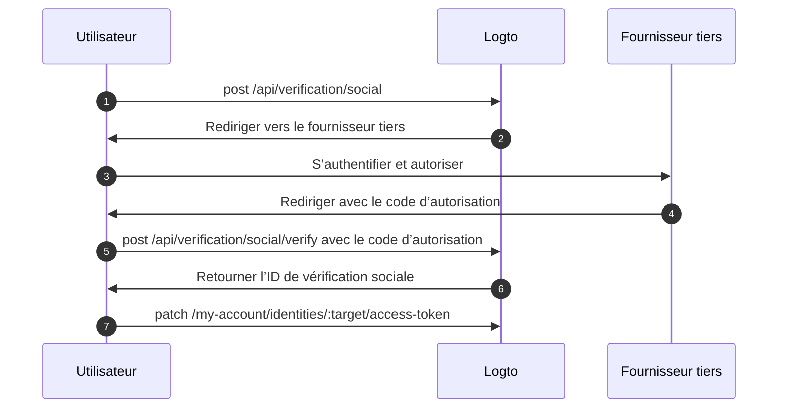

import Availability from '@components/Availability';

<Availability cloud oss={{ major: 1, minor: 31 }} />

L'ensemble de jetons tiers (aussi appelé ensemble de jetons fédérés) est un type de secret stocké dans le [coffre-fort de secrets](/secret-vault) de Logto, utilisé pour gérer en toute sécurité les jetons d’accès (Access tokens) et de rafraîchissement (Refresh tokens) émis par des fournisseurs d'identité tiers. Lorsqu'un utilisateur s'authentifie via un connecteur social ou SSO d’entreprise, Logto stocke les jetons émis dans le coffre-fort. Ces jetons peuvent ensuite être récupérés pour accéder aux API tierces au nom de l'utilisateur, sans nécessiter une nouvelle authentification.

## Cas d’utilisation courants \{#common-use-cases}

Cette fonctionnalité est essentielle pour les applications modernes telles que les agents IA, les plateformes SaaS, les outils de productivité et les applications clients qui doivent interagir avec des services tiers au nom des utilisateurs. Voici quelques exemples pratiques :

**📅 Applications de gestion de calendrier** : Après qu'un utilisateur se connecte avec Google, votre application de productivité peut automatiquement synchroniser ses événements de calendrier, créer de nouvelles réunions et envoyer des invitations sans lui demander de s'authentifier à nouveau.

**🤖 Assistants IA** : Un agent IA peut accéder aux dépôts GitHub d'un utilisateur pour analyser du code, créer des pull requests ou gérer des tickets. Tout cela avec le consentement unique de l'utilisateur lors de la connexion ou de la liaison de compte.

**📊 Tableaux de bord analytiques** : Les plateformes SaaS peuvent extraire des données des comptes de réseaux sociaux connectés des utilisateurs (Facebook, LinkedIn) pour générer des analyses et des rapports sans interrompre leur flux de travail avec des demandes de connexion répétées.

## Activer le stockage de jetons tiers \{#enable-third-party-token-storage}

### Connecteurs sociaux \{#social-connectors}

Cette fonctionnalité est disponible pour les [connecteurs sociaux](/connectors/social-connectors) qui prennent en charge le stockage de jetons. Les jetons tiers peuvent être stockés lors de la [connexion sociale](/end-user-flows/sign-up-and-sign-in/social-sign-in), de la [liaison de compte social](/end-user-flows/account-settings/by-account-api#link-a-new-social-connection), et [lors du renouvellement des jetons pour l'accès à l'API tierce](/secret-vault/federated-token-set#reauthentication-and-token-renewal). Les connecteurs actuellement pris en charge incluent : [GitHub](/integrations/github), [Google](/integrations/google), [Facebook](/integrations/facebook), [OAuth 2.0 standard](/integrations/oauth2), et [OIDC standard](/integrations/oidc). La prise en charge d'autres connecteurs sera déployée progressivement.

1. Accédez à <CloudLink to="/connectors/social">Console > Connecteurs > Connecteurs sociaux</CloudLink>.
2. Sélectionnez le connecteur social pour lequel vous souhaitez activer le stockage de jetons tiers.
3. Suivez les tutoriels de configuration pour configurer le connecteur, y compris l'ajout des portées nécessaires pour accéder à des API tierces spécifiques.
4. Dans la page "Paramètres", activez l’option **Stocker les jetons pour un accès API persistant**.

### Connecteurs SSO d’entreprise \{#enterprise-sso-connectors}

Le stockage des jetons est disponible pour tous les [connecteurs d’entreprise OIDC](/connectors/enterprise-connectors). Les jetons d’accès (Access tokens) et de rafraîchissement (Refresh tokens) peuvent être stockés lors de la [connexion SSO d’entreprise](/end-user-flows/enterprise-sso). Les connecteurs actuellement pris en charge incluent : [Google Workspace](/integrations/google-workspace).

1. Accédez à <CloudLink to="/enterprise-sso">Console > SSO d’entreprise</CloudLink>.
2. Sélectionnez le connecteur SSO d’entreprise pour lequel vous souhaitez activer le stockage de jetons tiers.
3. Suivez les tutoriels de configuration pour configurer le connecteur, y compris l'ajout des portées nécessaires pour accéder à des API tierces spécifiques.
4. Dans l’onglet "Expérience SSO", activez l’option **Stocker les jetons pour un accès API persistant**.

N'oubliez pas d'enregistrer vos modifications.

## Stockage des jetons \{#token-storage}

Une fois le stockage de jetons tiers activé, Logto stocke automatiquement les jetons d’accès (Access tokens) et de rafraîchissement (Refresh tokens) émis par le fournisseur d'identité fédéré chaque fois qu'un utilisateur s'authentifie via un connecteur social ou SSO d’entreprise. Cela inclut :

- [Connexion et inscription sociale](/end-user-flows/sign-up-and-sign-in/social-sign-in)
- [Connexion et inscription SSO d’entreprise](/end-user-flows/enterprise-sso)
- [Liaison de compte social via Account API](/end-user-flows/account-settings/by-account-api#link-a-new-social-connection)

Les jetons stockés sont attachés à l'identité sociale ou SSO d’entreprise de l'utilisateur, ce qui leur permet de récupérer les jetons ultérieurement pour accéder à l’API sans nécessiter une nouvelle authentification.

### Vérifier le statut du stockage de jetons \{#checking-token-storage-status}

Vous pouvez vérifier le statut du stockage de jetons tiers d'un utilisateur dans la Console Logto :

1. Accédez à <CloudLink to="/users">Console > Utilisateurs</CloudLink>.
2. Cliquez sur l'utilisateur que vous souhaitez inspecter. Cela vous amènera à la page de détails de l'utilisateur.
3. Faites défiler jusqu'à la section **Connexions**. Cette zone répertorie toutes les connexions sociales et SSO d’entreprise associées à l'utilisateur.
4. Chaque entrée de connexion affiche une étiquette de statut de jeton indiquant si des jetons sont stockés pour cette connexion.
5. Cliquez sur l'entrée de connexion pour afficher plus de détails, y compris les métadonnées du jeton d’accès stocké et la disponibilité du jeton de rafraîchissement (le cas échéant).

Vous pouvez également vérifier les identités tierces de l'utilisateur et le statut du stockage de jetons via la Management API :

- `GET /api/users/{userId}/identities/{target}?includeTokenSecret=true` : Récupérer l'identité sociale d'un utilisateur et le statut du stockage de jetons associé à l'identité par un connecteur donné (par exemple, `github`, `google`, etc.).
- `GET /api/users/{userId}/sso-identities/{ssoConnectorId}?includeTokenSecret=true` : Récupérer l'identité SSO d’entreprise d'un utilisateur et le statut du stockage de jetons associé à l'identité par un ID de connecteur SSO donné.

### Statut du stockage de jetons \{#token-storage-status}

- **Actif** : Le jeton d’accès est stocké et actif.
- **Expiré** : Le jeton d’accès est stocké mais a expiré. Si un jeton de rafraîchissement est disponible, il peut être utilisé pour obtenir un nouveau jeton d’accès.
- **Inactif** : Aucun jeton d’accès n'est stocké pour cette connexion. Cela peut se produire si l'utilisateur ne s'est pas authentifié via cette connexion ou si le stockage du jeton a été supprimé.
- **Non applicable** : Le connecteur ne prend pas en charge le stockage de jetons.

### Métadonnées du jeton \{#token-metadata}

Pour l'intégrité et la sécurité des données, tous les jetons sont chiffrés avant d'être stockés dans le coffre-fort de secrets. Les valeurs réelles des jetons ne sont accessibles qu'à l'utilisateur final avec la bonne autorisation. Les développeurs, quant à eux, ne peuvent récupérer que les métadonnées de l'ensemble de jetons pour comprendre l'état des jetons stockés sans exposer de contenu sensible.

- `createdAt` : L'horodatage auquel la connexion a été établie pour la première fois et où l'ensemble de jetons a été initialement stocké dans le coffre-fort de secrets.
- `updatedAt` : La dernière fois que l'ensemble de jetons a été mis à jour.
  - Si aucun jeton de rafraîchissement n'est disponible, cette valeur sera identique à **createdAt**.
  - Si un jeton de rafraîchissement est présent, cette valeur reflète la dernière fois où le jeton d’accès a été rafraîchi.
- `hasRefreshToken` : Indique si un jeton de rafraîchissement est disponible.
  Si le connecteur prend en charge l'accès hors ligne et que la requête d'autorisation est correctement configurée, Logto stocke le jeton de rafraîchissement lorsqu'il est émis par le fournisseur d'identité en même temps que le jeton d’accès.
  Lorsque le jeton d’accès expire et qu'un jeton de rafraîchissement valide existe, Logto tente automatiquement d'obtenir un nouveau jeton d’accès en utilisant le jeton de rafraîchissement stocké chaque fois que l'utilisateur demande l'accès au fournisseur connecté.
- `expiresAt` : L'heure d'expiration estimée du jeton d’accès en **secondes**.
  Ceci est calculé à partir de la valeur `expires_in` renvoyée par le point de terminaison de jeton du fournisseur d'identité. (Ce champ n'est disponible que si le fournisseur inclut `expires_in` dans la réponse du jeton.)
- `scope` : La portée (Scope) du jeton d’accès, indiquant les permissions accordées par le fournisseur d'identité.
  Ceci est utile pour comprendre quelles actions peuvent être effectuées avec le jeton d’accès stocké. (Ce champ n'est disponible que si le fournisseur inclut `scope` dans la réponse du jeton.)
- `tokenType` : Le type du jeton d’accès, généralement "Bearer".
  (Ce champ n'est disponible que si le fournisseur inclut `token_type` dans la réponse du jeton.)

## Récupération des jetons \{#token-retrieval}

Une fois le stockage de jetons activé et les jetons stockés en toute sécurité dans le coffre-fort de secrets de Logto, les utilisateurs finaux peuvent récupérer leurs jetons d’accès tiers depuis votre application cliente en s'intégrant à l'[Account API](/end-user-flows/account-settings/by-account-api) de Logto.

- `GET /my-account/identities/:target/access-token` : Récupérer le jeton d’accès pour une identité sociale en spécifiant le connecteur cible (par exemple, github, google).

- `GET /my-account/sso-identities/:connectorId/access-token` : Récupérer le jeton d’accès pour une identité SSO d’entreprise en spécifiant l’ID du connecteur.

:::info
Découvrez comment [activer](/end-user-flows/account-settings/by-account-api#how-to-enable-account-api) et [accéder](/end-user-flows/account-settings/by-account-api#access-account-api-using-access-token) à l’Account API en utilisant le jeton d’accès émis par Logto.
:::

### Rotation des jetons \{#token-rotation}

Les points de terminaison de récupération de jetons renvoient :

- `200` OK : Si le jeton d’accès est récupéré avec succès et est toujours valide.
- `404` Not Found : Si l'utilisateur ne possède pas d'identité sociale ou SSO d’entreprise associée à la cible ou à l’ID du connecteur spécifié, ou si le jeton d’accès n'est pas stocké.
- `401` Unauthorized : Si le jeton d’accès est expiré.

Si le jeton d’accès est expiré et qu'un jeton de rafraîchissement est disponible, Logto tente automatiquement de rafraîchir le jeton d’accès et renvoie le nouveau jeton d’accès dans la réponse. Le stockage du jeton dans le coffre-fort de secrets est également mis à jour avec le nouveau jeton d’accès et ses métadonnées.

## Suppression du stockage de jetons \{#token-storage-deletion}

Le stockage de jetons tiers est directement lié à chaque connexion sociale ou SSO d’entreprise de l'utilisateur. Cela signifie que l'ensemble de jetons stocké sera automatiquement supprimé dans les cas suivants :

- L'identité sociale ou SSO d’entreprise associée est supprimée du compte de l'utilisateur.
- Le compte utilisateur est supprimé de votre tenant.
- Le connecteur social ou SSO d’entreprise est supprimé de votre tenant.

### Révocation des jetons \{#revoking-tokens}

Vous pouvez également supprimer manuellement l'ensemble de jetons tiers d'un utilisateur pour révoquer l'accès :

- Depuis la Console :
  Accédez à la page de détails de l'identité de l'utilisateur. Faites défiler jusqu'à la section **Jeton d’accès** (si le stockage de jetons est disponible) et cliquez sur le bouton **Supprimer les jetons** à la fin de la section.
- Via la Management API :
  - `DELETE /api/secret/:id` : Supprimer un secret spécifique par son ID, qui peut être obtenu à partir des détails de l'identité utilisateur.

La révocation de l'ensemble de jetons obligera l'utilisateur à se ré-authentifier auprès du fournisseur tiers pour obtenir un nouveau jeton d’accès avant de pouvoir accéder à nouveau aux API tierces.

## Ré-authentification et renouvellement des jetons \{#reauthentication-and-token-renewal}

Dans les scénarios où un jeton d’accès stocké a expiré ou lorsqu'une application doit demander des portées API supplémentaires, les utilisateurs finaux peuvent se ré-authentifier auprès du fournisseur tiers pour obtenir un nouveau jeton d’accès — sans avoir besoin de se connecter à Logto à nouveau.
Cela peut être réalisé via l’[API de vérification sociale](https://openapi.logto.io/operation/operation-createverificationbysocial) de Logto, qui permet aux utilisateurs de réinitier un flux d'autorisation sociale fédérée et de mettre à jour leur ensemble de jetons stocké.

:::note
La réinitiation de l'autorisation fédérée est actuellement limitée aux connecteurs sociaux.
Pour les connecteurs SSO d’entreprise, la ré-authentification et le renouvellement des jetons nécessitent que l'utilisateur initie à nouveau un flux d'authentification Logto complet, car la ré-autorisation directe auprès du fournisseur SSO d’entreprise n'est pas encore prise en charge après la connexion.
:::



1. L'utilisateur initie une demande de vérification sociale en appelant le point de terminaison `POST /api/verification/social`. L'utilisateur peut spécifier des portées personnalisées pour demander des permissions supplémentaires au fournisseur tiers.

   ```sh
   curl -X POST https://<your-logto-domain>/api/verification/social \
     -H "Authorization: Bearer <access_token>" \
     -H "Content-Type: application/json" \
     -d '{
       "state": "<state>",
       "connectorId": "<logto_connectorId>",
       "redirectUri": "<redirect_uri>",
       "scope": "<custom_scope>"
     }'
   ```

   - **authorization header** : Le jeton d’accès de l'utilisateur émis par Logto.
   - **connectorId** : L’ID du connecteur social dans Logto.
   - **redirectUri** : L’URI vers laquelle rediriger l'utilisateur après l'authentification. Vous devrez enregistrer cette URI dans les paramètres de l'application du fournisseur.
   - **scope** : (Optionnel) Portées personnalisées pour demander des permissions supplémentaires au fournisseur tiers. Si non spécifié, les portées par défaut configurées dans le connecteur seront utilisées.

2. Logto crée un nouvel enregistrement de vérification sociale et retourne l’ID de vérification sociale ainsi que l’URL d'autorisation pour rediriger l'utilisateur vers le fournisseur tiers pour l'authentification.

   La réponse ressemblera à ceci :

   ```json
   {
     "verificationRecordId": "<social_verification_id>",
     "authorizationUri": "<authorization_url>",
     "expiresAt": "<expiration_time>"
   }
   ```

3. Redirigez l'utilisateur vers l’URL d'autorisation. L'utilisateur s'authentifie auprès du fournisseur tiers et accorde les permissions.

4. Le fournisseur tiers redirige l'utilisateur vers votre application cliente avec un code d'autorisation.

5. Gérez le rappel d'autorisation en transmettant le code d'autorisation au point de terminaison de vérification de Logto :

   ```sh
   curl -X POST https://<your-logto-domain>/api/verification/social/verify \
     -H "Authorization: Bearer <access_token>" \
     -d '{
       "verificationRecordId": "<social_verification_id>",
       "connectorData": {
         "code": "<authorization_code>",
         "state": "<state>",
         "redirectUri": "<redirect_uri>"
       }
     }'
   ```

   - **authorization header** : Le jeton d’accès de l'utilisateur émis par Logto.
   - **verificationRecordId** : L’ID de vérification sociale retourné à l’étape précédente.
   - **connectorData** : Le code d'autorisation et toute autre donnée retournée par le fournisseur tiers lors du rappel.

   :::note
   N'oubliez pas de valider le paramètre `state` pour prévenir les attaques CSRF.
   :::

6. Logto vérifie le code d'autorisation et l'échange contre un nouveau jeton d’accès et un jeton de rafraîchissement auprès du fournisseur tiers, puis retourne l’ID de vérification sociale dans la réponse.

7. Enfin, mettez à jour le stockage de jetons de l'utilisateur en appelant le point de terminaison `PATCH /my-account/identities/:target/access-token` avec l’ID de vérification sociale :

   ```sh
   curl -X PATCH https://<your-logto-domain>/my-account/identities/<target>/access-token \
     -H "Authorization: Bearer <access_token>" \
     -H "Content-Type: application/json" \
     -d '{
       "socialVerificationId": "<social_verification_id>"
     }'
   ```

   - **authorization header** : Le jeton d’accès de l'utilisateur émis par Logto.
   - **socialVerificationId** : L’ID de vérification sociale vérifié retourné à l’étape précédente.

   Cela mettra à jour l'ensemble de jetons de l'utilisateur dans le coffre-fort de secrets de Logto avec le nouveau jeton d’accès et le jeton de rafraîchissement, permettant à l'utilisateur d'accéder aux API tierces sans avoir à se reconnecter à Logto.

   Le jeton d’accès mis à jour sera retourné.
