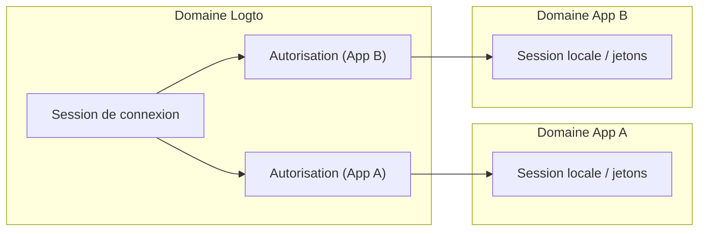
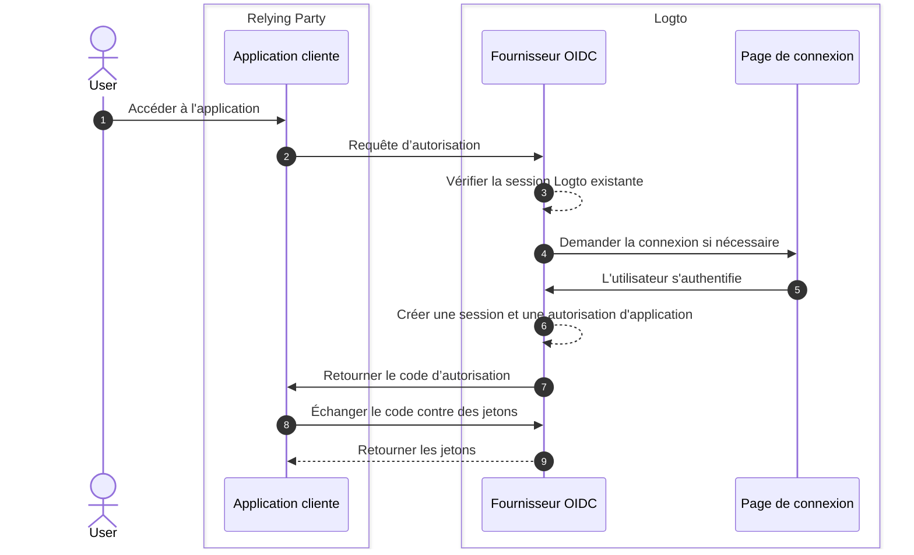
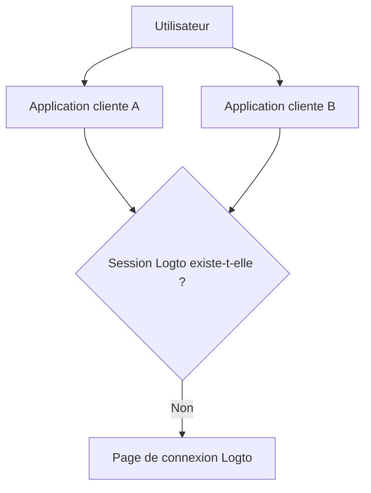

# Sessions

Les sessions dans Logto définissent comment l'état d'authentification est créé, partagé, rafraîchi et révoqué à travers les applications, navigateurs et appareils.

En pratique, les utilisateurs vivent l'expérience d'être "connectés" comme un état unique, mais l'état du système est divisé en plusieurs couches. Comprendre ces couches est la clé pour concevoir un SSO prévisible, un renouvellement de jeton et un comportement de déconnexion.

## Modèle de session dans Logto \{#session-model-in-logto}

- **Session de connexion Logto** : État de connexion centralisé stocké sous forme de cookies de domaine Logto. Cela contrôle la disponibilité du SSO dans le contexte du navigateur actuel.
- **Autorisation** : État d'autorisation spécifique à l'application pour `utilisateur + application cliente`. Les autorisations sont le pont entre la connexion centralisée et l'émission de jetons d'application.
- **Session/jetons locaux de l'application** : État d'authentification local dans chaque application (jetons d’identifiant/d’accès/de rafraîchissement, cookie de session de l'application, etc.).

## Concepts de base \{#core-concepts}

### Qu'est-ce qu'une session Logto ? \{#what-is-a-logto-session}

Une session Logto est l'état d'authentification centralisé créé après une connexion réussie. Si elle est toujours valide, Logto peut authentifier les utilisateurs silencieusement pour d'autres applications dans le même locataire. Si elle n'existe pas, les utilisateurs doivent se reconnecter.

### Qu'est-ce que les autorisations ? \{#what-are-grants}

Une autorisation est un état d'autorisation au niveau de l'application lié à un utilisateur spécifique et à une application cliente.

- Une session Logto peut avoir des autorisations pour plusieurs applications.
- Les jetons pour une application sont émis sous l'autorisation de cette application.
- La révocation d'une autorisation affecte la capacité de cette application à continuer l'accès basé sur les jetons.

### Comment la session, les autorisations et l'état d'authentification de l'application sont liés \{#how-session-grants-and-app-auth-state-relate}

- **Session** répond : "Ce navigateur peut-il faire du SSO avec Logto en ce moment ?"
- **Autorisation** répond : "Cet utilisateur est-il autorisé pour cette application cliente ?"
- **Session locale de l'application** répond : "Cette application considère-t-elle actuellement l'utilisateur comme connecté ?"

## Connexion et création de session \{#sign-in-and-session-creation}

## Topologie de session à travers les applications et appareils \{#session-topology-across-apps-and-devices}

### Même navigateur : session Logto partagée \{#same-browser-shared-logto-session}

Les applications dans le même navigateur peuvent partager l'état de session Logto centralisé, de sorte que le SSO peut se produire sans saisie répétée des identifiants.

### Navigateurs ou appareils différents : sessions Logto isolées \{#different-browsers-or-devices-isolated-logto-sessions}

Chaque navigateur/appareil a un stockage de cookies séparé. Une session valide sur l'Appareil A n'implique pas une session valide sur l'Appareil B.

## Cycle de vie de la session \{#session-lifecycle}

### 1. Créer \{#1-create}

Après l'authentification de l'utilisateur, Logto crée une session centralisée et une autorisation spécifique à l'application.

### 2. Réutiliser (SSO) \{#2-reuse-sso}

Tant que les cookies de session sont valides dans le même navigateur, les nouvelles requêtes d’autorisation peuvent souvent se terminer silencieusement.

### 3. Renouveler les jetons \{#3-renew-tokens}

L'accès à l'application se poursuit généralement par des flux de rafraîchissement de jetons (lorsqu'ils sont activés). C'est une continuité au niveau de l'application, distincte de l'existence de la session Logto centralisée.

### 4. Révoquer/expirer \{#4-revokeexpire}

La révocation peut se produire à différents niveaux :

- La déconnexion locale de l'application supprime les jetons/session locaux de l'application.
- La fin de session supprime la session Logto centralisée.
- La révocation d'autorisation supprime la continuité de l'autorisation au niveau de l'application.

## Recommandations de conception \{#design-recommendations}

- Gardez la gestion des sessions locales de l'application explicite dans le code de votre application.
- Traitez la session Logto, les autorisations et la session locale de l'application comme des couches séparées.
- Choisissez si la déconnexion doit être uniquement locale à l'application ou globale.
- Utilisez [la déconnexion par canal secondaire](/end-user-flows/sign-out#federated-sign-out-back-channel-logout) lorsque la cohérence multi-applications est requise.
- Pour le comportement de déconnexion et les détails de mise en œuvre, voir [Déconnexion](/end-user-flows/sign-out).

## Bonnes pratiques pour révoquer l'accès \{#best-practices-for-revoking-access}

Utilisez différentes stratégies de révocation en fonction de votre objectif :

- **Révoquer l'accès de vos applications de première partie** :
  Révoquez la session cible avec `revokeGrantsTarget=firstParty`.
  Cela déconnecte l'utilisateur des applications de première partie associées à cette session, ce qui crée une expérience de déconnexion cohérente.
  En même temps, les autorisations pour les applications tierces qui ont `offline_access` accordé peuvent rester disponibles pour les intégrations en cours.
  Voir [Gérer les sessions utilisateur](/sessions/manage-user-sessions) pour les détails de révocation de session.

- **Révoquer l'accès aux applications tierces** :
  Choisissez l'une des options suivantes :

  - Révoquez la session avec `revokeGrantsTarget=all` pour révoquer toutes les autorisations associées à cette session.
  - Révoquez directement des autorisations spécifiques via les API de gestion des autorisations pour supprimer les autorisations des applications tierces sans forcer une déconnexion complète de la session.
    Voir [Gérer les applications autorisées par l'utilisateur (autorisations)](/sessions/grants-management) pour les stratégies de révocation spécifiques aux autorisations.

- **Lors de l'utilisation de Logto Console** :
  Sur la page des détails de l'utilisateur, Logto fournit à la fois la gestion des sessions et la gestion des applications tierces autorisées prêtes à l'emploi.
  - Révoquer une session révoque également les autorisations des applications de première partie, pour maintenir un comportement de déconnexion de première partie cohérent.
  - Révoquer une autorisation d'application tierce révoque les autorisations pour cette application tierce tout en gardant le statut de session original inchangé.

## Ressources associées \{#related-resources}

<Url href="/sessions/manage-user-sessions">Gérer les sessions utilisateur</Url>
<Url href="/sessions/grants-management">
  Gérer les applications autorisées par l'utilisateur (autorisations)
</Url>
<Url href="/sessions/session-configs">Configuration de session</Url>
<Url href="/end-user-flows/sign-out">Déconnexion</Url>
<Url href="/end-user-flows/sign-up-and-sign-in">Inscription et connexion</Url>
<Url href="/integrate-logto/integrate-logto-into-your-application/understand-authentication-flow">
  Comprendre le flux d'authentification
</Url>
