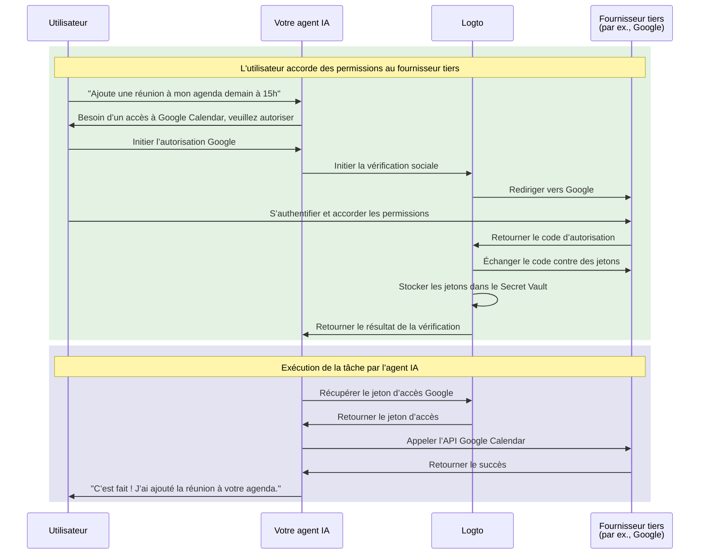

# Connectez votre agent IA aux API tierces

Ce guide vous explique comment permettre à votre agent IA d'accéder aux API tierces (par exemple, Google Calendar, GitHub, etc.) au nom des utilisateurs. En tirant parti des connecteurs sociaux de Logto et du Secret Vault, vous pouvez stocker et gérer en toute sécurité les jetons d’accès, permettant à votre agent d’effectuer des tâches automatisées sans demander à plusieurs reprises aux utilisateurs de se ré-authentifier.

Vous apprendrez à :

- Configurer des connecteurs sociaux avec stockage de jetons tiers.
- Demander des permissions minimales lors de la première connexion.
- Demander progressivement des permissions supplémentaires selon les besoins.
- Récupérer et utiliser les jetons stockés pour accéder aux API tierces.

## Pourquoi votre agent IA a besoin d’accéder aux API tierces \{#why-your-ai-agent-needs-third-party-api-access}

Les agents IA sont de plus en plus utilisés pour automatiser des tâches nécessitant une interaction avec des services externes. Par exemple :

- **📅 Gestion de calendrier** : Votre agent IA peut planifier automatiquement des réunions, ajouter des événements ou ajuster des rendez-vous sur Google Calendar.
- **📧 Automatisation des e-mails** : Envoyer des e-mails de suivi, organiser les boîtes de réception ou rédiger des réponses via les API Gmail.
- **💻 Gestion de code** : Créer des issues GitHub, examiner des pull requests ou gérer des dépôts.
- **📁 Gestion de fichiers** : Télécharger, organiser ou partager des fichiers sur Google Drive ou Dropbox.

Pour effectuer ces tâches, votre agent IA a besoin d’un accès sécurisé aux API tierces autorisées par l’utilisateur, ce qui implique de gérer correctement et en toute sécurité les jetons OAuth.

## Comment ça fonctionne \{#how-it-works}

Voici un aperçu rapide du flux :



1. **L’utilisateur demande une tâche** : L’utilisateur demande à l’agent IA d’effectuer une tâche nécessitant l’accès à une API tierce (par exemple, ajouter un événement au calendrier).
2. **Demande d’autorisation** : L’agent détecte le besoin d’accès tiers et invite l’utilisateur à autoriser.
3. **Jetons stockés** : Après l’autorisation de l’utilisateur, Logto stocke en toute sécurité les jetons d’accès et de rafraîchissement dans le Secret Vault.
4. **Exécution de la tâche** : L’agent récupère le jeton stocké et appelle l’API tierce pour accomplir la tâche.

Une fois autorisé, l’utilisateur peut effectuer plusieurs tâches sans devoir réautoriser. Logto stocke les jetons en toute sécurité et les renouvelle automatiquement si nécessaire, offrant une expérience fluide pour les interactions continues avec l’agent IA.

## Prérequis \{#prerequisites}

Avant de commencer, assurez-vous d’avoir :

- Un tenant [Logto Cloud](https://cloud.logto.io) (ou Logto auto-hébergé v1.31+)
- Un compte fournisseur tiers avec accès API (par exemple, [Google Cloud Console](https://console.cloud.google.com))
- Une application agent IA intégrée avec le SDK Logto (les utilisateurs peuvent se connecter à votre agent IA)

## Configurer un connecteur social avec stockage de jetons \{#set-up-social-connector-with-token-storage}

Pour permettre à votre agent IA d’accéder aux API tierces, vous devez configurer un connecteur social avec le stockage de jetons activé. Cela permet à Logto de stocker et de gérer les jetons d’accès lorsque les utilisateurs autorisent des services tiers lors de leur interaction avec votre agent IA.

Prenons Google comme exemple :

1. Rendez-vous sur <CloudLink to="/connectors/social">Console > Connecteurs > Connecteurs sociaux</CloudLink>.
2. Cliquez sur **Ajouter un connecteur social** et sélectionnez **Google**.
3. Suivez le [guide de configuration du connecteur Google](/integrations/google) pour configurer vos identifiants OAuth client.
4. Dans les paramètres du connecteur :
   - Activez **Stocker les jetons pour un accès API persistant** pour stocker les jetons dans le Secret Vault.
   - Définissez **Prompts** pour inclure `consent` afin de garantir que l’utilisateur voit la demande de permission.
   - Activez **Accès hors ligne** pour recevoir des jetons de rafraîchissement pour un accès API longue durée.
5. Enregistrez vos modifications.

:::info
Vous n’avez pas besoin d’ajouter ce connecteur à votre expérience de connexion. Le connecteur sera utilisé pour l’autorisation à la demande lorsque votre agent IA doit accéder à des API tierces, et non pour la connexion utilisateur.
:::

## Demander l’autorisation et accéder aux API tierces \{#request-authorization-and-access-third-party-apis}

Lorsque votre agent IA doit accéder à une API tierce (par exemple, Google Calendar), il doit d’abord vérifier si l’utilisateur a déjà autorisé l’accès. Sinon, invitez l’utilisateur à autoriser.

:::info Activer Account API
Avant de continuer, activez Account API dans <CloudLink to="/sign-in-experience/account-center">Console > Expérience de connexion > Centre de compte</CloudLink>. En savoir plus sur [l’activation de Account API](/end-user-flows/account-settings/by-account-api#how-to-enable-account-api).
:::

### Étape 1 : Vérifier l’existence d’une autorisation \{#step-1-check-for-existing-authorization}

Commencez par essayer de récupérer le jeton d’accès stocké pour voir si l’utilisateur a déjà autorisé :

```tsx
async function getGoogleAccessToken(userAccessToken: string) {
  const response = await fetch(
    'https://[tenant-id].logto.app/my-account/identities/google/access-token',
    {
      headers: {
        Authorization: `Bearer ${userAccessToken}`,
      },
    }
  );

  return response.json();
}
```

### Étape 2 : Demander l’autorisation si nécessaire \{#step-2-request-authorization-if-needed}

Si aucun jeton n’existe, que le jeton a expiré ou que vous devez étendre la portée du jeton d’accès, utilisez la [Social Verification API](/secret-vault/federated-token-set#reauthentication-and-token-renewal) de Logto pour initier le flux d’autorisation :

```tsx
async function requestGoogleAuthorization(userAccessToken: string, scopes: string) {
  // Générer un état aléatoire pour la protection CSRF
  const state = crypto.randomUUID();
  sessionStorage.setItem('oauth_state', state);

  // Initier la vérification sociale
  const response = await fetch('https://[tenant-id].logto.app/api/verification/social', {
    method: 'POST',
    headers: {
      Authorization: `Bearer ${userAccessToken}`,
      'Content-Type': 'application/json',
    },
    body: JSON.stringify({
      connectorId: '<google_connector_id>',
      state,
      redirectUri: 'https://your-ai-agent.com/callback',
      scope: scopes,
    }),
  });

  const { verificationRecordId, authorizationUri } = await response.json();

  // Stocker verificationRecordId pour une utilisation ultérieure
  sessionStorage.setItem('verificationRecordId', verificationRecordId);

  // Rediriger l’utilisateur vers Google pour l’autorisation
  window.location.href = authorizationUri;
}
```

### Étape 3 : Gérer le callback d’autorisation \{#step-3-handle-the-authorization-callback}

Après que l’utilisateur a accordé les permissions, Google redirige vers votre application. Finalisez la vérification et stockez les jetons :

```tsx
async function handleAuthorizationCallback(
  userAccessToken: string,
  callbackParams: URLSearchParams
) {
  const verificationRecordId = sessionStorage.getItem('verificationRecordId');
  const storedState = sessionStorage.getItem('oauth_state');
  const code = callbackParams.get('code');
  const state = callbackParams.get('state');

  // Valider l’état pour prévenir les attaques CSRF
  if (state !== storedState) {
    throw new Error('Invalid state parameter');
  }

  // Vérifier l’autorisation
  await fetch('https://[tenant-id].logto.app/api/verification/social/verify', {
    method: 'POST',
    headers: {
      Authorization: `Bearer ${userAccessToken}`,
      'Content-Type': 'application/json',
    },
    body: JSON.stringify({
      verificationRecordId,
      connectorData: {
        code,
        state,
        redirectUri: 'https://your-ai-agent.com/callback',
      },
    }),
  });

  // Stocker les jetons dans le Secret Vault de Logto
  await fetch('https://[tenant-id].logto.app/my-account/identities/google/access-token', {
    method: 'PUT',
    headers: {
      Authorization: `Bearer ${userAccessToken}`,
      'Content-Type': 'application/json',
    },
    body: JSON.stringify({
      verificationRecordId,
    }),
  });

  // Nettoyer
  sessionStorage.removeItem('verificationRecordId');
  sessionStorage.removeItem('oauth_state');
}
```

### Étape 4 : Appeler l’API tierce \{#step-4-call-the-third-party-api}

Votre agent IA peut maintenant récupérer le jeton et appeler l’API :

```tsx
async function addCalendarEvent(userAccessToken: string, eventDetails: EventDetails) {
  // Obtenir le jeton d’accès Google stocké
  const tokenData = await getGoogleAccessToken(userAccessToken);

  if (!tokenData) {
    // L’utilisateur n’a pas autorisé, demander l’autorisation avec la portée calendrier
    await requestGoogleAuthorization(
      userAccessToken,
      'https://www.googleapis.com/auth/calendar.events'
    );
    return; // Continuera après la redirection
  }

  // Appeler l’API Google Calendar
  const response = await fetch('https://www.googleapis.com/calendar/v3/calendars/primary/events', {
    method: 'POST',
    headers: {
      Authorization: `Bearer ${tokenData.accessToken}`,
      'Content-Type': 'application/json',
    },
    body: JSON.stringify(eventDetails),
  });

  return response.json();
}
```

Logto gère automatiquement le rafraîchissement des jetons. Si le jeton d’accès est expiré mais qu’un jeton de rafraîchissement existe, Logto obtiendra un nouveau jeton d’accès de manière transparente lors de l’appel au point de récupération.

## Demander des permissions supplémentaires \{#request-additional-permissions}

Au fur et à mesure que votre agent IA prend en charge plus de tâches, vous devrez peut-être demander des permissions supplémentaires. Par exemple, si l’utilisateur a initialement autorisé un accès en lecture seule au calendrier mais souhaite maintenant créer des événements, vous aurez besoin des permissions d’écriture.

### Pourquoi l’autorisation incrémentale ? \{#why-incremental-authorization}

- **Meilleure expérience utilisateur** : Les utilisateurs sont plus enclins à accorder des permissions lorsqu’ils comprennent pourquoi elles sont nécessaires dans le contexte.
- **Taux de conversion plus élevé** : Moins de permissions demandées d’emblée signifie moins de friction.
- **Renforcement de la confiance** : Les utilisateurs font confiance aux applications qui ne demandent que ce dont elles ont besoin.

### Exemple : Passer de l’accès en lecture à l’accès en écriture \{#example-upgrading-from-read-to-write-access}

```tsx
async function createCalendarEvent(userAccessToken: string, eventDetails: EventDetails) {
  const tokenData = await getGoogleAccessToken(userAccessToken);

  if (!tokenData) {
    // Pas encore d’autorisation, demander directement la permission d’écriture calendrier
    await requestGoogleAuthorization(userAccessToken, 'https://www.googleapis.com/auth/calendar');
    return;
  }

  // Essayer de créer l’événement
  const response = await fetch('https://www.googleapis.com/calendar/v3/calendars/primary/events', {
    method: 'POST',
    headers: {
      Authorization: `Bearer ${tokenData.accessToken}`,
      'Content-Type': 'application/json',
    },
    body: JSON.stringify(eventDetails),
  });

  if (response.status === 403) {
    // Permissions insuffisantes, demander une portée supplémentaire
    await requestGoogleAuthorization(
      userAccessToken,
      'https://www.googleapis.com/auth/calendar' // Accès complet au calendrier
    );
    return;
  }

  return response.json();
}
```

:::tip
Lors de la demande de portées supplémentaires, l’utilisateur verra un écran de consentement affichant uniquement les nouvelles permissions demandées. Ses permissions existantes seront conservées.
:::

## Gérer le statut des jetons \{#manage-token-status}

La Console Logto offre une visibilité sur le statut des jetons pour chaque utilisateur :

1. Rendez-vous sur <CloudLink to="/users">Console > Gestion des utilisateurs</CloudLink>.
2. Cliquez sur un utilisateur pour afficher ses détails.
3. Faites défiler jusqu’à la section **Connexions** pour voir tous les comptes sociaux liés.
4. Chaque connexion affiche le statut du jeton :
   - **Actif** : Le jeton d’accès est valide et prêt à l’emploi.
   - **Expiré** : Le jeton d’accès a expiré. Si un jeton de rafraîchissement existe, il sera renouvelé automatiquement lors de la prochaine récupération.
   - **Inactif** : Aucun jeton n’est stocké pour cette connexion.

## Bonnes pratiques de sécurité \{#security-best-practices}

Lorsque vous développez des agents IA qui accèdent à des API tierces, gardez à l’esprit ces bonnes pratiques de sécurité :

- **Demandez des portées minimales** : Ne demandez que les permissions réellement nécessaires à votre agent.
- **Utilisez l’autorisation incrémentale** : Demandez des permissions supplémentaires dans le contexte, pas toutes d’un coup.
- **Gérez l’expiration des jetons avec souplesse** : Gérez toujours les cas où les jetons peuvent être expirés ou révoqués.
- **Sécurisez les jetons d’accès utilisateur** : Le jeton d’accès Logto de l’utilisateur est la clé pour récupérer les jetons tiers. Protégez-le en conséquence.
- **Auditez l’accès API** : Journalisez quand votre agent IA accède aux API tierces pour le dépannage et la conformité.

## Ressources associées \{#related-resources}

<Url href="/secret-vault/federated-token-set">Stockage de jetons tiers</Url>
<Url href="/connectors/social-connectors">Connecteurs sociaux</Url>
<Url href="/end-user-flows/sign-up-and-sign-in/social-sign-in">Connexion sociale</Url>
<Url href="/end-user-flows/account-settings/by-account-api">Account API</Url>
