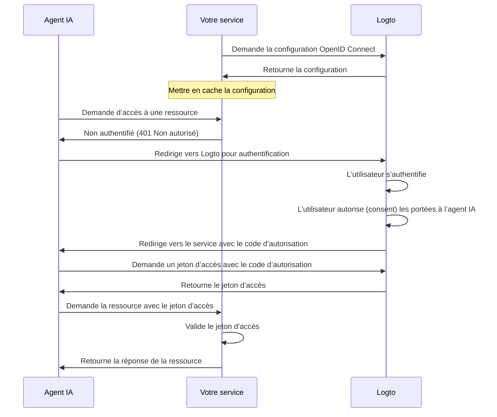

import ConfigureThirdPartyAiAgent from './fragments/_configure-third-party-ai-agent.mdx';

# Autoriser l’accès d’un agent IA tiers à votre application

Ce guide vous accompagne dans l’intégration de Logto à votre service et l’activation de l’accès par des agents IA.

Vous apprendrez à:

- Configurer Logto comme serveur d’autorisation pour votre service.
- Obtenir un jeton d’accès (Access token) pour permettre à l’agent IA d’accéder à votre service.
- Tester le flux avec un agent IA.

## Différence entre un agent IA tiers et votre propre agent IA (ou application) \{#difference-between-third-party-ai-agent-and-your-own-ai-agent-or-app}

Prenons un exemple. Imaginez que vous êtes un développeur proposant un service de données météorologiques.

**Application météo officielle (Votre propre agent IA / application)**

- Vous proposez une application météo officielle permettant aux utilisateurs de consulter la météo.
- Fonctionnement: L’application météo officielle se connecte à votre service en utilisant Logto pour authentifier les utilisateurs. Lorsque Alice se connecte, elle accède automatiquement aux données météo, sans écran de consentement supplémentaire, car il s’agit de votre application de confiance.

**Agent IA tiers**

- Vous développez un écosystème autour de votre service, et un autre développeur crée «WeatherBot» (un assistant IA capable de fournir des mises à jour et prévisions météo) en l’intégrant comme agent IA tiers.
- Fonctionnement: WeatherBot (agent IA tiers) souhaite accéder aux données météo de l’utilisateur via votre service. Lorsque Alice se connecte à WeatherBot avec son compte:
  - Un écran de consentement s’affiche, demandant l’autorisation pour que WeatherBot accède à ses données météo.
  - Alice peut autoriser ou refuser cet accès.
  - Seules les données auxquelles elle consent sont partagées avec WeatherBot, et WeatherBot ne peut accéder à aucune donnée supplémentaire sans un nouveau consentement explicite.

Ce contrôle d’accès (Permission) garantit la sécurité des données utilisateur: même si votre service gère toutes les données, les agents IA tiers comme WeatherBot ne peuvent accéder qu’aux informations explicitement autorisées par l’utilisateur. Ils ne peuvent pas contourner ce processus, car il est imposé par votre implémentation du contrôle d’accès dans le service.

**Résumé**

| Type de client               | Exemple                        | Consentement requis? | Qui le contrôle?      |
| ---------------------------- | ------------------------------ | -------------------- | --------------------- |
| Application météo officielle | Votre propre application météo | Non                  | Vous (le développeur) |
| Agent IA tiers               | Assistant WeatherBot           | Oui                  | Un autre développeur  |

:::note
Si vous souhaitez intégrer votre service à votre propre agent IA ou application, veuillez consulter nos [guides de démarrage rapide](/quick-starts) pour plus d’informations.
:::

## Prérequis \{#prerequisites}

- Un tenant [Logto Cloud](https://cloud.logto.io) (ou auto-hébergé)
- Un service exposant des points de terminaison API à destination de l’agent IA

### Comprendre le flux \{#understanding-the-flow}

- **Service**: Le service que vous souhaitez exposer à l’agent IA.
- **Agent IA**: L’agent IA qui accédera à votre service.
- **Logto**: Sert de fournisseur OpenID Connect (serveur d’autorisation) et gère les identités des utilisateurs.

Un diagramme de séquence non normatif illustre le déroulement global du processus:

## Configurer un agent IA tiers \{#set-up-third-party-ai-agent}

Pour permettre à un agent IA tiers d’accéder à votre service, suivez ces étapes:

1. **Enregistrez l’agent IA dans Logto**: Créez une application dans Logto pour représenter l’agent IA.
2. **Configurez l’agent IA**: Assurez-vous que l’agent IA peut effectuer des requêtes vers votre service et gérer la réponse 401 Non autorisé.
3. **Implémentez le flux d’autorisation**: L’agent IA doit pouvoir gérer le flux d’autorisation OAuth 2.0 pour obtenir un jeton d’accès auprès de Logto.
4. **Testez l’intégration**: Utilisez l’agent IA pour accéder à votre service et vérifiez qu’il peut authentifier et autoriser les requêtes avec succès.

<ConfigureThirdPartyAiAgent />

## Configurer l’autorisation dans votre service \{#set-up-authorization-in-your-service}

Pour activer le contrôle d’accès dans votre service, vous devez:

1. **Définir les ressources API dans Logto**: Créez des ressources API dans Logto représentant les points de terminaison auxquels votre agent IA accédera.
2. **Implémenter la logique de contrôle d’accès**: Dans votre service, implémentez la logique permettant de valider le jeton d’accès reçu de l’agent IA et de vérifier si l’utilisateur dispose des permissions nécessaires pour accéder à la ressource demandée.
3. **Répondre à l’agent IA**: Si le jeton d’accès est valide et que l’utilisateur a la permission, retournez la ressource demandée. Sinon, retournez une réponse 401 Non autorisé.

Pour en savoir plus sur la mise en œuvre du contrôle d’accès dans votre service, consultez notre [guide sur l’Autorisation](/authorization).

## Tester l’intégration \{#test-the-integration}

1. Démarrez votre service.
2. Démarrez l’agent IA.
3. Depuis l’agent IA, invoquez le point de terminaison API pour accéder à votre service.
4. L’agent IA doit gérer la réponse 401 Non autorisé et rediriger l’utilisateur vers Logto pour l’authentification.
5. Après authentification réussie, l’agent IA doit recevoir un jeton d’accès et l’utiliser pour effectuer des requêtes vers votre service.
6. L’agent IA doit pouvoir récupérer la ressource depuis votre service en utilisant le jeton d’accès.
