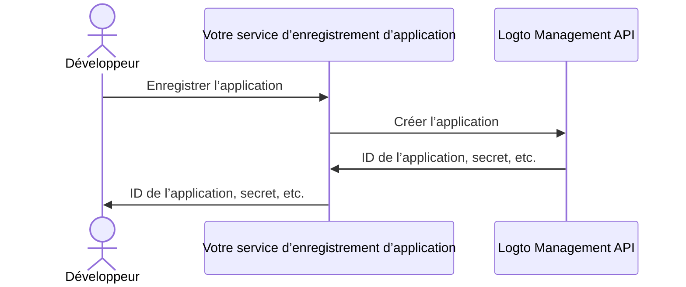

import QuickStartsReference from '../../../quick-starts/third-party/oidc/_quick-starts-reference.md';
import thirdPartyAppPermissions from '../assets/third-party-app-permissions.png';

## Configurer un agent IA tiers dans Logto \{#configure-third-party-ai-agent-in-logto}

Pour permettre à l’agent IA tiers d’accéder à {props.serviceName ?? 'votre service'}, vous devez configurer une **application tierce** dans Logto. Cette application sera utilisée pour représenter l’agent IA et obtenir les identifiants nécessaires à l’authentification et à l’autorisation.

### Autoriser les développeurs à créer des applications tierces dans Logto \{#allow-developers-to-create-third-party-apps-in-logto}

Si vous construisez une place de marché ou souhaitez permettre aux développeurs de créer des applications tierces dans Logto, vous pouvez utiliser la [Logto Management API](/integrate-logto/interact-with-management-api) pour créer des applications tierces de manière programmatique. Cela permet aux développeurs d’enregistrer leurs applications et d’obtenir les identifiants nécessaires à l’authentification.

Vous devrez héberger votre propre service pour gérer le processus d’enregistrement des clients. Ce service interagira avec la Logto Management API pour créer des applications tierces au nom des développeurs.

Alternativement, vous pouvez créer manuellement des applications tierces dans la Console Logto pour vous familiariser avec le processus.

### Créer manuellement une application tierce dans Logto \{#manually-create-a-third-party-app-in-logto}

Vous pouvez créer manuellement une application tierce dans la Console Logto à des fins de test ou pour des intégrations ponctuelles. Ceci est utile lorsque vous souhaitez tester rapidement l’intégration sans mettre en œuvre un flux complet d’enregistrement de client.

1. Connectez-vous à votre Console Logto.
2. Allez dans <CloudLink to="/applications">**Applications**</CloudLink> → **Créer une application** → **Application tierce** -> **OIDC**.
3. Renseignez le nom de l’application et les autres champs requis, puis cliquez sur **Créer une application**.
4. Cliquez sur l’onglet **Permissions**, dans la section **Utilisateur**, cliquez sur "Ajouter".
5. Dans la boîte de dialogue qui s’ouvre -> **Données utilisateur** -> sélectionnez les permissions **`profile`**, **`email`**, puis cliquez sur **Enregistrer**.
6. Dans l’application tierce, configurez les portées (scopes) pour demander les permissions (portées) `openid profile email`.

   **Remarque** : `openid` est requis pour OIDC, et `profile` et `email` sont les permissions que vous avez ajoutées à l’étape précédente.

7. Configurez l’**URI de redirection** de votre application tierce en conséquence. N’oubliez pas de mettre à jour l’URI de redirection dans Logto également.

---

<QuickStartsReference />
