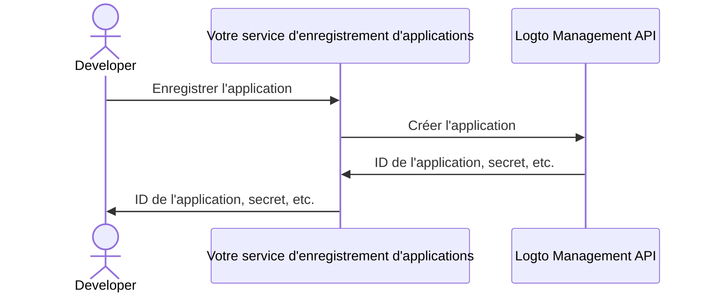
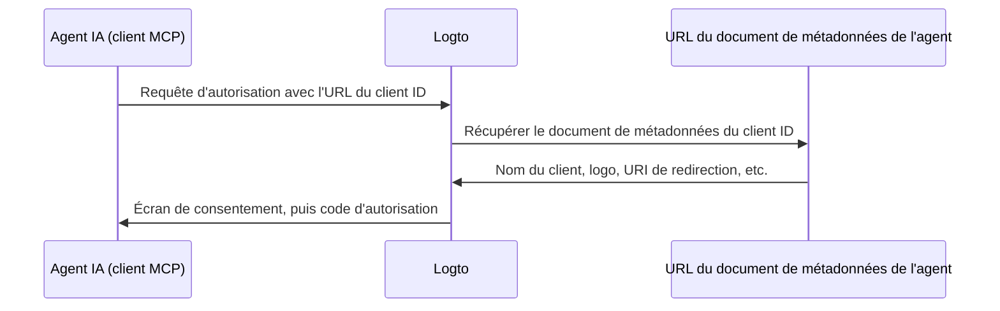

import QuickStartsReference from '../../../quick-starts/third-party/oidc/_quick-starts-reference.md';

## Configurer un agent IA tiers dans Logto \{#configure-third-party-ai-agent-in-logto}

Pour permettre à l'agent IA tiers d'accéder à votre {props.serviceName ?? 'service'}, vous devez configurer une **application tierce** dans Logto. Cette application sera utilisée pour représenter l'agent IA et obtenir les identifiants nécessaires à l'authentification et à l'autorisation.

:::info[Qu'est-ce qu'une application tierce ?]
Une **application tierce** est une application créée par des développeurs externes (non propriétaire de la ressource) qui nécessite le consentement de l'utilisateur pour accéder à des ressources protégées. Contrairement aux applications propriétaires (vos propres applications), les applications tierces affichent un écran de consentement demandant aux utilisateurs d'approuver des permissions spécifiques avant d'accéder à leurs données. Cela garantit que les utilisateurs gardent le contrôle sur les données qu'ils partagent avec des services externes.

Pour en savoir plus, consultez [Applications tierces](/integrate-logto/third-party-applications).
:::

Il existe trois façons d'intégrer des agents IA :

- [Créer manuellement l'application dans la Console](#manually-create-a-third-party-app-in-logto), pour des tests ou quelques agents connus.
- [Construire un service d'enregistrement sur le Management API](#allow-developers-to-create-third-party-apps-in-logto), si vous souhaitez contrôler qui obtient des identifiants.
- [Activer l'application dynamique](#let-any-ai-agent-connect-without-pre-registration), si n'importe quel agent peut se connecter et que vous ne souhaitez pas d'étape d'enregistrement.

### Permettre aux développeurs de créer des applications tierces dans Logto \{#allow-developers-to-create-third-party-apps-in-logto}

Si vous construisez une place de marché ou souhaitez permettre aux développeurs de créer des applications tierces dans Logto, vous pouvez utiliser le [Logto Management API](/integrate-logto/interact-with-management-api) pour créer des applications tierces de manière programmatique. Cela permet aux développeurs d'enregistrer leurs applications et d'obtenir les identifiants nécessaires à l'authentification.

Vous devrez héberger votre propre service pour gérer le processus d'enregistrement des clients. Ce service interagira avec le Logto Management API pour créer des applications tierces au nom des développeurs.

```mermaid
sequenceDiagram
  actor Developer
  participant Server as Votre service d'enregistrement d'applications
  participant Logto as Logto Management API
  Developer->>Server: Enregistrer l'application
  Server->>Logto: Créer l'application
  Logto->>Server: ID de l'application, secret, etc.
  Server->>Developer: ID de l'application, secret, etc.
```

Alternativement, vous pouvez créer manuellement des applications tierces dans la Console Logto pour vous familiariser avec le processus.

### Permettre à n'importe quel agent IA de se connecter sans pré-enregistrement \{#let-any-ai-agent-connect-without-pre-registration}

Dans un écosystème MCP ouvert, vous ne connaissez généralement pas les agents à l'avance. [Application dynamique](/integrate-logto/third-party-applications/dynamic-apps) supprime l'étape d'enregistrement : l'agent utilise une URL HTTPS publique servant son propre document de métadonnées client comme `client_id`, et Logto le résout lorsque la requête d'autorisation arrive.

```mermaid
sequenceDiagram
  participant Agent as Agent IA (client MCP)
  participant Logto
  participant Metadata as URL du document de métadonnées de l'agent
  Agent->>Logto: Requête d'autorisation avec l'URL du client ID
  Logto->>Metadata: Récupérer le document de métadonnées du client ID
  Metadata->>Logto: Nom du client, logo, URI de redirection, etc.
  Logto->>Agent: Écran de consentement, puis code d'autorisation
```

Vous gardez toujours le contrôle sur ce que les agents peuvent demander via les permissions accordées à l'application dynamique, et chaque autorisation passe par l'écran de consentement utilisateur.

### Créer manuellement une application tierce dans Logto \{#manually-create-a-third-party-app-in-logto}

Vous pouvez créer manuellement une application tierce dans la Console Logto à des fins de test ou pour des intégrations ponctuelles. Ceci est utile lorsque vous souhaitez tester rapidement l'intégration sans mettre en œuvre un flux complet d'enregistrement de client.

1. Connectez-vous à votre Console Logto.
2. Allez dans <CloudLink to="/applications">**Applications**</CloudLink> → **Créer une application** → **Application tierce** -> **OIDC**.
3. Renseignez le nom de l'application et les autres champs requis, puis cliquez sur **Créer l'application**.
4. Cliquez sur l'onglet **Permissions** pour accorder des [permissions](/integrate-logto/third-party-applications/permission-management) à l'application :

   - Section **Utilisateur** : permissions sur les données utilisateur telles que **`profile`** et **`email`**, pour les revendications d'identité de base.
   - Section **Ressource API** : permissions (portées) des [ressources API](/authorization/global-api-resources) que vous avez définies dans Logto, par exemple la ressource API qui représente votre {props.serviceName ?? 'service'}.
   - Section **Organisation** : permissions d'organisation, si vous utilisez les organisations Logto.

5. Dans l'application tierce, configurez les portées pour demander les permissions que vous avez accordées, par exemple, `openid profile email` plus les portées des ressources API.

   **Remarque** : `openid` est requis pour OIDC. Pour recevoir un jeton d’accès lié à une ressource API, l'application doit également inclure le paramètre `resource` dans la requête d'autorisation. Les clients MCP qui suivent la dernière spécification MCP le font automatiquement en fonction des métadonnées de la ressource protégée.

6. Configurez l'**URI de redirection** de votre application tierce en conséquence. N'oubliez pas de mettre à jour l'URI de redirection dans Logto également.

---

<QuickStartsReference />
