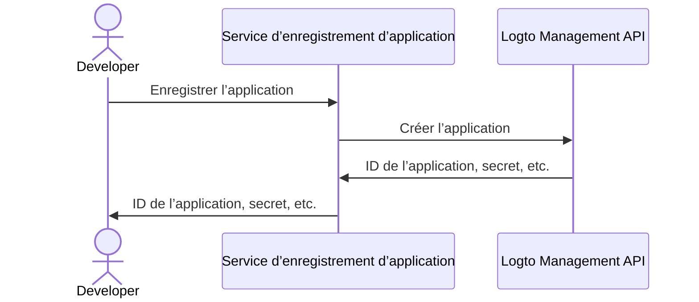

import thirdPartyAppPermissions from '../../../../../../docs/use-cases/ai/assets/third-party-app-permissions.png';
import QuickStartsReference from '../../quick-starts/third-party/oidc/_quick-starts-reference.md';

import Prerequisites from './fragments/_mcp-prerequisites.mdx';
import SampleCode from './fragments/_mcp-sample-code.mdx';
import SetUpServer from './fragments/_mcp-set-up-server.mdx';

# Autoriser l’accès d’un agent IA tiers à votre serveur MCP

Ce guide vous accompagne dans l’intégration de Logto avec votre serveur MCP en utilisant [mcp-auth](https://mcp-auth.dev), vous permettant d’authentifier les utilisateurs et de récupérer en toute sécurité leurs informations d’identité via le flux standard OpenID Connect.

Vous apprendrez à :

- Configurer Logto comme serveur d’autorisation pour votre serveur MCP.
- Mettre en place un outil “whoami” dans votre serveur MCP pour retourner les revendications d’identité de l’utilisateur courant.
- Tester le flux avec un agent IA tiers (client MCP).

Après ce tutoriel, votre serveur MCP pourra :

- Authentifier les utilisateurs dans votre tenant Logto.
- Retourner les revendications d’identité (`sub`, `username`, `name`, `email`, etc.) lors de l’appel de l’outil "whoami".

## Différence entre un agent IA tiers (client MCP tiers) et votre propre client MCP \{#difference-between-third-party-ai-agent-mcp-client-and-your-own-mcp-client}

Prenons un exemple. Imaginez que vous êtes un développeur qui exploite un serveur MCP pour gérer l’accès aux e-mails et l’automatisation.

**Application e-mail officielle (Votre propre client MCP)**

- Vous fournissez une application e-mail officielle permettant aux utilisateurs de lire et gérer leurs e-mails.
- Fonctionnement : L’application e-mail officielle se connecte à votre serveur MCP en utilisant Logto pour authentifier les utilisateurs. Lorsque Alice se connecte, elle accède automatiquement à ses e-mails, sans écran de consentement supplémentaire, car il s’agit de votre application de confiance.

**Agent IA tiers (Client MCP tiers)**

- Vous développez un écosystème autour de votre serveur MCP, un autre développeur crée alors “SmartMail AI” (un assistant IA qui peut résumer les e-mails et planifier des réunions automatiquement) en l’intégrant comme client tiers.
- Fonctionnement : SmartMail AI (client MCP tiers) souhaite accéder aux e-mails des utilisateurs via votre serveur MCP. Lorsque Alice se connecte à SmartMail AI avec son compte :
  - Un écran de consentement s’affiche, demandant l’autorisation à SmartMail AI de lire ses e-mails et son agenda.
  - Alice peut autoriser ou refuser cet accès.
  - Seules les données auxquelles elle consent sont partagées avec SmartMail AI, et SmartMail AI ne peut accéder à aucune donnée supplémentaire sans un nouveau consentement explicite.

Ce contrôle d’accès (permission) garantit la sécurité des données utilisateur : même si votre serveur MCP gère toutes les données, les applications tierces comme SmartMail AI ne peuvent accéder qu’à ce que l’utilisateur a explicitement autorisé. Elles ne peuvent pas contourner ce processus, car il est imposé par votre implémentation du contrôle d’accès dans le serveur MCP.

**Résumé**

| Type de client                | Exemple                         | Consentement requis ? | Qui le contrôle ?     |
| ----------------------------- | ------------------------------- | --------------------- | --------------------- |
| Application e-mail officielle | Votre propre application e-mail | Non                   | Vous (le développeur) |
| Agent IA tiers                | Assistant SmartMail AI          | Oui                   | Un autre développeur  |

:::note
Si vous souhaitez intégrer votre serveur MCP avec votre propre agent IA ou application, veuillez consulter le guide [Activer l’authentification pour vos applications alimentées par MCP avec Logto](./mcp-server-add-auth).
:::

<Prerequisites isThirdParty />

## Configurer un agent IA tiers \{#set-up-third-party-ai-agent}

Pour permettre à l’agent IA tiers d’accéder à votre serveur MCP, vous devez configurer les éléments suivants :

1. Le client doit pouvoir effectuer des requêtes MCP pour invoquer les outils exposés par le serveur MCP.
2. Le client doit pouvoir gérer la réponse 401 Non autorisé. Voir [Étapes du flux d’autorisation](https://modelcontextprotocol.io/specification/2025-03-26/basic/authorization#2-5-authorization-flow-steps) pour plus de détails.
3. Après une authentification réussie, le client doit pouvoir effectuer des requêtes vers le serveur MCP avec le jeton d’accès obtenu depuis Logto.

## Configurer l’agent IA dans Logto \{#set-up-ai-agent-in-logto}

Pour permettre à l’agent IA tiers d’accéder à votre serveur MCP, vous devez créer une **application tierce** dans Logto. Cette application représentera l’agent IA et obtiendra les identifiants nécessaires pour l’authentification et l’autorisation.

### Autoriser les développeurs à créer des applications tierces dans Logto \{#allow-developers-to-create-third-party-apps-in-logto}

Si vous construisez une marketplace ou souhaitez permettre aux développeurs de créer des applications tierces dans Logto, vous pouvez exploiter la [Logto Management API](/integrate-logto/interact-with-management-api) pour créer des applications tierces de façon programmatique. Cela permet aux développeurs d’enregistrer leurs applications et d’obtenir les identifiants nécessaires à l’authentification.

Vous devrez héberger votre propre service pour gérer le processus d’enregistrement des clients. Ce service interagira avec la Logto Management API pour créer des applications tierces au nom des développeurs.

Vous pouvez également créer manuellement des applications tierces dans la Console Logto pour vous familiariser avec le processus.

### Créer manuellement une application tierce dans Logto \{#manually-create-a-third-party-app-in-logto}

Vous pouvez créer manuellement une application tierce dans la Console Logto à des fins de test ou d’intégrations ponctuelles. Cela est utile si vous souhaitez tester rapidement l’intégration sans mettre en œuvre un flux complet d’enregistrement de client.

1. Connectez-vous à votre Console Logto.
2. Allez dans <CloudLink to="/applications">**Applications**</CloudLink> → **Créer une application** → **Application tierce** -> **OIDC**.
3. Renseignez le nom de l’application et les autres champs requis, puis cliquez sur **Créer l’application**.
4. Cliquez sur l’onglet **Permissions**, dans la section **Utilisateur**, cliquez sur "Ajouter".
5. Dans la boîte de dialogue qui s’ouvre -> **Données utilisateur** -> sélectionnez les permissions **`profile`**, **`email`**, puis cliquez sur **Enregistrer**.
6. Dans l’application tierce, configurez les portées pour demander les permissions `openid profile email`.
7. Configurez l’**URI de redirection** de votre application tierce en conséquence. N’oubliez pas de mettre à jour l’URI de redirection dans Logto également.

---

<QuickStartsReference />

<SetUpServer />

## Tester l’intégration \{#test-the-integration}

1. Démarrez le serveur MCP.
2. Démarrez l’agent IA.
3. Dans le client, invoquez l’outil `whoami` pour récupérer les revendications d’identité de l’utilisateur courant.
4. Le client doit gérer la réponse 401 Non autorisé et rediriger l’utilisateur vers Logto pour l’authentification.
5. Après une authentification réussie, le client doit recevoir un jeton d’accès et l’utiliser pour effectuer des requêtes vers le serveur MCP.
6. Le client doit pouvoir récupérer les revendications d’identité depuis le serveur MCP en utilisant le jeton d’accès.

<SampleCode />
