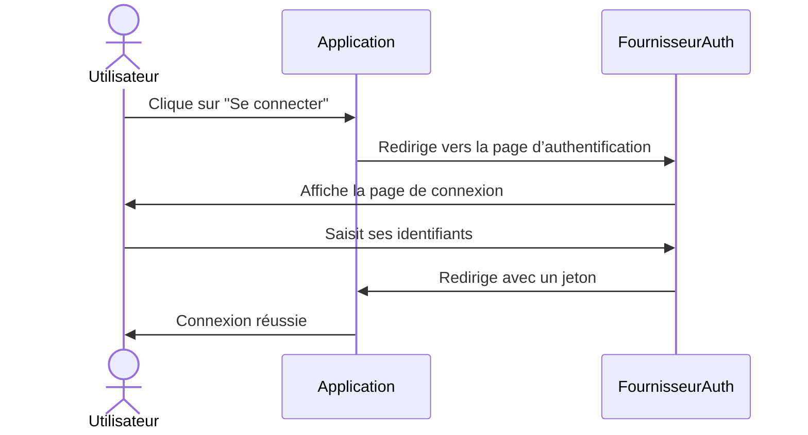
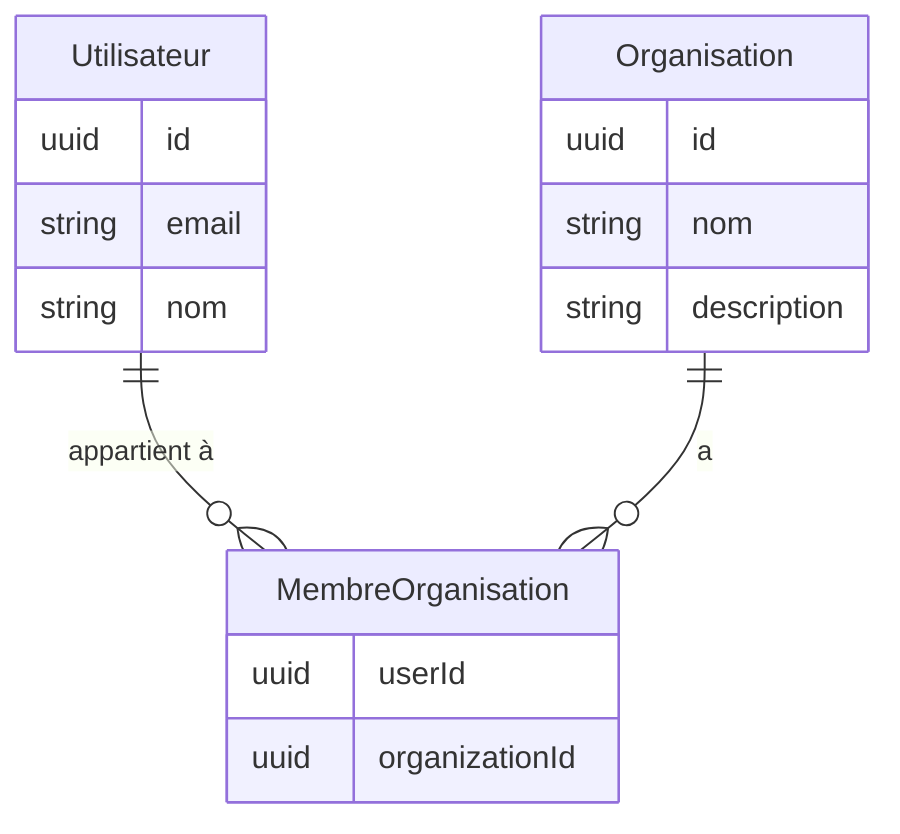
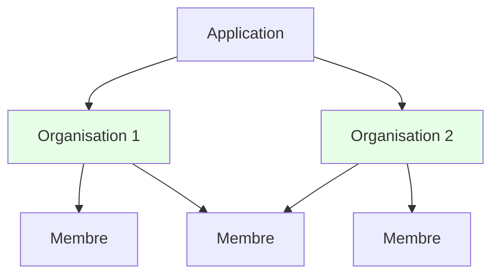
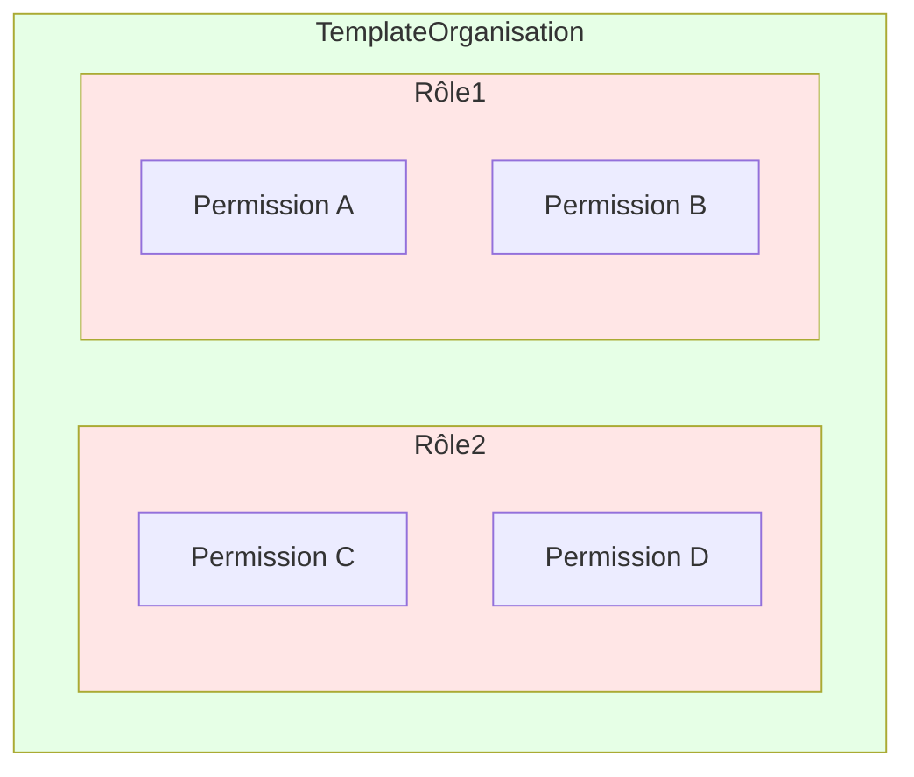
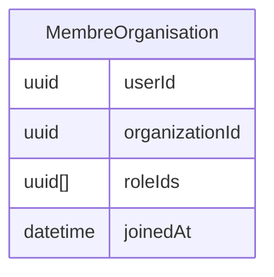
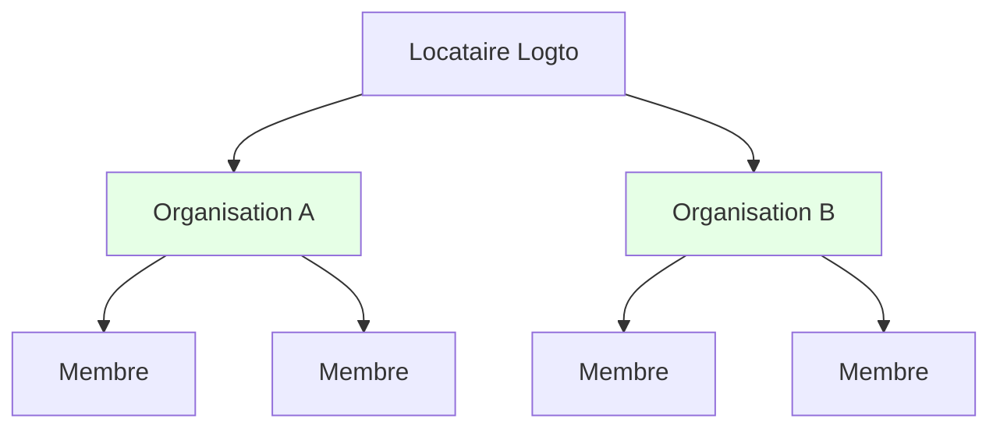
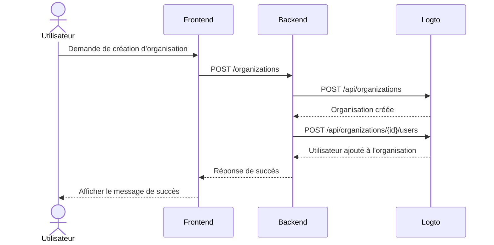

<head>
  <link rel="canonical" href="https://blog.logto.io/build-multi-tenant-saas-application" />
</head>

<style>
  {`
    .twoColumn {
      display: grid;
      grid-template-columns: 1fr 1fr;
      gap: 24px;
    }
    .twoColumn + .twoColumn {
      margin-top: 24px;
    }
  `}
</style>

# Construire une application SaaS multi-tenant : Guide complet de la conception à l’implémentation

Comment des applications comme Notion, Slack ou Figma sont-elles construites ? Ces applications SaaS multi-tenant semblent simples à utiliser, mais en construire une soi-même ? C’est une autre histoire.

Quand j’ai d’abord envisagé de construire une telle bête complexe, mon esprit a explosé :

- Les utilisateurs ont besoin de plusieurs options de connexion (e-mail, Google, GitHub)
- Chaque utilisateur peut créer et appartenir à plusieurs organisations
- Différents niveaux de permissions au sein de chaque organisation
- Les organisations d’entreprise nécessitent une adhésion automatique pour certains domaines e-mail
- Exigences MFA pour les opérations sensibles
- Et plus encore...

« Boss, parlons de la conception produit dans deux semaines. Je suis embourbé pour l’instant. »

Mais quand j’ai réellement commencé à travailler dessus, **je me suis rendu compte que ce n’était pas aussi intimidant qu’il n’y paraît.**

J’ai **construit un système avec toutes ces fonctionnalités avec étonnamment peu d’efforts !**


<div className="twoColumn">
  
  
</div>

Je vais vous montrer exactement comment concevoir et implémenter un tel système depuis zéro – et vous serez étonné de voir à quel point c’est simple en 2025 avec les bons outils et la bonne approche architecturale.

> **Le code source complet est disponible dans ce [Repo Github](https://github.com/logto-io/multi-tenant-saas-sample). Allons-y !**

Nous allons commencer avec un produit SaaS de documentation IA appelé DocuMind.

DocuMind est un produit SaaS de documentation IA conçu avec un modèle multi-tenant pour prendre en charge les utilisateurs individuels, les petites entreprises et les entreprises.

La plateforme offre de puissantes capacités d’IA pour la gestion documentaire, y compris la génération automatique de résumés, l’extraction de points clés et des recommandations intelligentes de contenu au sein des organisations.

## Quelles fonctionnalités sont nécessaires pour l’authentification et l’autorisation SaaS ? \{#what-features-are-required-for-saas-authentication-and-authorization}

Commençons par revoir les exigences nécessaires. De quelles fonctionnalités avez-vous besoin ?

### Architecture multi-tenant \{#multi-tenant-architecture}

Pour permettre une architecture multi-tenant, vous aurez besoin d’une couche d’entité appelée **organisation**. Imaginez un seul pool d’utilisateurs pouvant accéder à plusieurs espaces de travail. Chaque organisation représente un espace de travail, et les utilisateurs conservent une identité unique tout en accédant à différents espaces de travail (organisations) selon leurs rôles attribués.


C’est une fonctionnalité largement utilisée chez les fournisseurs d’authentification. Une organisation dans un système de gestion d’identité correspond à l’espace de travail, au projet ou au locataire de votre application SaaS.


### Adhésion \{#membership}

Un membre est un concept temporaire utilisé pour indiquer le statut d’adhésion d’une identité au sein d’une organisation.

Par exemple, Sarah s’inscrit à votre application avec son e-mail, **sarah@gmail.com**. Elle peut appartenir à différents espaces de travail. Si Sarah fait partie de **Workspace A** mais pas de **Workspace B**, elle est considérée comme membre de **Workspace A** mais pas de **Workspace B**.

### Conception des rôles et des permissions \{#role-and-permission-design}

Dans une architecture multi-tenant, les utilisateurs ont besoin de **rôles** avec des **permissions** spécifiques pour accéder à leurs ressources de locataire.
Les permissions sont des contrôles d’accès détaillés qui définissent des actions spécifiques, telles que `read: order` ou `write: order`. Elles déterminent quelles actions peuvent être effectuées sur des ressources particulières.

Les rôles sont un ensemble de permissions attribuées aux membres dans un environnement multi-tenant.

Vous devrez définir ces rôles et permissions, puis attribuer des rôles aux utilisateurs, et parfois cela peut inclure des processus automatisés. Par exemple :

1. Les utilisateurs qui rejoignent une organisation reçoivent automatiquement le rôle **membre**.
2. Le premier utilisateur à créer un espace de travail reçoit automatiquement le rôle **admin**.

### Flux d’inscription et de connexion \{#sign-up-and-login-flow}

Assurez un processus d’inscription et d’authentification convivial et sécurisé, incluant des options de connexion et d’inscription de base :

1. **Connexion par e-mail et mot de passe** : Méthode traditionnelle avec e-mail et mot de passe.
2. **Connexion sans mot de passe** : Utilisez des codes de vérification par e-mail pour un accès facile et sécurisé.
3. **Gestion du compte** : Un centre de compte où les utilisateurs peuvent mettre à jour leur e-mail, mot de passe et autres détails.
4. **Connexion sociale** : Options comme Google et GitHub pour une connexion rapide.
5. **Authentification multi-facteurs (MFA)** : Renforcez la sécurité en permettant la connexion via des applications d’authentification comme Duo.

### Création de locataire et invitation \{#tenant-creation-and-invitation}

Dans une application SaaS multi-tenant, une différence clé dans le flux utilisateur est la nécessité de prendre en charge la création de locataire et l’invitation de membres. Ce processus nécessite une planification et une exécution minutieuses car il joue un rôle clé dans l’activation et la croissance du produit.

Voici quelques flux d’utilisation typiques à considérer :

| Type d’utilisateur                                    | Point d’entrée                                                                   |
| ----------------------------------------------------- | -------------------------------------------------------------------------------- |
| Nouveau compte                                        | Entrer depuis la page de connexion / inscription pour créer un nouveau locataire |
| Compte existant                                       | Créer un autre locataire dans le produit                                         |
| Le compte existant a reçu une invitation de locataire | Entrer depuis la page de connexion / inscription                                 |
| Le compte existant a reçu une invitation de locataire | Entrer depuis l’e-mail d’invitation                                              |
| Le nouveau compte a reçu une invitation de locataire  | Entrer depuis la page de connexion / inscription                                 |
| Le nouveau compte a reçu une invitation de locataire  | Entrer depuis l’e-mail d’invitation                                              |

Voici quelques scénarios courants que l’on retrouve dans presque toutes les applications SaaS. Utilisez-les comme référence pour inspirer votre équipe produit et design, et n’hésitez pas à créer vos propres flux selon vos besoins.

<div className="twoColumn">
  
  
</div>

<div className="twoColumn">
  
  
</div>

<div className="twoColumn">
  
  
</div>

## Architecture technique et conception du système \{#technical-architecture-and-system-design}

Une fois que nous avons compris toutes les exigences produit, passons à l’implémentation.

### Définir la stratégie d’authentification \{#define-authentication-strategy}

L’authentification peut sembler effrayante. Les utilisateurs ont besoin de :

- Inscription / connexion par e-mail & mot de passe
- Connexion en un clic avec Google / Github
- Réinitialisation du mot de passe en cas d’oubli
- Connexion à l’échelle de l’équipe pour les clients entreprise
- ...

Implémenter seulement ces fonctionnalités de base pourrait prendre des semaines de développement.

Mais aujourd’hui, **nous n’avons plus besoin de construire tout cela nous-mêmes !**

Les fournisseurs d’authentification modernes (je vais choisir [Logto](https://logto.io/) cette fois) ont empaqueté toutes ces fonctionnalités pour nous. Le flux d’authentification est simple :



**De plusieurs semaines de développement à 15 minutes de configuration**, Logto gère tous les flux complexes pour nous ! Nous verrons les étapes d’intégration dans la section implémentation plus loin. Nous pouvons maintenant nous concentrer sur la construction des fonctionnalités principales de DocuMind !

### Mettre en place l’architecture multi-tenant \{#establish-multi-tenant-architecture}

Le système d’organisation permet aux utilisateurs de créer et de rejoindre plusieurs organisations. Comprenons les relations principales :



Dans ce système, chaque utilisateur peut appartenir à plusieurs organisations, et chaque organisation peut avoir plusieurs membres.



### Activer le contrôle d’accès dans une application multi-tenant \{#enable-access-control-in-multi-tenant-app}

Le Contrôle d’accès basé sur les rôles (RBAC) est important pour garantir la sécurité et la scalabilité dans les applications SaaS multi-tenant.

Dans une application multi-tenant, la conception des permissions et des rôles est généralement cohérente, car elle découle de la conception produit. Par exemple, dans plusieurs espaces de travail, il y a généralement un rôle admin et un rôle membre. Logto, en tant que fournisseur d’authentification, propose la conception suivante de contrôle d’accès basé sur les rôles au niveau de l’organisation :

1. **Définitions de permissions unifiées** : Les permissions sont définies au niveau du système et s’appliquent de manière cohérente à toutes les organisations, assurant une gestion des permissions maintenable et cohérente.
2. **Templates d’organisation** : Combinaisons prédéfinies de rôles et de permissions via des templates d’organisation, simplifiant l’initialisation des organisations.

La relation de permission ressemble à ceci :



Puisque chaque utilisateur a besoin de son propre(s) rôle(s) dans chaque organisation, la relation entre les rôles et les organisations doit refléter les rôles attribués à chaque utilisateur :



Nous avons conçu le système d’organisation et le système de contrôle d’accès, nous pouvons maintenant commencer à construire notre produit !

## Pile technologique \{#tech-stack}

J’ai choisi une pile facile à prendre en main et portable :

1. **Frontend** : React (facilement transférable vers Vue / Angular / Svelte)
2. **Backend** : Express (API simple et intuitive)

Pourquoi séparer frontend et backend ? Parce que cela offre une architecture claire, facile à apprendre et à changer de stack. Et pour les fournisseurs d’authentification, j’utilise Logto comme exemple.

Et pour les guides suivants, **ces modèles fonctionnent avec : n’importe quel frontend, n’importe quel backend et n’importe quel système d’authentification.**

## Ajouter un flux d’authentification de base à votre application \{#add-basic-authentication-flow-to-your-app}

C’est l’étape la plus simple. Nous avons juste besoin d’intégrer Logto dans notre projet. Ensuite, nous pouvons configurer les méthodes de connexion / inscription des utilisateurs dans la Console Logto selon nos besoins.

### Installer Logto dans votre application \{#install-logto-to-your-app}

Connectez-vous d’abord à [Logto Cloud](https://cloud.logto.io/). Vous pouvez créer un compte gratuit si vous n’en avez pas. Créez un Tenant de développement pour les tests.

Dans la Console du Tenant, cliquez sur le bouton "Application" à gauche. Sélectionnez ensuite React pour commencer à construire notre application.

Suivez le guide sur la page. Vous pouvez compléter l’intégration Logto en environ 5 minutes !

Voici mon code d’intégration :

```jsx
const config: LogtoConfig = {
  endpoint: "<YOUR_LOGTO_ENDPOINT>",
  appId: "<YOUR_LOGTO_APP_ID>",
};

function App() {
  return (
    <LogtoProvider config={config}>
      <div className="min-h-screen bg-gradient-to-b from-gray-50 to-gray-100">
        <Routes>
          {/* Ce callback gère la redirection de connexion utilisateur depuis Logto */}
          <Route path="/callback" element={<Callback />} />
          <Route path="/*" element={<AppContent />} />
        </Routes>
      </div>
    </LogtoProvider>
  );
}

function AppContent() {
  const { isAuthenticated } = useLogto();

  if (!isAuthenticated) {
    // Afficher la page d’accueil pour les utilisateurs non authentifiés
    return <Landing />;
  }

  // Afficher l’application principale pour les utilisateurs authentifiés
  return (
    <Routes>
      {/* Le tableau de bord affiche toutes les organisations disponibles */}
      <Route path="/" element={<Dashboard />} />

      {/* Page organisation après avoir cliqué sur une organisation dans le Dashboard */}
      <Route path="/:orgId" element={<Organization />} />
    </Routes>
  );
}
```


Voici une astuce utile : notre page de connexion comporte à la fois les boutons Se connecter et S’inscrire. Le bouton S’inscrire mène directement à la page d’inscription Logto. Cela fonctionne grâce à la fonctionnalité [premier écran](/end-user-flows/authentication-parameters/first-screen) de Logto. Elle détermine quelle étape du flux d’authentification les utilisateurs voient en premier.

Vous pouvez définir par défaut la page d’inscription lorsque votre produit attend beaucoup de nouveaux utilisateurs.

```jsx
function LandingPage() {
  const { signIn } = useLogto();

  return (
    <div className="landing-container">
      <div className="auth-buttons">
        <button
          className="sign-in-button"
          onClick={() => {
            signIn({
              redirectUri: '<YOUR_APP_CALLBACK_URL>',
            });
          }}
        >
          Se connecter
        </button>

        <button
          className="register-button"
          onClick={() => {
            signIn({
              redirectUri: '<YOUR_APP_CALLBACK_URL>',
              firstScreen: 'register',
            });
          }}
        >
          S’inscrire
        </button>
      </div>
    </div>
  );
}
```

Après avoir cliqué sur connexion, vous serez redirigé vers la page de connexion Logto. Après une connexion (ou inscription) réussie, félicitations ! Votre application a son premier utilisateur (vous) !

Et appelez la fonction `signOut` du hook `useLogto` pour déconnecter l’utilisateur quand vous le souhaitez.

```jsx
function SignOutButton() {
  const { signOut } = useLogto();

  return <button onClick={() => signOut('<YOUR_POST_LOGOUT_REDIRECT_URL>')}>Se déconnecter</button>;
}
```

### Personnaliser les méthodes de connexion et d’inscription \{#customize-sign-in-and-sign-up-methods}

Dans la Console Logto, cliquez sur "Expérience de connexion" dans le menu de gauche. Puis cliquez sur l’onglet "Inscription et connexion".
Sur cette page, suivez les instructions pour configurer les méthodes de connexion / inscription de Logto.


Et le flux de connexion ressemblera à ceci :


### Activer l’authentification multi-facteurs \{#enable-multi-factor-authentication}

Avec Logto, activer la MFA est simple. Cliquez simplement sur le bouton "Authentification multi-facteurs" dans la Console Logto. Puis activez-la sur la page d’authentification multi-facteurs.


Et le flux MFA ressemblera à ceci :

<div className="twoColumn">
  
  
</div>

Tout est si simple ! Nous avons mis en place un système d’authentification utilisateur complexe en quelques minutes seulement !

## Ajouter l’expérience d’organisation multi-tenant \{#adding-multi-tenant-organization-experience}

Nous avons maintenant notre premier utilisateur ! Cependant, cet utilisateur n’appartient à aucune organisation pour l’instant, et nous n’avons pas encore créé d’organisations.

Logto offre un support intégré pour la multi-location. Vous pouvez créer autant d’organisations que vous le souhaitez dans Logto. Chaque organisation peut avoir plusieurs membres.



Chaque utilisateur peut obtenir ses informations d’organisation depuis Logto. Cela permet la prise en charge de la multi-location.

### Obtenir les informations d’organisation d’un utilisateur \{#get-a-user-s-organization-information}

Pour obtenir les informations d’organisation d’un utilisateur depuis Logto, suivez ces deux étapes :

Déclarez l’accès aux informations d’organisation dans la configuration Logto. Cela se fait en définissant les `scopes` et `resources` appropriés.

```jsx
import { UserScope, ReservedResource } from "@logto/react";
const config: LogtoConfig = {
  endpoint: "<YOUR_LOGTO_ENDPOINT>",
  appId: "<YOUR_LOGTO_APP_ID>",
  scopes: [UserScope.Organizations], // Valeur : "urn:logto:scope:organizations"
  resources: [ReservedResource.Organization], // Valeur : "urn:logto:resource:organizations"
};

```

Utilisez la méthode `fetchUserInfo` de Logto pour obtenir les informations utilisateur, y compris les données d’organisation.

```jsx
function Dashboard() {
  // Obtenir les infos utilisateur
  const { fetchUserInfo } = useLogto();
  const [organizations, setOrganizations] = useState<OrganizationData[]>([]);
  const [loading, setLoading] = useState(false);

  useEffect(() => {
    const loadOrganizations = async () => {
      try {
        setLoading(true);
        // Obtenir les infos utilisateur
        const userInfo = await fetchUserInfo();
        // Obtenir les infos d’organisation de l’utilisateur
        const organizationData = userInfo?.organization_data || [];
        setOrganizations(organizationData);
      } catch (error) {
        console.error('Impossible de récupérer les organisations :', error);
      } finally {
        setLoading(false);
      }
    };

    loadOrganizations();
  }, [fetchUserInfo]);

  if (loading) {
    return <div>Chargement...</div>;
  }

  if (organizations.length === 0) {
    return <div>Vous n’êtes membre d’aucune organisation pour l’instant</div>;
  }

  return <div>Organisations : {organizations.map(org => org.name).join(', ')}</div>;
}

```

Après avoir complété ces étapes, vous devez vous déconnecter puis vous reconnecter. C’est nécessaire car nous avons modifié la portée et la ressource demandées.

Pour l’instant, vous n’avez créé aucune organisation. L’utilisateur n’a rejoint aucune organisation non plus. Le tableau de bord affichera "Vous n’avez pas encore d’organisation".


Ensuite, nous allons créer une organisation pour nos utilisateurs et les y ajouter.

Grâce à Logto, nous n’avons pas besoin de construire des relations d’organisation complexes. Nous avons juste à créer une organisation dans Logto et y ajouter des utilisateurs. Logto gère toute la complexité pour nous. Il y a deux façons de créer des organisations :

1. Créer manuellement des organisations via la Console Logto
2. Utiliser la Management API de Logto pour créer des organisations, notamment lors de la conception d’un flux SaaS permettant aux utilisateurs de créer leurs propres organisations (espaces de travail).

### Créer une organisation dans la console Logto \{#create-organization-in-logto-console}

Cliquez sur le bouton "Organisations" dans le menu de gauche de la Console Logto. Créez une organisation.

Vous avez maintenant votre première organisation.


Ajoutons maintenant l’utilisateur à cette organisation.

Allez sur la page de détails de l’organisation. Passez à l’onglet Membres. Cliquez sur le bouton "+ Ajouter un membre". Sélectionnez votre utilisateur connecté dans la liste de gauche. Cliquez sur le bouton "Ajouter des membres" en bas à droite. Vous avez maintenant ajouté l’utilisateur à cette organisation avec succès.


Rafraîchissez la page de votre application. Vous verrez que l’utilisateur appartient maintenant à une organisation !


## Implémenter l’expérience de création d’organisation en libre-service \{#implement-self-serve-organization-creation-experience}

Créer une organisation dans la console ne suffit pas. Votre application SaaS a besoin d’un flux permettant aux utilisateurs finaux de créer et gérer facilement leurs propres espaces de travail. Pour implémenter cette fonctionnalité, utilisez la Management API de Logto.

Pour obtenir des conseils, consultez la documentation [Interagir avec la Management API](/integrate-logto/interact-with-management-api) pour configurer la communication API avec Logto.

### Comprendre le flux d’interaction d’authentification d’organisation \{#understand-organization-auth-interaction-flow}

Prenons l’exemple du flux de création d’organisation. Voici comment fonctionne le processus de création d’organisation :



Ce flux a deux exigences d’authentification clés :

1. **Protéger l’API du service backend** :
   - L’accès frontend à notre API de service backend nécessite une authentification
   - Les endpoints API sont protégés par la validation du Jeton d’accès Logto de l’utilisateur
   - Cela garantit que seuls les utilisateurs authentifiés peuvent accéder à nos services
2. **Accéder à la Management API Logto** :
   - Le service backend doit appeler la Management API Logto de manière sécurisée
   - Suivez le guide [Interagir avec la Management API](/integrate-logto/interact-with-management-api) pour la configuration
   - Utilisez l’authentification Machine à machine pour obtenir les identifiants d’accès

### Protéger votre API backend \{#protect-your-backend-api}

Créons d’abord un endpoint API dans notre service backend pour la création d’organisations.

```jsx
app.post('/organizations', async (req, res) => {
  // Implémentation utilisant la Management API Logto
  // ...
});
```

Notre API de service backend n’autorise que les utilisateurs authentifiés. Nous devons utiliser Logto pour protéger notre API. Nous avons aussi besoin de connaître les informations de l’utilisateur courant (comme l’ID utilisateur).

Dans la conception Logto (et OAuth 2.0), notre service backend agit comme un serveur de ressources. Les utilisateurs accèdent au serveur de ressources DocuMind avec un Jeton d’accès depuis le frontend. Le serveur de ressources vérifie ce jeton. S’il est valide, il retourne les ressources demandées.

Créons une Ressource API pour représenter notre service backend.

Allez dans la Console Logto.

1. Cliquez sur le bouton "Ressources API" à droite.
2. Cliquez sur "Créer une ressource API". Sélectionnez Express dans la popup.
3. Renseignez "DocuMind API" comme nom de l’API. Utilisez "[https://api.documind.com](https://api.documind.com/)" comme identifiant de l’API.
4. Cliquez sur créer.

Ne vous inquiétez pas de cet identifiant d’API URL. C’est juste un identifiant unique pour votre API dans Logto. Il n’est pas lié à l’URL réelle de votre service backend.

Vous verrez un tutoriel pour utiliser la ressource API. Vous pouvez suivre ce tutoriel ou nos étapes ci-dessous.

Créons un middleware requireAuth pour protéger notre endpoint POST /organizations.

```jsx
const { createRemoteJWKSet, jwtVerify } = require('jose');

const getTokenFromHeader = (headers) => {
  const { authorization } = headers;
  const bearerTokenIdentifier = 'Bearer';

  if (!authorization) {
    throw new Error('Authorization header missing');
  }

  if (!authorization.startsWith(bearerTokenIdentifier)) {
    throw new Error('Authorization token type not supported');
  }

  return authorization.slice(bearerTokenIdentifier.length + 1);
};

const requireAuth = (resource) => {
  if (!resource) {
    throw new Error('Resource parameter is required for authentication');
  }

  return async (req, res, next) => {
    try {
      // Extraire le jeton
      const token = getTokenFromHeader(req.headers);

      const { payload } = await jwtVerify(
        token,
        createRemoteJWKSet(new URL(process.env.LOGTO_JWKS_URL)),
        {
          issuer: process.env.LOGTO_ISSUER,
          audience: resource,
        }
      );

      // Ajouter les infos utilisateur à la requête
      req.user = {
        id: payload.sub,
      };

      next();
    } catch (error) {
      console.error('Erreur d’authentification :', error);
      res.status(401).json({ error: 'Non autorisé' });
    }
  };
};

module.exports = {
  requireAuth,
};
```

Pour utiliser ce middleware, nous avons besoin de ces variables d’environnement :

- LOGTO_JWKS_URL
- LOGTO_ISSUER

Obtenez ces variables depuis l’endpoint OpenID Configuration de votre tenant Logto. Rendez-vous sur `https://<your-tenant-id>.logto.app/oidc/.well-known/openid-configuration`. Vous trouverez les informations nécessaires dans le JSON retourné :

```json
{
  "jwks_uri": "<https://tenant-id.logto.app/oidc/jwks>",
  "issuer": "<https://tenant-id.logto.app/oidc>"
}
```

Utilisez maintenant le middleware requireAuth dans notre endpoint POST /organizations.

```jsx
app.post('/organizations', requireAuth('<https://api.documind.com>'), async (req, res) => {
  // Logique de création d’organisation
  // ...
});
```

Cela protège notre endpoint POST /organizations. Seuls les utilisateurs avec des Jetons d’accès Logto valides peuvent y accéder.

Nous pouvons maintenant obtenir le jeton depuis Logto dans notre frontend. Les utilisateurs peuvent créer des organisations via notre API de service backend avec ce jeton. Le middleware nous donne aussi l’ID utilisateur. Cela aide lors de l’ajout d’utilisateurs aux organisations.

Dans le code frontend, déclarez cette ressource API dans la config Logto. Ajoutez son identifiant au tableau resources.

```jsx
const config: LogtoConfig = {
  endpoint: "<YOUR_LOGTO_ENDPOINT>",
  appId: "<YOUR_LOGTO_APP_ID>",
  scopes: [UserScope.Organizations],
  resources: [ReservedResource.Organization, "<https://api.documind.com>"], // Identifiant de la ressource API nouvellement créée
};

```

Comme précédemment, les utilisateurs doivent se reconnecter après la mise à jour de la config Logto.

Dans le Dashboard, obtenez le Jeton d’accès Logto lors de la création d’une organisation. Utilisez ce jeton pour accéder à notre API de service backend.

```jsx
// Obtenir le jeton d’accès pour "DocuMind API"
const token = await getAccessToken('<https://api.documind.com>');

// Accéder à notre API de service backend avec le jeton
const response = await fetch('<http://localhost:3000/organizations>', {
  method: 'POST',
  headers: {
    'Content-Type': 'application/json',
    Authorization: `Bearer ${token}`,
  },
  body: JSON.stringify({
    name: 'Organisation A',
    description: 'Description de l’Organisation A',
  }),
});
```

Nous pouvons maintenant accéder correctement à l’API de service backend DocuMind.

### Appeler la Management API Logto \{#calling-logto-management-api}

Implémentons la création d’organisation en utilisant la Management API Logto.

Comme pour les requêtes frontend vers le backend, les requêtes backend vers Logto nécessitent des Jetons d’accès.

Dans Logto, nous utilisons l’authentification Machine à machine pour les Jetons d’accès. Voir [Interagir avec la Management API](/integrate-logto/interact-with-management-api).

Allez sur la page des applications dans la Console Logto. Créez une application Machine à machine. Attribuez le rôle "Accès à la Management API Logto". Copiez l’endpoint Token, l’App ID et l’App Secret. Nous les utiliserons pour obtenir les Jetons d’accès.


Nous pouvons maintenant obtenir des Jetons d’accès à la Management API Logto via cette application M2M.

```jsx
async function fetchLogtoManagementApiAccessToken() {
  const response = await fetch(process.env.LOGTO_MANAGEMENT_API_TOKEN_ENDPOINT, {
    method: 'POST',
    headers: {
      'Content-Type': 'application/x-www-form-urlencoded',
      Authorization: `Basic ${Buffer.from(
        `${process.env.LOGTO_MANAGEMENT_API_APPLICATION_ID}:${process.env.LOGTO_MANAGEMENT_API_APPLICATION_SECRET}`
      ).toString('base64')}`,
    },
    body: new URLSearchParams({
      grant_type: 'client_credentials',
      resource: process.env.LOGTO_MANAGEMENT_API_RESOURCE,
      scope: 'all',
    }).toString(),
  });
  const data = await response.json();
  return data.access_token;
}
```

Utilisez ce Jeton d’accès pour appeler la Management API Logto.

Nous utiliserons ces APIs de gestion :

- `POST /api/organizations` : Créer une organisation (voir : [Référence API création d’organisation](https://openapi.logto.io/operation/operation-createorganization))
- `POST /api/organizations/{id}/users` : Ajouter des utilisateurs à une organisation (voir : [Référence API ajout d’utilisateurs](https://openapi.logto.io/operation/operation-addusers))

```jsx
app.post('/organizations', requireAuth('<https://api.documind.com>'), async (req, res) => {
  const accessToken = await fetchLogtoManagementApiAccessToken();
  // Créer l’organisation dans Logto et y ajouter l’utilisateur
  const response = await fetch(`${process.env.LOGTO_ENDPOINT}/api/organizations`, {
    method: 'POST',
    headers: {
      'Content-Type': 'application/json',
      Authorization: `Bearer ${accessToken}`,
    },
    body: JSON.stringify({
      name: req.body.name,
      description: req.body.description,
    }),
  });

  const createdOrganization = await response.json();

  await fetch(`${process.env.LOGTO_ENDPOINT}/api/organizations/${createdOrganization.id}/users`, {
    method: 'POST',
    headers: {
      'Content-Type': 'application/json',
      Authorization: `Bearer ${accessToken}`,
    },
    body: JSON.stringify({
      userIds: [req.user.id],
    }),
  });

  res.json({ data: createdOrganization });
});
```

Nous avons maintenant implémenté la création d’organisation via la Management API Logto. Nous pouvons aussi ajouter des utilisateurs aux organisations.

Testons cette fonctionnalité dans le Dashboard.


et cliquez sur “Créer une organisation”


Création réussie !

L’étape suivante serait d’inviter des utilisateurs dans une organisation. Nous n’implémenterons pas cette fonctionnalité dans notre tutoriel pour l’instant. Vous savez déjà comment utiliser la Management API. Vous pouvez vous référer à [**Création de locataire et invitation**](https://blog.logto.io/build-multi-tenant-saas-application#tenant-creation-and-invitation) comme référence de conception produit et implémenter facilement cette fonctionnalité en suivant cet article de blog : [Comment nous avons implémenté la collaboration utilisateur dans une application multi-tenant](https://blog.logto.io/implement-user-collaboration-in-your-app).

## Implémenter le contrôle d’accès dans votre application multi-tenant \{#implement-access-control-to-your-multi-tenant-app}

Passons maintenant au contrôle d’accès organisationnel.

Nous voulons obtenir :

- Les utilisateurs ne peuvent accéder qu’aux ressources appartenant à leurs propres organisations : Cela peut être fait via le `jeton d’organisation` Logto
- Les utilisateurs ont des rôles spécifiques dans les organisations (contenant différentes permissions) pour effectuer des actions autorisées : Cela peut être implémenté via la fonctionnalité de template d’organisation Logto

Voyons comment implémenter ces fonctionnalités.

### Utiliser le jeton d’organisation Logto \{#using-logto-organization-token}

Comme pour le Jeton d’accès Logto mentionné précédemment, Logto émet un Jeton d’accès correspondant à une ressource spécifique, et les utilisateurs utilisent ce jeton pour accéder aux ressources protégées du service backend. De même, Logto émet un jeton d’organisation correspondant à une organisation spécifique, et les utilisateurs utilisent ce jeton pour accéder aux ressources d’organisation protégées du service backend.

Dans l’application frontend, nous pouvons utiliser la méthode `getOrganizationToken` de Logto pour obtenir un jeton pour accéder à une organisation spécifique.

```jsx
const { getOrganizationToken } = useLogto();
const organizationToken = await getOrganizationToken(organizationId);
```

Ici, `organizationId` est l’id de l’organisation à laquelle l’utilisateur appartient.

Avant d’utiliser `getOrganization` ou toute fonctionnalité d’organisation, nous devons nous assurer que le scope `urn:logto:scope:organizations` et la ressource `urn:logto:resource:organization` sont inclus dans la config Logto. Comme nous les avons déjà déclarés plus tôt, nous ne le répéterons pas.

Dans notre page d’organisation, nous utilisons le jeton d’organisation pour récupérer les documents de l’organisation.

```jsx
function OrganizationPage() {
  const { organizationId } = useParams();
  const navigate = useNavigate();
  const { signOut, getOrganizationToken } = useLogto();
  const [error, setError] = useState<Error | null>(null);
  const [documents, setDocuments] = useState([]);

  const fetchDocuments = useCallback(async () => {
    if (!organizationId) return;

    try {
      const organizationToken = await getOrganizationToken(organizationId);
      const response = await fetch(`http://localhost:3000/documents`, {
          headers: {
          'Content-Type': 'application/json',
          Authorization: `Bearer ${organizationToken}`,
        },
      });
      const documents = await response.json();
      setDocuments(documents);
    } catch (error: unknown) {
      if (error instanceof Error) {
        setError(error);
      } else {
        setError(new Error(String(error)));
      }
    }
  },[getOrganizationToken, organizationId]);

  useEffect(() => {
    void fetchDocuments();
  }, [fetchDocuments]);

  if (error) {
    return <div>Erreur : {error.message}</div>;
  }

  return <div>
    <h1>Documents de l’organisation</h1>
    <ul>
      {documents.map((document) => (
        <li key={document.id}>{document.name}</li>
      ))}
    </ul>
  </div>
}

```

Il y a deux points importants à noter dans cette implémentation :

1. Si le `organizationId` passé à `getOrganizationToken` n’est pas un id d’organisation auquel appartient l’utilisateur courant, cette méthode ne pourra pas obtenir de jeton, garantissant ainsi que les utilisateurs ne peuvent accéder qu’à leurs propres organisations.
2. Lors de la demande de ressources d’organisation, nous utilisons le jeton d’organisation au lieu du Jeton d’accès car pour les ressources appartenant à une organisation, nous voulons utiliser le contrôle de permission d’organisation plutôt que le contrôle de permission utilisateur (vous comprendrez mieux cela lors de l’implémentation de l’API `GET /documents` plus loin).

Ensuite, créons une API `GET /documents` dans notre service backend. Comme pour la protection de l’API `POST /organizations` par la ressource API, nous utilisons des indicateurs de ressource spécifiques à l’organisation pour protéger l’API `GET /documents`.

Créons d’abord un middleware `requireOrganizationAccess` pour protéger les ressources d’organisation.

```jsx
const getTokenFromHeader = (headers) => {
  const { authorization } = headers;
  const bearerTokenIdentifier = 'Bearer';

  if (!authorization) {
    throw new Error('Authorization header missing');
  }

  if (!authorization.startsWith(bearerTokenIdentifier)) {
    throw new Error('Authorization token type not supported');
  }

  return authorization.slice(bearerTokenIdentifier.length + 1);
};

const extractOrganizationId = (aud) => {
  if (!aud || typeof aud !== 'string' || !aud.startsWith('urn:logto:organization:')) {
    throw new Error('Invalid organization token');
  }
  return aud.replace('urn:logto:organization:', '');
};

const decodeJwtPayload = (token) => {
  try {
    const [, payloadBase64] = token.split('.');
    if (!payloadBase64) {
      throw new Error('Invalid token format');
    }
    const payloadJson = Buffer.from(payloadBase64, 'base64').toString('utf-8');
    return JSON.parse(payloadJson);
  } catch (error) {
    throw new Error('Failed to decode token payload');
  }
};

const requireOrganizationAccess = () => {
  return async (req, res, next) => {
    try {
      // Extraire le jeton
      const token = getTokenFromHeader(req.headers);

      // Obtenir dynamiquement l’audience depuis le jeton
      const { aud } = decodeJwtPayload(token);
      if (!aud) {
        throw new Error('Audience manquante dans le jeton');
      }

      // Vérifier le jeton avec l’audience
      const { payload } = await jwtVerify(
        token,
        createRemoteJWKSet(new URL(process.env.LOGTO_JWKS_URL)),
        {
          issuer: process.env.LOGTO_ISSUER,
          audience: aud,
        }
      );

      // Extraire l’ID d’organisation depuis la claim audience
      const organizationId = extractOrganizationId(payload.aud);

      // Ajouter les infos d’organisation à la requête
      req.user = {
        id: payload.sub,
        organizationId,
      };

      next();
    } catch (error) {
      console.error('Erreur d’authentification organisation :', error);
      res.status(401).json({ error: 'Non autorisé - Accès organisation invalide' });
    }
  };
};
```

Utilisons ensuite le middleware `requireOrganizationAccess` pour protéger l’API `GET /documents`.

```jsx
app.get('/documents', requireOrganizationAccess(), async (req, res) => {
  // Vous pouvez obtenir l’id utilisateur courant et l’organisation via req.user
  console.log('userId', req.user.id);
  console.log('organizationId', req.user.organizationId);

  // Récupérer les documents depuis la base de données par organizationId
  // ....
  const documents = await getDocumentsByOrganizationId(req.user.organizationId);

  res.json(documents);
});
```

De cette façon, nous avons implémenté l’utilisation des jetons d’organisation pour accéder aux ressources d’organisation. Dans le service backend, vous pouvez récupérer les ressources correspondantes depuis la base de données en fonction de l’id d’organisation.

Certains logiciels nécessitent une isolation des données entre organisations. Pour aller plus loin et pour l’implémentation, vous pouvez consulter l’article de blog : [Implémentation de la multi-location avec PostgreSQL : Apprenez avec un exemple réel simple](https://blog.logto.io/implement-multi-tenancy).

### Implémenter la conception du contrôle d’accès basé sur les rôles au niveau de l’organisation \{#implement-organization-level-role-based-access-control-design}

Nous avons implémenté l’utilisation des jetons d’organisation pour accéder aux ressources d’organisation. Passons maintenant au contrôle des permissions utilisateur au sein des organisations via le RBAC.

Supposons que DocuMind ait deux rôles : Admin et Collaborateur.

Les Admins peuvent créer et accéder aux documents, tandis que les Collaborateurs ne peuvent qu’accéder aux documents.

Notre Organisation doit donc avoir ces deux rôles : Admin et Collaborateur.

Admin a les permissions `read:documents` et `create:documents`, tandis que Collaborateur n’a que la permission `read:documents`.

- Admin
  - `read:documents`
  - `create:documents`
- Collaborateur
  - `read:documents`

C’est là qu’intervient la fonctionnalité de template d’organisation de Logto.

Un template d’organisation est un modèle du système de contrôle d’accès pour chaque organisation : il définit les rôles et permissions qui s’appliquent à toutes les organisations.

> Pourquoi un template d’organisation ?
>
> Parce que la scalabilité est l’une des exigences les plus importantes pour les produits SaaS. En d’autres termes, ce qui fonctionne pour un client doit fonctionner pour tous les clients.

Allons dans Logto Console > Templates d’organisation > Permissions d’organisation et créons deux permissions : `read:documents` et `create:documents`.


Puis allez dans l’onglet rôles d’organisation pour créer deux rôles utilisateur : Admin et Collaborateur, et attribuez les permissions correspondantes à ces rôles.


De cette façon, nous avons créé un modèle de permission RBAC pour chaque organisation.

Ensuite, rendez-vous sur la page de détails de votre organisation pour attribuer les rôles appropriés à vos membres.


Nos utilisateurs d’organisation ont maintenant des rôles !
Vous pouvez réaliser ces étapes via la Management API Logto :

```jsx
// Attribuer le rôle 'Admin' au créateur de l’organisation
app.post('/organizations', requireAuth('https://api.documind.com'), async (req, res) => {
  const accessToken = await fetchLogtoManagementApiAccessToken();
  // Créer l’organisation dans Logto
  // codes existants...

  // Ajouter l’utilisateur à l’organisation dans Logto
  await fetch(`${process.env.LOGTO_ENDPOINT}/api/organizations/${createdOrganization.id}/users`, {
    method: 'POST',
    headers: {
      'Content-Type': 'application/json',
      Authorization: `Bearer ${accessToken}`,
    },
    body: JSON.stringify({
      userIds: [req.user.id],
    }),
  });

  // Attribuer le rôle `Admin` au premier utilisateur.
  const rolesResponse = await fetch(`${process.env.LOGTO_ENDPOINT}/api/organization-roles`, {
    method: 'GET',
    headers: {
      'Content-Type': 'application/json',
      Authorization: `Bearer ${accessToken}`,
    },
  });

  const roles = await rolesResponse.json();

  // Trouver le rôle `Admin`
  const adminRole = roles.find((role) => role.name === 'Admin');

  // Attribuer le rôle `Admin` au premier utilisateur.
  await fetch(
    `${process.env.LOGTO_ENDPOINT}/api/organizations/${createdOrganization.id}/users/${req.user.id}/roles`,
    {
      method: 'POST',
      headers: {
        'Content-Type': 'application/json',
        Authorization: `Bearer ${accessToken}`,
      },
      body: JSON.stringify({
        organizationRoleIds: [adminRole.id],
      }),
    }
  );

  // codes existants...
});
```

Nous pouvons maintenant implémenter le contrôle des permissions utilisateur en vérifiant leurs permissions.

Dans notre code, nous devons faire en sorte que le jeton d’organisation de l’utilisateur porte les informations de permission, puis vérifier ces permissions dans le backend.

Dans la config Logto du frontend, nous devons déclarer les permissions que les utilisateurs doivent demander au sein de l’organisation. Ajoutons les permissions `read:documents` et `create:documents` dans les `scopes`.

```jsx
const config: LogtoConfig = {
  endpoint: "<YOUR_LOGTO_ENDPOINT>",
  appId: "<YOUR_LOGTO_APP_ID>",
  scopes: [UserScope.Organizations, "read:documents", "create:documents"],
  resources: [ReservedResource.Organization, "<https://api.documind.com>"], // Identifiant de la ressource API nouvellement créée
};

```

Comme d’habitude, reconnectez-vous avec votre utilisateur pour que ces configurations prennent effet.

Puis dans le middleware `requireOrganizationAccess` du backend, ajoutons la vérification des permissions utilisateur.

```jsx
const hasRequiredScopes = (tokenScopes, requiredScopes) => {
  if (!requiredScopes || requiredScopes.length === 0) {
    return true;
  }
  const scopeSet = new Set(tokenScopes);
  return requiredScopes.every((scope) => scopeSet.has(scope));
};

const requireOrganizationAccess = ({ requiredScopes = [] } = {}) => {
  return async (req, res, next) => {
    try {
      //...

      // Vérifier le jeton avec l’audience
      const { payload } = await jwtVerify(
        token,
        createRemoteJWKSet(new URL(process.env.LOGTO_JWKS_URL)),
        {
          issuer: process.env.LOGTO_ISSUER,
          audience: aud,
        }
      );

      //...

      // Obtenir les scopes du jeton
      const scopes = payload.scope?.split(' ') || [];

      // Vérifier les scopes requis
      if (!hasRequiredScopes(scopes, requiredScopes)) {
        throw new Error('Permissions insuffisantes');
      }

      //...

      next();
    } catch (error) {
      //...
    }
  };
};
```

Créez ensuite une API POST /documents, et utilisez le middleware `requireOrganizationAccess` avec la configuration requiredScopes pour protéger cette API et l’API `GET /documents` précédente.

```jsx
// API pour créer des documents
app.post(
  '/documents',
  requireOrganizationAccess({ requiredScopes: ['create:documents'] }),
  async (req, res) => {
    //...
  }
);

// API pour obtenir les documents
app.get(
  '/documents',
  requireOrganizationAccess({ requiredScopes: ['read:documents'] }),
  async (req, res) => {
    //...
  }
);
```

De cette façon, nous avons implémenté le contrôle des permissions utilisateur en vérifiant les permissions utilisateur.

Dans le frontend, vous pouvez obtenir les informations de permission utilisateur en décodant le jeton d’organisation ou en appelant la méthode `getOrganizationTokenClaims` de Logto.

```jsx
const [scopes, setScopes] = useState([]);
const { getOrganizationTokenClaims } = useLogto();

const loadScopes = async () => {
  const claims = await getOrganizationTokenClaims(organizationId);
  setScopes(claims.scope.split(' '));
};

// ...
```

Contrôlez les éléments de la page en fonction des permissions utilisateur en vérifiant les scopes dans les claims.

## Ajouter d’autres fonctionnalités multi-tenant \{#add-more-multi-tenant-app-features}

Jusqu’à présent, nous avons implémenté les fonctionnalités de base utilisateur et organisation dans un système SaaS multi-tenant ! Cependant, il reste des fonctionnalités que nous n’avons pas abordées, comme la personnalisation de la marque de la page de connexion pour chaque Organisation, l’ajout automatique d’utilisateurs avec des e-mails de domaine spécifique à certaines organisations, et l’intégration de la fonctionnalité SSO d’entreprise.

Ce sont toutes des fonctionnalités prêtes à l’emploi, et vous pouvez trouver plus d’informations à leur sujet dans la documentation Logto :

- [Intégration SSO d’entreprise](/end-user-flows/enterprise-sso)
- [Provisionnement Just-in-Time (JIT)](/organizations/just-in-time-provisioning)
- [Personnalisation au niveau de l’organisation](/customization/match-your-brand#organization-specific-branding)
- [MFA au niveau de l’organisation](/organizations/organization-management#require-mfa-for-organization-members)
- [Gestion au niveau de l’organisation](/end-user-flows/organization-experience/organization-management)

## Résumé \{#summary}

Vous vous souvenez à quel point cela semblait insurmontable au début ? Utilisateurs, organisations, permissions, fonctionnalités entreprise... cela ressemblait à une montagne sans fin à gravir.

Mais regardez ce que nous avons accompli :

- Un système d’authentification complet avec plusieurs options de connexion et prise en charge MFA
- Un système d’organisation flexible qui prend en charge plusieurs adhésions
- Contrôle d’accès basé sur les rôles au sein des organisations

Et le meilleur ? Nous n’avons pas eu à réinventer la roue. En tirant parti d’outils modernes comme Logto, nous avons transformé ce qui aurait pu prendre des mois de développement en quelques minutes.

Le code source complet de ce tutoriel est disponible ici : [Exemple SaaS multi-tenant](https://github.com/logto-io/multi-tenant-saas-sample).

C’est la puissance du développement moderne en 2025 – nous pouvons nous concentrer sur la création de fonctionnalités produit uniques au lieu de lutter avec l’infrastructure. À vous de jouer pour construire quelque chose d’incroyable !

Découvrez toutes les fonctionnalités de Logto, de Logto Cloud à Logto OSS, sur le [site Logto](https://logto.io/) ou inscrivez-vous sur [Logto cloud](https://cloud.logto.io/?sign_up) dès aujourd’hui.
