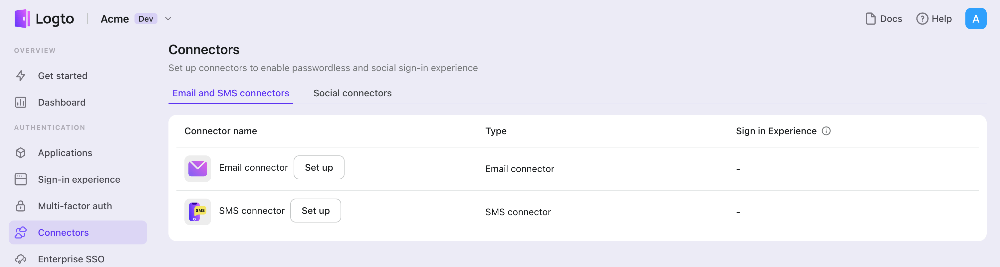

{props.connectorType} コネクターは、認証 (Authentication) のためにワンタイムパスワード (OTP) を送信するための方法です。これにより、{props.passwordlessSignUpIdentifier} の認証が可能になり、{props.connectorType} ベースの登録、サインイン、二要素認証 (2FA)、アカウントの復旧を含むパスワードレス認証 (Authentication) をサポートします。
Logto {props.connectorType} コネクターを使用すると、{props.connector} を {props.connectorType} プロバイダーとして簡単に接続できます。数分で設定を完了できます。

{props.connectorType} コネクターを追加するには、次の手順に従ってください：

1. [Console > Connector > Email and SMS connectors](https://cloud.logto.io/to/connectors/passwordless) に移動します。
2. 新しい {props.connectorType} コネクターを追加するには、「Set up」ボタンをクリックし、「{props.connector}」を選択します。
3. 選択したプロバイダーの README ドキュメントを確認します。
4. 「パラメーター設定」セクションで設定フィールドを完了します。
5. JSON エディターを使用して {props.connectorType} テンプレートをカスタマイズします。
6. {props.passwordlessSignUpIdentifier} に確認コードを送信して設定をテストします。

:::note
インプレースコネクターガイドに従っている場合は、次のセクションをスキップできます。
:::
