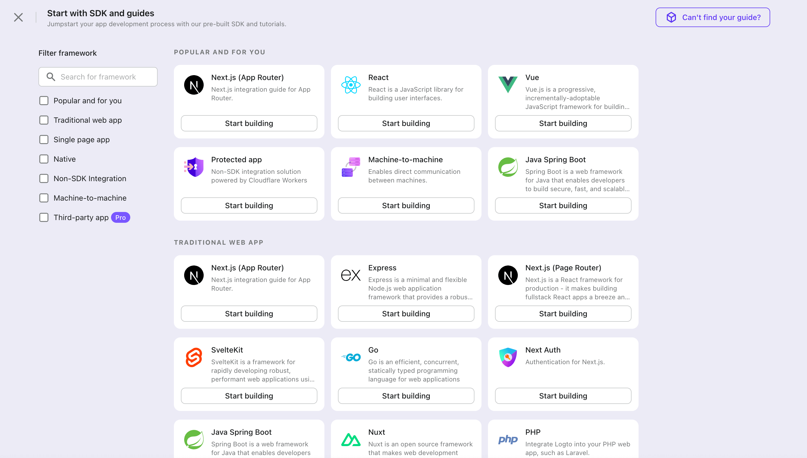

Logto は OpenID Connect (OIDC) 認証 (Authentication) と OAuth 2.0 認可 (Authorization) に基づいています。複数のアプリケーション間でのフェデレーテッドアイデンティティ管理をサポートしており、一般的にシングルサインオン (SSO) と呼ばれます。

あなたの {props.type} アプリケーションを作成するには、次の手順に従ってください：

1. [Logto コンソール](https://cloud.logto.io) を開きます。「Get started」セクションで「View all」リンクをクリックしてアプリケーションフレームワークのリストを開きます。あるいは、[Logto Console > Applications](https://cloud.logto.io/to/applications) に移動し、「Create application」ボタンをクリックします。
   
2. 開いたモーダルで、左側のクイックフィルターチェックボックスを使用して、すべての利用可能な "{props.type}" フレームワークをフィルタリングするか、"{props.type}" セクションをクリックします。{props.framework.split('/').map((text) => `"${text.trim()}"`).join(' / ')} フレームワークカードをクリックして、アプリケーションの作成を開始します。
   
3. アプリケーション名を入力します。例：「Bookstore」と入力し、「Create application」をクリックします。

🎉 タダーン！Logto で最初のアプリケーションを作成しました。詳細な統合ガイドを含むお祝いページが表示されます。ガイドに従って、アプリケーションでの体験がどのようになるかを確認してください。
