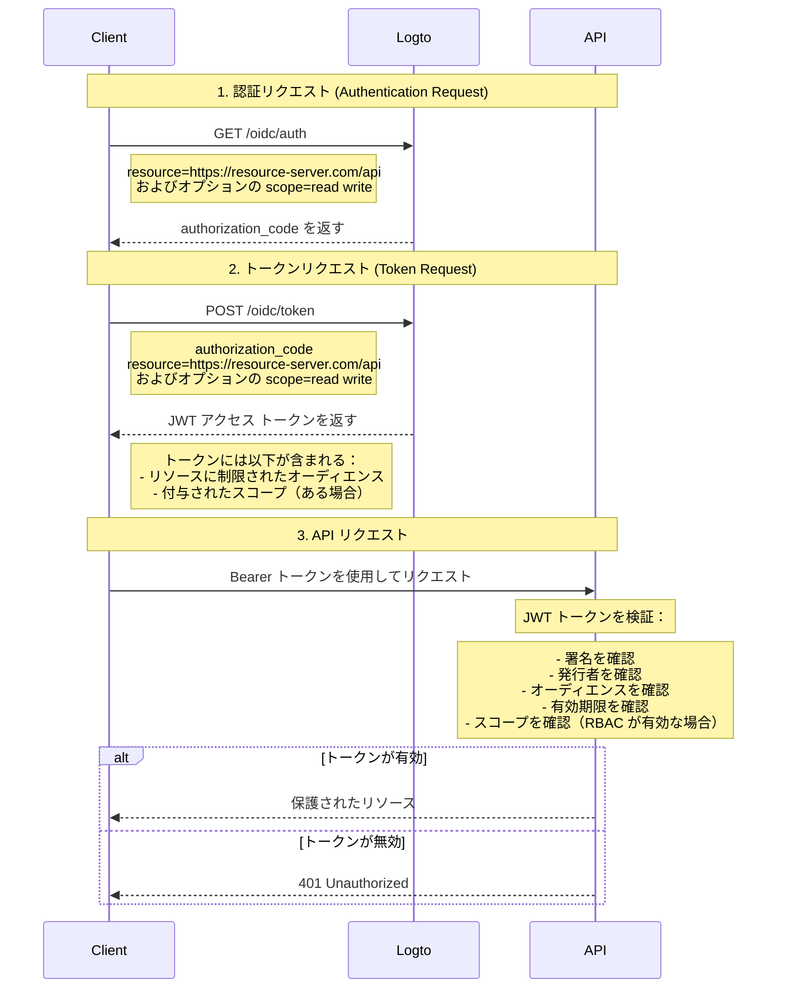

# API を保護する

柔軟で詳細なアクセス制御ポリシーが必要ない場合は、API を直接保護することができます。ここでは、シーケンス図と必要なステップを通じて、アプリにアクセス制御を統合する方法を説明します。



このチュートリアルでは

- Logto エンドポイント: `https://tenant-id.logto.app`
- クライアントアプリケーション: `https://client.example.org`
- API リソースサーバー: `https://resource-server.com/api`

実装時にはこれらを実際のエンドポイントに置き換える必要があります。

## 認証リクエスト \{#authentication-request}

[認証リクエスト (Authentication Request)](https://openid.net/specs/openid-connect-core-1_0.html#AuthRequest) にリソースインジケーターのパラメーターのリストを提供します。これにより、ユーザーが要求する可能性のあるすべての保護されたリソースが示されます。

```bash
GET https://tenant-id.logto.app/oidc/auth?response_type=code
    &client_id=s6BhdRkqt3
    &state=tNwzQ87pC6llebpmac_IDeeq-mCR2wLDYljHUZUAWuI
    &redirect_uri=https%3A%2F%2Fclient.example.org%2Fcb
    &resource=https%3A%2F%2Fresource-server.com%2Fapi
    &scope=read%20write
```

Logto はこれらのリソースインジケーターを検証し保存します。指定されたリソースに制限されたスコープで `authorization_code` が付与され返されます。

Logto SDK の設定例：

```tsx
const config: LogtoConfig = {
  // ...他の設定
  resources: ['https://resource-server.com/api'],
  scopes: ['read', 'write'],
};
```

## トークンリクエスト \{#token-request}

[トークンリクエスト (Token Request)](https://openid.net/specs/openid-connect-core-1_0.html#TokenRequest) にリソースパラメーターが存在し、上記で付与された `authorization_code` と共に送信されると、アクセス トークンの対象 API リソースオーディエンスが指定されます。

```bash
POST https://tenant-id.logto.app/oidc/token HTTP/1.1
Content-Type: application/x-www-form-urlencoded

grant_type=authorization_code&redirect_uri=https%3A%2F%2Fclient.example.org%2Fcb&code=10esc29BWC2qZB0acc9v8zAv9ltc2pko105tQauZ&resource=https%3A%2F%2Fresource-server.com%2Fapi
```

要求されたリソースに制限されたオーディエンスを持つ暗号化されたアクセス トークンが Logto によって付与されます。このトークンには、リクエストの認可 (Authorization) 状態を表すために必要なすべてのデータが含まれています。例えば、リクエストユーザーのアイデンティティとロール、トークンのオーディエンスと有効期限などです。

Logto SDK のコード例：

```tsx
const accessToken = await logtoClient.getAccessToken('https://resource-server.com/api');
```

accessToken のペイロードには以下が含まれます：

```tsx
{
  iss: '<your-logto-endpoint>/oidc',
  aud: 'https://resource-server.com/api',
  scope: 'read write'
}
```

## API リソースへのリクエスト \{#request-to-the-api-resource}

クライアントユーザーは、Authorization ヘッダーに指定された `access_token` を提示して API リソースにリクエストを送信します。

```bash
GET https://resource-server.com/api/users
Authorization: Bearer eyJhbGciOiJIUz...
```

Logto は、API リソースを保護するために標準のトークンベースの認可 (Authorization) プロトコルに従います。OAuth 2.0 について詳しく知りたい場合は、OAuth 2.0 の [公式ドキュメント](https://datatracker.ietf.org/doc/html/rfc6749#section-1.3.1) を参照してください。

## API リクエストの認可トークンを検証する \{#validate-authorization-tokens-for-api-requests}

Logto は、各認可された API リクエストに対して標準の [JWT](https://datatracker.ietf.org/doc/html/rfc7519) 形式の認可トークンを発行します。このトークンは暗号化され、[JWS](https://datatracker.ietf.org/doc/html/rfc7515) トークンとして署名されています。

#### JWS トークンを理解する \{#understanding-jws-token}

エンコードされた [JWS](https://datatracker.ietf.org/doc/html/rfc7515) トークンは、3 つの部分で構成されています：

- JOSE ヘッダー：コードタイプとエンコーディングアルゴリズムを宣言
- JWS ペイロード：トークンのすべてのクレームを含む
- JWS 署名： [JWK](https://datatracker.ietf.org/doc/html/rfc7517) で署名された署名

Logto が発行する JWS ペイロードの標準スキーマ：（クレームはカスタム OIDC 設定に基づいて異なる場合があります）

| key       | description                            |
| --------- | -------------------------------------- |
| jti       | 一意の JWT ID                          |
| sub       | サブジェクト、通常はユーザー ID        |
| iat       | トークンが発行されたタイムスタンプ     |
| exp       | トークンが期限切れになるタイムスタンプ |
| client_id | アプリケーション ID                    |
| iss       | トークン発行者のアイデンティティ       |
| aud       | トークンのオーディエンス               |
| scope     | トークンのスコープ（権限）             |

:::note

開発のために、JWT トークンを視覚的に検査するには、 [JWT デコーダーツール](https://www.jstoolset.com/jwt) を訪れて、受け取ったトークンをデコードして確認できます。これはサードパーティが提供する公開オンラインサービスであるため、トークンが露出する可能性があるため、本番環境のトークンは慎重に、または使用しないでください。

:::

#### 認可トークンを検証する \{#validate-the-authorization-token}

1. [JWT の検証](https://datatracker.ietf.org/doc/html/rfc7519#section-7.2)
2. [JWS 署名の検証](https://datatracker.ietf.org/doc/html/rfc7515#section-5.2)
3. トークンの発行者は `https://<your-logto-domain>/oidc`（あなたの Logto 認証サーバーによって発行）
4. トークンのオーディエンスは、Logto 管理コンソールに登録された現在の受信者のリソースインジケーターと等しい
5. トークンは有効期限内である
6. （[RBAC](/authorization/role-based-access-control/protect-api-resources-with-rbac) のみ）トークンには必要な `scope` がある

JWT トークンを簡単に検証およびデコードするのに役立つさまざまなオープンソースライブラリやパッケージがあります。使用している言語とフレームワークに基づいて、1 つを選んでバックエンドアプリケーションに統合することができます。いくつかの例を確認してください：

- [Node (Express)](/authorization/api-resources/node-express)
- [Spring Boot](/authorization/api-resources/spring-boot)
- [Python](/authorization/api-resources/python)

## 参考資料 \{#reference}

Logto は、コードベースの OAuth 2.0 認可プロトコルを使用して API リクエストを安全にします。これに関する戦略に興味がある場合は、OAuth 2.0 の [仕様](https://datatracker.ietf.org/doc/html/rfc6749#section-1.3.1) を参照して詳細を確認してください。

## よくある質問 \{#faqs}

<details>

<summary>

### クライアントを構築せずにクライアント側、Logto、およびサーバー側の相互作用をテストする方法 \{#how-to-test-the-client-side-logto-and-server-side-interaction-without-building-the-client}

</summary>

クライアントを構築することなく、このプロセスを自動化することができます。1 つのオプションは、パーソナルアクセストークン (PAT) を使用することです。PAT は、特定のユーザーを表すことでクライアント側の認証をシミュレートし、異なるロールと権限を持つことができます。これにより、完全に構築されたクライアントを必要とせずに、アクセストークンや JWT の検証など、サーバー側のロジックをテストすることができます。始めるには、 [パーソナルアクセストークン](/user-management/personal-access-token) を参照してください。

</details>
