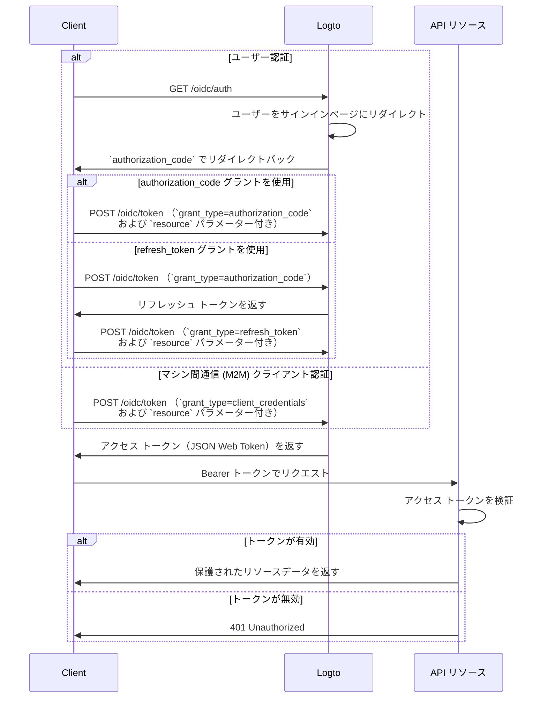

import illustration from '@site/docs/authorization/assets/rbac-global-api-resources.png';
import AuthorizationRequestExample from '@site/docs/authorization/fragments/AuthorizationRequestExample';
import ClientCredentialsRequestExample from '@site/docs/authorization/fragments/ClientCredentialsRequestExample';
import TokenRequestExample from '@site/docs/authorization/fragments/TokenRequestExample';
import TabItem from '@theme/TabItem';
import Tabs from '@theme/Tabs';

# グローバル API リソースの保護

export const resource = 'https://api.your-app.com';

Logto のロールベースのアクセス制御 (RBAC) を使用して、プロダクト全体の API を保護します。グローバルロールと権限を割り当てることで、アプリケーション全体のすべてのユーザーやクライアントのアクセスを制御できます。

## グローバル API リソースとは？ \{#what-are-global-api-resources}

グローバル API リソースとは、組織やテナントに関係なく、すべてのユーザーがアクセスできるアプリケーション内のエンドポイントやサービスです。これらは通常、パブリック向け API、コアプロダクトサービス、または特定の組織に限定されないエンドポイントです。

**ユースケース例**

- ユーザーベース全体で共有されるパブリック API やエンドポイント
- マルチテナンシーに紐づかないマイクロサービス
- すべての顧客が利用するコアアプリケーション API（例： `/api/users`、 `/api/products`）

Logto では、OAuth 2.1 と柔軟なロールベースのアクセス制御を組み合わせて、これらの API を安全に保護できます。

## Logto での仕組み \{#how-it-works-in-logto}

- **API リソースと権限はグローバルに登録される：** 保護したい各 API は、一意のリソースインジケーター（URI）とアクセスを制御する権限（スコープ）のセットで定義されます。
- **アクセスはグローバルロールで制御：** 権限をロールに割り当て、それをユーザーやクライアントに割り当てます。
- **組織レベルの権限とは分離：** グローバル API リソースには組織の文脈がありません。ただし、必要に応じて組織ロールと組み合わせて追加の文脈を提供することも可能です。組織レベルの API を保護するには、[組織レベルの API リソースの保護](/authorization/organization-level-api-resources) を参照してください。


### 実装概要 \{#implementation-overview}

1. **API リソースを登録**し、Logto でその権限を定義します。
2. **API へのアクセスに必要な権限を持つロールを定義**します。
3. **ロールをユーザーやクライアントに割り当て**ます。
4. **OAuth 2.0 認可フローを使用して** API 用のアクセス トークンを取得します（resource パラメーターは登録した API 識別子と一致させる必要があります）。
5. **API でアクセス トークンを検証**し、権限を強制します。

### リソースインジケーターの理解 \{#understanding-resource-indicators}

Logto は [RFC 8707: OAuth 2.0 のリソースインジケーター](https://www.rfc-editor.org/rfc/rfc8707.html) に従って API リソースをモデル化しています。**リソースインジケーター**とは、リクエスト対象の API やサービスを一意に識別する URI です。

**ポイント**

- リソースインジケーターは絶対 URI でなければなりません（例： `https://api.example.com`）
- フラグメントコンポーネントは不可。可能な限りクエリストリングの使用も避けてください。
- リソースインジケーターにより、オーディエンス制限付きトークンやマルチ API アーキテクチャのサポートが可能になります。

**例**

- Management API: `https://my-tenant.logto.app/api`
- カスタムグローバル API: `https://api.yourapp.com`

### 認可フロー：API の認証と保護 \{#authorization-flow-authenticating-and-securing-your-api}

以下のフローは、インタラクティブなユーザー認証（ブラウザ / アプリ）とバックエンドのマシン間通信 (M2M) シナリオの両方に適用されます。

このフローは必要なパラメーターやヘッダーの詳細をすべて網羅しているわけではなく、主要なステップに焦点を当てています。実際のフローの動作については、引き続きお読みください。



_ユーザー認証 = ブラウザ / アプリ。M2M = クライアント認証を使うバックエンドサービスやスクリプト。_

:::note
`resource` パラメーターは、Logto で登録した API 識別子（リソースインジケーター）と完全に一致している必要があります。
:::

## 実装手順 \{#implementation-steps}

### API リソースの登録 \{#register-your-api-resources}

1. <CloudLink to="/api-resources">コンソール → API リソース</CloudLink> に移動します。
2. 新しい API リソース（例： `https://api.yourapp.com/org`）を作成し、その権限（スコープ）を定義します。

詳細な設定手順は [権限付き API リソースの定義](/authorization/role-based-access-control#define-api-resources-with-permissions) を参照してください。

### グローバルロールの設定 \{#set-up-global-roles}

1. <CloudLink to="/roles">コンソール → ロール</CloudLink> に移動します。
2. API 権限に対応するロール（例： `read:products`、 `write:products`）を作成します。
3. これらのロールを API へのアクセスが必要なユーザーやクライアントに割り当てます。

詳細な設定手順は [グローバルロールの利用](/authorization/role-based-access-control#configure-global-roles) を参照してください。

### グローバル API リソース用のアクセス トークンの取得 \{#obtain-access-tokens-for-global-api-resources}

グローバル API リソースにアクセスする前に、クライアントはアクセス トークンを取得する必要があります。Logto はグローバル API リソース用の [JSON Web Token (JWT)](https://auth.wiki/jwt) をアクセス トークンとして発行します。これは通常、[OAuth 2.0 認可コードフロー](https://auth.wiki/authorization-code-flow)、[リフレッシュ トークンフロー](https://auth.wiki/refresh-token)、または [クライアント認証フロー](https://auth.wiki/client-credentials-flow) を使用して行われます。

#### 認可コードまたはリフレッシュ トークンフロー \{#authorization-code-or-refresh-token-flow}

Logto 公式 SDK はすべて、リフレッシュ トークンフローを利用したグローバル API リソース用のアクセス トークン取得をサポートしています。標準的な OAuth 2.0 / OIDC クライアントライブラリでもこのフローを実装できます。

<Tabs groupId="user-client">
<TabItem value="logto-sdk" label="Logto SDK">

Logto クライアントの初期化時に、`resources` パラメーター（配列）にリソースインジケーターを追加し、`scopes` パラメーターに必要な権限（スコープ）を追加します。

ユーザーが認証された後、`getAccessToken()` などでアクセス トークンをリクエストする際に、`resource` パラメーターまたは同様のパラメーターでリソースインジケーターを渡します。

各 SDK の詳細は [クイックスタート](/quick-starts) を参照してください。

</TabItem>
<TabItem value="oauth-client" label="OAuth 2.0 / OIDC client library">

OAuth 2.0 クライアントの設定や認可コードフローの初期化時に、`resource` パラメーターと必要なスコープを認可リクエストに含めてください。

一部のライブラリは `resource` パラメーターをネイティブにサポートしていませんが、通常は追加パラメーターとして認可リクエストに渡すことができます。詳細はご利用のライブラリのドキュメントを確認してください。

`resource` および `scope` パラメーターを含む認可リクエストの非公式例を示します：

<AuthorizationRequestExample resource={resource} scope="read:products write:products" />

ユーザーが認証されると、認可コードを受け取ります。このコードを Logto の `/oidc/token` エンドポイントに POST し、リクエストボディに `resource` パラメーターを含めてアクセス トークンと交換します。

認可コードグラントタイプを使ったトークンリクエストの非公式例：

<TokenRequestExample grantType="authorization_code" resource={resource} />

また、`refresh_token` グラントタイプを使えば、ユーザー操作なしで新しいアクセス トークンを取得できます（リクエストに `resource` パラメーターを含める必要があります）。

リフレッシュ トークングラントタイプを使ったトークンリクエストの非公式例：

<TokenRequestExample grantType="refresh_token" resource={resource} />

</TabItem>
</Tabs>

#### クライアント認証フロー \{#client-credentials-flow}

マシン間通信 (M2M) シナリオでは、クライアント認証フローを使ってグローバル API リソース用のアクセス トークンを取得できます。Logto の `/oidc/token` エンドポイントに POST リクエストを送り、クライアント ID とシークレットを使ってアクセス トークンをリクエストします。

リクエストに含めるべき主なパラメーターは 2 つです：

- `resource`: アクセスしたい API のリソースインジケーター URI（例： `https://api.yourapp.com`）
- `scope`: API にリクエストしたい権限（例： `read:products write:products`）

クライアント認証グラントタイプを使ったトークンリクエストの非公式例：

<ClientCredentialsRequestExample
  resource="https://api.yourapp.com"
  scope="read:products write:products"
/>

### API での JWT アクセス トークンの検証 \{#validating-jwt-access-tokens-in-your-api}

Logto が発行する JWT には、API で認可 (Authorization) を強制するために利用できるクレームが含まれています。

API が Logto 発行のアクセス トークンを受け取った場合、次のことを行うべきです：

- トークン署名の検証（Logto の JWKs を使用）
- トークンが有効期限切れでないことの確認（`exp` クレーム）
- `iss`（発行者）が Logto エンドポイントと一致していることの確認
- `aud`（オーディエンス）が登録した API リソース識別子（例： `https://api.yourapp.com`）と一致していることの確認
- `scope` クレーム（スペース区切り）を分割し、必要な権限が含まれているか確認

ステップバイステップや言語別ガイドは [アクセス トークンの検証方法](/authorization/validate-access-tokens) を参照してください。

### オプション：ユーザー権限変更のハンドリング \{#optional-handle-user-permission-change}

:::info
👷 作業中です。 🚧
:::

## ベストプラクティスとセキュリティのヒント \{#best-practices-and-security-tips}

- **権限はビジネス主導で設計：** 実際のアクションに対応する分かりやすい名前を使いましょう。
- **トークンの有効期限は短く：** トークンが漏洩した場合のリスクを低減します。
- **付与するスコープは最小限に：** トークンには本当に必要な権限だけを与えましょう。
- **オーディエンス制限を活用：** `aud` クレームを必ず検証し、不正利用を防ぎましょう。

## よくある質問 \{#faqs}

<details>
<summary>

### クライアントが resource パラメーターをサポートしていない場合は？ \{#what-if-my-client-doesn-t-support-the-resource-parameter}

</summary>

Logto コンソールでデフォルトの API リソースを設定してください。トークンリクエストで resource パラメーターが指定されていない場合、このオーディエンスがデフォルトになります。

</details>

<details>
<summary>

### API から 401 Unauthorized が返される理由は？ \{#why-do-i-get-401-unauthorized-from-my-api}

</summary>

次の一般的な問題を確認してください：

- **トークン署名**：バックエンドが Logto から正しい JWKs を取得しているか確認
- **トークンの有効期限**：トークンが有効期限切れでないか（`exp` クレーム）
- **オーディエンス**：`aud` クレームが登録した API リソースインジケーターと一致しているか
- **必要なスコープ**：トークンの `scope` クレームに必要な権限が含まれているか

</details>

<details>
<summary>

### フルクライアントなしでテストするには？ \{#how-do-i-test-without-a-full-client}

</summary>

[パーソナルアクセストークン](/user-management/personal-access-token) を使って認証済みコールをシミュレートできます。これにより、クライアントアプリケーションで完全な OAuth フローを実装せずに API エンドポイントのテストが可能です。

</details>

<details>
<summary>

### 権限リクエスト時にスコープのプレフィックスや短縮形は使えますか？ \{#can-i-use-scope-prefixes-or-shortened-versions}

</summary>

いいえ。スコープ名は API リソースで定義した権限名と**完全一致**している必要があります。プレフィックスや短縮形はワイルドカードとして機能しません。

**例：**

API リソースで次のように定義している場合：

- `read:elections`
- `write:elections`

リクエスト時は次のように指定する必要があります：

```swift
scopes: ["read:elections", "write:elections"]
```

これは**動作しません**：

```swift
scopes: ["read", "write"]  // ❌ 権限名と一致しません
```

</details>

## さらに読む \{#further-reading}

<Url href="/authorization/validate-access-tokens">アクセス トークンの検証方法</Url>
<Url href="/use-cases/authorization/rbac-in-practice">
  RBAC 実践：アプリケーションの安全な認可 (Authorization) 実装
</Url>
<Url href="/developers/custom-token-claims">トークンクレームのカスタマイズ</Url>
<Url href="https://www.rfc-editor.org/rfc/rfc8707.html">RFC 8707: リソースインジケーター</Url>
