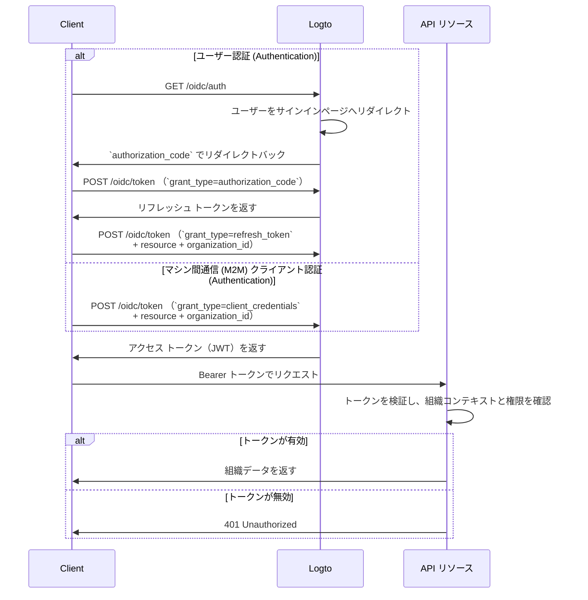

import illustration from '@site/docs/authorization/assets/rbac-organization-level-api-resources.png';
import AuthorizationRequestExample from '@site/docs/authorization/fragments/AuthorizationRequestExample';
import ClientCredentialsRequestExample from '@site/docs/authorization/fragments/ClientCredentialsRequestExample';
import TokenRequestExample from '@site/docs/authorization/fragments/TokenRequestExample';
import HandleUserPermissionChange from '@site/docs/authorization/fragments/_handle-user-permission-change.mdx';
import TabItem from '@theme/TabItem';
import Tabs from '@theme/Tabs';

import InspectOrganizationClaim from './fragments/_inspect-organization-claim.md';
import OrganizationTokenWarning from './fragments/_organization-token-warning.md';

# 組織レベルの API リソースを保護する

export const resource = 'https://api.your-app.com/organizations';

API リソースと組織テンプレートを組み合わせることで、各組織内の API やデータへのアクセスを制限し、SaaS におけるテナントレベルの分離を実現できます。

## 組織レベルの API リソースとは？ \{#what-are-organization-level-api-resources}

組織レベルの API リソースとは、**特定の組織にスコープされた**アプリケーション内のエンドポイントやサービスです。これらの API は組織コンテキストに基づいて認可 (Authorization) とアクセスを強制し、ユーザーやクライアントが自分の組織に関連するデータや操作のみにアクセスできるようにします。

**ユースケース例**

- 組織メンバー、ロール、設定を管理する API（例： `/organizations/{organizationId}/members`）
- 組織単位のダッシュボード、分析、レポート
- 組織に紐づく請求、サブスクリプション、監査用エンドポイント
- アクションやデータがテナントごとに分離されるあらゆる API

Logto は、OAuth 2.1 とロールベースのアクセス制御 (RBAC) を利用して、これらの組織 API をセキュアに保護し、マルチテナント SaaS アーキテクチャをサポートします。

これらの権限は [組織テンプレート](/authorization/organization-template) で定義された**組織ロール**によって管理されます。すべての組織が同じテンプレートを使用するため、全組織で一貫した権限モデルが保証されます。

## Logto での仕組み \{#how-it-works-in-logto}

- **API リソースと権限はグローバルに登録される：** 各 API リソースは Logto で一意のリソースインジケーター（URI）と権限（スコープ）のセットとして定義されます。
- **組織レベルのロール：** 組織ロールは組織テンプレートで定義されます。API リソースの権限（スコープ）は組織ロールに割り当てられ、各組織内のユーザーやクライアントに割り当てられます。
- **コンテキスト認識型の認可 (Authorization)：** クライアントが API リソースと `organization_id` の両方を指定してアクセストークンをリクエストすると、Logto は組織コンテキストと API オーディエンスの両方を含むトークンを発行します。トークンの権限（スコープ）は、指定された組織に対するユーザーの組織ロールによって決定されます。
- **グローバルリソースとの分離：** API リソースは組織コンテキストの有無にかかわらずアクセスできます。組織 RBAC はリクエストに `organization_id` が含まれる場合のみ適用されます。すべてのユーザーで共有される API については [グローバル API リソースの保護](/authorization/global-api-resources) を参照してください。

### 実装概要 \{#implementation-overview}

1. **API リソースを登録**し、Logto でその権限（スコープ）を定義します。
2. **組織ロールを組織テンプレートで定義**し、関連する API 権限を割り当てます。
3. **各組織内でユーザーやクライアントにロールを割り当てます。**
4. **`organization_id` を指定して API 用のアクセストークンをリクエストし、組織コンテキストを含めます。**
5. **API でアクセストークンを検証し、組織コンテキストと権限の両方を強制します。**

### Logto による組織 RBAC の適用方法 \{#how-logto-applies-organization-rbac}

- `organization_id` **なし**でアクセストークンをリクエストした場合、グローバルロール／権限のみが考慮されます。
- `organization_id` **あり**でアクセストークンをリクエストした場合、Logto はユーザーの組織ロールとその組織に紐づく権限を評価します。
- 発行される JWT には、API オーディエンス（`aud` クレーム）と組織コンテキスト（`organization_id` クレーム）の両方が含まれ、スコープはユーザーの組織ロールで許可されたものに絞り込まれます。

### 認可 (Authorization) フロー：組織コンテキスト付きで API を認証・保護する \{#authorization-flow-authenticating-and-securing-apis-with-organization-context}

以下のフローは、クライアント（Web、モバイル、バックエンド）が組織トークンを取得し、組織レベルの API リソースへアクセスする流れを示しています。

このフローは必要なパラメーターやヘッダーの詳細をすべて網羅しているわけではなく、主要なステップに焦点を当てています。実際の動作例はこの後の説明を参照してください。

_ユーザー認証 (Authentication) = ブラウザ／アプリ。M2M = クライアント認証情報＋組織コンテキストを使うバックエンドサービスやスクリプト。_

## 実装手順 \{#implementation-steps}

### API リソースを登録する \{#register-your-api-resource}

1. <CloudLink to="/api-resources">コンソール → API リソース</CloudLink> に移動します。
2. 新しい API リソース（例： `https://api.yourapp.com/org`）を作成し、その権限（スコープ）を定義します。

詳細な設定手順は [API リソースと権限の定義](/authorization/role-based-access-control#define-api-resources-with-permissions) を参照してください。

### 組織ロールを設定する \{#set-up-organization-roles}

1. <CloudLink to="/organization-template/organization-roles">
     コンソール → 組織テンプレート → 組織ロール
   </CloudLink>
   に移動します。
2. 組織ロール（例： `admin`、`member`）を作成し、各ロールに API 権限を割り当てます。
3. 各組織内でユーザーやクライアントにロールを割り当てます。まだメンバーでない場合は、招待または追加してください。

詳細な設定手順は [組織ロールの利用](/authorization/role-based-access-control#configure-organization-roles) を参照してください。

### API リソース用の組織トークンを取得する \{#obtain-organization-tokens-for-api-resources}

クライアント／アプリは、`resource` と `organization_id` の両方を指定してトークンをリクエストすることで、組織レベルの API にアクセスできます。Logto はこれらを [JSON Web Token (JWT)](https://auth.wiki/jwt) 形式の組織トークンとして発行します。[リフレッシュ トークンフロー](https://auth.wiki/refresh-token) または [クライアント認証情報フロー](https://auth.wiki/client-credentials-flow) のいずれかで取得できます。

#### リフレッシュ トークンフロー \{#refresh-token-flow}

ほとんどの Logto 公式 SDK は、リフレッシュ トークンフローによる組織トークンの取得を標準でサポートしています。標準的な OAuth 2.0 / OIDC クライアントライブラリでもこのフローを実装できます。

<Tabs groupId="user-client">
<TabItem value="logto-sdk" label="Logto SDK">

Logto SDK の初期化時に、`urn:logto:scope:organizations` および必要な組織権限（スコープ）を `scopes` パラメーターに追加します。

一部の Logto SDK には、`UserScope.Organizations` など組織用の事前定義スコープがあります。

<InspectOrganizationClaim />

`getAccessToken()` を呼び出す際、API リソース（`resource`）と組織 ID（`organizationId`）の両方を指定して組織トークンを取得します。

各 SDK の詳細は [クイックスタート](/quick-starts) を参照してください。

</TabItem>
<TabItem value="oauth-client" label="OAuth 2.0 / OIDC クライアントライブラリ">

OAuth 2.0 クライアントの設定や認可コードフローの初期化時に、以下のパラメーターを含めてください：

- `resource`: Logto で登録した API リソース識別子（例： `https://api.your-app.com/organizations`）。
- `scope`: 事前定義の組織スコープ（`urn:logto:scope:organizations`）、`offline_access`（リフレッシュ トークン取得用）、および必要な API 権限（例： `manage:members view:analytics`）。

一部のライブラリは `resource` パラメーターを標準サポートしていませんが、多くの場合、認可リクエストで追加パラメーターを渡せます。詳細はライブラリのドキュメントを確認してください。

認可リクエストの非公式例：

<AuthorizationRequestExample
  resource={resource}
  scope="urn:logto:scope:organizations invite:member manage:billing"
/>

ユーザーが認証 (Authentication) されると、認可コードが返されます。このコードを使って Logto の `/oidc/token` エンドポイントに POST リクエストします。

トークンリクエストの非公式例：

<TokenRequestExample grantType="authorization_code" />

<OrganizationTokenWarning />

リフレッシュ トークンが返され、これを使って組織トークンを取得できます。

<InspectOrganizationClaim />

最後に、リフレッシュ トークンを使って Logto の `/oidc/token` エンドポイントに POST リクエストし、組織トークンを取得します。以下を必ず含めてください：

- `resource` パラメーター：API リソース識別子（例： `https://api.yourapp.com/org`）。
- `organization_id` パラメーター：対象の組織 ID。
- （オプション）`scope` パラメーター：必要な権限をさらに絞り込む場合（例： `manage:members view:reports`）。

トークンリクエストの非公式例：

<TokenRequestExample
  grantType="refresh_token"
  resource={resource}
  organizationId="your-organization-id"
/>

</TabItem>
</Tabs>

#### クライアント認証情報フロー \{#client-credentials-flow}

マシン間通信 (M2M) シナリオでは、クライアント認証情報フローを使って組織レベルの API リソース権限用のアクセストークンを取得できます。Logto の `/oidc/token` エンドポイントに組織パラメーターを含めて POST リクエストすることで、クライアント ID とシークレットを使って組織トークンをリクエストできます。

リクエストに含める主なパラメーター：

- `resource`: API リソース識別子（例： `https://api.yourapp.com/org`）。
- `organization_id`: トークンを取得したい組織の ID。
- `scope`: リクエストしたい組織レベルの API リソース権限（例： `invite:member`、`manage:billing`）。

クライアント認証情報グラントタイプでのトークンリクエスト非公式例：

<ClientCredentialsRequestExample
  resource="https://api.yourapp.com/org"
  organizationId="your-organization-id"
  scope="invite:member manage:billing"
/>

### 組織トークンを検証する \{#validate-organization-tokens}

Logto が発行する組織トークン（JWT）には、API で組織レベルのアクセス制御を強制するためのクレームが含まれます。

アプリが組織トークンを受け取ったら、次の点を確認してください：

- トークン署名の検証（Logto の JWKs を使用）
- トークンの有効期限（`exp` クレーム）の確認
- `iss`（発行者）が自分の Logto エンドポイントと一致しているか
- `aud`（オーディエンス）が登録した API リソース識別子（例： `https://api.yourapp.com/org`）と一致しているか
- `organization_id` クレームが正しい組織にスコープされているか
- `scope` クレーム（スペース区切り）を分割し、必要な権限が含まれているか
- API パスに組織 ID（例： `/organizations/{organizationId}/members`）が含まれる場合、`organization_id` クレームとパスパラメーターが一致しているか

詳細な手順や言語別ガイドは [アクセストークンの検証方法](/authorization/validate-access-tokens) を参照してください。

<HandleUserPermissionChange type="organization" />

## ベストプラクティスとセキュリティのヒント \{#best-practices-and-security-tips}

- **常に組織コンテキストを検証する：** トークンだけを信用せず、組織スコープ API 呼び出しごとに `organization_id` クレームを確認してください。
- **オーディエンス制限を利用する：** `aud` クレームを必ず確認し、トークンが意図した組織用であることを保証してください。
- **権限はビジネス主導で設計する：** 実際のアクションに対応する明確な名前を使い、各組織ロールに必要なものだけを付与してください。
- **API 権限と非 API 権限は可能な限り分離する**（ただし両方を 1 つのロールに含めることも可能）。
- **トークンの有効期間は短く保つ：** 万が一漏洩した場合のリスクを低減します。
- **組織テンプレートを定期的に見直す：** 製品の進化に合わせてロールや権限を更新してください。

## よくある質問 \{#faqs}

### トークンリクエストに `organization_id` を含めなかった場合は？ \{#what-if-i-don-t-include-organization-id-in-my-token-request}

グローバルロール／権限のみが評価されます。組織 RBAC は適用されません。

### 1 つのロールに組織権限と非組織権限を混在できますか？ \{#can-i-mix-organization-and-non-organization-permissions-in-a-single-role}

いいえ、組織権限（組織レベルの API 権限を含む）は組織テンプレートで定義されており、グローバル API 権限と混在できません。ただし、組織権限と組織レベルの API 権限を含むロールは作成できます。

## さらに読む \{#further-reading}

<Url href="/authorization/validate-access-tokens">アクセストークンの検証方法</Url>
<Url href="/developers/custom-token-claims">トークンクレームのカスタマイズ</Url>
<Url href="/use-cases/multi-tenancy/build-multi-tenant-saas-application">
  ユースケース：マルチテナント SaaS アプリケーションの構築
</Url>
<Url href="https://www.rfc-editor.org/rfc/rfc8707.html">RFC 8707: リソースインジケーター</Url>
