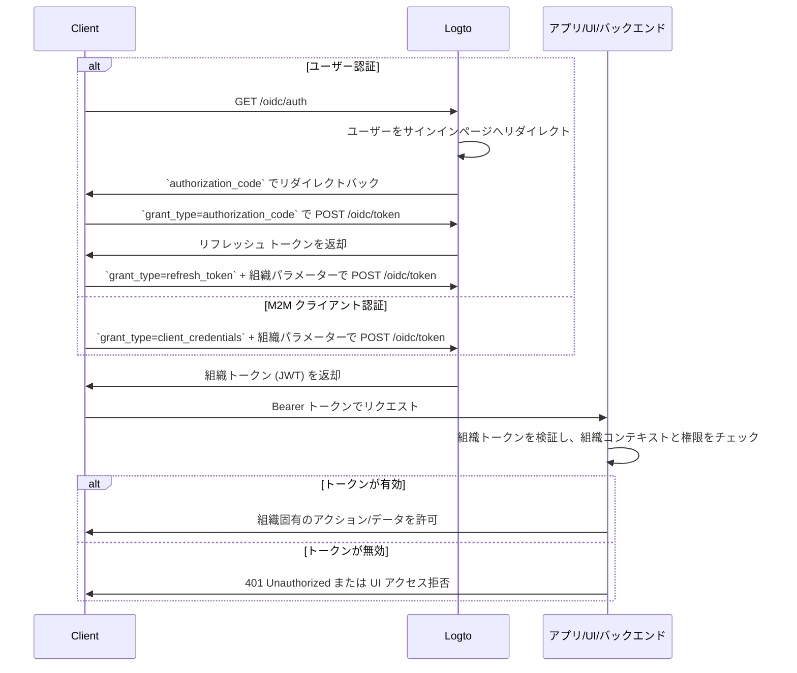

import illustration from '@site/docs/authorization/assets/rbac-organization-permissions.png';
import AuthorizationRequestExample from '@site/docs/authorization/fragments/AuthorizationRequestExample';
import ClientCredentialsRequestExample from '@site/docs/authorization/fragments/ClientCredentialsRequestExample';
import TokenRequestExample from '@site/docs/authorization/fragments/TokenRequestExample';
import TabItem from '@theme/TabItem';
import Tabs from '@theme/Tabs';

import InspectOrganizationClaim from './fragments/_inspect-organization-claim.md';
import OrganizationTokenWarning from './fragments/_organization-token-warning.md';

# 組織（非 API）権限の保護

Logto の組織テンプレートを利用して、組織レベルのロールと権限を管理・適用し、組織コンテキスト内でアプリ内機能やワークフローへのアクセスを制御できます。

## 組織（非 API）権限とは？ \{#what-are-organization-non-api-permissions}

組織権限（非 API）は、**組織コンテキスト内**でユーザーが何をできるかを制御しますが、**API レベルで強制されるものではありません**。代わりに、アプリの機能、UI 要素、ワークフロー、またはビジネスアクションへのアクセスを管理し、バックエンド API ではなくフロントや業務ロジックで適用されます。

**ユースケース例**

- 組織内でメンバーを招待・管理する
- 組織ロールの割り当てや変更
- 組織の請求、設定、管理機能の管理
- API エンドポイントを持たないダッシュボード、分析、内部ツールへのアクセス

Logto では、OAuth 2.1 とロールベースのアクセス制御 (RBAC) を活用し、マルチテナント SaaS アーキテクチャをサポートしながら、これらの組織権限を安全に管理できます。

これらの権限は [組織テンプレート](/authorization/organization-template) で定義された**組織ロール**を通じて管理されます。すべての組織が同じテンプレートを使用するため、全組織で一貫した権限モデルが保証されます。

## Logto での仕組み \{#how-it-works-in-logto}

- **組織レベルの RBAC**：ロールと権限は組織テンプレートで定義します。ユーザーが組織に参加すると、1 つ以上のロールが割り当てられ、特定の権限が付与されます。
- **非 API 強制**：権限はアプリの UI、ワークフロー、またはバックエンドロジックでチェック・適用され、必ずしも API ゲートウェイで強制されるわけではありません。
- **API 保護との分離**：組織（非 API）権限は API リソース権限とは別物です。両者を組み合わせて高度なシナリオにも対応できます。

  

### 実装概要 \{#implementation-overview}

1. Logto の組織テンプレートで**組織権限を定義**します。
2. 組織固有のアクションに必要な権限をまとめた**組織ロールを作成**します。
3. 各組織内のユーザーやクライアントに**ロールを割り当て**ます。
4. リフレッシュトークンまたはクライアントクレデンシャルフローを使って、現在の組織の**組織トークン（JWT）を取得**します。
5. アプリの UI やバックエンドで**アクセス トークン**を検証し、組織権限を強制します。

### 認可フロー：組織権限の認証と保護 \{#authorization-flow-authenticating-and-securing-organization-permissions}

以下のフローは、クライアント（Web、モバイル、バックエンド）が非 API 権限の強制のために組織トークンを取得・利用する流れを示しています。

このフローは必要なパラメーターやヘッダーの詳細をすべて網羅しているわけではなく、主要なステップに焦点を当てています。実際の動作例はこの後の説明を参照してください。

_ユーザー認証 = ブラウザ/アプリ。M2M = クライアントクレデンシャル + 組織コンテキストを使うバックエンドサービスやスクリプト。_

## 実装手順 \{#implementation-steps}

### 組織権限の登録 \{#register-organization-permissions}

{/* eslint-disable-next-line prettier/prettier */}
1. <CloudLink to="/organization-template/organization-permissions">コンソール → 組織テンプレート → 組織権限</CloudLink> にアクセスします。
2. 必要な組織権限を定義します（例：`invite:member`, `manage:billing`, `view:analytics` など）。

詳細な設定手順は [組織権限の定義](/authorization/role-based-access-control#define-organization-permissions) を参照してください。

### 組織ロールの設定 \{#set-up-organization-roles}

{/* eslint-disable-next-line prettier/prettier */}
1. <CloudLink to="/organization-template/organization-roles">コンソール → 組織テンプレート → 組織ロール</CloudLink> にアクセスします。
2. 先ほど定義した組織権限をまとめたロールを作成します（例：`admin`, `member`, `billing` など）。
3. これらのロールを各組織内のユーザーやクライアントに割り当てます。

詳細な設定手順は [組織ロールの利用](/authorization/role-based-access-control#configure-organization-roles) を参照してください。

### 組織トークン（非 API）の取得 \{#obtain-organization-tokens-non-api}

クライアント/アプリは、組織権限へアクセスするために組織トークン（非 API）を取得する必要があります。Logto は組織トークンを [JSON Web Token (JWT)](https://auth.wiki/jwt) 形式で発行します。[リフレッシュ トークンフロー](https://auth.wiki/refresh-token) または [クライアントクレデンシャルフロー](https://auth.wiki/client-credentials-flow) のいずれかで取得できます。

#### リフレッシュ トークンフロー \{#refresh-token-flow}

ほぼすべての Logto 公式 SDK は、リフレッシュ トークンフローによる組織トークンの取得を標準でサポートしています。標準的な OAuth 2.0 / OIDC クライアントライブラリでもこのフローを実装できます。

<Tabs groupId="user-client">
<TabItem value="logto-sdk" label="Logto SDK">

Logto SDK の初期化時に、`urn:logto:scope:organizations` および必要な組織権限（スコープ）を `scopes` パラメーターに追加します。

一部の Logto SDK には、`UserScope.Organizations` のような組織用の事前定義スコープがあります（JavaScript SDK など）。

<InspectOrganizationClaim />

`getOrganizationToken` または（組織 ID を指定した）`getAccessToken` などのメソッドで、特定の組織の組織トークンをリクエストします。

各 SDK の詳細は [クイックスタート](/quick-starts) を参照してください。

</TabItem>
<TabItem value="oauth-client" label="OAuth 2.0 / OIDC クライアントライブラリ">

OAuth 2.0 クライアントの設定や認可コードフローの初期化時に、以下のパラメーターを含めてください：

- `resource`: `urn:logto:resource:organizations` を指定し、組織トークンを要求することを示します。
- `scope`: 事前定義された組織スコープ（`urn:logto:scope:organizations`）、`offline_access`（リフレッシュ トークン取得用）、および必要な組織権限（例：`invite:member`, `manage:billing` など）を含めます。

一部のライブラリは `resource` パラメーターを標準サポートしていませんが、多くの場合認可リクエストで追加パラメーターを渡せます。詳細はライブラリのドキュメントを確認してください。

認可リクエストの非公式例：

<AuthorizationRequestExample
  scope="urn:logto:scope:organizations invite:member manage:billing"
  resource="urn:logto:resource:organizations"
/>

ユーザーが認証されると、認可コードが返却されます。このコードを使い、Logto の `/oidc/token` エンドポイントへ POST リクエストを送ります。

トークンリクエストの非公式例：

<TokenRequestExample grantType="authorization_code" />

<OrganizationTokenWarning />

リフレッシュ トークンが返却され、組織トークンの取得に利用できます。

<InspectOrganizationClaim />

最後に、リフレッシュ トークンを使って Logto の `/oidc/token` エンドポイントへ POST リクエストし、組織トークンを取得します。以下を含めてください：

- `organization_id` パラメーターに希望する組織 ID を指定
- （オプション）`scope` パラメーターで必要な権限をさらに絞り込む（例：`manage:members view:reports` など）

トークンリクエストの非公式例：

<TokenRequestExample grantType="refresh_token" organizationId="your-organization-id" />

</TabItem>
</Tabs>

#### クライアントクレデンシャルフロー \{#client-credentials-flow}

マシン間通信 (M2M) シナリオでは、クライアントクレデンシャルフローを使って組織権限用のアクセス トークンを取得できます。Logto の `/oidc/token` エンドポイントへ組織パラメーター付きで POST リクエストし、クライアント ID とシークレットで組織トークンをリクエストします。

リクエストに含める主なパラメーター：

- `organization_id`: トークンを取得したい組織の ID
- `scope`: 要求したい組織権限（例：`invite:member`, `manage:billing` など）

クライアントクレデンシャルグラントタイプでのトークンリクエスト非公式例：

<ClientCredentialsRequestExample
  organizationId="your-organization-id"
  scope="invite:member manage:billing"
/>

### 組織トークンの検証 \{#validate-organization-tokens}

Logto が発行する組織トークン（JWT）には、アプリ/UI/バックエンドで組織レベルのアクセス制御を強制するためのクレームが含まれています。

アプリが組織トークンを受け取ったら、以下を行ってください：

- トークン署名の検証（Logto の JWKs を使用）
- トークンの有効期限（`exp` クレーム）の確認
- `iss`（発行者）が Logto エンドポイントと一致するか確認
- `aud`（オーディエンス）がフォーマットされた組織識別子（例：`urn:logto:organization:{organization_id}`）と一致するか確認
- `scope` クレーム（スペース区切り）を分割し、必要な権限が含まれているか確認

詳細な手順や言語別ガイドは [アクセス トークンの検証方法](/authorization/validate-access-tokens) を参照してください。

## ベストプラクティスとセキュリティのヒント \{#best-practices-and-security-tips}

- **UI のみの強制に頼らない**：重要なアクションは必ずバックエンドでも権限を検証してください。
- **オーディエンス制限を利用**：`aud` クレームを必ずチェックし、トークンが意図した組織用であることを確認してください。
- **ビジネス主導の権限設計**：実際のアクションに対応する明確な名前を使い、各組織ロールに必要なものだけを付与してください。
- **API 権限と非 API 権限は可能な限り分離**（ただし 1 つのロールに両方含めることも可能）
- **プロダクトの進化に合わせて組織テンプレートを定期的に見直す**

## よくある質問 \{#faqs}

### 1 つのロールに組織権限と非組織権限を混在できますか？ \{#can-i-mix-organization-and-non-organization-permissions-in-a-single-role}

いいえ、組織権限（組織レベルの API 権限を含む）は組織テンプレートで定義されており、グローバル API 権限と混在できません。ただし、組織権限と組織レベルの API 権限を含むロールは作成できます。

### 非 API 権限はどこで強制すべきですか？ \{#where-should-i-enforce-non-api-permissions}

非 API 権限は、UI（機能制御用）とサーバーサイドロジック（機密アクション用）の両方でチェックしてください。

## さらに読む \{#further-reading}

<Url href="/authorization/validate-access-tokens">アクセス トークンの検証方法</Url>
<Url href="/developers/custom-token-claims">トークンクレームのカスタマイズ</Url>
<Url href="/use-cases/multi-tenancy/build-multi-tenant-saas-application">
  ユースケース：マルチテナント SaaS アプリケーションの構築
</Url>
