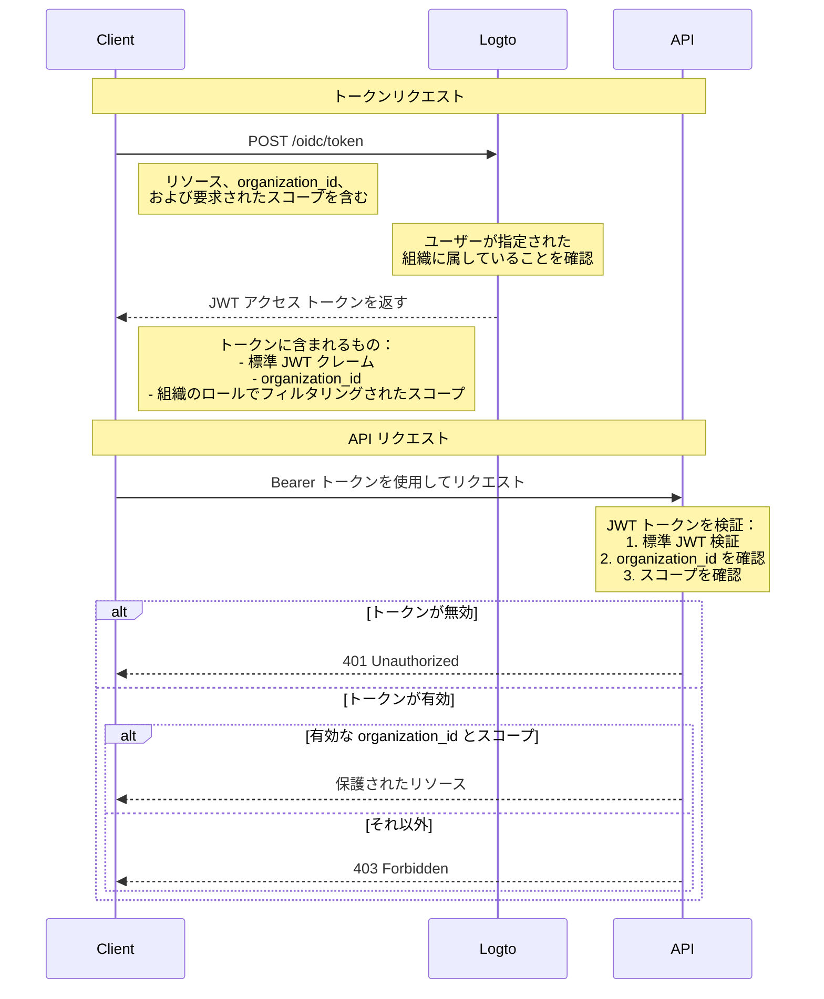

# 組織テンプレートで API リソースを保護する

有効な JWT が存在することを確認することでリソースを保護する [API を保護する](/authorization/api-resources/protect-your-api) に加えて、組織のロールを適用してスコープをフィルタリングすることもできます。この記事では、組織のロールが認証 (Authentication) フローにおけるスコープの委任と検証にどのように影響するかに焦点を当てます。



## 追加の `organization_id` パラメーター

通常のアクセス トークン付与リクエストに加えて、図では追加の `organization_id` パラメーターを追加しています。これにより、Logto は特定の組織のロールにスコープを絞り込むことができます。

## クライアント設定

Logto の SDK を使用している場合、`getAccessToken` メソッドの第 2 パラメーターとして `organization_id` を追加できます。

```tsx
const accessToken = await logto.getAccessToken('https://my-resource.com/api', 'org_1');

// またはクレームを直接取得
const accessTokenClaims = await logto.getAccessTokenClaims('https://my-resource.com/api', 'org_1');
console.log(accessTokenClaims.organization_id); // 'org_1'
console.log(accessTokenClaims.aud); // 'https://my-resource.com/api'
```

その後、この組織のロールから継承されたスコープのみがアクセス トークンに含まれ、追加のクレーム `organization_id` も含まれます。

## API サーバーの検証

通常の JWT アクセス トークンの検証に加えて、`organization_id` が存在し有効であるかどうかを確認する追加のレベルを追加する必要があります。
