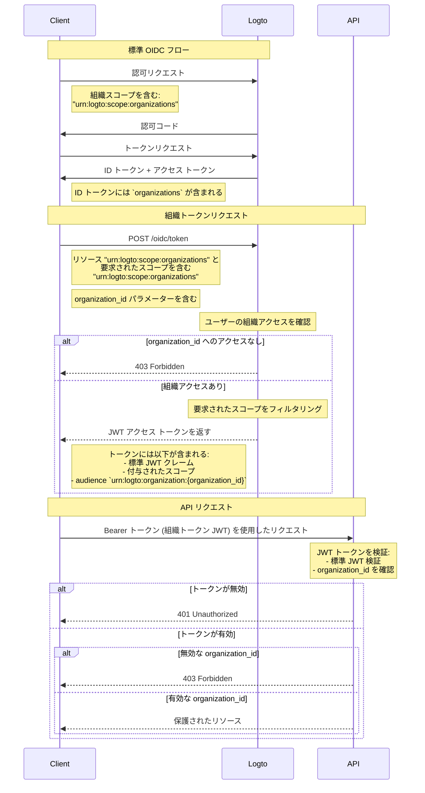

import TabItem from '@theme/TabItem';
import Tabs from '@theme/Tabs';

# 組織リソースを保護する

API をリソースとして扱う [API を保護する](/authorization/api-resources/protect-your-api) ことに加えて、組織もリソースとなり、同様の方法で組織リソースを保護できます。この記事では、組織リソースを同様の方法で保護する方法に焦点を当てます。



## ステップ 1: OIDC フローから組織 ID を取得する

Logto は標準の [OpenID Connect](https://openid.net/specs/openid-connect-core-1_0.html) プロトコルを拡張して、アプリがユーザーから組織情報を取得できるようにします。これを行う方法は 2 つあります：

- 組織サポートを備えた Logto SDK を使用している場合、`urn:logto:scope:organizations` スコープを構成オブジェクトの `scopes` パラメーターに追加できます。通常、SDK にはこのスコープの列挙型があり、例えば [Logto JS SDKs](https://github.com/logto-io/js) では `UserScope.Organizations` です。

<Tabs groupId="sdk">

  <TabItem value="js" label="JavaScript">

```ts
import { LogtoClient, UserScope } from '@logto/browser'; // または @logto/node, @logto/client

const logto = new LogtoClient({
  // ...
  scopes: [UserScope.Organizations],
});
```

  </TabItem>
  <TabItem value="react" label="React">

```tsx
import { LogtoProvider, UserScope } from '@logto/react';

const App = () => (
  <LogtoProvider
    config={{
      // ...
      scopes: [UserScope.Organizations],
    }}
  >
    {/* ... */}
  </LogtoProvider>
);
```

  </TabItem>
  <TabItem value="python" label="Python">

```python
from logto import UserInfoScope

client = LogtoClient(
    LogtoConfig(
        # ...
        scopes=[UserInfoScope.organizations],
    )
)
```

  </TabItem>
  <TabItem value="php" label="PHP">

```php
use Logto\Sdk\Constants\UserScope;

$client = new LogtoClient(
  new LogtoConfig(
    // ...
    scopes: [UserScope::organizations],
  )
);
```

  </TabItem>
  <TabItem value="swift" label="Swift">

```swift
import Logto
import LogtoClient

let config = try? LogtoConfig(
    // ...
    scopes: [
        UserScope.organizations.rawValue,
    ],
    // ...
)
let client = LogtoClient(useConfig: config)
```

  </TabItem>
  <TabItem value="others" label="その他">

```ts
const config = {
  // ...
  scope: 'openid offline_access urn:logto:scope:organizations',
};
```

  </TabItem>

</Tabs>
    
- その他の場合、`urn:logto:scope:organizations` スコープを SDK 設定（または認証リクエスト）の `scope` パラメーターに追加する必要があります。

ユーザーが認証フローを完了すると、`idToken` から組織情報を取得できます：

```tsx
// JavaScript を例として使用
const idToken = await logto.getIdTokenClaims();

console.log(idToken.organizations); // 組織 ID の文字列配列
```

`organizations` フィールド（クレーム）は、[UserInfo エンドポイント](https://openid.net/specs/openid-connect-core-1_0.html#UserInfo) からの応答にも含まれます。

### オプション: 組織ロールを取得する

まだ組織ロールを設定していない場合は、[このセクション](/authorization/organization-template/configure-organization-template/#create-organization-role) を参照してください。

現在のユーザーのすべての組織ロールを取得するには：

- 組織サポートを備えた Logto SDK を使用している場合、`urn:logto:scope:organization_roles` スコープを構成オブジェクトの `scopes` パラメーターに追加できます。通常、SDK にはこのスコープの列挙型があり、例えば [Logto JS SDKs](https://github.com/logto-io/js) では `UserScope.OrganizationRoles` です。
- その他の場合、`urn:logto:scope:organization_roles` スコープを SDK 設定（または認証リクエスト）の `scope` パラメーターに追加する必要があります。

その後、`idToken` から組織ロールを取得できます：

```tsx
// JavaScript を例として使用
const idToken = await logto.getIdTokenClaims();

console.log(idToken.organization_roles); // 組織ロールの文字列配列
```

配列内の各文字列は `organization_id:role_id` の形式で、例えば `org_123:admin` はユーザーが ID `org_123` の組織で `admin` ロールを持っていることを意味します。

`organization_roles` フィールド（クレーム）は、[UserInfo エンドポイント](https://openid.net/specs/openid-connect-core-1_0.html#UserInfo) からの応答にも含まれます。

## ステップ 2. 組織トークンを取得する

組織のコンテキストでアクションを実行するには、ユーザーはその組織のためのアクセス トークン（組織トークン）を付与される必要があります。組織トークンは、組織 ID と組織内のユーザーの権限（スコープ）を含む JWT トークンです。

### 認証リクエストにパラメーターを追加する

- 組織サポートを備えた Logto SDK を使用している場合、`urn:logto:scope:organizations` スコープを構成オブジェクトの `scopes` パラメーターに追加できます。[現在のユーザーの組織 ID を取得する](/authorization/organization-template/protect-organization-resources/#step-1-get-organization-ids-from-oidc-flow) の方法と同じです。
  - 組織サポートを備えた Logto SDK は、残りの設定を自動的に処理します。
- その他の場合、`offline_access` と `urn:logto:scope:organizations` スコープを `scope` パラメーターに追加し、`urn:logto:resource:organizations` リソースを SDK 設定（または認証リクエスト）の `resource` パラメーターに追加する必要があります。
  - 注意: `offline_access` は、組織トークンを取得するために使用できる `refresh_token` を取得するために必要です。

```tsx
// その他の場合のみ。Logto SDK の場合は上記を参照してください。
const config = {
  // ...
  scope: 'openid offline_access urn:logto:scope:organizations',
  resource: 'urn:logto:resource:organizations',
};
```

:::note

`urn:logto:resource:organizations` リソースは、組織テンプレートを表す特別なリソースです。

:::

### 組織トークンを取得する

Logto は標準の `refresh_token` グラントタイプを拡張して、アプリが組織トークンを取得できるようにします。

- 組織サポートを備えた Logto SDK を使用している場合、SDK の `getOrganizationToken()` メソッド（または `getOrganizationTokenClaims()` メソッド）を呼び出すことができます。
- その他の場合、次のパラメーターを使用してトークンエンドポイントを呼び出す必要があります：
  - `grant_type`: `refresh_token`。
  - `client_id`: ユーザーが認証に使用したアプリ ID。
  - `refresh_token`: 認証フローから取得した `refresh_token`。
  - `organization_id`: トークンを取得したい組織の ID。
  - `scope` (オプション): 組織内でユーザーに付与したいスコープ。指定しない場合、認可サーバーは認証フローと同じスコープを付与しようとします。

<Tabs groupId="sdk">

  <TabItem value="js" label="JavaScript">

```ts
const token = await logto.getOrganizationToken('<organization-id>');
```

  </TabItem>
  <TabItem value="react" label="React">

```tsx
const App = () => {
  const { getOrganizationToken } = useLogto();

  const getToken = async () => {
    const token = await getOrganizationToken('<organization-id>');
  };

  return <button onClick={getToken}>Get organization token</button>;
};
```

  </TabItem>
  <TabItem value="python" label="Python">

```python
token = await client.getOrganizationToken("<organization-id>")
# または
claims = await client.getOrganizationTokenClaims("<organization-id>")
```

  </TabItem>
  <TabItem value="php" label="PHP">

```php
$token = $client->getOrganizationToken('<organization-id>');
// または
$claims = $client->getOrganizationTokenClaims('<organization-id>');
```

  </TabItem>
  <TabItem value="swift" label="Swift">

```swift
let token = try await client.getOrganizationToken(forId: "<organization-id>")
```

  </TabItem>
  <TabItem value="others" label="その他">

```ts
// JavaScript を例として使用

const params = new URLSearchParams();

params.append('grant_type', 'refresh_token');
params.append('client_id', 'YOUR_CLIENT_ID');
params.append('refresh_token', 'REFRESH_TOKEN');
params.append('organization_id', 'org_123');

const response = await fetch('https://YOUR_LOGTO_ENDPOINT/oidc/token', {
  method: 'POST',
  headers: {
    'Content-Type': 'application/x-www-form-urlencoded',
  },
  body: params,
});
```

  </TabItem>

</Tabs>

応答は [標準トークンエンドポイント](https://openid.net/specs/openid-connect-core-1_0.html#TokenEndpoint) と同じ形式であり、`access_token` は JWT 形式の組織トークンです。

通常のアクセス トークンのクレームに加えて、組織トークンには次のクレームも含まれます：

- `aud`: 組織トークンのオーディエンスは `urn:logto:organization:{organization_id}` です。
- `scope`: 組織内でユーザーに付与されたスコープ。スペースで区切られます。

### 例

良い例は千の言葉に勝ることがあります。私たちの組織テンプレートが次の設定を持っていると仮定します：

- 権限: `read:logs`, `write:logs`, `read:users`, `write:users`。
- ロール: `admin`, `member`。
  - `admin` ロールはすべての権限を持っています。
  - `member` ロールは `read:logs` と `read:users` の権限を持っています。

そして、ユーザーは次の設定を持っています：

- 組織 ID: `org_1`, `org_2`。
- 組織ロール: `org_1:admin`, `org_2:member`。

Logto SDK 設定（または認証リクエスト）で、他の設定を適切に行い、次のスコープを追加しました：

- `urn:logto:scope:organizations`
- `openid`
- `offline_access`
- `read:logs`
- `write:logs`

これで、ユーザーが認証フローを完了すると、`idToken` から組織 ID を取得できます：

```tsx
// JavaScript を例として使用
const idToken = await logto.getIdTokenClaims();

console.log(idToken.organizations); // ['org_1', 'org_2']
```

組織トークンを取得したい場合：

```tsx
// JavaScript を例として使用
const org1Token = await logto.getOrganizationTokenClaims('org_1');
const org2Token = await logto.getOrganizationTokenClaims('org_2');

console.log(org1Token.aud); // 'urn:logto:organization:org_1'
console.log(org1Token.scope); // 'read:logs write:logs'
console.log(org2Token.aud); // 'urn:logto:organization:org_2'
console.log(org2Token.scope); // 'read:logs'

const org3Token = await logto.getOrganizationTokenClaims('org_3'); // エラー: ユーザーは組織のメンバーではありません
```

説明：

- `org_1` では、ユーザーは `admin` ロールを持っているため、組織トークンにはすべての利用可能な権限（スコープ）が含まれるべきです。
- `org_2` では、ユーザーは `member` ロールを持っているため、組織トークンには `read:logs` と `read:users` の権限（スコープ）が含まれるべきです。

認証フローで `read:logs` と `write:logs` スコープのみを要求したため、組織トークンは要求されたスコープと利用可能なスコープの交差に応じて「ダウンスコープ」されました。

### マシン間通信アプリケーションのための組織トークンを取得する

ユーザーのための組織トークンを取得するのと同様に、マシン間通信アプリケーションのための組織トークンも取得できます。唯一の違いは、`refresh_token` グラントタイプの代わりに `client_credentials` グラントタイプを使用する必要があることです。

マシン間通信アプリケーションについて詳しく知るには、[マシン間通信: Logto での認証](/quick-starts/m2m/) を参照してください。

## ステップ 3. 組織トークンを検証する

アプリが組織トークンを取得すると、通常のアクセス トークンと同様にトークンを使用できます。例えば、`Authorization` ヘッダーに `Bearer {token}` の形式でトークンを含めて API を呼び出します。

API で組織トークンを検証する方法は、[API を保護する](/authorization/api-resources/protect-your-api/#validate-authorization-tokens-for-api-requests) 方法と非常に似ています。主な違い：

- API リソースのアクセス トークンとは異なり、ユーザーが組織のメンバーでない場合、組織トークンを取得することはできません。
- 組織トークンのオーディエンスは `urn:logto:organization:{organization_id}` です。
- 特定の権限（スコープ）については、組織トークンの `scope` クレームをスペースで区切って確認する必要があります。
