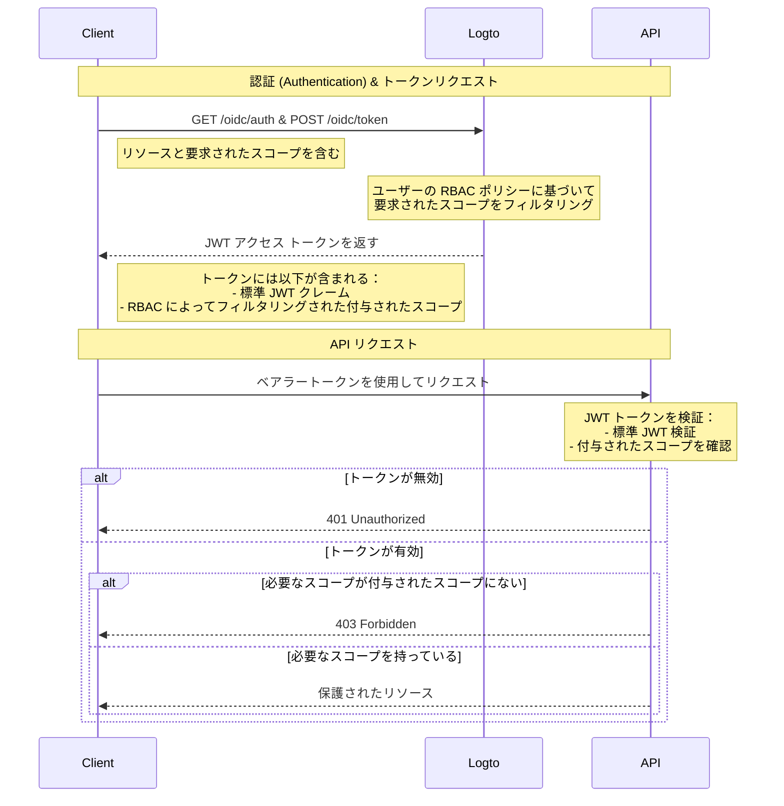

# RBAC で API リソースを保護する

有効な JWT が存在することを確認してリソースを保護する [API を保護する](/authorization/api-resources/protect-your-api) に加えて、ロールベースのアクセス制御 (RBAC) も適用できます。

この記事では、RBAC が認証 (Authentication) フローにおけるスコープの委任と検証にどのように影響するかに焦点を当てます。

## 認可 (Authorization) フローダイアグラム \{#authorization-flow-diagram}



この図からわかるように、基本的な API 保護との主な違いはスコープの処理です。要求されたすべてのスコープを直接付与する代わりに、Logto はユーザーの RBAC ポリシーに基づいてそれらをフィルタリングします。JWT トークンには、ユーザーがそのロールを通じて付与されたスコープのみが含まれます。API 側では、トークンの真正性を検証した後、要求されたリソースに必要なスコープがトークンに含まれていることを確認する追加のチェックがあります。

## オプション: ユーザー権限の変更を処理する \{#optional-handle-user-permission-change}

ユーザーの権限はセッション中に変更されることがあります。たとえば、新しいロールが割り当てられたり、既存のロールの権限が変更されたりすることがあります。これらの変更を検出し、アプリケーションの UI を更新する必要がある場合があります。

ユーザーの権限が変更された場合、何が起こるでしょうか？2 つのケースがあります。

### システムに新しい権限が導入されない場合 \{#no-new-permissions-introduced-into-the-system}

ユーザーの権限が変更された後でも、現在のアクセス トークンは有効期限が切れるまで有効です。ただし、新しい権限は後続のアクセス トークンに反映され、取り消された権限は省略されます。

ここにいくつかの **推奨アクション** があります：

**オプション 1: 短いアクセス トークンの有効期限を使用する**

短命のアクセス トークンは、ユーザー権限のより頻繁な更新を保証します。Console の [API リソース](/authorization/api-resources/#logto-api-resource-schema) 設定でトークンの有効期限設定を構成します。欠点は、トークンの使用量が増えることです。

**オプション 2: 動的に権限を確認する**

[Logto Management API](/integrate-logto/interact-with-management-api) エンドポイントを定期的に呼び出す（例：SWR）か、WebSocket などの技術を使用して長期間の接続を実装し、動的にユーザー権限を取得します。変更を検出した場合、既存のアクセス トークンをクリアし、新しく発行されたトークンには自動的に権限スコープの変更が反映されます。- API: ユーザー-ロール - API: ロール-権限

    権限の変更が検出された場合、まずストレージからアクセス トークンをクリアし、次に SDK メソッド `getAccessToken()` を呼び出して新しいトークンを取得します。新しく発行されたアクセス トークンには権限の変更が反映されるはずです。

### システムに新しい権限が導入され、ユーザーに割り当てられる場合 \{#new-permission-is-introduced-into-the-system-and-assigned-to-a-user}

これは、システムに新しい権限が導入された場合に発生します。この場合、まず Logto クライアントを初期化する際に新しく導入された権限スコープを含める必要があります。例：

```tsx
new LogtoClient({
  appId: 'your-app-id',
  endpoint: 'your-logto-endpoint',
  resources: ['your-api-resource'],
  scopes: [
    // ... 既存の権限スコープ,
    'new-scope',
  ],
});
```

次に、各クライアントアプリケーションは、新しい権限の変更を受け取るためにユーザーの再同意または再ログインが必要です。すると、新しい権限スコープが新しいアクセス トークンに反映されます。

再同意のコード例：

```tsx
signIn({ redirectUri: 'your-redirect-url', prompt: 'consent' });
```

## 関連リソース \{#related-resources}

<Url href="https://blog.logto.io/logto-x-cloudflare-workers">
  Logto x Cloudflare Workers: パブリックアクセスからワーカーを保護する方法
</Url>

<Url href="https://blog.logto.io/secure-api-for-machine-to-machine">
  マシン間通信のために API リソースを保護する
</Url>
