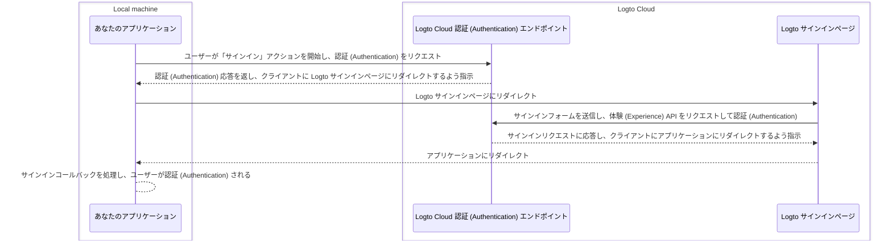
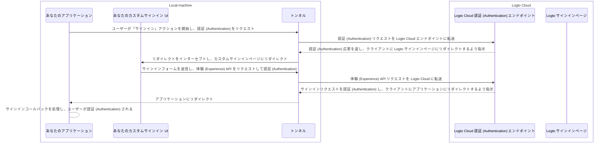

import TabItem from '@theme/TabItem';
import Tabs from '@theme/Tabs';

# カスタム UI をローカルでデバッグおよびテストする

Logto Cloud ユーザー向けに、Logto に「独自の UI を持ち込む」ことを簡単にしました。Cloud ユーザーは、<CloudLink to="/sign-in-experience/branding">Console > Sign-in experience > Branding > Bring your UI</CloudLink> でカスタム UI アセットを含む zip ファイルをアップロードできます（詳細は [Bring your UI](/customization/bring-your-ui) ページを参照してください）。

しかし、このようなカスタム UI ページを開発する際、ユーザーは Logto Cloud にアップロードする前にコードをローカルでテストおよびデバッグしたいと考えます。この CLI コマンドは、ローカルトンネルを設定し、次の 3 つのエンティティを接続するのに役立ちます：Logto Cloud 認証 (Authentication) エンドポイント、アプリケーション、およびカスタムサインイン UI。

## なぜこれが必要なのか？

デフォルトでは、アプリケーションで「サインイン」ボタンをクリックすると、Logto エンドポイントで設定されたサインインページに移動します。成功したサインインフローは次のように示されます：



しかし、現在は独自のカスタムサインイン UI を開発しているため、代わりにローカルマシンで実行されているカスタムサインイン UI ページに移動する方法が必要です。これには、アプリケーションからの送信リクエストをインターセプトし、カスタムサインイン UI ページにリダイレクトするためのローカルトンネルサービスが必要です。

さらに、ユーザーを認証 (Authentication) し、セッションを管理するために [Logto の体験 (Experience) API](https://openapi.logto.io/group/endpoint-experience) と対話する必要があります。このサービスは、CORS の問題を回避するために、これらの体験 (Experience) API リクエストを Logto Cloud に転送するのにも役立ちます。

以下のシーケンス図は、カスタム UI とトンネルサービスを使用した成功した「サインイン」フローの動作を示しています：



トンネルサービスを使用することで、カスタムサインイン UI をローカルで開発およびテストでき、変更を加えるたびに Logto Cloud にアセットをアップロードする必要がなくなります。

## 手順

### ステップ 1: コマンドを実行する

Cloud テナント ID が `foobar` で、ローカル開発サーバーで `http://localhost:4000` で実行されているカスタムサインインページがあると仮定すると、次のようにコマンドを実行できます：

<Tabs groupId="cmd">

  <TabItem value="cli" label="CLI">

```bash
logto-tunnel -p 9000 --experience-uri http://localhost:4000/ --endpoint https://foobar.logto.app/
```

  </TabItem>
  <TabItem value="npx" label="npx">

```bash
npx @logto/tunnel -p 9000 --experience-uri http://localhost:4000/ --endpoint https://foobar.logto.app/
```

  </TabItem>

</Tabs>

Logto でカスタムドメインが設定されている場合も動作します：

<Tabs groupId="cmd">

  <TabItem value="cli" label="CLI">

```bash
logto-tunnel -p 9000 --experience-uri http://localhost:4000/ --endpoint https://your.custom.domain/
```

  </TabItem>
  <TabItem value="npx" label="npx">

```bash
npx @logto/tunnel -p 9000 --experience-uri http://localhost:4000/ --endpoint https://your.custom.domain/
```

  </TabItem>

</Tabs>

また、コマンドは静的 HTML アセットをサポートしており、最初に開発サーバーで実行する必要はありません。指定したパスに `index.html` があることを確認してください。

<Tabs groupId="cmd">

  <TabItem value="cli" label="CLI">

```bash
logto-tunnel -p 9000 --experience-path /path/to/your/static/files --endpoint https://foobar.logto.app/
```

  </TabItem>
  <TabItem value="npx" label="npx">

```bash
npx @logto/tunnel -p 9000 --experience-path /path/to/your/static/files --endpoint https://foobar.logto.app/
```

  </TabItem>

</Tabs>

### ステップ 2: アプリケーションのエンドポイント URI を更新する

最後に、アプリケーションを実行し、その Logto エンドポイントをトンネルサービスアドレス `http://localhost:9000/` に設定します。

React アプリケーションを例にとってみましょう：

```tsx title=App.tsx
import { LogtoProvider, LogtoConfig } from '@logto/react';

const config: LogtoConfig = {
  // endpoint: 'https://foobar.logto.app/', // 元の Logto Cloud エンドポイント
  endpoint: 'http://localhost:9000/', // トンネルサービスアドレス
  appId: '<your-application-id>',
};

const App = () => (
  <LogtoProvider config={config}>
    <YourAppContent />
  </LogtoProvider>
);
```

ソーシャルサインインを使用している場合は、ソーシャルプロバイダー設定のリダイレクト URI もトンネルサービスアドレスに更新する必要があります。

```
http://localhost:9000/callback/<connector-id>
```

すべて正しく設定されていれば、アプリケーションで「サインイン」ボタンをクリックすると、Logto の組み込み UI ではなく、カスタムサインインページに移動し、Logto Experience API とさらに対話できる有効なセッション（クッキー）を取得できます。

コーディングを楽しんでください！

## 関連リソース

<Url href="https://blog.logto.io/automate-custom-sign-in-ui-deployment-with-github-actions">
  GitHub Actions ワークフローでカスタムサインイン UI のデプロイを自動化する
</Url>
