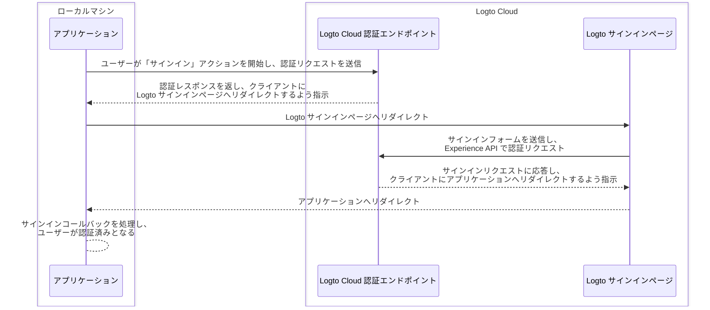
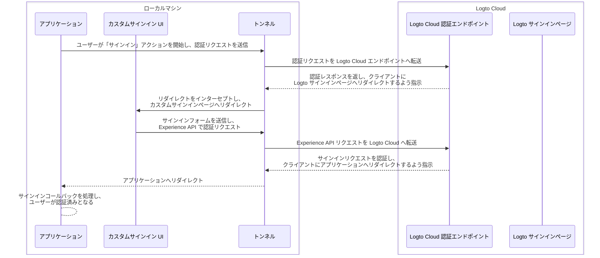

import TabItem from '@theme/TabItem';
import Tabs from '@theme/Tabs';

# カスタム UI をローカルでデバッグ・テストする

Logto Cloud ユーザー向けに、「独自の UI を持ち込む」機能を簡単に利用できるようにしました。Cloud ユーザーは、カスタム UI アセットを含む zip ファイルを <CloudLink to="/sign-in-experience/branding">コンソール > サインイン & アカウント > ブランディング > 独自の UI を持ち込む</CloudLink> からアップロードできます（詳細は [独自の UI を持ち込む](/customization/bring-your-ui) ページをご覧ください）。

しかし、このようなカスタム UI ページを開発する際には、Logto Cloud へアップロードする前に、ローカルでコードをテスト・デバッグしたい場合があります。この CLI コマンドは、ローカルトンネルをセットアップし、次の 3 つのエンティティを接続するのに役立ちます：
Logto Cloud 認証エンドポイント、アプリケーション、カスタムサインイン UI です。

## なぜこれが必要なのか？ \{#why-do-i-need-this}

デフォルトでは、アプリケーションで「サインイン」ボタンをクリックすると、Logto エンドポイントで設定されたサインインページに遷移します。正常なサインインフローは次のように表現できます：


```mermaid
sequenceDiagram
    box ローカルマシン
    participant A as アプリケーション
    end
    box Logto Cloud
    participant B as Logto Cloud 認証エンドポイント
    participant C as Logto サインインページ
    end
    A ->> B: ユーザーが「サインイン」アクションを開始し、認証リクエストを送信
    B -->> A: 認証レスポンスを返し、クライアントに<br/>Logto サインインページへリダイレクトするよう指示
    A ->> C: Logto サインインページへリダイレクト
    C ->> B: サインインフォームを送信し、<br/>Experience API で認証リクエスト
    B -->> C: サインインリクエストに応答し、<br/>クライアントにアプリケーションへリダイレクトするよう指示
    C -->> A: アプリケーションへリダイレクト
    A --> A: サインインコールバックを処理し、<br/>ユーザーが認証済みとなる
```

しかし、独自のカスタムサインイン UI を開発している場合は、ローカルマシン上で動作しているカスタムサインイン UI ページへ遷移させる必要があります。
これには、アプリケーションからのリクエストをインターセプトし、カスタムサインイン UI ページへリダイレクトするローカルトンネルサービスが必要です。

さらに、ユーザー認証やセッション管理のために [Logto の Experience API](https://openapi.logto.io/group/endpoint-experience) とやり取りする必要があります。
このサービスは、CORS 問題を回避するために、Experience API リクエストを Logto Cloud へ転送する役割も果たします。

下記のシーケンス図は、カスタム UI とトンネルサービスを利用した場合の正常な「サインイン」フローを示しています：


```mermaid
sequenceDiagram
    box ローカルマシン
    participant A as アプリケーション
    participant B as カスタムサインイン UI
    participant C as トンネル
    end
    box Logto Cloud
    participant D as Logto Cloud 認証エンドポイント
    participant E as Logto サインインページ
    end
    A ->> C: ユーザーが「サインイン」アクションを開始し、認証リクエストを送信
    C ->> D: 認証リクエストを Logto Cloud エンドポイントへ転送
    D -->> C: 認証レスポンスを返し、クライアントに<br/>Logto サインインページへリダイレクトするよう指示
    C ->> B: リダイレクトをインターセプトし、<br/>カスタムサインインページへリダイレクト
    B ->> C: サインインフォームを送信し、<br/>Experience API で認証リクエスト
    C ->> D: Experience API リクエストを Logto Cloud へ転送
    D -->> C: サインインリクエストを認証し、<br/>クライアントにアプリケーションへリダイレクトするよう指示
    C -->> A: アプリケーションへリダイレクト
    A --> A: サインインコールバックを処理し、<br/>ユーザーが認証済みとなる
```

このトンネルサービスを利用することで、アセットを毎回 Logto Cloud へアップロードすることなく、ローカルでカスタムサインイン UI を開発・テストできます。

## 手順 \{#instructions}

### ステップ 1: コマンドを実行する \{#step-1-execute-the-command}

Cloud テナント ID が `foobar` で、ローカル開発サーバーでカスタムサインインページが `http://localhost:4000` で動作している場合、次のようにコマンドを実行できます：

<Tabs groupId="cmd">

  <TabItem value="cli" label="CLI">

```bash
logto-tunnel -p 9000 --experience-uri http://localhost:4000/ --endpoint https://foobar.logto.app/
```

  </TabItem>
  <TabItem value="npx" label="npx">

```bash
npx @logto/tunnel -p 9000 --experience-uri http://localhost:4000/ --endpoint https://foobar.logto.app/
```

  </TabItem>

</Tabs>

Logto でカスタムドメインを設定している場合も同様に動作します：

<Tabs groupId="cmd">

  <TabItem value="cli" label="CLI">

```bash
logto-tunnel -p 9000 --experience-uri http://localhost:4000/ --endpoint https://your.custom.domain/
```

  </TabItem>
  <TabItem value="npx" label="npx">

```bash
npx @logto/tunnel -p 9000 --experience-uri http://localhost:4000/ --endpoint https://your.custom.domain/
```

  </TabItem>

</Tabs>

また、開発サーバーで実行せずに静的 html アセットにも対応しています。指定したパスに `index.html` が存在することを確認してください。

<Tabs groupId="cmd">

  <TabItem value="cli" label="CLI">

```bash
logto-tunnel -p 9000 --experience-path /path/to/your/static/files --endpoint https://foobar.logto.app/
```

  </TabItem>
  <TabItem value="npx" label="npx">

```bash
npx @logto/tunnel -p 9000 --experience-path /path/to/your/static/files --endpoint https://foobar.logto.app/
```

  </TabItem>

</Tabs>

### ステップ 2: アプリケーションのエンドポイント URI を更新する \{#step-2-update-endpoint-uri-in-your-application}

最後に、アプリケーションを起動し、Logto エンドポイントをトンネルサービスのアドレス `http://localhost:9000/` に設定します。

React アプリケーションの例を示します：

```tsx title=App.tsx
import { LogtoProvider, LogtoConfig } from '@logto/react';

const config: LogtoConfig = {
  // endpoint: 'https://foobar.logto.app/', // 元の Logto Cloud エンドポイント
  endpoint: 'http://localhost:9000/', // トンネルサービスのアドレス
  appId: '<your-application-id>',
};

const App = () => (
  <LogtoProvider config={config}>
    <YourAppContent />
  </LogtoProvider>
);
```

ソーシャルサインインを利用している場合は、ソーシャルプロバイダーの設定でリダイレクト URI もトンネルサービスのアドレスに更新する必要があります。

```
http://localhost:9000/callback/<connector-id>
```

すべて正しく設定されていれば、アプリケーションで「サインイン」ボタンをクリックした際、Logto の組み込み UI ではなくカスタムサインインページに遷移し、Logto Experience API とやり取りできる有効なセッション（クッキー）も利用できます。

開発をお楽しみください！

## 関連リソース \{#related-resources}

<Url href="https://blog.logto.io/automate-custom-sign-in-ui-deployment-with-github-actions">
  GitHub Actions ワークフローでカスタムサインイン UI のデプロイを自動化する
</Url>
