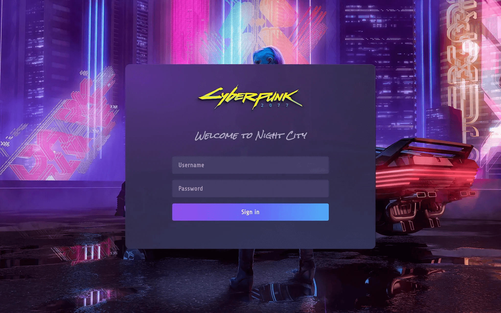

# カスタム CSS

[UI の微調整](/customization/match-your-brand) がブランドに完全に一致しない場合は、カスタム CSS を使用してサインイン体験を調整できます。エディターに CSS コードを追加するだけで、すぐに変更を確認できます。

## Logto コンソールでのカスタム CSS \{#custom-css-in-logto-console}

{/* eslint-disable-next-line prettier/prettier */}
1. <CloudLink to="/sign-in-experience/branding">Console > Sign-in experience > Branding > Custom CSS</CloudLink> に移動します。
2. 左側のエディターで CSS コードを編集すると、右側のプレビューモーダルに即座に反映されます。注意：コードエディターは現在、CSS コードのみをサポートしています。HTML や Javascript はサポートしていません。
3. 変更を保存します。
4. すべてのページでの変更を確認するために、「[ライブプレビュー](/customization/live-preview)」ボタンをクリックするのを忘れないでください。

Logto のコンポーネント化されたインターフェースデザインを表示するには、GitHub の [Logto/packages/experience/src](https://github.com/logto-io/logto/tree/master/packages/experience/src) に移動するか、Logto ライブプレビューページでブラウザの「要素を検査」ツールを開くことができます。

## 例 \{#examples}

例えば、Web ビューでサインインページに _Night City_ の雰囲気を与えたい場合は、次の CSS を試してみてください：

```css
@font-face {
  font-family: 'Rock Salt';
  font-style: normal;
  font-weight: normal;
  font-display: swap;
  src: url('https://fonts.gstatic.com/s/rocksalt/v18/MwQ0bhv11fWD6QsAVOZrt0M6p7NGrQ.woff2')
    format('woff2');
  unicode-range: U+0000-00FF, U+0131, U+0152-0153, U+02BB-02BC, U+02C6, U+02DA, U+02DC, U+2000-206F,
    U+2074, U+20AC, U+2122, U+2191, U+2193, U+2212, U+2215, U+FEFF, U+FFFD;
}
@font-face {
  font-family: 'Share Tech';
  font-style: normal;
  font-weight: normal;
  font-display: swap;
  src: url('https://fonts.gstatic.com/s/sharetech/v17/7cHtv4Uyi5K0OeZ7bohU8H0JmBUhfrE.woff2')
    format('woff2');
  unicode-range: U+0000-00FF, U+0131, U+0152-0153, U+02BB-02BC, U+02C6, U+02DA, U+02DC, U+2000-206F,
    U+2074, U+20AC, U+2122, U+2191, U+2193, U+2212, U+2215, U+FEFF, U+FFFD;
}

#app * {
  font-family: 'Share Tech';
  letter-spacing: 0.5px;
  --color-type-primary: #ffffff;
  --color-type-secondary: #c9c5d0;
}

#app > div[class$='viewBox'] {
  background-image: url('https://silverhand.io/assets/v-in-nc.jpg');
  background-size: cover;
}

#app main[class*='main'] {
  background-image: url('https://logtoeu.blob.core.windows.net/public-blobs/g3cp4y/m-g3cp4y/2024/01/02/w9j0x57g/gentle-universe.png');
  background-size: cover;
  opacity: 97%;
  min-height: initial;
  padding: 24px;
  padding-bottom: 72px;
  border-radius: 12px;
}

#app main[class*='main'] img[class*='logo'] {
  content: url('https://silverhand.io/assets/cyberpunk-2077.png');
  margin: -20px 0 -12px;
  height: 160px;
}

#app form div[class*='inputField'] > div {
  outline: none;
  border: none;
  border-radius: 4px;
}

#app form div[class*='inputField'] input,
#app form div[class*='inputField'] div[class$='countryCodeSelector'] {
  background: initial;
  background-color: #564f7c;
  font-family: 'Share Tech';
  letter-spacing: 0.5px;
  font-size: 16px;
  font-weight: 600;
}

#app form div[class*='inputField'] > div > input::placeholder,
#app main[class*='main'] > div[class*='wrapper'] > div[class*='divider'],
#app main[class*='main'] > div[class*='wrapper'] > form div[class*='content'],
#app main[class*='main'] > div[class*='wrapper'] > form div[class*='content'] > span {
  color: #a7a5b3;
}

#app main[class*='main'] > div[class*='wrapper'] > div[class*='divider'] > i[class*='line'],
#app
  main[class*='main']
  > div[class*='wrapper']
  > div[class*='terms']
  > i[class*='divider']::after {
  background: rgba(247, 248, 248, 14%);
}

#app button {
  font-weight: 600;
  font-size: 16px;
  border-radius: 4px;
}

#app button[type='submit'] {
  background: linear-gradient(270.84deg, #2fd6fb -24.55%, #6369fc 44.33%, #a741eb 119.2%), #5d34f2;
}

#app div[class*='socialLinkList'] *,
#app div[class*='main'] * {
  font-family: 'Share Tech';
}

#app main[class*='main'] > div[class*='wrapper'] > div[class*='createAccount'] {
  font-family: 'Share Tech';
  color: #ffffff;
}

#app div[class*='socialLinkList'] > button {
  border: none;
  background-color: #645995;
}
```



:::note

Logto は CSS モジュールを使用しているため、DOM 要素の `class` プロパティにハッシュ値が表示されることがあります（例：`vUugRG_container` を持つ `<div>`）。これを上書きするには、`$=` CSS セレクターを使用して、指定された値で終わる要素を一致させることができます。この場合、`div[class$=container]` である必要があります。

:::

## Management API によるカスタム CSS \{#custom-css-by-management-api}

[Management API](https://openapi.logto.io/operation/operation-uploadcustomuiassets) `PATCH /api/sign-in-exp` を使用して、サインイン体験のカスタム CSS を設定することもできます。ボディに `{ "customCss": "任意の文字列" }` を指定します。ページの `<title>` の後に `customCss` の値が添付されているのが確認できます。スタイルに優先順位が高い場合、それを上書きできるはずです。
