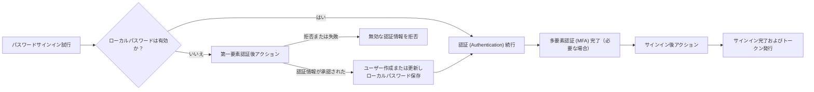

# アクション (Actions)

Logto アクション (Actions) を使うと、認証 (Authentication) フローの特定のタイミングで信頼された JavaScript を実行できます。アクションは同期的に実行され、認証リクエストはスクリプトの完了を待ち、スクリプトの結果によってユーザーの更新やフローの継続可否が決まります。

アクション (Actions) は、認証 (Authentication) フロー内で判断を行う必要がある場合に便利です。よくあるユースケースは以下の通りです：

- 初回サインイン時にレガシーアイデンティティシステムからユーザーやパスワードを移行する。
- Logto がサインインを完了する前に、ユーザープロファイルやアプリケーション固有データを更新する。
- 外部サービスを呼び出し、その結果を Logto ユーザーに適用する。

:::note
アクション (Actions) は Logto Cloud Enterprise プランで利用できます。
:::

:::warning
アクションスクリプトは認証 (Authentication) に影響を与え、ユーザーデータを変更できます。信頼できる管理者のみが閲覧、作成、編集、テスト、有効化、削除できるようにしてください。

セルフホスト環境では、アクションスクリプトは Logto サーバープロセス内でその権限のもと実行されます。スクリプトの編集やテスト権限を与えることは、Logto ホスト上でのコード実行権限を与えるのと同等です。そのため、管理コンソールは信頼できないユーザーと共有しないでください。スクリプトは信頼されたサーバーサイドコードとして扱ってください。ランタイムはスクリプトの実行時間とメモリを制限しますが、信頼できないコードに対するセキュリティ境界にはなりません。
:::

## サインインフローにおけるアクション (Actions) の位置付け \{#how-actions-fit-into-sign-in}

Logto では現在、2 種類のアクション (Actions) タイプを提供しています：



| アクションタイプ                                                               | 実行タイミング                                                                                                                 | できること                                                                                                                          |
| ------------------------------------------------------------------------------ | ------------------------------------------------------------------------------------------------------------------------------ | ----------------------------------------------------------------------------------------------------------------------------------- |
| [第一要素認証後アクション](/developers/actions/post-first-factor-verification) | パスワードサインイン時、Logto のローカルパスワード認証が失敗した場合のみ実行。ローカルパスワードが有効な場合は実行されません。 | 提出された認証情報をレガシーシステムで検証し、新規 Logto ユーザーの作成や既存ユーザーの更新、パスワードの移行を行うことができます。 |
| [サインイン後アクション](/developers/actions/post-sign-in)                     | ユーザーがすべての認証要素（MFA を含む）を完了した後、Logto がサインインを完了しトークンを発行する前に実行されます。           | 最終的なサインインコンテキストを使って既存の Logto ユーザーを更新・拡充できます。                                                   |

どちらのアクションタイプも Experience API の `SignIn` インタラクションでのみ実行されます。第一要素認証後アクションはパスワードサインイン時のみ適用され、サインイン後アクションは認証方法に依存しません。

## スクリプトモデル \{#script-model}

各アクションタイプには 1 つの設定と、`runAction` という名前の JavaScript エントリ関数があります：

```js
const runAction = async ({ event, environmentVariables = {} }) => {
  // event を確認し、必要に応じて外部データを取得し、
  // このアクションタイプでサポートされる結果を返します。
};
```

ペイロードには以下が含まれます：

- `event`: 本番環境の認証 (Authentication) イベント。内容はアクションタイプによって異なります。
- `environmentVariables`: このアクション用に設定された文字列値。これらの値は関数ペイロード経由で渡され、`process.env` からは利用できません。

エディタは型情報を提供しますが、保存されたスクリプトは JavaScript として実行されます。スクリプトは非同期であり、Logto Cloud とセルフホスト Logto の両方で以下の標準 Web API を利用できます：

- `fetch`, `Request`, `Response`, `Headers`
- `crypto` および `crypto.subtle` による Web Crypto
- `TextEncoder`, `TextDecoder`
- `URL`, `URLSearchParams`

スクリプトはパッケージのインポートはできません。Node.js 固有のグローバルやモジュールは、セルフホスト Logto と Logto Cloud 間で移植性がなく、サポート対象外のため使用しないでください。

サポートされる戻り値はアクションタイプごとに異なります。アクション有効化前に該当するリファレンスページを参照してください。

## アクション (Actions) と Webhook の違い \{#actions-and-webhooks}

アクション (Actions) と [Webhook](/developers/webhooks) は目的が異なります：

|                                | アクション (Actions)                           | Webhook                                                    |
| ------------------------------ | ---------------------------------------------- | ---------------------------------------------------------- |
| 実行タイミング                 | 認証 (Authentication) と同期的かつインライン   | 認証リクエスト外で非同期的に実行                           |
| 現在の認証フローに影響できるか | 可能                                           | 不可                                                       |
| 結果からユーザーを変更できるか | サポートされるユーザーパッチで可能             | 直接は不可。受信側が Management API を別途呼び出す必要あり |
| イベントカバレッジ             | 特定の認証 (Authentication) ポイント           | 幅広いインタラクションやデータ変更イベント                 |
| 主な用途                       | 認証情報移行、トークン発行前のプロファイル拡充 | 通知、下流同期、分析など                                   |

非同期処理は Webhook で行ってください。認証 (Authentication) 継続前に Logto が結果を必要とする場合のみアクション (Actions) を使用してください。

## 次のステップ \{#next-steps}

- [アクション (Actions) の設定とテスト](/developers/actions/configure-and-test-actions)
- [パスワードサインイン時のユーザー移行](/developers/actions/post-first-factor-verification)
- [サインイン後のユーザー拡充](/developers/actions/post-sign-in)
