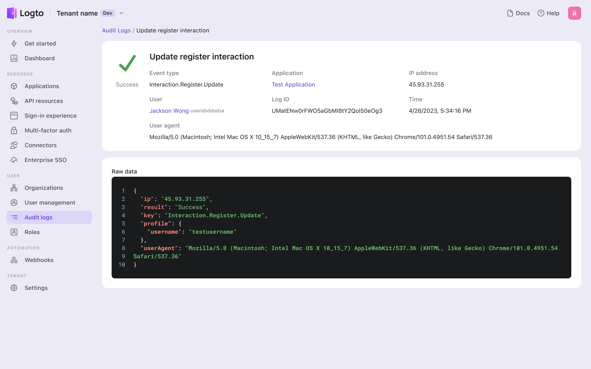

# 監査ログ

Logto の監査ログを使用すると、ユーザーのアクティビティやイベントを簡単に監視できます。これは、さまざまなユーザー管理やヘルスチェックのビジネスシナリオに強力な基盤を提供します。

## すべてのログを表示する \{#view-all-logs}

<CloudLink to="/audit-logs">Console > 監査ログ</CloudLink> に移動します。Logto は認証
(Authentication)
イベントをキャプチャしてテーブルに整理します。イベント名、ユーザー、アプリケーション、タイムスタンプを追跡します。イベント名やアプリケーション名でフィルタリングして結果を絞り込むことができます。特定のイベントをクリックすると、追加の詳細が表示されます。

:::warning
監査ログには、ユーザー認証 (Authentication) プロセス中に発生するログのみが含まれ、Management API 操作のログは記録されません。
:::

## テナントレベルでのユーザーアクティビティのキャプチャ \{#capture-user-activity-at-the-tenant-level}

Logto のログは包括的な詳細を提供し、アクションの容易さと顧客の安全性を確保します。次の情報をキャプチャして記録します：

- イベントの種類（監査ログイベントの完全なリストは [こちら](https://github.com/logto-io/logto/blob/master/packages/console/src/consts/logs.ts) で確認できます）
- 関与するアプリケーション
- IP アドレス
- 関与するユーザー
- ログ ID
- タイムスタンプ
- ユーザーエージェント

これらのイベント記録を維持することで、組織は潜在的なセキュリティリスクを効果的に検出し、システムへの不正アクセスを防ぐために迅速に対処できます。

## ユーザーレベルでの詳細な分析の実行 \{#perform-a-detailed-analysis-at-the-user-level}

管理者は、特定のユーザーに関連するログの詳細な分析を行うことができ、特定のイベントに関する包括的な調査を容易にします。ナビゲーションプロセスは簡単でユーザーフレンドリーです。

ユーザー固有のログにアクセスするには、次の手順に従います：

1. <CloudLink to="/users">Console > ユーザー管理</CloudLink> に移動します。
2. 希望するユーザーを選択し、詳細ページに移動します。
3. 「ユーザーログ」をクリックします。結果のテーブルには、その特定のユーザーによって実行およびトリガーされたログイベントのみが表示されます。

## よくある質問 \{#faqs}

### 自己ホスト型 Logto を使用しており、監査ログを取得するのに数秒かかります。パフォーマンスを改善するにはどうすればよいですか？ \{#im-using-self-hosted-logto-and-it-takes-seconds-to-get-the-audit-logs-how-can-i-improve-the-performance}

OSS ユーザーは、古い監査ログを定期的にクリーンアップするために cronjob を追加する必要があります。

