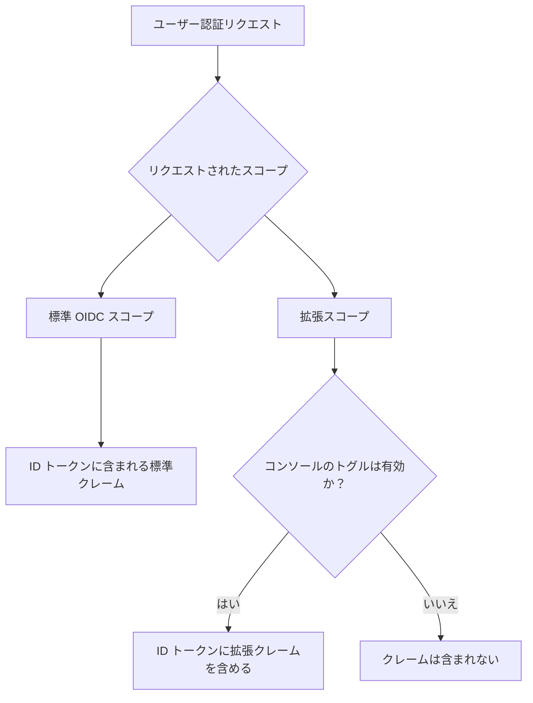

# カスタム ID トークン

## はじめに \{#introduction}

[ID トークン (ID token)](https://auth.wiki/id-token) は、[OpenID Connect (OIDC)](https://auth.wiki/openid-connect) プロトコルによって定義された特別な種類のトークンです。これは、ユーザーが正常に認証 (Authentication) された後、認可 (Authorization) サーバー（Logto）によって発行されるアイデンティティの証明であり、認証 (Authentication) されたユーザーのアイデンティティに関するクレーム (Claims) を含みます。

[アクセス トークン (Access token)](/developers/custom-token-claims) が保護されたリソースへのアクセスに使用されるのとは異なり、ID トークンは認証 (Authentication) されたユーザーのアイデンティティをクライアントアプリケーションに伝えるために特化して設計されています。これらは [JSON Web Token (JWT)](https://auth.wiki/jwt) であり、認証 (Authentication) イベントおよび認証 (Authentication) されたユーザーに関するクレーム (Claims) を含みます。

## ID トークンのクレーム (Claims) の仕組み \{#how-id-token-claims-work}

Logto では、ID トークンのクレーム (Claims) は 2 つのカテゴリに分かれています：

1. **標準 OIDC クレーム (Claims)**：OIDC 仕様で定義されており、これらのクレーム (Claims) は認証 (Authentication) 時にリクエストされたスコープ (Scope) によって完全に決定されます。
2. **拡張クレーム (Claims)**：Logto によって拡張され、追加のアイデンティティ情報を運ぶクレーム (Claims) であり、**二重条件モデル**（スコープ (Scope) + トグル）によって制御されます。

## 標準 OIDC クレーム (Claims) \{#standard-oidc-claims}

標準クレーム (Claims) は OIDC 仕様によって完全に管理されています。ID トークンに含まれるかどうかは、認証 (Authentication) 時にアプリケーションがリクエストするスコープ (Scope) のみに依存します。Logto では、個々の標準クレーム (Claims) を無効化したり選択的に除外したりするオプションは提供していません。

以下の表は、標準スコープ (Scope) とそれに対応するクレーム (Claims) のマッピングを示しています：

| Scope     | Claims                                                                                                                                                                           |
| --------- | -------------------------------------------------------------------------------------------------------------------------------------------------------------------------------- |
| `openid`  | `sub`                                                                                                                                                                            |
| `profile` | `name`, `family_name`, `given_name`, `middle_name`, `nickname`, `preferred_username`, `profile`, `picture`, `website`, `gender`, `birthdate`, `zoneinfo`, `locale`, `updated_at` |
| `email`   | `email`, `email_verified`                                                                                                                                                        |
| `phone`   | `phone_number`, `phone_number_verified`                                                                                                                                          |
| `address` | `address`                                                                                                                                                                        |

例えば、アプリケーションが `openid profile email` スコープ (Scope) をリクエストした場合、ID トークンには `openid`、`profile`、`email` スコープ (Scope) のすべてのクレーム (Claims) が含まれます。

## 拡張クレーム (Claims) \{#extended-claims}

標準 OIDC クレーム (Claims) に加えて、Logto は Logto エコシステム固有のアイデンティティ情報を運ぶ追加のクレーム (Claims) を拡張しています。これらの拡張クレーム (Claims) は、ID トークンに含めるために **二重条件モデル** に従います：

1. **スコープ (Scope) 条件**：アプリケーションが認証 (Authentication) 時に対応するスコープ (Scope) をリクエストする必要があります。
2. **コンソールのトグル**：管理者が Logto コンソールでそのクレーム (Claims) を ID トークンに含める設定を有効にする必要があります。

両方の条件が同時に満たされる必要があります。スコープ (Scope) はプロトコル層でのアクセス宣言、トグルはプロダクト層での公開制御として機能し、それぞれの役割は明確で代替できません。

### 利用可能な拡張スコープ (Scope) とクレーム (Claims) \{#available-extended-scopes-and-claims}

| Scope                                | Claims                         | 説明                                                    | デフォルトで含まれる |
| ------------------------------------ | ------------------------------ | ------------------------------------------------------- | -------------------- |
| `custom_data`                        | `custom_data`                  | ユーザーオブジェクトに保存されたカスタムデータ          |                      |
| `identities`                         | `identities`, `sso_identities` | ユーザーの連携済みソーシャルおよび SSO アイデンティティ |                      |
| `roles`                              | `roles`                        | ユーザーに割り当てられたロール (Role)                   | ✅                   |
| `urn:logto:scope:organizations`      | `organizations`                | ユーザーの組織 (Organization) ID                        | ✅                   |
| `urn:logto:scope:organizations`      | `organization_data`            | ユーザーの組織 (Organization) データ                    |                      |
| `urn:logto:scope:organization_roles` | `organization_roles`           | ユーザーの組織 (Organization) ロール (Role) 割り当て    | ✅                   |

### Logto コンソールでの設定方法 \{#configure-in-logto-console}

ID トークンに拡張クレーム (Claims) を有効にするには：

1. <CloudLink to="/customize-jwt">コンソール > カスタム JWT</CloudLink>
   に移動します。
2. ID トークンに含めたいクレーム (Claims) のトグルをオンにします。
3. アプリケーションが認証 (Authentication) 時に対応するスコープ (Scope) をリクエストしていることを確認します。

## 関連リソース \{#related-resources}

<Url href="/developers/custom-token-claims">カスタム アクセス トークン</Url>

<Url href="https://openid.net/specs/openid-connect-core-1_0.html#IDToken">
  OpenID Connect Core - ID トークン
</Url>
