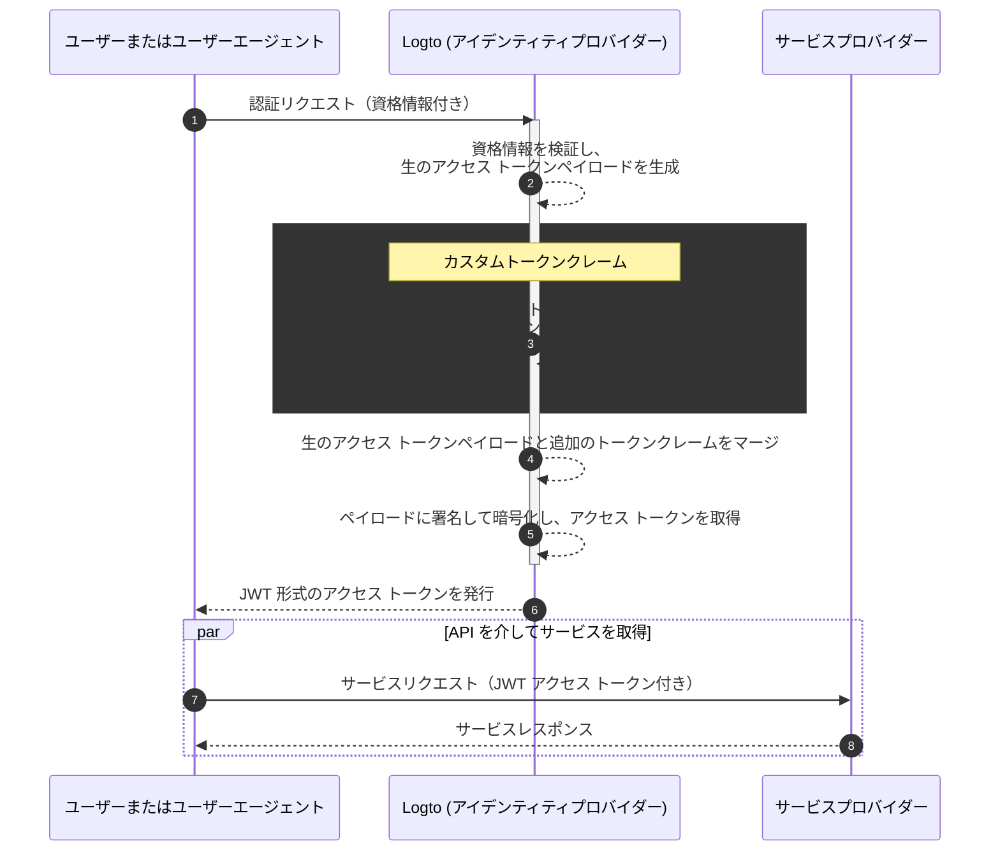

# カスタムトークンクレーム

## はじめに \{#introduction}

[アクセス トークン](https://auth.wiki/access-token) は、認証 (Authentication) と認可 (Authorization) プロセスにおいて重要な役割を果たし、サブジェクトのアイデンティティ情報と権限を運び、[Logto サーバー](/concepts/core-service)（認証サーバーまたはアイデンティティプロバイダー (IdP) として機能）、あなたのウェブサービスサーバー（リソースプロバイダー）、およびクライアントアプリケーション（クライアント）間で渡されます。

[トークンクレーム](https://auth.wiki/claim) は、エンティティまたはトークン自体に関する情報を提供するキーと値のペアです。クレームには、ユーザー情報、トークンの有効期限、権限、認証 (Authentication) および認可 (Authorization) プロセスに関連するその他のメタデータが含まれる場合があります。

Logto には 2 種類のアクセス トークンがあります：

- **JSON Web Token:** [JSON Web Token (JWT)](https://auth.wiki/jwt) は、クレームを安全かつクライアントが読み取り可能な形式でエンコードする人気のあるフォーマットです。`sub`、`iss`、`aud` などの一般的なクレームは、OAuth 2.0 プロトコルに従って使用されます（詳細は [このリンク](https://datatracker.ietf.org/doc/html/rfc7519#section-4) を参照）。JWT トークンは、消費者が追加の検証ステップなしでクレームに直接アクセスできるようにします。Logto では、特定のリソースまたは組織の認可リクエストをクライアントが初期化すると、デフォルトで JWT 形式でアクセス トークンが発行されます。
- **不透明トークン:** [不透明トークン](http://localhost:3000/concepts/opaque-token) は自己完結型ではなく、常に [トークンイントロスペクション](https://auth.wiki/token-introspection) エンドポイントを介した追加の検証ステップが必要です。その非透明な形式にもかかわらず、不透明トークンはクレームを取得し、当事者間で安全に送信するのに役立ちます。トークンクレームは Logto サーバーに安全に保存され、クライアントアプリケーションがトークンイントロスペクションエンドポイントを介してアクセスします。認可リクエストに特定のリソースまたは組織が含まれていない場合、不透明形式でアクセス トークンが発行されます。これらのトークンは主に OIDC `userinfo` エンドポイントやその他の一般的な目的で使用されます。

多くの場合、標準のクレームでは、JWT または不透明トークンを使用しているかどうかにかかわらず、アプリケーションの特定のニーズを満たすのに十分ではありません。これに対処するために、Logto はアクセス トークン内にカスタマイズされたクレームを追加する柔軟性を提供します。この機能を使用すると、ビジネスロジックのための追加情報を含めることができ、不透明トークンの場合はイントロスペクションを介して安全にトークン内で送信および取得できます。

## カスタムトークンクレームはどのように機能しますか？ \{#how-do-custom-token-claims-work}

Logto は、`getCustomJwtClaims` コールバック関数を通じて `アクセス トークン` にカスタムクレームを挿入することを許可します。`getCustomJwtClaims` 関数の実装を提供して、カスタムクレームのオブジェクトを返すことができます。返された値は元のトークンペイロードとマージされ、最終的なアクセス トークンを生成するために署名されます。

:::warning
Logto のビルドイントークンクレームは上書きまたは変更できません。カスタムクレームは追加のクレームとしてトークンに追加されます。ビルドインクレームと競合するカスタムクレームがある場合、それらのカスタムクレームは無視されます。
:::

## 関連リソース \{#related-resources}

<Url href="https://blog.logto.io/glance-on-custom-jwt-access-token-claims">
  Logto を使用して JWT アクセス トークンにカスタムクレームを追加し、認可 (Authorization) を強化する
</Url>
