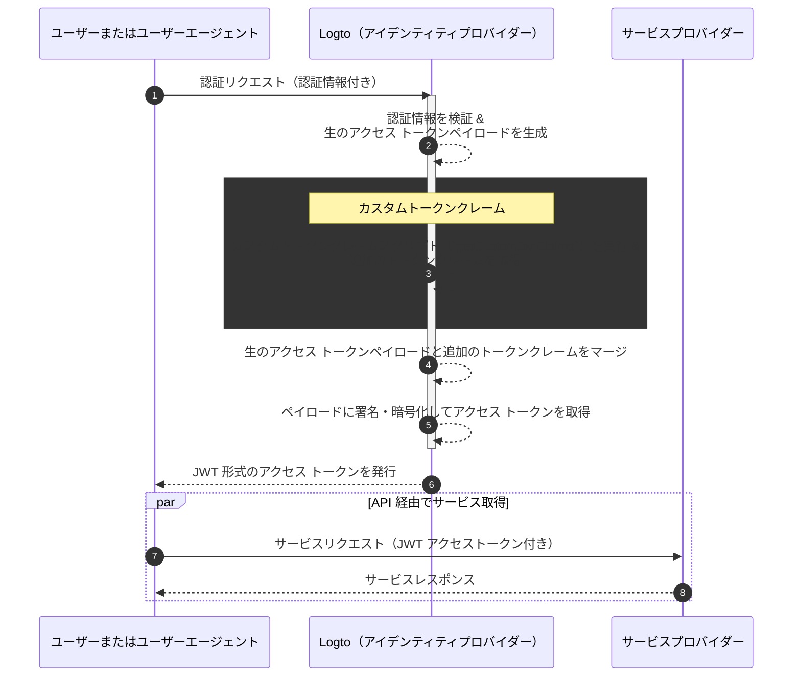

# カスタムトークンクレーム (Custom token claims)

Logto では、アクセス トークン（JWT / 不透明トークン）内にカスタムクレームを追加する柔軟性が提供されています。この機能により、ビジネスロジックに必要な追加情報をトークン内に安全に含めることができ、不透明トークンの場合はイントロスペクション経由で取得できます。

## はじめに \{#introduction}

[アクセス トークン (Access tokens)](https://auth.wiki/access-token) は、認証 (Authentication) と認可 (Authorization) のプロセスで重要な役割を果たし、サブジェクトのアイデンティティ情報や権限を保持し、[Logto サーバー](/concepts/core-service)（認証サーバーまたはアイデンティティプロバイダー (IdP) として機能）、Web サービスサーバー（リソースプロバイダー）、クライアントアプリケーション（クライアント）の間でやり取りされます。

[トークンクレーム (Token claims)](https://auth.wiki/claim) は、エンティティまたはトークン自体に関する情報を提供するキーと値のペアです。クレームには、ユーザー情報、トークンの有効期限、権限、その他認証 (Authentication) および認可 (Authorization) プロセスに関連するメタデータが含まれる場合があります。

Logto には 2 種類のアクセス トークンがあります：

- **JSON Web Token:** [JSON Web Token (JWT)](https://auth.wiki/jwt) は、クレームを安全かつクライアントが読み取れる形式でエンコードする一般的なフォーマットです。`sub`、`iss`、`aud` などの一般的なクレームは OAuth 2.0 プロトコルに準拠して使用されます（詳細は [こちら](https://datatracker.ietf.org/doc/html/rfc7519#section-4) を参照）。JWT では、追加の検証ステップなしでクレームに直接アクセスできます。Logto では、クライアントが特定のリソースや組織に対して認可リクエストを開始した場合、デフォルトで JWT 形式のアクセス トークンが発行されます。
- **不透明トークン (Opaque token):** [不透明トークン (Opaque token)](http://localhost:3000/concepts/opaque-token) は自己完結型ではなく、[トークンイントロスペクション (token introspection)](https://auth.wiki/token-introspection) エンドポイントを介した追加の検証ステップが常に必要です。不透明な形式であっても、クレームを取得し、当事者間で安全に送信できます。トークンクレームは Logto サーバー内で安全に保存され、クライアントアプリケーションはトークンイントロスペクションエンドポイント経由でアクセスします。認可リクエストに特定のリソースや組織が含まれていない場合、不透明形式でアクセス トークンが発行されます。これらのトークンは主に OIDC の `userinfo` エンドポイントやその他の一般的な用途で使用されます。

多くの場合、標準クレームだけではアプリケーションの特定のニーズを満たせません（JWT でも不透明トークンでも同様です）。この課題に対応するため、Logto ではアクセス トークン内にカスタムクレームを追加する柔軟性を提供しています。この機能により、ビジネスロジックに必要な追加情報をトークン内に安全に含めることができ、不透明トークンの場合はイントロスペクション経由で取得できます。

## カスタムトークンクレームの仕組み \{#how-do-custom-token-claims-work}

Logto では、コールバック関数 `getCustomJwtClaims` を通じて `アクセス トークン` にカスタムクレームを挿入できます。`getCustomJwtClaims` 関数の実装を用意し、カスタムクレームのオブジェクトを返すことができます。戻り値は元のトークンペイロードとマージされ、署名されて最終的なアクセス トークンが生成されます。

:::warning
Logto の組み込みトークンクレームは上書きや変更ができません。カスタムクレームは追加クレームとしてトークンに追加されます。組み込みクレームとカスタムクレームが競合した場合、カスタムクレームは無視されます。
:::

## 関連リソース \{#related-resources}

<Url href="https://blog.logto.io/glance-on-custom-jwt-access-token-claims">
  Logto で JWT アクセストークンにカスタムクレームを追加して認可 (Authorization) を強化する
</Url>
