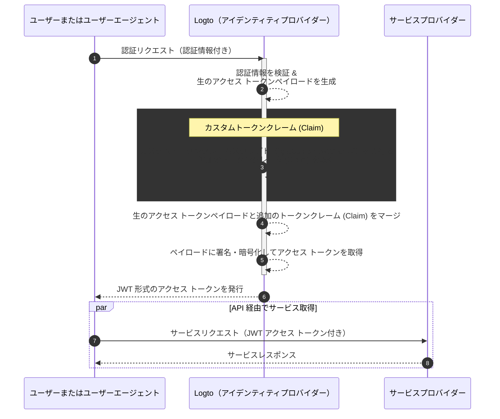

# カスタムアクセス トークン (Custom access token)

Logto では、アクセス トークン（JWT / 不透明トークン (Opaque token)）内にカスタムクレーム (Claim) を追加する柔軟性を提供しています。この機能により、ビジネスロジックに必要な追加情報をトークン内に安全に含めることができ、不透明トークン (Opaque token) の場合はイントロスペクション経由で取得できます。

## はじめに \{#introduction}

[アクセス トークン (Access token)](https://auth.wiki/access-token) は、認証 (Authentication) と認可 (Authorization) プロセスにおいて重要な役割を果たし、サブジェクトのアイデンティティ情報や権限 (Permission) を保持し、[Logto サーバー](/concepts/core-service)（認証サーバーまたはアイデンティティプロバイダー (IdP) として機能）、Web サービスサーバー（リソースプロバイダー）、クライアントアプリケーション（クライアント）間でやり取りされます。

[トークンクレーム (Claim)](https://auth.wiki/claim) は、エンティティまたはトークン自体に関する情報を提供するキーと値のペアです。クレーム (Claim) には、ユーザー情報、トークンの有効期限、権限 (Permission)、その他認証 (Authentication) や認可 (Authorization) プロセスに関連するメタデータが含まれる場合があります。

Logto には 2 種類のアクセス トークンがあります：

- **JSON Web Token:** [JSON Web Token (JWT)](https://auth.wiki/jwt) は、クレーム (Claim) を安全かつクライアントが読み取れる形式でエンコードする一般的なフォーマットです。`sub`、`iss`、`aud` などの一般的なクレーム (Claim) は OAuth 2.0 プロトコルに準拠して使用されます（詳細は [こちら](https://datatracker.ietf.org/doc/html/rfc7519#section-4) を参照）。JWT では、追加の検証ステップなしでクレーム (Claim) に直接アクセスできます。Logto では、クライアントが特定のリソースや組織 (Organization) への認可リクエストを初期化する際、デフォルトで JWT 形式のアクセス トークンが発行されます。
- **不透明トークン (Opaque token):** [不透明トークン (Opaque token)](http://localhost:3000/concepts/opaque-token) は自己完結型ではなく、[トークンイントロスペクション](https://auth.wiki/token-introspection) エンドポイントを介した追加の検証ステップが常に必要です。不透明な形式であっても、クレーム (Claim) を取得し、当事者間で安全に送信できます。トークンクレーム (Claim) は Logto サーバー内で安全に保存され、クライアントアプリケーションはトークンイントロスペクションエンドポイント経由でアクセスします。認可リクエストに特定のリソースや組織 (Organization) が含まれていない場合、不透明トークン (Opaque token) 形式でアクセス トークンが発行されます。これらのトークンは主に OIDC の `userinfo` エンドポイントやその他の一般的な用途で使用されます。

多くの場合、標準のクレーム (Claim) だけではアプリケーションの特定の要件を満たすことができません。JWT でも不透明トークン (Opaque token) でも同様です。これに対応するため、Logto ではアクセス トークン内にカスタマイズしたクレーム (Claim) を追加できる柔軟性を提供しています。この機能により、ビジネスロジックに必要な追加情報をトークン内に安全に含めることができ、不透明トークン (Opaque token) の場合はイントロスペクション経由で取得できます。

## カスタムトークンクレーム (Claim) の仕組み \{#how-do-custom-token-claims-work}

Logto では、コールバック関数 `getCustomJwtClaims` を通じて `access token` にカスタムクレーム (Claim) を挿入できます。`getCustomJwtClaims` 関数の実装を提供し、カスタムクレーム (Claim) のオブジェクトを返すことができます。戻り値は元のトークンペイロードとマージされ、署名されて最終的なアクセス トークンが生成されます。

```mermaid
sequenceDiagram
  participant U as ユーザーまたはユーザーエージェント
  participant IdP as Logto（アイデンティティプロバイダー）
  participant SP as サービスプロバイダー

  autonumber
  U ->> IdP: 認証リクエスト（認証情報付き）
  activate IdP
  IdP-->>IdP: 認証情報を検証 &<br/>生のアクセス トークンペイロードを生成
  rect var(--mermaid-rect-fill)
  note over IdP: カスタムトークンクレーム (Claim)
  IdP->>IdP: カスタムトークンクレームスクリプト（`getCustomJwtClaims`）を実行 &<br/>追加のトークンクレーム (Claim) を取得
  end
  IdP-->>IdP: 生のアクセス トークンペイロードと追加のトークンクレーム (Claim) をマージ
  IdP-->>IdP: ペイロードに署名・暗号化してアクセス トークンを取得
  deactivate IdP
  IdP-->>U: JWT 形式のアクセス トークンを発行
  par API 経由でサービス取得
  U->>SP: サービスリクエスト（JWT アクセス トークン付き）
  SP-->>U: サービスレスポンス
  end
```

:::warning
Logto の組み込みトークンクレーム (Claim) は上書きや変更できません。カスタムクレーム (Claim) は追加クレーム (Claim) としてトークンに追加されます。組み込みクレーム (Claim) とカスタムクレーム (Claim) が競合した場合、カスタムクレーム (Claim) は無視されます。
:::

## 関連リソース \{#related-resources}

<Url href="https://blog.logto.io/glance-on-custom-jwt-access-token-claims">
  Logto で JWT アクセス トークンにカスタムクレーム (Claim) を追加して認可 (Authorization) を強化する
</Url>
