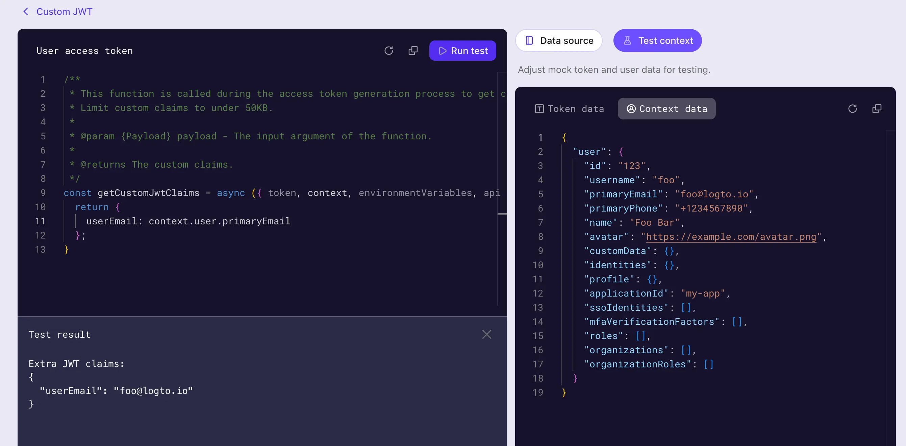

# カスタムトークンクレームスクリプトを作成する

[アクセス トークン](https://auth.wiki/access-token) に [カスタムクレームを追加する](/developers/custom-token-claims) には、それらのクレームを含むオブジェクトを返すスクリプトを提供する必要があります。スクリプトは、カスタムクレームを含むオブジェクトを返す `JavaScript` 関数として記述する必要があります。

1. <CloudLink to="/customize-jwt">Console > Custom JWT</CloudLink> に移動します。
2. カスタマイズ可能なアクセス トークンクレームには、2 つの異なるタイプのアクセス トークンがあります：

   - **ユーザーアクセス トークン**：エンドユーザーに発行されるアクセス トークン。例：Web アプリケーションやモバイルアプリケーション用。
   - **マシン間通信アクセス トークン**：サービスまたはアプリケーションに発行されるアクセス トークン。例：[マシン間通信アプリケーション](/quick-starts/m2m) 用。

   異なるタイプのアクセス トークンは、異なるトークンペイロードコンテキストを持つ場合があります。各タイプのアクセス トークンに対してトークンクレームを個別にカスタマイズできます。

   トークンクレームをカスタマイズしたい任意のタイプのアクセス トークンを選択し、**Add custom claims** ボタンをクリックして新しいスクリプトを作成します。

:::note
カスタムトークンクレーム機能は、次のユーザーのみが利用できます：

- [Logto OSS](/logto-oss) ユーザー
- 開発環境を持つ [Logto Cloud テナント](/logto-cloud/tenant-settings#development)
- 本番環境を持つ Logto Cloud 有料テナント（[Pro テナントおよび Enterprise テナント](https://logto.io/pricing) を含む）
  :::

## `getCustomJwtClaims()` 関数を実装する

**Custom JWT** 詳細ページでは、カスタムトークンクレームスクリプトを書くためのスクリプトエディタを見つけることができます。スクリプトは、カスタムクレームのオブジェクトを返す `JavaScript` 関数である必要があります。


## ステップ 1: スクリプトを編集する

左側のコードエディタを使用してスクリプトを修正します。空のオブジェクトを返すデフォルトの `getCustomJwtClaims` が提供されているので、そこから始めることができます。関数を修正して、独自のカスタムクレームのオブジェクトを返すようにします。

```jsx
const getCustomJwtClaims = async ({ token, context, environmentVariables }) => {
  return {};
};
```

このエディタは、JavaScript 言語サーバーを使用して基本的な構文のハイライト、コード補完、エラーチェックを提供します。入力パラメータは jsDoc スタイルで適切に型付けされ、文書化されています。エディタの IntelliSense を使用して、入力オブジェクトのプロパティに正しくアクセスできます。ページの右側に詳細なパラメータ定義が表示されます。

:::note
この関数はモジュールとしてエクスポートされます。モジュールが関数を正しくエクスポートできるように、関数名を `getCustomJwtClaims` のままにしてください。
:::

## ステップ 2: 入力パラメータ

`getCustomJwtClaims` 関数は、オブジェクトを入力パラメータとして受け取ります。入力オブジェクトには次のプロパティが含まれています：

### token

トークンペイロードオブジェクト。このオブジェクトには、スクリプトでアクセスする必要がある元のトークンクレームとメタデータが含まれています。

トークンペイロードオブジェクトとユーザーデータオブジェクトの詳細な型定義は、ページの右側に表示されます。エディタの IntelliSense は、入力オブジェクトのこれらのプロパティに正しくアクセスするのを助けます。

- ユーザーアクセス トークンデータオブジェクト
  | プロパティ | 説明 | 型 |
  | -------------------- | ------------------------------------------------ | ------------- |
  | `jti` | 一意の JWT ID | `string` |
  | `aud` | トークンのオーディエンス | `string` |
  | `scope` | トークンのスコープ | `string` |
  | `clientId` | トークンのクライアント ID | `string` |
  | `accountId` | トークンのユーザー ID | `string` |
  | `expiresWithSession` | トークンがセッションと共に期限切れになるかどうか | `boolean` |
  | `grantId` | トークンの現在の認証 (Authentication) グラント ID | `string` |
  | `gty` | トークンのグラントタイプ | `string` |
  | `kind` | トークンの種類 | `AccessToken` |
- マシン間通信アクセス トークンデータオブジェクト
  | プロパティ | 説明 | 型 |
  | ---------- | -------------------------- | ------------------- |
  | `jti` | 一意の JWT ID | `string` |
  | `aud` | トークンのオーディエンス | `string` |
  | `scope` | トークンのスコープ | `string` |
  | `clientId` | トークンのクライアント ID | `string` |
  | `kind` | トークンの種類 | `ClientCredentials` |

### context (ユーザーアクセス トークンのみ利用可能)

コンテキストオブジェクトには、現在の認可 (Authorization) プロセスに関連するユーザーデータとグラントデータが含まれています。

- **ユーザーデータオブジェクト**
  ユーザーアクセス トークンの場合、Logto はアクセスするための追加のユーザーデータコンテキストを提供します。ユーザーデータオブジェクトには、カスタムクレームを設定するために必要なすべてのユーザープロファイルデータと組織メンバーシップデータが含まれています。詳細については、[ユーザー](/user-management/user-data) と [組織](/organizations/organization-data) を確認してください。
- **グラントデータオブジェクト**
  なりすましトークン交換によって付与されたユーザーアクセス トークンの場合、Logto はアクセスするための追加のグラントデータコンテキストを提供します。グラントデータオブジェクトには、サブジェクトトークンからのカスタムコンテキストが含まれています。詳細については、[なりすまし](/developers/user-impersonation) を確認してください。

### environmentVariables

右側の **Set environment variables** セクションを使用して、スクリプトの環境変数を設定します。これらの変数を使用して、スクリプトにハードコードしたくない機密情報や設定データを保存できます。例：API キー、シークレット、または URL。

ここで設定したすべての環境変数はスクリプトで利用可能です。入力パラメータの `environmentVariables` オブジェクトを使用して、これらの変数にアクセスします。

### api

`api` オブジェクトは、トークン発行プロセスに対する追加のアクセス制御のためにスクリプトで使用できる一連のユーティリティ関数を提供します。`api` オブジェクトには次の関数が含まれています：

```jsx
api.denyAccess(message?: string): void
```

`api.denyAccess()` 関数を使用すると、カスタムメッセージでトークン発行プロセスを拒否できます。この関数を使用して、トークン発行プロセスに対する追加のアクセス検証を強制することができます。

## ステップ 3: 外部データを取得する

スクリプト内で外部データを取得するには、Node に組み込まれている `fetch` 関数を使用できます。`fetch` 関数は、外部 API に HTTP リクエストを行うためのプロミスベースの関数です。

```jsx
const getCustomJwtClaims = async ({ environmentVariables }) => {
  const response = await fetch('https://api.example.com/data', {
    headers: {
      Authorization: `Bearer ${environmentVariables.API_KEY}`,
    },
  });

  const data = await response.json();

  return {
    data,
  };
};
```

:::note
注意してください。外部データの取得は、トークン発行プロセスに遅延をもたらす可能性があります。外部 API が信頼性が高く、要件を満たすのに十分な速さであることを確認してください。

さらに：

- スクリプト内でエラーとタイムアウトを適切に処理し、トークン発行プロセスがブロックされないようにします。
- 適切な認証ヘッダーを使用して、外部 API への不正アクセスを防ぎます。
  :::

## ステップ 4: スクリプトをテストする

スクリプトを保存する前にテストしてください。ページの右側にある **Test context** タブをクリックして、テスト用のモックトークンペイロードとユーザーデータコンテキストを修正します。

エディタの右上隅にある **Run test** をクリックして、モックデータを使用してスクリプトを実行します。スクリプトの出力は **Test Result** ドロワーに表示されます。



:::note
テスト結果は、設定したモックデータを使用した `getCustomJwtClaims` 関数の出力です（[シーケンス図](/developers/custom-token-claims/#how-do-custom-token-claims-work) のステップ 3 を完了した後に得られる「追加トークンクレーム」）。スクリプトがトークン発行プロセスで実行されるとき、実際のトークンペイロードとユーザーデータコンテキストは異なる場合があります。
:::

**Create** ボタンをクリックしてスクリプトを保存します。カスタムトークンクレームスクリプトは保存され、アクセス トークン発行プロセスに適用されます。
