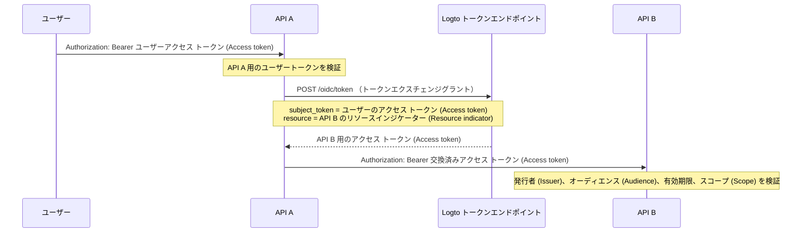

import TokenExchangePrerequisites from './fragments/_token-exchange-prerequisites.mdx';

# サービス間委任 (Service-to-service delegation)

一部の API アーキテクチャでは、バックエンドサービスがサインイン済みユーザーからリクエストを受け取り、そのユーザーのアイデンティティを保持したまま別のバックエンドサービスを呼び出す必要があります。

例えば：

```text
ユーザー -> API A -> API B
```

API B は次の 2 点を知る必要があります：

1. 呼び出し元が信頼できるサービス（例：API A）であること。
2. 操作が元のユーザーのために実行されていること。

Logto のトークンエクスチェンジグラントを利用して、ユーザーのアクセス トークン (Access token) を下流の API リソースをオーディエンス (Audience) とする新しいアクセス トークン (Access token) に交換します。これは OAuth 2.0 のトークンエクスチェンジパターンに従い、元のユーザートークンを下流サービスに転送することを回避します。

## このフローを使うべき場合 \{#when-to-use-this-flow}

サービス間委任を利用するのは、次のような場合です：

- API A が Logto のトークンエンドポイントに安全に認証できるバックエンドサービスである。
- API A が Logto 発行のユーザーアクセス トークン (Access token) を受け取る。
- API A が同じユーザーの代理で API B を呼び出す必要がある。
- API B が自分の API リソースをオーディエンス (Audience) とする 1 つのアクセス トークン (Access token) を検証すべきである。

ユーザーがいない純粋なマシン間通信の場合はこのフローを使用しないでください。その場合は [クライアントクレデンシャルフロー](/quick-starts/m2m) を利用してください。サポートや管理者、エージェントなど、あるユーザーが一時的に別のユーザーとして行動する場合は、[ユーザーなりすまし (User impersonation)](/developers/user-impersonation) を利用してください。

## 仕組み \{#how-it-works}



交換されたアクセス トークン (Access token) は元のユーザー（`sub`）を表し、下流の API リソース（`aud`）にバインドされます。下流の API は `client_id` クレーム (Claim) を確認することで、交換を開始したアプリケーションを特定できます。

## 前提条件 \{#prerequisites}

1. 関連するサービス用の API リソースを作成します。詳しくは [グローバル API リソースの保護](/authorization/global-api-resources) を参照してください。
2. API B の権限 (Permissions) を設定し、ロール (Role) または組織ロール (Organization role) を通じてユーザーに割り当てます。
3. API A には、アプリシークレットで安全に認証できるサーバーサイドアプリ（マシン間通信アプリや従来型 Web アプリなど）を使用します。
4. API A のアプリケーションでトークンエクスチェンジを有効にします。

<TokenExchangePrerequisites />

## 下流 API 用のアクセス トークン (Access token) をリクエストする \{#request-an-access-token-for-the-downstream-api}

API A が API B を呼び出す必要がある場合、Logto の [トークンエンドポイント](/integrate-logto/application-data-structure#token-endpoint) にトークンエクスチェンジリクエストを送信します。

従来型 Web アプリやアプリシークレットを持つマシン間通信アプリの場合、`Authorization` ヘッダーに認証情報を含めます：

```bash
POST /oidc/token HTTP/1.1
Host: tenant.logto.app
Content-Type: application/x-www-form-urlencoded
# highlight-next-line
Authorization: Basic <base64(api-a-app-id:api-a-app-secret)>

grant_type=urn:ietf:params:oauth:grant-type:token-exchange
&subject_token=<user_access_token_received_by_api_a>
&subject_token_type=urn:ietf:params:oauth:token-type:access_token
&resource=https://api-b.example.com
&scope=read:orders
```

パラメーター：

1. `grant_type`：`urn:ietf:params:oauth:grant-type:token-exchange` を指定します。
2. `subject_token`：API A が受け取った Logto 発行の元のユーザーアクセス トークン (Access token)。
3. `subject_token_type`：`urn:ietf:params:oauth:token-type:access_token` を指定します。
4. `resource`：API B のリソースインジケーター (Resource indicator)。
5. `scope`：この委任呼び出しで API A が要求する下流の権限 (Permissions)。Logto は、RBAC 設定に従い、元のユーザーがこのリソースで利用可能なスコープ (Scope) のみを発行します。

Logto は API B 用のアクセス トークン (Access token) を返します：

```json
{
  "access_token": "eyJhbGci...<truncated>",
  "token_type": "Bearer",
  "expires_in": 3600,
  "scope": "read:orders"
}
```

デコードすると、アクセス トークン (Access token) には次のようなクレーム (Claims) が含まれます：

```json
{
  "sub": "user_id",
  "client_id": "api_a_app_id",
  "iss": "https://tenant.logto.app/oidc",
  "aud": "https://api-b.example.com",
  "scope": "read:orders",
  "exp": 1760000000
}
```

その後、API A は交換済みトークンで API B を呼び出します：

```bash
GET /orders HTTP/1.1
Host: api-b.example.com
Authorization: Bearer <exchanged_access_token>
```

## API B でトークンを検証する \{#validate-the-token-in-api-b}

API B は、Logto 発行の API リソース用アクセス トークン (Access token) と同様に、交換済みトークンを検証する必要があります：

1. Logto の JWKs を使って署名を検証します。
2. 発行者 (`iss`) を確認します。
3. オーディエンス (`aud`) が API B のリソースインジケーター (Resource indicator) と一致するか確認します。
4. 有効期限 (`exp`) を確認します。
5. 必要なスコープ (Scope) を確認します。
6. `sub` を元のユーザー ID として利用します。
7. 特定の上流サービスのみ委任呼び出しを許可する場合は、`client_id` も任意で確認します。

実装ガイダンスについては [API でのアクセス トークン (Access token) の検証](/authorization/validate-access-tokens) を参照してください。

## 関連リソース \{#related-resources}

<Url href="/authorization/global-api-resources">グローバル API リソースの保護</Url>

<Url href="/authorization/validate-access-tokens">
  API でのアクセス トークン (Access token) の検証
</Url>

<Url href="/developers/user-impersonation">ユーザーなりすまし (User impersonation)</Url>
