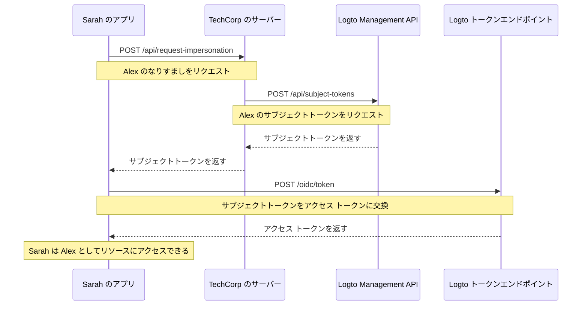

# ユーザーなりすまし

TechCorp のサポートエンジニアである Sarah が、重要なリソースにアクセスできない顧客の Alex から緊急のチケットを受け取ったと想像してください。問題を効率的に診断し解決するために、Sarah はシステム内で Alex が見ているものを正確に確認する必要があります。ここで Logto のユーザーなりすまし機能が役立ちます。

ユーザーなりすましは、Sarah のような認可されたユーザーがシステム内で一時的に Alex のような他のユーザーの代わりに行動することを可能にします。この強力な機能は、トラブルシューティング、顧客サポートの提供、および管理タスクの実行に非常に価値があります。

## どのように機能するのか？ \{#how-it-works}



なりすましプロセスは、主に次の 3 つのステップで構成されます：

1. Sarah が TechCorp のバックエンドサーバーを通じてなりすましをリクエスト
2. TechCorp のサーバーが Logto の Management API からサブジェクトトークンを取得
3. Sarah のアプリケーションがこのサブジェクトトークンをアクセス トークンに交換

Sarah がどのようにこの機能を使用して Alex を助けることができるかを見てみましょう。

### ステップ 1: なりすましのリクエスト \{#step-1-requesting-impersonation}

まず、Sarah のサポートアプリケーションは TechCorp のバックエンドサーバーからなりすましをリクエストする必要があります。

**リクエスト (Sarah のアプリケーションから TechCorp のサーバーへ)**

```bash
POST /api/request-impersonation HTTP/1.1
Host: api.techcorp.com
Authorization: Bearer <Sarah's_access_token>
Content-Type: application/json

{
  "userId": "alex123",
  "reason": "リソースアクセス問題の調査",
  "ticketId": "TECH-1234"
}
```

この API では、バックエンドが適切な認可チェックを行い、Sarah が Alex をなりすますための必要な権限を持っていることを確認する必要があります。

### ステップ 2: サブジェクトトークンの取得 \{#step-2-obtaining-a-subject-token}

Sarah のリクエストを検証した後、TechCorp のサーバーは Logto の [Management API](/integrate-logto/interact-with-management-api) を呼び出してサブジェクトトークンを取得します。

**リクエスト (TechCorp のサーバーから Logto の Management API へ)**

```bash
POST /api/subject-tokens HTTP/1.1
Host: techcorp.logto.app
Authorization: Bearer <TechCorp_m2m_access_token>
Content-Type: application/json

{
  "userId": "alex123",
  "context": {
    "ticketId": "TECH-1234",
    "reason": "リソースアクセス問題",
    "supportEngineerId": "sarah789"
  }
}
```

**レスポンス (Logto から TechCorp のサーバーへ)**

```json
{
  "subjectToken": "sub_7h32jf8sK3j2",
  "expiresIn": 600
}
```

TechCorp のサーバーはこのサブジェクトトークンを Sarah のアプリケーションに返す必要があります。

**レスポンス (TechCorp のサーバーから Sarah のアプリケーションへ)**

```json
{
  "subjectToken": "sub_7h32jf8sK3j2",
  "expiresIn": 600
}
```

### ステップ 3: サブジェクトトークンをアクセス トークンに交換 \{#step-3-exchanging-the-subject-token-for-an-access-token}

次に、Sarah のアプリケーションはこのサブジェクトトークンを Alex を表すアクセス トークンに交換し、トークンが使用されるリソースを指定します。

**リクエスト (Sarah のアプリケーションから Logto のトークンエンドポイントへ)**

```bash
POST /oidc/token HTTP/1.1
Host: techcorp.logto.app
Content-Type: application/x-www-form-urlencoded

grant_type=urn:ietf:params:oauth:grant-type:token-exchange
&client_id=techcorp_support_app
&scope=resource:read
&subject_token=alx_7h32jf8sK3j2
&subject_token_type=urn:ietf:params:oauth:token-type:access_token
&resource=https://api.techcorp.com/customer-data
```

**レスポンス (Logto から Sarah のアプリケーションへ)**

```json
{
  "access_token": "eyJhbG...<truncated>",
  "issued_token_type": "urn:ietf:params:oauth:token-type:access_token",
  "token_type": "Bearer",
  "expires_in": 3600,
  "scope": "resource:read"
}
```

返された `access_token` は指定されたリソースにバインドされ、TechCorp の顧客データ API でのみ使用できることを保証します。

## 使用例 \{#example-usage}

Sarah が Node.js サポートアプリケーションでこれをどのように使用するかを示します：

```jsx
interface ImpersonationResponse {
  subjectToken: string;
  expiresIn: number;
}

interface TokenExchangeResponse {
  access_token: string;
  issued_token_type: string;
  token_type: string;
  expires_in: number;
  scope: string;
}

async function impersonateUser(
  userId: string,
  clientId: string,
  ticketId: string,
  resource: string
): Promise<string> {
  try {
    // ステップ 1 & 2: なりすましをリクエストし、サブジェクトトークンを取得
    const impersonationResponse = await fetch(
      'https://api.techcorp.com/api/request-impersonation',
      {
        method: 'POST',
        headers: {
          Authorization: "Bearer <Sarah's_access_token>",
          'Content-Type': 'application/json',
        },
        body: JSON.stringify({
          userId,
          reason: 'リソースアクセス問題の調査',
          ticketId,
        }),
      }
    );

    if (!impersonationResponse.ok) {
      throw new Error(`HTTP エラーが発生しました。ステータス: ${impersonationResponse.status}`);
    }

    const { subjectToken } = (await impersonationResponse.json()) as ImpersonationResponse;

    // ステップ 3: サブジェクトトークンをアクセス トークンに交換
    const tokenExchangeBody = new URLSearchParams({
      grant_type: 'urn:ietf:params:oauth:grant-type:token-exchange',
      client_id: clientId,
      scope: 'openid profile resource.read',
      subject_token: subjectToken,
      subject_token_type: 'urn:ietf:params:oauth:token-type:access_token',
      resource: resource,
    });

    const tokenExchangeResponse = await fetch('https://techcorp.logto.app/oidc/token', {
      method: 'POST',
      headers: { 'Content-Type': 'application/x-www-form-urlencoded' },
      body: tokenExchangeBody,
    });

    if (!tokenExchangeResponse.ok) {
      throw new Error(`HTTP エラー! ステータス: ${tokenExchangeResponse.status}`);
    }

    const tokenData = (await tokenExchangeResponse.json()) as TokenExchangeResponse;
    return tokenData.access_token;
  } catch (error) {
    console.error('なりすましに失敗しました:', error);
    throw error;
  }
}

// Sarah がこの関数を使用して Alex をなりすます
async function performImpersonation(): Promise<void> {
  try {
    const accessToken = await impersonateUser(
      'alex123',
      'techcorp_support_app',
      'TECH-1234',
      'https://api.techcorp.com/customer-data'
    );
    console.log('Alex のなりすましアクセス トークン:', accessToken);
  } catch (error) {
    console.error('なりすましの実行に失敗しました:', error);
  }
}

// なりすましを実行
void performImpersonation()
```

:::note

1. サブジェクトトークンは短命で一度きりの使用です。
2. なりすましアクセス トークンには [リフレッシュ トークン](https://auth.wiki/refresh-token) が付属していません。Sarah は、トークンが Alex の問題を解決する前に期限切れになった場合、このプロセスを繰り返す必要があります。
3. TechCorp のバックエンドサーバーは、Sarah のような認可されたサポートスタッフのみがなりすましをリクエストできるように、適切な認可チェックを実装する必要があります。
   :::

## `act` クレーム \{#act-claim}

なりすましのためにトークン交換フローを使用する場合、発行されたアクセス トークンには追加の `act` (actor) クレームを含めることができます。このクレームは「行動する当事者」のアイデンティティを表します。私たちの例では、Sarah がなりすましを行っています。

`act` クレームを含めるには、Sarah のアプリケーションがトークン交換リクエストで `actor_token` を提供する必要があります。このトークンは、`openid` スコープを持つ Sarah の有効なアクセス トークンである必要があります。トークン交換リクエストに含める方法は次のとおりです：

```bash
POST /oidc/token HTTP/1.1
Host: techcorp.logto.app
Content-Type: application/x-www-form-urlencoded

grant_type=urn:ietf:params:oauth:grant-type:token-exchange
&client_id=techcorp_support_app
&scope=resource:read
&subject_token=alx_7h32jf8sK3j2
&subject_token_type=urn:ietf:params:oauth:token-type:access_token
&actor_token=sarah_access_token
&actor_token_type=urn:ietf:params:oauth:token-type:access_token
&resource=https://api.techcorp.com/customer-data
```

`actor_token` が提供されると、結果のアクセス トークンには次のような `act` クレームが含まれます：

```json
{
  "aud": "https://api.techcorp.com",
  "iss": "https://techcorp.logto.app",
  "exp": 1443904177,
  "sub": "alex123",
  "act": {
    "sub": "sarah789"
  }
}
```

この `act` クレームは、Sarah (sarah789) が Alex (alex123) の代わりに行動していることを明確に示しています。`act` クレームは、なりすまし行動の監査と追跡に役立ちます。

## トークンクレームのカスタマイズ \{#customizing-token-claims}

Logto は、なりすましトークンの [トークンクレームをカスタマイズ](/developers/custom-token-claims) することを可能にします。これは、なりすましプロセスに追加のコンテキストやメタデータを追加するのに役立ちます。例えば、なりすましの理由や関連するサポートチケットなどです。

TechCorp のサーバーが Logto の Management API からサブジェクトトークンをリクエストする際に、`context` オブジェクトを含めることができます：

```json
{
  "userId": "alex123",
  "context": {
    "ticketId": "TECH-1234",
    "reason": "リソースアクセス問題",
    "supportEngineerId": "sarah789"
  }
}
```

この [コンテキスト](/developers/custom-token-claims/create-script#context-only-available-for-user-access-token) は、最終的なアクセス トークンに特定のクレームを追加するために `getCustomJwtClaims()` 関数で使用できます。実装例は次のとおりです：

```tsx
const getCustomJwtClaims = async ({ token, context, environmentVariables }) => {
  if (context.grant?.type === 'urn:ietf:params:oauth:grant-type:token-exchange') {
    const { ticketId, reason, supportEngineerId } = context.grant.subjectTokenContext;
    return {
      impersonation_context: {
        ticket_id: ticketId,
        reason: reason,
        support_engineer: supportEngineerId,
      },
    };
  }
  return {};
};
```

Sarah が受け取る結果のアクセス トークンは次のようになります：

```json
{
  "sub": "alex123",
  "aud": "https://api.techcorp.com/customer-data",
  "impersonation_context": {
    "ticket_id": "TECH-1234",
    "reason": "リソースアクセス問題",
    "support_engineer": "sarah789"
  }
  // ... 他の標準クレーム
}
```

このようにアクセス トークンのクレームをカスタマイズすることで、TechCorp はなりすましコンテキストに関する貴重な情報を含めることができ、システム内でのなりすまし活動を監査し理解しやすくなります。

:::note
トークンにカスタムクレームを追加する際は注意が必要です。トークンが傍受されたり漏洩したりした場合にセキュリティリスクを引き起こす可能性のある機密情報を含めないようにしてください。JWT は署名されていますが暗号化されていないため、クレームはトークンにアクセスできる人には見える状態です。
:::
