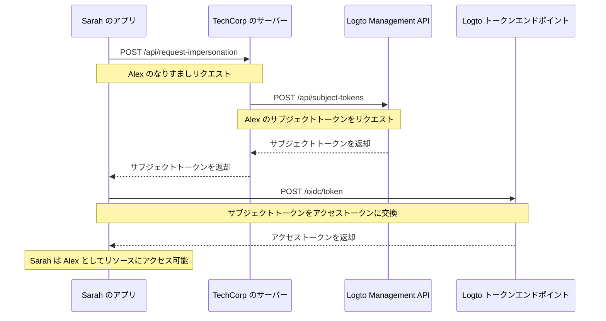

# ユーザーなりすまし (User impersonation)

TechCorp のサポートエンジニアである Sarah が、重要なリソースにアクセスできないという顧客 Alex から緊急のチケットを受け取ったと想像してください。問題を効率的に診断し解決するために、Sarah はシステム内で Alex とまったく同じ画面を確認する必要があります。ここで Logto のユーザーなりすまし (User impersonation) 機能が役立ちます。

ユーザーなりすまし (User impersonation) を利用すると、Sarah のような権限を持つユーザーが、一時的に Alex のような他のユーザーになり代わってシステム内で操作できます。この強力な機能は、トラブルシューティング、カスタマーサポート、管理業務にとって非常に有用です。

## 仕組み \{#how-it-works}



なりすましのプロセスは主に 3 つのステップで構成されます：

1. Sarah が TechCorp のバックエンドサーバーを通じてなりすましをリクエスト
2. TechCorp のサーバーが Logto の Management API からサブジェクトトークンを取得
3. Sarah のアプリケーションがこのサブジェクトトークンをアクセストークンに交換

Sarah がこの機能を使って Alex をサポートする流れを見てみましょう。

### ステップ 1: なりすましリクエスト \{#step-1-requesting-impersonation}

まず、Sarah のサポートアプリケーションが TechCorp のバックエンドサーバーに対してなりすましをリクエストします。

**リクエスト (Sarah のアプリケーション → TechCorp のサーバー)**

```bash
POST /api/request-impersonation HTTP/1.1
Host: api.techcorp.com
Authorization: Bearer <Sarah's_access_token>
Content-Type: application/json

{
  "userId": "alex123",
  "reason": "リソースアクセス問題の調査",
  "ticketId": "TECH-1234"
}
```

この API では、Sarah が Alex のなりすましを行うための十分な権限を持っているか、バックエンドで適切な認可 (Authorization) チェックを実施する必要があります。

### ステップ 2: サブジェクトトークンの取得 \{#step-2-obtaining-a-subject-token}

Sarah のリクエストを検証した後、TechCorp のサーバーは Logto の [Management API](/integrate-logto/interact-with-management-api) を呼び出してサブジェクトトークンを取得します。

**リクエスト (TechCorp のサーバー → Logto Management API)**

```bash
POST /api/subject-tokens HTTP/1.1
Host: techcorp.logto.app
Authorization: Bearer <TechCorp_m2m_access_token>
Content-Type: application/json

{
  "userId": "alex123",
  "context": {
    "ticketId": "TECH-1234",
    "reason": "リソースアクセス問題",
    "supportEngineerId": "sarah789"
  }
}
```

**レスポンス (Logto → TechCorp のサーバー)**

```json
{
  "subjectToken": "sub_7h32jf8sK3j2",
  "expiresIn": 600
}
```

TechCorp のサーバーはこのサブジェクトトークンを Sarah のアプリケーションに返却します。

**レスポンス (TechCorp のサーバー → Sarah のアプリケーション)**

```json
{
  "subjectToken": "sub_7h32jf8sK3j2",
  "expiresIn": 600
}
```

### ステップ 3: サブジェクトトークンをアクセストークンに交換 \{#step-3-exchanging-the-subject-token-for-an-access-token}

Sarah のアプリケーションは、このサブジェクトトークンを Alex を表すアクセストークンに交換し、トークンを使用するリソースを指定します。

**リクエスト (Sarah のアプリケーション → Logto のトークンエンドポイント)**

```bash
POST /oidc/token HTTP/1.1
Host: techcorp.logto.app
Content-Type: application/x-www-form-urlencoded

grant_type=urn:ietf:params:oauth:grant-type:token-exchange
&client_id=techcorp_support_app
&scope=resource:read
&subject_token=alx_7h32jf8sK3j2
&subject_token_type=urn:ietf:params:oauth:token-type:access_token
&resource=https://api.techcorp.com/customer-data
```

**レスポンス (Logto → Sarah のアプリケーション)**

```json
{
  "access_token": "eyJhbG...<truncated>",
  "issued_token_type": "urn:ietf:params:oauth:token-type:access_token",
  "token_type": "Bearer",
  "expires_in": 3600,
  "scope": "resource:read"
}
```

返却される `access_token` は指定されたリソースにバインドされており、TechCorp のカスタマーデータ API でのみ利用可能です。

**注意**：従来型の Web アプリケーションの場合、トークンリクエストのヘッダーに `client_id` と `client_secret` を含めて、401 invalid_client エラーを防いでください。

Node.js の例：

```json
Authorization: `Basic ${Buffer.from(`${client_id}:${client_secret}`, 'utf8').toString('base64')}`
```

## 利用例 \{#example-usage}

Sarah が Node.js のサポートアプリケーションでこの機能を利用する例です：

```jsx
interface ImpersonationResponse {
  subjectToken: string;
  expiresIn: number;
}

interface TokenExchangeResponse {
  access_token: string;
  issued_token_type: string;
  token_type: string;
  expires_in: number;
  scope: string;
}

async function impersonateUser(
  userId: string,
  clientId: string,
  ticketId: string,
  resource: string
): Promise<string> {
  try {
    // ステップ 1 & 2: なりすましリクエストとサブジェクトトークン取得
    const impersonationResponse = await fetch(
      'https://api.techcorp.com/api/request-impersonation',
      {
        method: 'POST',
        headers: {
          Authorization: "Bearer <Sarah's_access_token>",
          'Content-Type': 'application/json',
        },
        body: JSON.stringify({
          userId,
          reason: 'リソースアクセス問題の調査',
          ticketId,
        }),
      }
    );

    if (!impersonationResponse.ok) {
      throw new Error(`HTTP error occurred. Status: ${impersonationResponse.status}`);
    }

    const { subjectToken } = (await impersonationResponse.json()) as ImpersonationResponse;

    // ステップ 3: サブジェクトトークンをアクセストークンに交換
    const tokenExchangeBody = new URLSearchParams({
      grant_type: 'urn:ietf:params:oauth:grant-type:token-exchange',
      client_id: clientId,
      scope: 'openid profile resource.read',
      subject_token: subjectToken,
      subject_token_type: 'urn:ietf:params:oauth:token-type:access_token',
      resource: resource,
    });

    const tokenExchangeResponse = await fetch('https://techcorp.logto.app/oidc/token', {
      method: 'POST',
      headers: { 'Content-Type': 'application/x-www-form-urlencoded' },
      body: tokenExchangeBody,
    });

    if (!tokenExchangeResponse.ok) {
      throw new Error(`HTTP error! status: ${tokenExchangeResponse.status}`);
    }

    const tokenData = (await tokenExchangeResponse.json()) as TokenExchangeResponse;
    return tokenData.access_token;
  } catch (error) {
    console.error('Impersonation failed:', error);
    throw error;
  }
}

// Sarah がこの関数を使って Alex になりすます
async function performImpersonation(): Promise<void> {
  try {
    const accessToken = await impersonateUser(
      'alex123',
      'techcorp_support_app',
      'TECH-1234',
      'https://api.techcorp.com/customer-data'
    );
    console.log('Impersonation access token for Alex:', accessToken);
  } catch (error) {
    console.error('Failed to perform impersonation:', error);
  }
}

// なりすましを実行
void performImpersonation()
```

:::note

1. サブジェクトトークンは短命で一度きりの利用です。
2. なりすましアクセストークンには [リフレッシュ トークン (Refresh token)](https://auth.wiki/refresh-token) は付与されません。Sarah はトークンの有効期限が切れる前に問題を解決できなかった場合、このプロセスを繰り返す必要があります。
3. TechCorp のバックエンドサーバーは、Sarah のような権限を持つサポート担当者のみがなりすましをリクエストできるよう、適切な認可 (Authorization) チェックを実装する必要があります。

:::

## `act` クレーム (Claim) \{#act-claim}

なりすましのためのトークン交換フローを利用する場合、発行されるアクセストークンには追加の `act`（アクター）クレーム (Claim) を含めることができます。このクレーム (Claim) は「なりすましを実行している当事者」のアイデンティティ、つまり今回の例では Sarah を表します。

`act` クレーム (Claim) を含めるには、Sarah のアプリケーションがトークン交換リクエストに `actor_token` を指定する必要があります。このトークンは `openid` スコープを持つ Sarah の有効なアクセストークンでなければなりません。リクエスト例：

```bash
POST /oidc/token HTTP/1.1
Host: techcorp.logto.app
Content-Type: application/x-www-form-urlencoded

grant_type=urn:ietf:params:oauth:grant-type:token-exchange
&client_id=techcorp_support_app
&scope=resource:read
&subject_token=alx_7h32jf8sK3j2
&subject_token_type=urn:ietf:params:oauth:token-type:access_token
&actor_token=sarah_access_token
&actor_token_type=urn:ietf:params:oauth:token-type:access_token
&resource=https://api.techcorp.com/customer-data
```

`actor_token` が指定されている場合、発行されるアクセストークンには次のような `act` クレーム (Claim) が含まれます：

```json
{
  "aud": "https://api.techcorp.com",
  "iss": "https://techcorp.logto.app",
  "exp": 1443904177,
  "sub": "alex123",
  "act": {
    "sub": "sarah789"
  }
}
```

この `act` クレーム (Claim) により、Sarah（sarah789）が Alex（alex123）になりすましていることが明確に示されます。`act` クレーム (Claim) はなりすまし操作の監査や追跡に役立ちます。

## トークンクレーム (Claim) のカスタマイズ \{#customizing-token-claims}

Logto では、なりすましトークンの [トークンクレーム (Claim) をカスタマイズ](/developers/custom-token-claims) できます。これにより、なりすましの理由や関連サポートチケットなど、追加のコンテキストやメタデータを付与できます。

TechCorp のサーバーが Logto の Management API からサブジェクトトークンをリクエストする際、`context` オブジェクトを含めることができます：

```json
{
  "userId": "alex123",
  "context": {
    "ticketId": "TECH-1234",
    "reason": "リソースアクセス問題",
    "supportEngineerId": "sarah789"
  }
}
```

この [context](/developers/custom-token-claims/create-script#context-only-available-for-user-access-token) は `getCustomJwtClaims()` 関数内で利用でき、最終的なアクセストークンに特定のクレーム (Claim) を追加できます。実装例：

```tsx
const getCustomJwtClaims = async ({ token, context, environmentVariables }) => {
  if (context.grant?.type === 'urn:ietf:params:oauth:grant-type:token-exchange') {
    const { ticketId, reason, supportEngineerId } = context.grant.subjectTokenContext;
    return {
      impersonation_context: {
        ticket_id: ticketId,
        reason: reason,
        support_engineer: supportEngineerId,
      },
    };
  }
  return {};
};
```

Sarah が受け取るアクセストークンの例：

```json
{
  "sub": "alex123",
  "aud": "https://api.techcorp.com/customer-data",
  "impersonation_context": {
    "ticket_id": "TECH-1234",
    "reason": "リソースアクセス問題",
    "support_engineer": "sarah789"
  }
  // ... 他の標準クレーム (Claim)
}
```

このようにアクセストークンのクレーム (Claim) をカスタマイズすることで、TechCorp はなりすましのコンテキストに関する有用な情報を含め、システム内でのなりすまし操作の監査や把握を容易にできます。

:::note
トークンにカスタムクレーム (Claim) を追加する際は注意してください。トークンが漏洩した場合にセキュリティリスクとなるような機密情報は含めないようにしましょう。JWT は署名されていますが暗号化されていないため、トークンにアクセスできる人にはクレーム (Claim) の内容が見えてしまいます。
:::

## 関連リソース \{#related-resources}

<Url href="https://blog.logto.io/impersonation">
  サイバーセキュリティとアイデンティティ管理におけるなりすまし (Impersonation) とは？AI
  エージェントはどのように活用できるか？
</Url>
