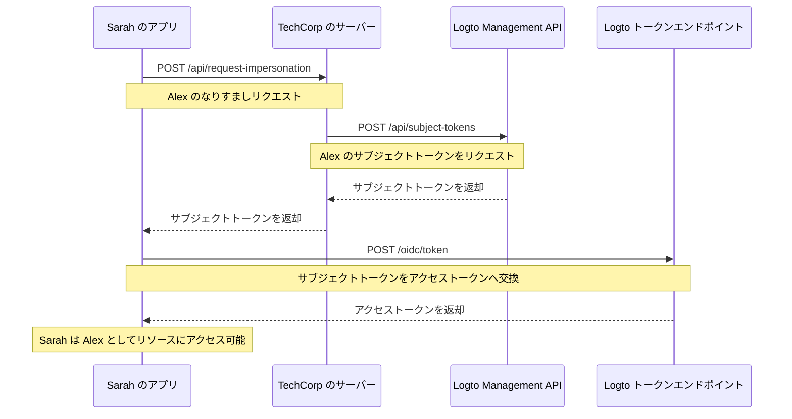

import TokenExchangePrerequisites from './fragments/_token-exchange-prerequisites.mdx';

# ユーザーなりすまし (User impersonation)

TechCorp のサポートエンジニアである Sarah が、Alex という顧客から「重要なリソースにアクセスできない」という緊急チケットを受け取ったと想像してください。問題を効率的に診断し解決するために、Sarah はシステム上で Alex とまったく同じ画面を確認する必要があります。ここで Logto のユーザーなりすまし (User impersonation) 機能が役立ちます。

ユーザーなりすまし (User impersonation) を利用すると、Sarah のような権限を持つユーザーが、一時的に Alex のような他のユーザーになり代わってシステム内で操作できます。この強力な機能は、トラブルシューティングやカスタマーサポート、管理作業に非常に有用です。

## 仕組み \{#how-it-works}


```mermaid
sequenceDiagram
    participant Sarah as Sarah のアプリ
    participant TechCorp as TechCorp のサーバー
    participant Logto as Logto Management API
    participant LogtoToken as Logto トークンエンドポイント

    Sarah->>TechCorp: POST /api/request-impersonation
    Note over Sarah,TechCorp: Alex のなりすましリクエスト

    TechCorp->>Logto: POST /api/subject-tokens
    Note over TechCorp,Logto: Alex のサブジェクトトークンをリクエスト

    Logto-->>TechCorp: サブジェクトトークンを返却
    TechCorp-->>Sarah: サブジェクトトークンを返却

    Sarah->>LogtoToken: POST /oidc/token
    Note over Sarah,LogtoToken: サブジェクトトークンをアクセストークンへ交換

    LogtoToken-->>Sarah: アクセストークンを返却
    Note over Sarah: Sarah は Alex としてリソースにアクセス可能
```

なりすましのプロセスは主に 3 つのステップで構成されます：

1. Sarah が TechCorp のバックエンドサーバー経由でなりすましをリクエスト
2. TechCorp のサーバーが Logto の Management API からサブジェクトトークンを取得
3. Sarah のアプリケーションがこのサブジェクトトークンをアクセストークンへ交換

Sarah がこの機能を使って Alex をサポートする流れを見てみましょう。

### ステップ 1: なりすましリクエスト \{#step-1-requesting-impersonation}

まず、Sarah のサポートアプリケーションが TechCorp のバックエンドサーバーに対してなりすましをリクエストします。

**リクエスト（Sarah のアプリケーション → TechCorp のサーバー）**

```bash
POST /api/request-impersonation HTTP/1.1
Host: api.techcorp.com
Authorization: Bearer <Sarah's_access_token>
Content-Type: application/json

{
  "userId": "alex123",
  "reason": "リソースアクセス問題の調査",
  "ticketId": "TECH-1234"
}
```

この API では、Sarah が Alex のなりすましを行うための十分な権限を持っているか、バックエンド側で適切な認可 (Authorization) チェックを行う必要があります。

### ステップ 2: サブジェクトトークンの取得 \{#step-2-obtaining-a-subject-token}

Sarah のリクエストを検証した後、TechCorp のサーバーは Logto の [Management API](/integrate-logto/interact-with-management-api) を呼び出してサブジェクトトークンを取得します。

**リクエスト（TechCorp のサーバー → Logto Management API）**

```bash
POST /api/subject-tokens HTTP/1.1
Host: techcorp.logto.app
Authorization: Bearer <TechCorp_m2m_access_token>
Content-Type: application/json

{
  "userId": "alex123",
  "context": {
    "ticketId": "TECH-1234",
    "reason": "リソースアクセス問題",
    "supportEngineerId": "sarah789"
  }
}
```

**レスポンス（Logto → TechCorp のサーバー）**

```json
{
  "subjectToken": "sub_7h32jf8sK3j2",
  "expiresIn": 600
}
```

TechCorp のサーバーはこのサブジェクトトークンを Sarah のアプリケーションに返却します。

**レスポンス（TechCorp のサーバー → Sarah のアプリケーション）**

```json
{
  "subjectToken": "sub_7h32jf8sK3j2",
  "expiresIn": 600
}
```

### ステップ 3: サブジェクトトークンをアクセストークンへ交換 \{#step-3-exchanging-the-subject-token-for-an-access-token}

<TokenExchangePrerequisites />

Sarah のアプリケーションは、このサブジェクトトークンを Alex を表すアクセストークンへ交換し、トークンを使用するリソースを指定します。

**リクエスト（Sarah のアプリケーション → Logto のトークンエンドポイント）**

従来の Web アプリケーションやアプリシークレットを持つマシン間通信アプリケーションの場合、`Authorization` ヘッダーに認証情報を含めます：

```bash
POST /oidc/token HTTP/1.1
Host: techcorp.logto.app
Content-Type: application/x-www-form-urlencoded
# highlight-next-line
Authorization: Basic <base64(client_id:client_secret)>

grant_type=urn:ietf:params:oauth:grant-type:token-exchange
&scope=resource:read
&subject_token=alx_7h32jf8sK3j2
&subject_token_type=urn:ietf:params:oauth:token-type:access_token
&resource=https://api.techcorp.com/customer-data
```

SPA やネイティブアプリケーション（アプリシークレットなし）の場合、`client_id` をリクエストボディに含めます：

```bash
POST /oidc/token HTTP/1.1
Host: techcorp.logto.app
Content-Type: application/x-www-form-urlencoded

grant_type=urn:ietf:params:oauth:grant-type:token-exchange
# highlight-next-line
&client_id=techcorp_support_app
&scope=resource:read
&subject_token=alx_7h32jf8sK3j2
&subject_token_type=urn:ietf:params:oauth:token-type:access_token
&resource=https://api.techcorp.com/customer-data
```

**レスポンス（Logto → Sarah のアプリケーション）**

```json
{
  "access_token": "eyJhbG...<truncated>",
  "issued_token_type": "urn:ietf:params:oauth:token-type:access_token",
  "token_type": "Bearer",
  "expires_in": 3600,
  "scope": "resource:read"
}
```

返却された `access_token` は指定したリソースに紐付けられており、TechCorp のカスタマーデータ API でのみ利用可能です。

## 利用例 \{#example-usage}

Sarah が Node.js のサポートアプリケーションでこの機能を利用する例です：

```tsx
interface ImpersonationResponse {
  subjectToken: string;
  expiresIn: number;
}

interface TokenExchangeResponse {
  access_token: string;
  issued_token_type: string;
  token_type: string;
  expires_in: number;
  scope: string;
}

async function impersonateUser(
  userId: string,
  clientId: string,
  ticketId: string,
  resource: string,
  // highlight-next-line
  clientSecret?: string // 従来の Web またはマシン間通信アプリの場合は必須
): Promise<string> {
  try {
    // ステップ 1 & 2: なりすましリクエストとサブジェクトトークン取得
    const impersonationResponse = await fetch(
      'https://api.techcorp.com/api/request-impersonation',
      {
        method: 'POST',
        headers: {
          Authorization: "Bearer <Sarah's_access_token>",
          'Content-Type': 'application/json',
        },
        body: JSON.stringify({
          userId,
          reason: 'リソースアクセス問題の調査',
          ticketId,
        }),
      }
    );

    if (!impersonationResponse.ok) {
      throw new Error(`HTTP エラーが発生しました。ステータス: ${impersonationResponse.status}`);
    }

    const { subjectToken } = (await impersonationResponse.json()) as ImpersonationResponse;

    // ステップ 3: サブジェクトトークンをアクセストークンへ交換
    // highlight-start
    // 従来の Web または M2M アプリの場合はクライアントシークレットで Basic 認証
    // SPA やネイティブアプリの場合はリクエストボディに client_id を含める
    const headers: Record<string, string> = {
      'Content-Type': 'application/x-www-form-urlencoded',
    };

    const tokenExchangeBody = new URLSearchParams({
      grant_type: 'urn:ietf:params:oauth:grant-type:token-exchange',
      scope: 'openid profile resource.read',
      subject_token: subjectToken,
      subject_token_type: 'urn:ietf:params:oauth:token-type:access_token',
      resource: resource,
    });

    if (clientSecret) {
      // 機密クライアント：Basic 認証を利用
      headers['Authorization'] =
        `Basic ${Buffer.from(`${clientId}:${clientSecret}`).toString('base64')}`;
    } else {
      // パブリッククライアント：body に client_id を追加
      tokenExchangeBody.append('client_id', clientId);
    }
    // highlight-end

    const tokenExchangeResponse = await fetch('https://techcorp.logto.app/oidc/token', {
      method: 'POST',
      headers,
      body: tokenExchangeBody,
    });

    if (!tokenExchangeResponse.ok) {
      throw new Error(`HTTP エラー! ステータス: ${tokenExchangeResponse.status}`);
    }

    const tokenData = (await tokenExchangeResponse.json()) as TokenExchangeResponse;
    return tokenData.access_token;
  } catch (error) {
    console.error('なりすましに失敗しました:', error);
    throw error;
  }
}

// Sarah がこの関数を使って Alex になりすます
async function performImpersonation(): Promise<void> {
  try {
    // highlight-start
    // 従来の Web または M2M アプリの場合はクライアントシークレットを渡す
    const accessToken = await impersonateUser(
      'alex123',
      'techcorp_support_app',
      'TECH-1234',
      'https://api.techcorp.com/customer-data',
      'your-client-secret' // SPA やネイティブアプリの場合は省略
    );
    // highlight-end
    console.log('Alex 用のなりすましアクセストークン:', accessToken);
  } catch (error) {
    console.error('なりすまし実行に失敗しました:', error);
  }
}

// なりすましを実行
void performImpersonation();
```

:::note

1. サブジェクトトークンは短命かつ一度きりの利用です。
2. なりすましアクセストークンには [リフレッシュ トークン (Refresh token)](https://auth.wiki/refresh-token) は付与されません。Sarah はトークンの有効期限が切れる前に問題を解決できなかった場合、このプロセスを繰り返す必要があります。
3. TechCorp のバックエンドサーバーは、Sarah のような権限を持つサポート担当者のみがなりすましをリクエストできるよう、適切な認可 (Authorization) チェックを実装する必要があります。

:::

## `act` クレーム \{#act-claim}

なりすましのためのトークンエクスチェンジフローを利用する場合、発行されるアクセストークンには追加で `act`（actor）クレームを含めることができます。このクレームは「なりすましを実行している当事者」のアイデンティティ（この例では Sarah）を表します。

`act` クレームを含めるには、Sarah のアプリケーションがトークンエクスチェンジリクエストで `actor_token` を指定する必要があります。このトークンは `openid` スコープを持つ Sarah の有効なアクセストークンである必要があります。リクエスト例は以下の通りです：

従来の Web アプリケーションやマシン間通信アプリケーションの場合：

```bash
POST /oidc/token HTTP/1.1
Host: techcorp.logto.app
Content-Type: application/x-www-form-urlencoded
# highlight-next-line
Authorization: Basic <base64(client_id:client_secret)>

grant_type=urn:ietf:params:oauth:grant-type:token-exchange
&scope=resource:read
&subject_token=alx_7h32jf8sK3j2
&subject_token_type=urn:ietf:params:oauth:token-type:access_token
&actor_token=sarah_access_token
&actor_token_type=urn:ietf:params:oauth:token-type:access_token
&resource=https://api.techcorp.com/customer-data
```

SPA やネイティブアプリの場合は、リクエストボディに `client_id` を含めます：

```bash
POST /oidc/token HTTP/1.1
Host: techcorp.logto.app
Content-Type: application/x-www-form-urlencoded

grant_type=urn:ietf:params:oauth:grant-type:token-exchange
# highlight-next-line
&client_id=techcorp_support_app
&scope=resource:read
&subject_token=alx_7h32jf8sK3j2
&subject_token_type=urn:ietf:params:oauth:token-type:access_token
&actor_token=sarah_access_token
&actor_token_type=urn:ietf:params:oauth:token-type:access_token
&resource=https://api.techcorp.com/customer-data
```

`actor_token` が指定されている場合、発行されるアクセストークンには次のような `act` クレームが含まれます：

```json
{
  "aud": "https://api.techcorp.com",
  "iss": "https://techcorp.logto.app",
  "exp": 1443904177,
  "sub": "alex123",
  "act": {
    "sub": "sarah789"
  }
}
```

この `act` クレームにより、Sarah（sarah789）が Alex（alex123）になりすましていることが明確に示されます。`act` クレームはなりすまし操作の監査や追跡に役立ちます。

## トークンクレームのカスタマイズ \{#customizing-token-claims}

Logto では、なりすましトークンの [トークンクレームをカスタマイズ](/developers/custom-token-claims) できます。なりすまし理由や関連サポートチケットなど、追加のコンテキストやメタデータを付与したい場合に便利です。

TechCorp のサーバーが Logto の Management API へサブジェクトトークンをリクエストする際、`context` オブジェクトを含めることができます：

```json
{
  "userId": "alex123",
  "context": {
    "ticketId": "TECH-1234",
    "reason": "リソースアクセス問題",
    "supportEngineerId": "sarah789"
  }
}
```

この [context](/developers/custom-token-claims/create-script#context-only-available-for-user-access-token) は `getCustomJwtClaims()` 関数内で利用でき、最終的なアクセストークンに特定のクレームを追加できます。実装例は以下の通りです：

```tsx
const getCustomJwtClaims = async ({ token, context, environmentVariables }) => {
  if (context.grant?.type === 'urn:ietf:params:oauth:grant-type:token-exchange') {
    const { ticketId, reason, supportEngineerId } = context.grant.subjectTokenContext;
    return {
      impersonation_context: {
        ticket_id: ticketId,
        reason: reason,
        support_engineer: supportEngineerId,
      },
    };
  }
  return {};
};
```

Sarah が受け取るアクセストークンは次のようになります：

```json
{
  "sub": "alex123",
  "aud": "https://api.techcorp.com/customer-data",
  "impersonation_context": {
    "ticket_id": "TECH-1234",
    "reason": "リソースアクセス問題",
    "support_engineer": "sarah789"
  }
  // ... 他の標準クレーム
}
```

このようにアクセストークンのクレームをカスタマイズすることで、TechCorp はなりすましのコンテキスト情報をトークンに含め、システム内でのなりすまし操作の監査や把握が容易になります。

:::note
トークンにカスタムクレームを追加する際は注意してください。トークンが漏洩した場合にセキュリティリスクとなるような機密情報は含めないようにしましょう。JWT は署名されていますが暗号化されていないため、クレームはトークンにアクセスできる誰にでも見える状態です。
:::

## 関連リソース \{#related-resources}

<Url href="https://blog.logto.io/impersonation">
  サイバーセキュリティとアイデンティティ管理におけるなりすましとは？AI
  エージェントはどのように活用できるか？
</Url>
