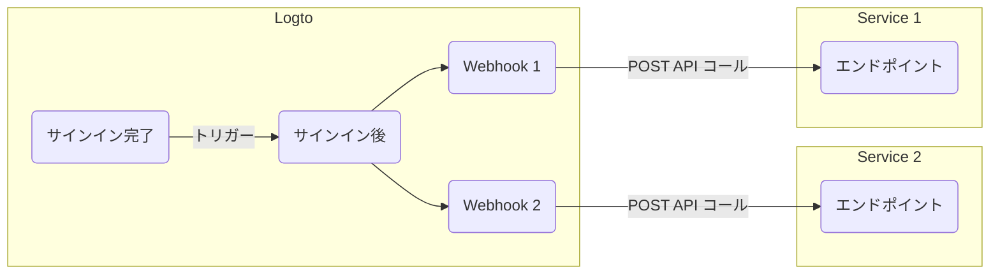

# Webhooks

Logto の [Webhook](https://auth.wiki/webhook) は、[ユーザーアカウント](/user-management/user-data)、[ロール](/authorization/role-based-access-control#roles)、[権限](/authorization/role-based-access-control#permissionsscopes)、[組織](/organizations/organization-data)、[組織ロール](/authorization/organization-template#organization-role)、[組織権限](/authorization/organization-template#organization-permission)、および [ユーザーインタラクション](/end-user-flows) への変更を含むさまざまなイベントに対するリアルタイム通知を提供します。

イベントがトリガーされると、Logto は提供されたエンドポイント URL に HTTP リクエストを送信し、ユーザー ID、ユーザー名、メールアドレス、その他の関連する詳細情報を含むイベントの詳細情報を含みます（ペイロードとヘッダーに含まれるデータの詳細については、[Webhook リクエスト](/developers/webhooks/webhooks-request) を参照してください）。あなたのアプリケーションはこのリクエストを処理し、メールを送信したり、データベースのデータを更新したりするなどのカスタマイズされたアクションを実行できます。

私たちはユーザーのニーズに基づいてさらに多くのイベントを追加し続けています。ビジネスに特定の要件がある場合は、お知らせください。

## Webhook を使用する理由

Webhooks はアプリケーション間のリアルタイム通信を提供し、ポーリングの必要性を排除し、即時のデータ更新を可能にします。複雑なコードや独自の API なしでアプリケーションの統合とワークフローの自動化を簡素化します。

CIAM の一般的な Webhook の使用例をいくつか紹介します：

- **メールを送信する**：Webhook を設定して、新しいユーザーが登録した際にウェルカムメールを送信したり、新しいデバイスや場所からユーザーがサインインした際に管理者に通知したりします。
- **通知を送信する**：Webhook を設定して、ユーザーがサインアップした際に CRM システムと連携してリアルタイムのカスタマーサポートを提供する仮想アシスタントをトリガーします。
- **追加の API コールを実行する**：Webhook を設定して、ユーザーのメールドメインや IP アドレスを確認してユーザーアクセスを検証し、Logto Management API を使用してリソース権限を持つ適切なロールを割り当てます。
- **データ同期**：Webhook を設定して、ユーザーアカウントの停止や削除などの変更についてアプリケーションを更新します。
- **レポートを生成する**：Webhook を設定してユーザーのログイン活動データを受け取り、ユーザーのエンゲージメントや使用パターンに関するレポートを作成します。

## 用語

| 項目                                                                                                                                                                         | 説明                                                                                                                                                                                                         |
| ---------------------------------------------------------------------------------------------------------------------------------------------------------------------------- | ------------------------------------------------------------------------------------------------------------------------------------------------------------------------------------------------------------ |
| イベント                                                                                                                                                                     | 特定のアクションが行われると、特定のタイプのフックイベントがトリガーされます。例：ユーザーがサインアッププロセスを完了し新しいアカウントを作成したときに、Logto は PostRegister フックイベントを発行します。 |
| フック                                                                                                                                                                       | 特定のイベントにフックする単一または一連のアクション。アクションは API の呼び出し、コードスニペットの実行などが含まれます。                                                                                  |
| Webhook                                                                                                                                                                      | イベントペイロードを持つ API を呼び出すことを示すフックのサブタイプ。                                                                                                                                        |
| 開発者が新しいデバイスでユーザーがサインインしたときに通知を送信したい場合、開発者は PostSignIn イベントに対してセキュリティサービス API を呼び出す Webhook を追加できます。 |

Logto で `PostSignIn` イベントに対して 2 つの Webhook を有効にする例を示します：

## よくある質問

### Logto は同期 Webhook をサポートしていますか？

同期 Webhook はユーザーのサインインフローをスムーズにするかもしれませんが、現時点ではサポートしていません（将来的にはサポート予定です）。したがって、同期 Webhook に依存するシナリオは現在すべて異なる回避策が必要です。質問がある場合は、お気軽にお問い合わせください。

### ユーザー権限の変更にどのように対処しますか？

[ユーザー権限の変更を管理する](/authorization/role-based-access-control/protect-api-resources-with-rbac/#optional-handle-user-permission-change) ガイドを参照してください。

### Webhook のタイムアウトをデバッグする方法は？

Webhook を受信するエンドポイントは、Webhook が正常に受信されたことを Logto に知らせるために、できるだけ早く 2xx 応答を返す必要があります。異なるユーザーが Webhook に対して非常に異なる処理ロジックを持っているため、過度に複雑なタスクは数秒かかることがあり、Logto Webhook がタイムアウトする原因となることがあります。ベストプラクティスは独自のイベントキューを維持することです。Logto Webhook を受信したら、イベントをキューに挿入し、Logto に 2xx 応答を返します。その後、独自のワーカーがキュー内のタスクを段階的に処理します。ワーカーがエラーに遭遇した場合は、独自のサーバーで処理します。

### `PostSignIn` Webhook からクライアントの IP アドレスを取得できますか？

はい、Webhook ペイロードで IP アドレス、ユーザーエージェントなどを取得できます。現在サポートされていない情報が必要な場合は、GitHub の issue で機能リクエストを作成するか、お問い合わせください。

## 関連リソース

<Url href="https://blog.logto.io/webhooks-vs-polling">Webhooks vs. polling</Url>
