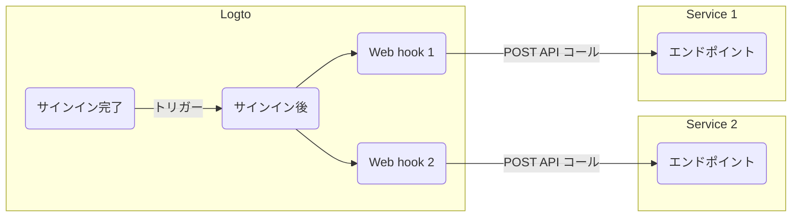

# Webhook

Logto [Webhook](https://auth.wiki/webhook) は、ユーザーアカウント、ロール、権限、組織 (Organizations)、組織ロール、組織権限、[ユーザー操作](/end-user-flows) など、さまざまなイベントに対してリアルタイム通知を提供します。

イベントがトリガーされると、Logto は指定した Endpoint URL に HTTP リクエストを送信し、ユーザー ID、ユーザー名、メールアドレスなど、イベントに関する詳細情報を含みます（ペイロードやヘッダーに含まれるデータの詳細については [Webhook リクエスト](/developers/webhooks/webhooks-request) を参照してください）。アプリケーション側でこのリクエストを処理し、メール送信やデータベースの更新など、カスタマイズしたアクションを実行できます。

ユーザーの要望に応じて、対応するイベントを随時追加しています。ビジネスに特化したご要望があれば、ぜひお知らせください。

## なぜ Webhook を使うのか？ \{#why-use-webhook}

Webhook はアプリケーション間のリアルタイム通信を実現し、ポーリングの必要をなくし、即時のデータ更新を可能にします。複雑なコードや独自 API なしで、アプリケーション統合やワークフロー自動化をシンプルにします。

CIAM における Webhook の一般的なユースケース例：

- **メール送信**：Webhook を設定し、新規ユーザー登録時にウェルカムメールを送信したり、新しいデバイスや場所からサインインがあった際に管理者へ通知したりできます。
- **通知送信**：Webhook を設定し、CRM システムと連携したバーチャルアシスタントをトリガーし、ユーザー登録時にリアルタイムでカスタマーサポートを提供できます。
- **追加の API コール実行**：Webhook を設定し、ユーザーのメールドメインや IP アドレスを確認してアクセスを検証し、Logto Management API を使ってリソース権限付きの適切なロールを割り当てます。
- **データ同期**：Webhook を設定し、ユーザーアカウントの停止や削除などの変更をアプリケーション側で常に最新に保ちます。
- **レポート生成**：Webhook を設定し、ユーザーのログインアクティビティデータを受け取り、ユーザーエンゲージメントや利用傾向のレポート作成に活用します。

## 用語 \{#terms}

| Item                                                                                                                                                                              | Description                                                                                                                                                                                      |
| --------------------------------------------------------------------------------------------------------------------------------------------------------------------------------- | ------------------------------------------------------------------------------------------------------------------------------------------------------------------------------------------------ |
| Event                                                                                                                                                                             | 特定のアクションが実行されると、特定タイプのフックイベントがトリガーされます。例：ユーザーがサインアップを完了し新しいアカウントを作成した際、Logto は PostRegister フックイベントを発行します。 |
| Hook                                                                                                                                                                              | 特定イベントにフックする 1 つまたは複数のアクション。アクションには API コールやコードスニペットの実行などが含まれます。                                                                         |
| Webhook                                                                                                                                                                           | イベントのペイロードを使って API を呼び出すフックのサブタイプです。                                                                                                                              |
| たとえば、開発者がユーザーが新しいデバイスからサインインした際に通知を送りたい場合、PostSignIn イベントに対して自身のセキュリティサービス API を呼び出す Webhook を追加できます。 |

以下は、Logto で `PostSignIn` イベントに対して 2 つの Webhook を有効化する例です：

```mermaid
graph LR
  subgraph Logto
    SF(サインイン完了)
    PS(サインイン後)
    WH2(Web hook 2)
    WH1(Web hook 1)
  end

  subgraph Service 2
    E2(エンドポイント)
  end

  subgraph Service 1
    E1(エンドポイント)
  end

  SF -->|トリガー| PS
  PS --> WH1
  PS --> WH2
  WH1 --->|POST API コール| E1
  WH2 --->|POST API コール| E2

```

## よくある質問 \{#faqs}

### Logto は同期 Webhook をサポートしていますか？ \{#does-logto-support-synced-webhooks}

同期 Webhook を利用するとユーザーのサインインフローがよりスムーズになりますが、現時点では未対応です（将来的に対応予定）。そのため、同期 Webhook に依存するシナリオは現状では個別のワークアラウンドが必要です。ご質問があればお気軽にお問い合わせください。

### ユーザー権限の変更にはどう対応すればよいですか？ \{#how-to-deal-with-user-permission-change}

[ユーザー権限変更の管理](/authorization/global-api-resources/#optional-handle-user-permission-change) ガイドをご覧ください。

### Webhook のタイムアウトをデバッグするには？ \{#how-to-debug-webhook-timeout}

Webhook を受信するエンドポイントは、Webhook を正常に受信したことを Logto に伝えるため、できるだけ早く 2xx レスポンスを返す必要があります。Webhook の処理ロジックはユーザーごとに大きく異なるため、複雑な処理は数秒かかる場合があり、Logto Webhook がタイムアウトすることがあります。ベストプラクティスは独自のイベントキューを用意し、Logto Webhook を受信したらイベントをキューに挿入し、すぐに 2xx レスポンスを Logto に返すことです。その後、独自のワーカーでキュー内のタスクを順次処理します。ワーカーでエラーが発生した場合は、自身のサーバーで対応してください。

### `PostSignIn` Webhook からクライアントの IP アドレスを取得できますか？ \{#can-i-get-the-client-ip-address-from-postsignin-webhooks}

はい、Webhook のペイロードから IP アドレスやユーザーエージェントなどを取得できます。現在サポートされていない情報が必要な場合は、GitHub issue でフィーチャーリクエストを作成するか、お問い合わせください。

## 関連リソース \{#related-resources}

<Url href="https://blog.logto.io/webhooks-vs-polling">Webhooks vs. polling</Url>
