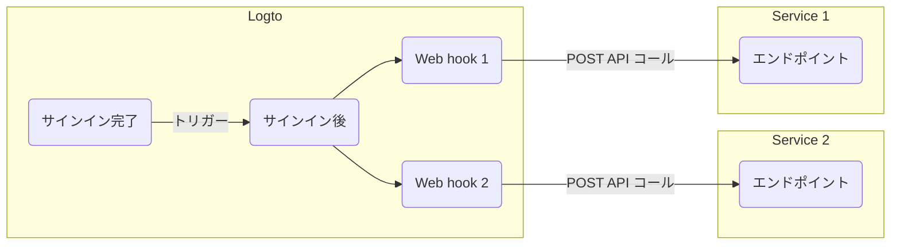

# Webhook

Logto の [Webhook](https://auth.wiki/webhook) は、ユーザーアカウント、ロール、権限、組織 (Organizations)、組織ロール、組織権限、[ユーザーインタラクション](/end-user-flows) など、さまざまなイベントに対してリアルタイム通知を提供します。

イベントがトリガーされると、Logto は指定したエンドポイント URL に非同期で HTTP リクエストを送信します。このリクエストには、ユーザー、アプリケーション、リクエストコンテキストなど、イベントの詳細が含まれます。ペイロードやヘッダーの詳細は [Webhook リクエスト](/developers/webhooks/webhooks-request) を参照してください。

Webhook の配信は認証リクエストの外で行われ、現在のフローの結果を変更することはできません。サインインが継続する前に必ず完了させる必要がある同期コードには、[Actions](/developers/actions) を利用してください。

ユーザーのニーズに応じて、対応イベントを随時追加しています。ビジネス要件があれば、ぜひご連絡ください。

## なぜ Webhook を使うのか？ \{#why-use-webhook}

Webhook はアプリケーション間のリアルタイム通信を提供し、ポーリングの必要をなくし、即時のデータ更新を可能にします。複雑なコードや独自 API なしで、アプリケーション統合やワークフロー自動化を簡素化します。

CIAM における一般的な Webhook のユースケース例：

- **メール送信**：Webhook を設定して、新規ユーザー登録時にウェルカムメールを送信したり、ユーザーが新しいデバイスや場所からサインインした際に管理者へ通知したりできます。
- **通知送信**：Webhook を設定して、CRM システムと連携したバーチャルアシスタントをトリガーし、ユーザー登録時にリアルタイムでカスタマーサポートを提供できます。
- **追加の API コール実行**：Webhook を設定して、ユーザーのメールドメインや IP アドレスを確認し、Logto Management API を使ってリソース権限付きの適切なロールを割り当てることができます。
- **データ同期**：Webhook を設定して、ユーザーアカウントの停止や削除などの変更をアプリケーションに反映させることができます。
- **レポート生成**：Webhook を設定してユーザーのログインアクティビティデータを受信し、ユーザーエンゲージメントや利用パターンのレポート作成に活用できます。

## 用語 \{#terms}

| 項目             | 説明                                                                                |
| ---------------- | ----------------------------------------------------------------------------------- |
| Webhook イベント | Logto が配信可能なサポートイベントタイプ。例：`PostSignIn` や `User.Created` など。 |
| Webhook          | 1 つ以上のイベントを購読し、そのペイロードを HTTP エンドポイントへ送信する設定。    |

たとえば、ユーザーがサインインした後にセキュリティサービスへ通知したい場合は、`PostSignIn` を購読する Webhook を作成します。

Logto で `PostSignIn` イベントに対して 2 つの Webhook を有効化する例：

```mermaid
graph LR
  subgraph Logto
    SF(サインイン完了)
    PS(サインイン後)
    WH2(Web hook 2)
    WH1(Web hook 1)
  end

  subgraph Service 2
    E2(エンドポイント)
  end

  subgraph Service 1
    E1(エンドポイント)
  end

  SF -->|トリガー| PS
  PS --> WH1
  PS --> WH2
  WH1 --->|POST API コール| E1
  WH2 --->|POST API コール| E2

```

## よくある質問 \{#faqs}

### Webhook で同期的な認証 (Authentication) 判定はできますか？ \{#does-logto-support-synced-webhooks}

できません。Webhook は非同期通知のため、そのレスポンスで現在の認証 (Authentication) フローを許可・ブロック・変更することはできません。

サインイン継続前に Logto でカスタムコード実行や外部 API コール、ユーザー更新が必要な場合は [Actions](/developers/actions) を利用してください。Actions は同期的に動作するため、外部依存先は高速かつ信頼性の高いものにしてください。

### ユーザー権限変更への対応方法は？ \{#how-to-deal-with-user-permission-change}

[ユーザー権限変更の管理](/authorization/global-api-resources/#optional-handle-user-permission-change) ガイドを参照してください。

### Webhook タイムアウトのデバッグ方法は？ \{#how-to-debug-webhook-timeout}

Webhook を受信するエンドポイントは、できるだけ早く 2xx レスポンスを返して Logto に Webhook の受信成功を伝える必要があります。Webhook の処理ロジックが複雑すぎると数秒かかり、Logto Webhook がタイムアウトする場合があります。ベストプラクティスは独自のイベントキューを用意し、Logto Webhook 受信時にイベントをキューへ挿入し、すぐに 2xx レスポンスを返すことです。その後、独自のワーカーでキュー内のタスクを順次処理してください。ワーカーでエラーが発生した場合は、自サーバー側で対応してください。

### `PostSignIn` Webhook からクライアント IP アドレスを取得できますか？ \{#can-i-get-the-client-ip-address-from-postsignin-webhooks}

はい、Webhook のペイロードで IP アドレスやユーザーエージェントなどを取得できます。現在サポートされていない情報が必要な場合は、GitHub issues でフィーチャーリクエストを作成するか、お問い合わせください。

## 関連リソース \{#related-resources}

<Url href="https://blog.logto.io/webhooks-vs-polling">Webhook とポーリングの違い</Url>
