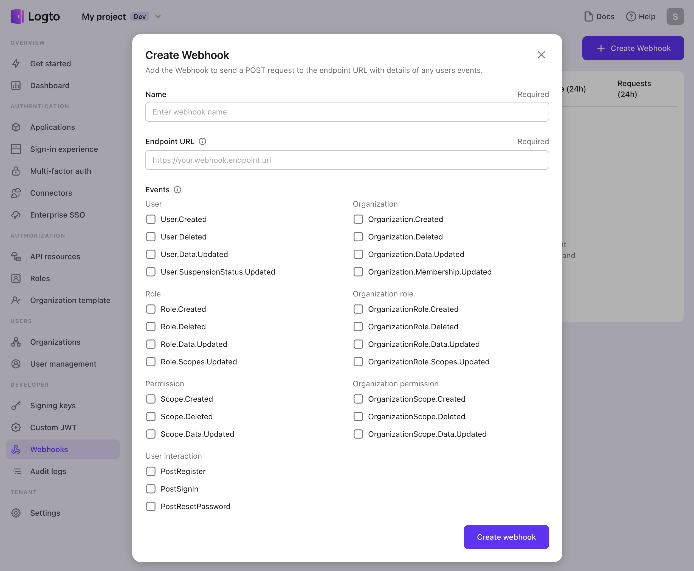

# Webhook を設定する

Logto コンソールで webhook を設定して、シームレスな統合を実現し、アプリケーションのリアルタイムイベント通知を受け取りましょう。簡単な設定、強化されたセキュリティ、便利なヘルスモニタリングオプションをお楽しみください。

## Webhook を作成する

まず、Logto Agent によって呼び出される webhook エンドポイントを作成します。このエンドポイントは、サーバー上で実装され、HTTP リクエストを受信できる必要があります。

Logto コンソールで新しい webhook を作成するには、次の手順に従います：

1. **Webhook を作成する**: <CloudLink to="/webhooks">Console > Webhooks</CloudLink> に移動し、「Create webhook」ボタンをクリックします。
2. **名前**: Webhook の名前を入力します。これは使用シナリオを定義するための参照用です。
3. **Endpoint URL**: `Endpoint URL` を入力します。これは、イベントが発生したときに webhook の POST リクエストを受信するサーバーの URL です。セキュリティ上の理由から、URL は HTTPS 経由で公開アクセス可能であり、ローカルホスト URL であってはなりません。

   :::note
   サーバーは、Logto webhook リクエストを受信した直後に HTTP 200（「OK」）応答を返して、リクエストが受信されたことを通知する必要があります。

   対応する Webhook イベントのロジック処理が完了するまで応答を待つと、Webhook がタイムアウトする可能性があります。

   Logto webhook に 200 以外の応答を返さないでください。イベントの処理中にエラーが発生した場合は、自分のサーバーで処理してください。
   :::

4. **イベント**: 表示されるモーダルで、この webhook をトリガーする [イベント](/developers/webhooks/webhooks-events) を選択します。サーバーの受信を圧倒しないように、要件を満たす少数のイベントを選択することをお勧めします。Webhook を作成した後、選択したイベントをいつでも変更できます。

   

5. **無効化 / 再有効化**: デフォルトでは、Webhook は作成直後にすぐに有効化されます。Webhook を一時的に停止したい場合は、作成後にヘッダーの右上隅にある「三点リーダー」メニューを使用して無効化または再有効化できます。

## Webhook を保護する

サーバーが webhook リクエストを受信する準備が整ったら、それを安全に処理できることを確認したいでしょう。Logto は各 webhook リクエストペイロードに署名を生成し、リクエストが Logto からのものであることを確認できます。

新しい webhook を作成した後、セキュリティを強化するためのオプションがあります：

- **署名キー**: Logto は各 webhook に対して一意のハッシュ署名、署名キーを生成します。このキーをエンドポイント実装のリクエストヘッダーとして含めることができます。署名キーを検証することで、webhook ペイロードが Logto からのものであり、許可されていないソースによって改ざんされていないことを確認できます。[webhook のセキュリティを確保する](/developers/webhooks/secure-webhooks/) を読んで、コードについて詳しく学びましょう。
- **カスタムヘッダー**: Webhook ペイロードにカスタムヘッダーを含めて、追加のコンテキストやメタデータを提供するオプションがあります。この機能により、webhook データを効果的に処理するために役立つ関連情報を追加できます。

署名キーを利用し、カスタムヘッダーの追加を検討することで、webhook のセキュリティを強化し、受信したペイロードの整合性と信頼性を確保できます。

## Webhook をテストする

Logto とサービス間の接続をテストするには、「Send test payload」ボタンをクリックするだけです。Logto は、選択した各イベントのサンプルペイロードをエンドポイント URL に送信します。これらのテストリクエストには匿名データが含まれており、最近のリクエスト履歴には記録されません。

このテストにより、Logto からのペイロードを受信し処理するために webhook が適切に設定されていることを確認できます。ライブ環境で webhook を展開する前に、統合を検証することができます。

## Webhook のヘルスステータスを監視する

Logto は、webhook のヘルスステータスを監視し、潜在的な問題を詳細に調査するための便利なツールを提供します：

- **ヘルスステータス**
  Logto の webhook リストには、各 webhook のヘルスステータスが表示され、過去 24 時間の成功率とリクエストの総数が含まれています。この情報により、webhook のパフォーマンスの概要を把握できます。
- **独立したリクエストログ**
  各 webhook の「Recent Requests」セクションでは、過去 24 時間のリクエストログにアクセスできます。各リクエストは個別に記録され、各リクエストの詳細を確認し、潜在的なエラーや異常を調査できます。
- **自動再試行**
  配信が失敗した場合（webhook 応答ステータスが 500 以上の場合）、Logto は配信を最大 3 回まで自動的に再試行します。同じリクエストの複数の再試行は、不要な重複を避けるために単一のログエントリのみを生成します。

これらの監視機能を活用することで、webhook のヘルスを効果的に追跡し、リクエストログを調査し、webhook 統合の信頼性とパフォーマンスを確保できます。
