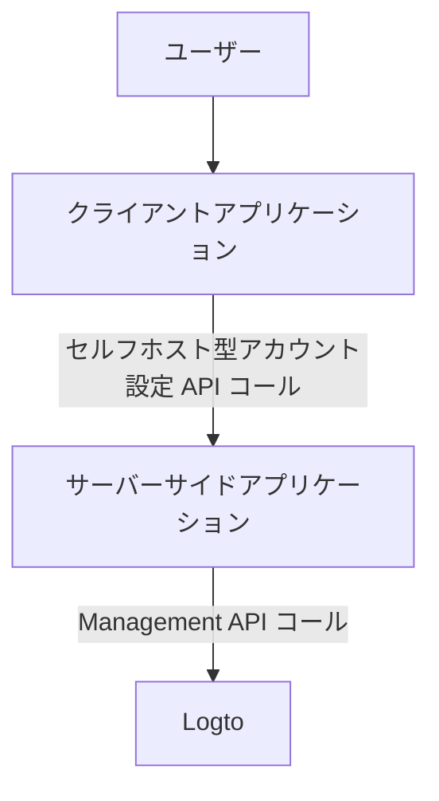
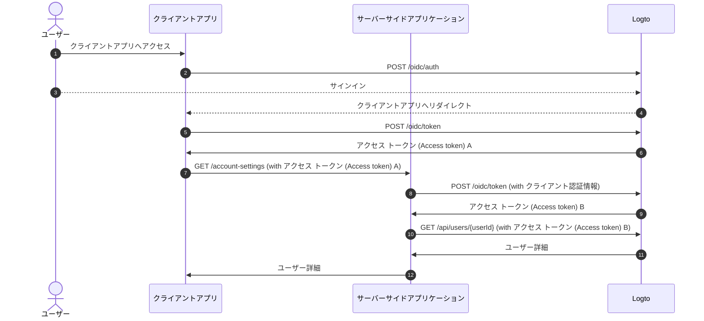
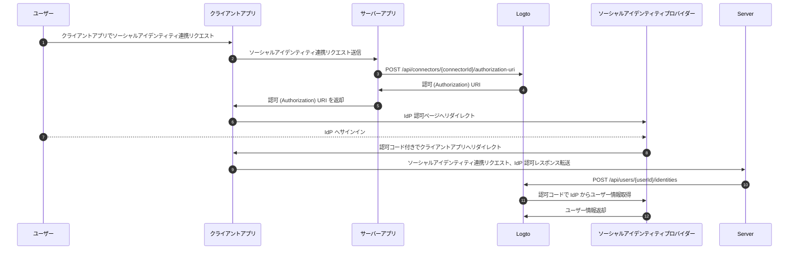

# Management API によるアカウント設定

## インテグレーション \{#integrations}

Logto は、ユーザーアカウントを管理するためのさまざまな Management API を提供しています。これらの API を利用して、エンドユーザー向けのセルフサービス型アカウント設定ページを構築できます。

### アーキテクチャ \{#architecture}

1. **ユーザー**：アカウント設定へアクセス・管理する認証済みエンドユーザー。
2. **クライアントアプリケーション**：ユーザーにアカウント設定ページを提供するクライアントアプリケーション。
3. **サーバーサイドアプリケーション**：クライアントにアカウント設定 API を提供するサーバーサイドアプリケーション。Logto Management API と連携します。
4. **Logto**：認証 (Authentication) および認可 (Authorization) サービスとしての Logto。ユーザーアカウント管理用の Management API を提供します。

### シーケンス図 \{#sequence-diagram}

1. ユーザーがクライアントアプリケーションへアクセスします。
2. クライアントアプリケーションが認証リクエスト (Authentication request) を Logto へ送り、ユーザーを Logto のサインインページへリダイレクトします。
3. ユーザーが Logto へサインインします。
4. 認証 (Authentication) 済みユーザーが認可コードとともにクライアントアプリケーションへリダイレクトされます。
5. クライアントアプリケーションがセルフホスト型アカウント設定 API へのアクセス用に Logto からアクセス トークン (Access token) をリクエストします。
6. Logto がクライアントアプリケーションへアクセス トークン (Access token) を発行します。
7. クライアントアプリケーションがユーザーのアクセス トークン (Access token) を付与してサーバーサイドアプリケーションへアカウント設定リクエストを送信します。
8. サーバーサイドアプリケーションがユーザーのアクセス トークン (Access token) からリクエスターのアイデンティティと権限を検証し、Management API 用のアクセス トークン (Access token) を Logto へリクエストします。
9. Logto がサーバーサイドアプリケーションへ Management API 用のアクセス トークン (Access token) を発行します。
10. サーバーサイドアプリケーションが Management API 用のアクセス トークン (Access token) を使って Logto からユーザーデータを取得します。
11. Logto がサーバーのアイデンティティと Management API 権限を検証し、ユーザーデータを返します。
12. サーバーサイドアプリケーションがリクエスターの権限に基づきユーザーデータを処理し、クライアントアプリケーションへユーザーアカウント詳細を返します。

### Management API をサーバーサイドアプリケーションへ統合する \{#integrate-management-api-to-server-side-application}

サーバーサイドアプリケーションへの Management API 統合方法については、[Management API](/integrate-logto/interact-with-management-api/) セクションを参照してください。

## ユーザー管理 API \{#user-management-apis}

### ユーザーデータスキーマ \{#user-data-schema}

Logto のユーザースキーマについて詳しくは、[ユーザーデータとカスタムデータ](/user-management/user-data/) セクションを参照してください。

### ユーザープロファイルおよび識別子管理 API \{#user-profile-and-identifiers-management-apis}

ユーザープロファイルと識別子はユーザー管理に不可欠です。以下の API を利用してユーザープロファイルや識別子を管理できます。

| method | path                                                                                                     | description                                          |
| ------ | -------------------------------------------------------------------------------------------------------- | ---------------------------------------------------- |
| GET    | [/api/users/\{userId\}](https://openapi.logto.io/operation/operation-getuser)                            | ユーザー ID でユーザー詳細を取得します。             |
| PATCH  | [/api/users/\{userId\}](https://openapi.logto.io/operation/operation-updateuser)                         | ユーザー詳細を更新します。                           |
| PATCH  | [/api/users/\{userId\}/profile](https://openapi.logto.io/operation/operation-updateuserprofile)          | ユーザー ID でユーザープロファイル項目を更新します。 |
| GET    | [/api/users/\{userId\}/custom-data](https://openapi.logto.io/operation/operation-listusercustomdata)     | ユーザー ID でカスタムデータを取得します。           |
| PATCH  | [/api/users/\{userId\}/custom-data](https://openapi.logto.io/operation/operation-updateusercustomdata)   | ユーザー ID でカスタムデータを更新します。           |
| PATCH  | [/api/users/\{userId\}/is-suspended](https://openapi.logto.io/operation/operation-updateuserissuspended) | ユーザー ID でユーザーの停止状態を更新します。       |

### メールアドレスと電話番号の認証 (Verification) \{#email-and-phone-number-verification}

Logto システムでは、メールアドレスと電話番号の両方がユーザー識別子として利用できるため、その認証 (Verification) は重要です。これをサポートするため、提供されたメールアドレスや電話番号を認証 (Verification) するための認証コード API を用意しています。

:::note
新しいメールアドレスや電話番号でユーザープロファイルを更新する前に、必ずメールアドレスまたは電話番号を認証 (Verification) してください。
:::

| method | path                                                                                                                             | description                                                            |
| ------ | -------------------------------------------------------------------------------------------------------------------------------- | ---------------------------------------------------------------------- |
| POST   | [/api/verifications/verification-code](https://openapi.logto.io/operation/operation-createverificationbyverificationcode)        | メールアドレスまたは電話番号の認証コードを送信します。                 |
| POST   | [/api/verifications/verification-code/verify](https://openapi.logto.io/operation/operation-verifyverificationbyverificationcode) | 認証コードでメールアドレスまたは電話番号を認証 (Verification) します。 |

### ユーザーパスワード管理 \{#user-password-management}

| method | path                                                                                                     | description                                                  |
| ------ | -------------------------------------------------------------------------------------------------------- | ------------------------------------------------------------ |
| POST   | [/api/users/\{userId\}/password/verify](https://openapi.logto.io/operation/operation-verifyuserpassword) | ユーザー ID で現在のパスワードを認証 (Verification) します。 |
| PATCH  | [/api/users/\{userId\}/password](https://openapi.logto.io/operation/operation-updateuserpassword)        | ユーザー ID でパスワードを更新します。                       |
| GET    | [/api/users/\{userId\}/has-password](https://openapi.logto.io/operation/operation-getuserhaspassword)    | ユーザー ID でパスワードの有無を確認します。                 |

:::note
ユーザーのパスワードを更新する前に、必ず現在のパスワードを認証 (Verification) してください。
:::

### ユーザーソーシャルアイデンティティ管理 \{#user-social-identities-management}

| method | path                                                                                                                              | description                                                                                                                                        |
| ------ | --------------------------------------------------------------------------------------------------------------------------------- | -------------------------------------------------------------------------------------------------------------------------------------------------- |
| GET    | [/api/users/\{userId\}](https://openapi.logto.io/operation/operation-getuser)                                                     | ユーザー ID でユーザー詳細を取得します。ソーシャルアイデンティティは `identities` フィールドに含まれます。                                         |
| POST   | [/api/users/\{userId\}/identities](https://openapi.logto.io/operation/operation-createuseridentity)                               | 認証 (Authentication) 済みソーシャルアイデンティティをユーザー ID でリンクします。                                                                 |
| DELETE | [/api/users/\{userId\}/identities](https://openapi.logto.io/operation/operation-deleteuseridentity)                               | ユーザー ID でソーシャルアイデンティティのリンクを解除します。                                                                                     |
| PUT    | [/api/users/\{userId\}/identities](https://openapi.logto.io/operation/operation-replaceuseridentity)                              | ユーザー ID でリンクされたソーシャルアイデンティティを直接更新します。                                                                             |
| POST   | [/api/connectors/\{connectorId\}/authorization-uri](https://openapi.logto.io/operation/operation-createconnectorauthorizationuri) | ソーシャルアイデンティティプロバイダーの認可 (Authorization) URI を取得します。この URI を使って新しいソーシャルアイデンティティ連携を開始します。 |

1. ユーザーがクライアントアプリケーションへアクセスし、ソーシャルアイデンティティ連携をリクエストします。
2. クライアントアプリケーションがサーバーへソーシャルアイデンティティ連携リクエストを送信します。
3. サーバーが Logto へソーシャルアイデンティティプロバイダーの認可 (Authorization) URI を取得するリクエストを送信します。この際、独自の `state` パラメーターと `redirect_uri` をリクエストに含める必要があります。`redirect_uri` はソーシャルアイデンティティプロバイダーに事前登録してください。
4. Logto がサーバーへ認可 (Authorization) URI を返却します。
5. サーバーがクライアントアプリケーションへ認可 (Authorization) URI を返却します。
6. クライアントアプリケーションがユーザーを IdP 認可 (Authorization) URI へリダイレクトします。
7. ユーザーが IdP へサインインします。
8. IdP が認可コード付きでユーザーを `redirect_uri` へリダイレクトします。
9. クライアントアプリケーションが `state` を検証し、IdP 認可レスポンスをサーバーへ転送します。
10. サーバーが Logto へソーシャルアイデンティティをユーザーへリンクするリクエストを送信します。
11. Logto が認可コードを使って IdP からユーザー情報を取得します。
12. IdP がユーザー情報を Logto へ返却し、Logto がソーシャルアイデンティティをユーザーへリンクします。

:::note
新しいソーシャルアイデンティティをユーザーへリンクする際には、いくつかの制限事項があります：

- Management API にはセッションコンテキストがないため、ソーシャル認証状態を安全に維持するためにアクティブなセッションが必要なソーシャルコネクターは Management API 経由でリンクできません。サポートされないコネクターには apple、標準 OIDC、標準 OAuth 2.0 コネクターが含まれます。
- 同じ理由で、Logto は認可レスポンスの `state` パラメーターを検証できません。クライアントアプリで `state` パラメーターを保存し、認可レスポンス受信時に必ず検証してください。
- `redirect_uri` を事前にソーシャルアイデンティティプロバイダーへ登録する必要があります。登録しない場合、ソーシャル IdP はユーザーをクライアントアプリへリダイレクトしません。ソーシャル IdP には、ユーザーサインイン用とプロフィール連携ページ用の複数のコールバック `redirect_uri` を登録できる必要があります。

:::

### ユーザーエンタープライズアイデンティティ管理 \{#user-enterprise-identities-management}

| method | path                                                                                                    | description                                                                                                                                                                                |
| ------ | ------------------------------------------------------------------------------------------------------- | ------------------------------------------------------------------------------------------------------------------------------------------------------------------------------------------ |
| GET    | [/api/users/\{userId\}?includeSsoIdentities=true](https://openapi.logto.io/operation/operation-getuser) | ユーザー ID でユーザー詳細を取得します。エンタープライズアイデンティティは `ssoIdentities` フィールドに含まれます。API で `includeSsoIdentities=true` クエリパラメータを追加してください。 |

現在、Management API ではユーザーへのエンタープライズアイデンティティのリンク・解除はサポートしていません。ユーザーにリンクされたエンタープライズアイデンティティの表示のみ可能です。

### パーソナルアクセストークン \{#personal-access-token}

| method | path                                                                                                                                 | description                                                |
| ------ | ------------------------------------------------------------------------------------------------------------------------------------ | ---------------------------------------------------------- |
| GET    | [/api/users/\{userId\}/personal-access-tokens](https://openapi.logto.io/operation/operation-listuserpersonalaccesstokens)            | ユーザーのすべてのパーソナルアクセストークンを取得します。 |
| POST   | [/api/users/\{userId\}/personal-access-tokens](https://openapi.logto.io/operation/operation-createuserpersonalaccesstoken)           | ユーザーに新しいパーソナルアクセストークンを追加します。   |
| DELETE | [/api/users/\{userId\}/personal-access-tokens/\{name\}](https://openapi.logto.io/operation/operation-deleteuserpersonalaccesstoken)  | 名前でユーザーのトークンを削除します。                     |
| PATCH  | [/api/users/\{userId\s}/personal-access-tokens/\{name\}](https://openapi.logto.io/operation/operation-updateuserpersonalaccesstoken) | 名前でユーザーのトークンを更新します。                     |

パーソナルアクセストークンは、ユーザーが認証情報やインタラクティブなサインインを使わずに [アクセス トークン (Access token)](https://auth.wiki/access-token) を安全に付与する方法を提供します。詳しくは [パーソナルアクセストークンの利用](/user-management/personal-access-token) をご覧ください。

### ユーザー多要素認証 (MFA) 設定管理 \{#user-mfa-settings-management}

| method | path                                                                                                                                 | description                                                 |
| ------ | ------------------------------------------------------------------------------------------------------------------------------------ | ----------------------------------------------------------- |
| GET    | [/api/users/\{userId\}/mfa-verifications](https://openapi.logto.io/operation/operation-listusermfaverifications)                     | ユーザー ID でユーザーの多要素認証 (MFA) 設定を取得します。 |
| POST   | [/api/users/\{userId\}/mfa-verifications](https://openapi.logto.io/operation/operation-createusermfaverification)                    | ユーザー ID で多要素認証 (MFA) 設定を追加します。           |
| DELETE | [/api/users/\{userId\}/mfa-verifications/\{verificationId\}](https://openapi.logto.io/operation/operation-deleteusermfaverification) | ID でユーザーの多要素認証 (MFA) 設定を削除します。          |

### ユーザーアカウント削除 \{#user-account-deletion}

| method | path                                                                             | description                          |
| ------ | -------------------------------------------------------------------------------- | ------------------------------------ |
| DELETE | [/api/users/\{userId\}](https://openapi.logto.io/operation/operation-deleteuser) | ユーザー ID でユーザーを削除します。 |
