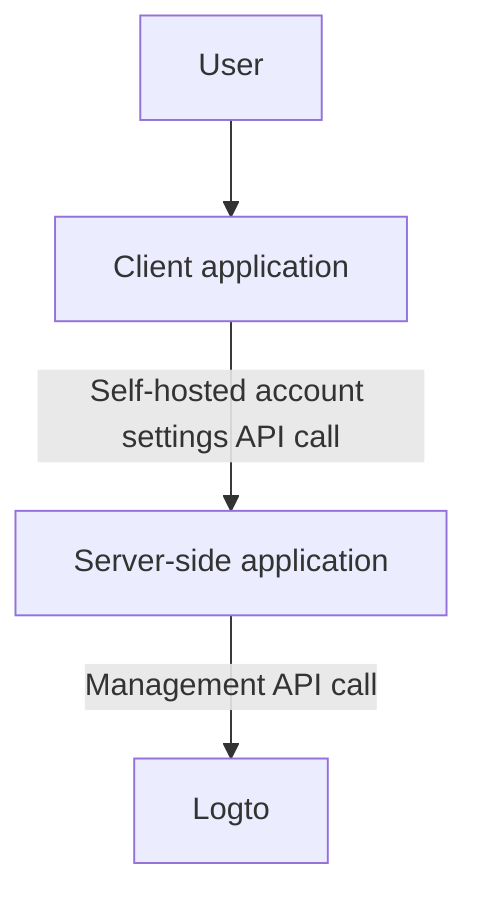
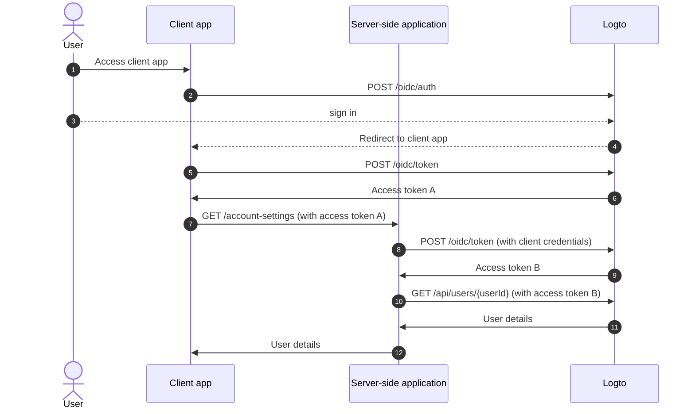
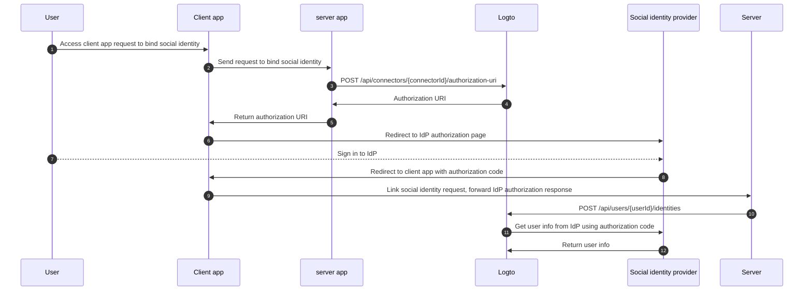

# Management API によるアカウント設定

## 統合 \{#integrations}

Logto は、ユーザーアカウントを管理するためのさまざまな Management API を提供しています。これらの API を使用して、エンドユーザー向けのセルフサービスアカウント設定ページを構築できます。

### アーキテクチャ \{#architecture}

1. **User**: アカウント設定にアクセスし管理する必要がある認証済みのエンドユーザー。
2. **Client application**: ユーザーにアカウント設定ページを提供するクライアントアプリケーション。
3. **Server-side application**: クライアントにアカウント設定 API を提供するサーバーサイドアプリケーション。Logto Management API と連携します。
4. **Logto**: 認証 (Authentication) と認可 (Authorization) サービスとしての Logto。ユーザーアカウントを管理するための Management API を提供します。

### シーケンス図 \{#sequence-diagram}

1. ユーザーがクライアントアプリケーションにアクセスします。
2. クライアントアプリケーションは Logto に認証リクエストを送り、ユーザーを Logto のサインインページにリダイレクトします。
3. ユーザーが Logto にサインインします。
4. 認証されたユーザーは、認可トークンと共にクライアントアプリケーションにリダイレクトされます。
5. クライアントアプリケーションは、セルフホストされたアカウント設定 API アクセスのために Logto からアクセス トークンを要求します。
6. Logto はクライアントアプリケーションにアクセス トークンを付与します。
7. クライアントアプリケーションは、ユーザーアクセス トークンを使用してサーバーサイドアプリケーションにアカウント設定リクエストを送信します。
8. サーバーサイドアプリケーションは、ユーザーアクセス トークンからリクエスターのアイデンティティと権限を確認します。その後、Logto から Management API アクセス トークンを要求します。
9. Logto はサーバーサイドアプリケーションに Management API アクセス トークンを付与します。
10. サーバーサイドアプリケーションは、Management API アクセス トークンを使用して Logto からユーザーデータを要求します。
11. Logto はサーバーのアイデンティティと Management API 権限を確認し、ユーザーデータを返します。
12. サーバーサイドアプリケーションはリクエスターの権限に基づいてユーザーデータを処理し、ユーザーアカウントの詳細をクライアントアプリケーションに返します。

### Management API をサーバーサイドアプリケーションに統合する \{#integrate-management-api-to-server-side-application}

Management API をサーバーサイドアプリケーションと統合する方法については、[Management API](/integrate-logto/interact-with-management-api/) セクションを確認してください。

## ユーザー管理 API \{#user-management-apis}

### ユーザーデータスキーマ \{#user-data-schema}

Logto のユーザースキーマについて詳しく知るには、[ユーザーデータとカスタムデータ](/user-management/user-data/) セクションを確認してください。

### ユーザープロファイルと識別子管理 API \{#user-profile-and-identifiers-management-apis}

ユーザーのプロファイルと識別子は、ユーザー管理において重要です。以下の API を使用して、ユーザープロファイルと識別子を管理できます。

| method | path                                                                                                     | description                                                |
| ------ | -------------------------------------------------------------------------------------------------------- | ---------------------------------------------------------- |
| GET    | [/api/users/\{userId\}](https://openapi.logto.io/operation/operation-getuser)                            | ユーザー ID でユーザーの詳細を取得します。                 |
| PATCH  | [/api/users/\{userId\}](https://openapi.logto.io/operation/operation-updateuser)                         | ユーザーの詳細を更新します。                               |
| PATCH  | [/api/users/\{userId\}/profile](https://openapi.logto.io/operation/operation-updateuserprofile)          | ユーザー ID でユーザープロファイルフィールドを更新します。 |
| GET    | [/api/users/\{userId\}/custom-data](https://openapi.logto.io/operation/operation-listusercustomdata)     | ユーザー ID でユーザーのカスタムデータを取得します。       |
| PATCH  | [/api/users/\{userId\}/custom-data](https://openapi.logto.io/operation/operation-updateusercustomdata)   | ユーザー ID でユーザーのカスタムデータを更新します。       |
| PATCH  | [/api/users/\{userId\}/is-suspended](https://openapi.logto.io/operation/operation-updateuserissuspended) | ユーザー ID でユーザーの停止状態を更新します。             |

### メールアドレスと電話番号の認証 \{#email-and-phone-number-verification}

Logto システムでは、メールアドレスと電話番号の両方がユーザー識別子として機能するため、その認証が重要です。これをサポートするために、提供されたメールまたは電話番号を認証するための一連の認証コード API を提供しています。

:::note
新しいメールまたは電話番号でユーザープロファイルを更新する前に、メールまたは電話番号を認証してください。
:::

| method | path                                                                                                               | description                                    |
| ------ | ------------------------------------------------------------------------------------------------------------------ | ---------------------------------------------- |
| POST   | [/api/verification/verification-codes](https://openapi.logto.io/operation/operation-createverificationcode)        | メールまたは電話番号の認証コードを送信します。 |
| POST   | [/api/verification/verification-codes/verify](https://openapi.logto.io/operation/operation-verifyverificationcode) | 認証コードでメールまたは電話番号を認証します。 |

### ユーザーパスワード管理 \{#user-password-management}

| method | path                                                                                                     | description                                                  |
| ------ | -------------------------------------------------------------------------------------------------------- | ------------------------------------------------------------ |
| POST   | [/api/users/\{userId\}/password/verify](https://openapi.logto.io/operation/operation-verifyuserpassword) | ユーザー ID で現在のユーザーパスワードを確認します。         |
| PATCH  | [/api/users/\{userId\}/password](https://openapi.logto.io/operation/operation-updateuserpassword)        | ユーザー ID でユーザーパスワードを更新します。               |
| GET    | [/api/users/\{userId\}/has-password](https://openapi.logto.io/operation/operation-getuserhaspassword)    | ユーザー ID でユーザーがパスワードを持っているか確認します。 |

:::note
ユーザーのパスワードを更新する前に、現在のパスワードを確認してください。
:::

### ユーザーソーシャルアイデンティティ管理 \{#user-social-identities-management}

| method | path                                                                                                                              | description                                                                                                                          |
| ------ | --------------------------------------------------------------------------------------------------------------------------------- | ------------------------------------------------------------------------------------------------------------------------------------ |
| GET    | [/api/users/\{userId\}](https://openapi.logto.io/operation/operation-getuser)                                                     | ユーザー ID でユーザーの詳細を取得します。ソーシャルアイデンティティは `identities` フィールドにあります。                           |
| POST   | [/api/users/\{userId\}/identities](https://openapi.logto.io/operation/operation-createuseridentity)                               | 認証済みのソーシャルアイデンティティをユーザー ID にリンクします。                                                                   |
| DELETE | [/api/users/\{userId\}/identities](https://openapi.logto.io/operation/operation-deleteuseridentity)                               | ユーザー ID からソーシャルアイデンティティのリンクを解除します。                                                                     |
| PUT    | [/api/users/\{userId\}/identities](https://openapi.logto.io/operation/operation-replaceuseridentity)                              | ユーザー ID にリンクされたソーシャルアイデンティティを直接更新します。                                                               |
| POST   | [/api/connectors/\{connectorId\}/authorization-uri](https://openapi.logto.io/operation/operation-createconnectorauthorizationuri) | ソーシャルアイデンティティプロバイダーの認可 URI を取得します。この URI を使用して新しいソーシャルアイデンティティ接続を開始します。 |

1. ユーザーがクライアントアプリケーションにアクセスし、ソーシャルアイデンティティのバインドを要求します。
2. クライアントアプリケーションは、ソーシャルアイデンティティのバインドをサーバーに要求します。
3. サーバーは、ソーシャルアイデンティティプロバイダーの認可 URI を取得するために Logto にリクエストを送信します。このリクエストには独自の `state` パラメーターと `redirect_uri` を提供する必要があります。ソーシャルアイデンティティプロバイダーに `redirect_uri` を登録してください。
4. Logto はサーバーに認可 URI を返します。
5. サーバーはクライアントアプリケーションに認可 URI を返します。
6. クライアントアプリケーションはユーザーを IdP 認可 URI にリダイレクトします。
7. ユーザーが IdP にサインインします。
8. IdP は `redirect_uri` を使用してユーザーをクライアントアプリケーションにリダイレクトし、認可コードを付与します。
9. クライアントアプリケーションは `state` を検証し、IdP 認可応答をサーバーに転送します。
10. サーバーは、ソーシャルアイデンティティをユーザーにリンクするために Logto にリクエストを送信します。
11. Logto は認可コードを使用して IdP からユーザー情報を取得します。
12. IdP はユーザー情報を Logto に返し、Logto はソーシャルアイデンティティをユーザーにリンクします。

:::note
新しいソーシャルアイデンティティをユーザーにリンクする際に考慮すべき制限があります：

- Management API にはセッションコンテキストがないため、ソーシャル認証状態を安全に維持するためにアクティブなセッションを必要とするソーシャルコネクターは Management API を介してリンクできません。サポートされていないコネクターには、apple、標準 OIDC、および標準 OAuth 2.0 コネクターが含まれます。
- 同じ理由で、Logto は認可応答の `state` パラメーターを検証できません。クライアントアプリで `state` パラメーターを保存し、認可応答を受信したときに検証してください。
- ソーシャルアイデンティティプロバイダーに `redirect_uri` を事前に登録する必要があります。そうしないと、ソーシャル IdP はユーザーをクライアントアプリにリダイレクトしません。ソーシャル IdP は、ユーザーサインイン用と独自のプロファイルバインディングページ用の 2 つのコールバック `redirect_uri` を受け入れる必要があります。

:::

### ユーザーエンタープライズアイデンティティ管理 \{#user-enterprise-identities-management}

| method | path                                                                                                    | description                                                                                                                                                                                               |
| ------ | ------------------------------------------------------------------------------------------------------- | --------------------------------------------------------------------------------------------------------------------------------------------------------------------------------------------------------- |
| GET    | [/api/users/\{userId\}?includeSsoIdentities=true](https://openapi.logto.io/operation/operation-getuser) | ユーザー ID でユーザーの詳細を取得します。エンタープライズアイデンティティは `ssoIdentities` フィールドにあります。ユーザー詳細 API に `includeSsoIdentities=true` クエリパラメーターを追加して含めます。 |

現在、Management API はユーザーにエンタープライズアイデンティティをリンクまたはリンク解除することをサポートしていません。ユーザーにリンクされたエンタープライズアイデンティティを表示することのみが可能です。

### パーソナルアクセストークン \{#personal-access-token}

| method | path                                                                                                                                 | description                                                |
| ------ | ------------------------------------------------------------------------------------------------------------------------------------ | ---------------------------------------------------------- |
| GET    | [/api/users/\{userId\}/personal-access-tokens](https://openapi.logto.io/operation/operation-listuserpersonalaccesstokens)            | ユーザーのすべてのパーソナルアクセストークンを取得します。 |
| POST   | [/api/users/\{userId\}/personal-access-tokens](https://openapi.logto.io/operation/operation-createuserpersonalaccesstoken)           | ユーザーの新しいパーソナルアクセストークンを追加します。   |
| DELETE | [/api/users/\{userId\}/personal-access-tokens/\{name\}](https://openapi.logto.io/operation/operation-deleteuserpersonalaccesstoken)  | 名前でユーザーのトークンを削除します。                     |
| PATCH  | [/api/users/\{userId\s}/personal-access-tokens/\{name\}](https://openapi.logto.io/operation/operation-updateuserpersonalaccesstoken) | 名前でユーザーのトークンを更新します。                     |

パーソナルアクセストークンは、ユーザーが資格情報やインタラクティブなサインインを使用せずに [アクセス トークン](https://auth.wiki/access-token) を付与するための安全な方法を提供します。[パーソナルアクセストークンの使用](/user-management/personal-access-token) について詳しく学びましょう。

### ユーザー MFA 設定管理 \{#user-mfa-settings-management}

| method | path                                                                                                                                 | description                                     |
| ------ | ------------------------------------------------------------------------------------------------------------------------------------ | ----------------------------------------------- |
| GET    | [/api/users/\{userId\}/mfa-verifications](https://openapi.logto.io/operation/operation-listusermfaverifications)                     | ユーザー ID でユーザーの MFA 設定を取得します。 |
| POST   | [/api/users/\{userId\}/mfa-verifications](https://openapi.logto.io/operation/operation-createusermfaverification)                    | ユーザー ID でユーザーの MFA 認証を設定します。 |
| DELETE | [/api/users/\{userId\}/mfa-verifications/\{verificationId\}](https://openapi.logto.io/operation/operation-deleteusermfaverification) | ID でユーザーの MFA 認証を削除します。          |

### ユーザーアカウント削除 \{#user-account-deletion}

| method | path                                                                             | description                          |
| ------ | -------------------------------------------------------------------------------- | ------------------------------------ |
| DELETE | [/api/users/\{userId\}](https://openapi.logto.io/operation/operation-deleteuser) | ユーザー ID でユーザーを削除します。 |
